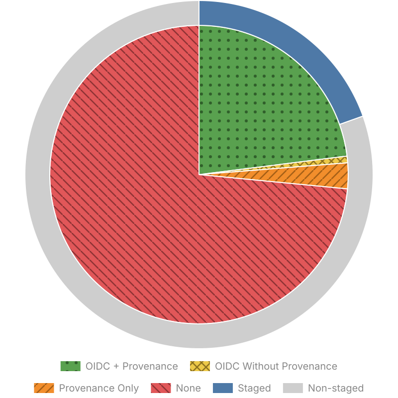
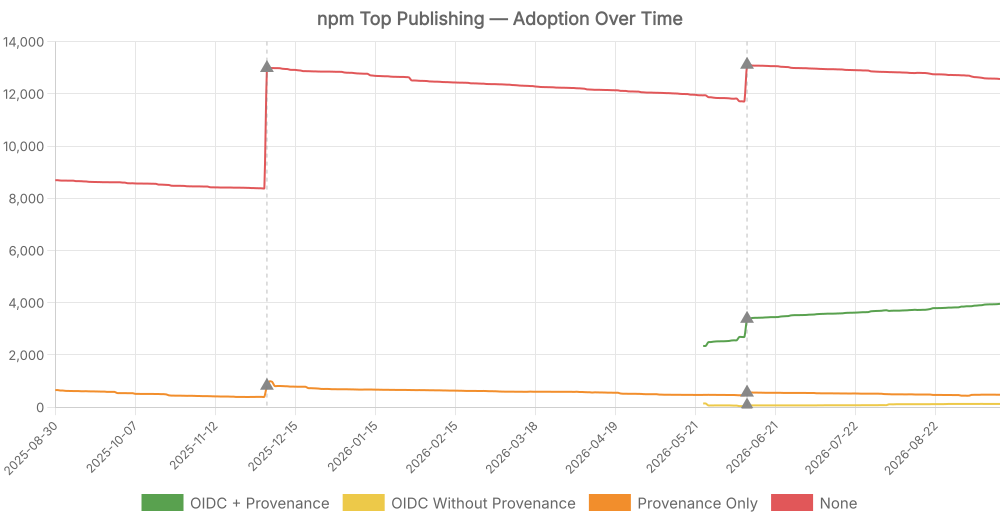
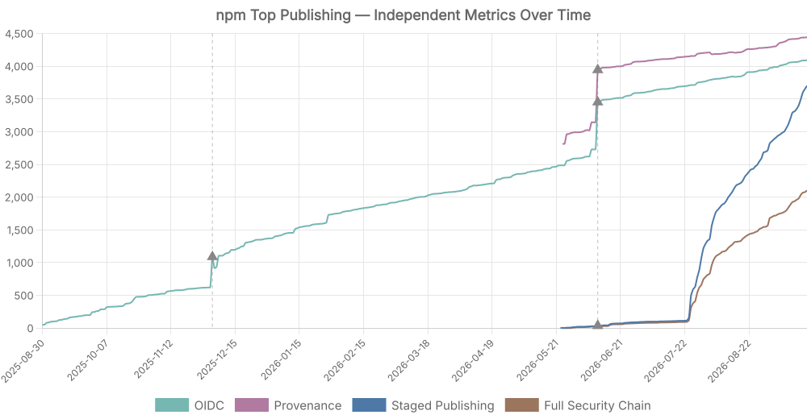

# npm Top Publishing

This repository tracks OIDC, provenance, and staged publishing adoption across high-impact npm packages. The package list is sourced from [wooorm/npm-high-impact](https://github.com/wooorm/npm-high-impact).

The results are generated by checking the publishing metadata for each package and are saved in `results.json`.

> The dashed vertical line and ▲ markers indicate days when the upstream [`npm-high-impact`](https://github.com/wooorm/npm-high-impact) package list was updated, which changes the set of packages being tracked and can cause discontinuities in the trend.

<!-- START -->

## Results

Generated time: 2026-08-07T01:21:02.929Z

Total packages: 17125

Compact tuples in [results.json](./results.json) · Full data with version and author in [full-results.json](./full-results.json)

### OIDC + Provenance + Staged

Published via [trusted publishing](https://docs.npmjs.com/trusted-publishers) with a provenance attestation and [staged publishing](https://docs.npmjs.com/staged-publishing/). This is currently the most secure way to publish.

Click to show first 500 of 1118 in total

| Package                                                                                                                                     |                                                                                                                                                                                                                                                  Downloads |
| ------------------------------------------------------------------------------------------------------------------------------------------- | ---------------------------------------------------------------------------------------------------------------------------------------------------------------------------------------------------------------------------------------------------------: |
| [`undici-types`](https://npmx.dev/package/undici-types)                                                                                     |                                                                                |
| [`postcss`](https://npmx.dev/package/postcss)                                                                                               |                                                                                               |
| [`nanoid`](https://npmx.dev/package/nanoid)                                                                                                 |                                                                                                  |
| [`cookie`](https://npmx.dev/package/cookie)                                                                                                 |                                                                                                  |
| [`electron-to-chromium`](https://npmx.dev/package/electron-to-chromium)                                                                     |                                                        |
| [`readdirp`](https://npmx.dev/package/readdirp)                                                                                             |                                                                                            |
| [`node-releases`](https://npmx.dev/package/node-releases)                                                                                   |                                                                             |
| [`browserslist`](https://npmx.dev/package/browserslist)                                                                                     |                                                                                |
| [`@radix-ui/react-primitive`](https://npmx.dev/package/@radix-ui/react-primitive)                                                           |                                         |
| [`update-browserslist-db`](https://npmx.dev/package/update-browserslist-db)                                                                 |                                                  |
| [`tinyglobby`](https://npmx.dev/package/tinyglobby)                                                                                         |                                                                                      |
| [`caniuse-lite`](https://npmx.dev/package/caniuse-lite)                                                                                     |                                                                                |
| [`@smithy/util-utf8`](https://npmx.dev/package/@smithy/util-utf8)                                                                           |                                                                 |
| [`raw-body`](https://npmx.dev/package/raw-body)                                                                                             |                                                                                            |
| [`baseline-browser-mapping`](https://npmx.dev/package/baseline-browser-mapping)                                                             |                                            |
| [`axios`](https://npmx.dev/package/axios)                                                                                                   |                                                                                                     |
| [`@smithy/is-array-buffer`](https://npmx.dev/package/@smithy/is-array-buffer)                                                               |                                               |
| [`@smithy/util-buffer-from`](https://npmx.dev/package/@smithy/util-buffer-from)                                                             |                                            |
| [`enhanced-resolve`](https://npmx.dev/package/enhanced-resolve)                                                                             |                                                                    |
| [`@radix-ui/react-context`](https://npmx.dev/package/@radix-ui/react-context)                                                               |                                               |
| [`node-addon-api`](https://npmx.dev/package/node-addon-api)                                                                                 |                                                                          |
| [`@vitest/utils`](https://npmx.dev/package/@vitest/utils)                                                                                   |                                                                             |
| [`tinyexec`](https://npmx.dev/package/tinyexec)                                                                                             |                                                                                            |
| [`jose`](https://npmx.dev/package/jose)                                                                                                     |                                                                                                        |
| [`get-tsconfig`](https://npmx.dev/package/get-tsconfig)                                                                                     |                                                                                |
| [`@vitest/spy`](https://npmx.dev/package/@vitest/spy)                                                                                       |                                                                                   |
| [`jsdom`](https://npmx.dev/package/jsdom)                                                                                                   |                                                                                                     |
| [`pnpm`](https://npmx.dev/package/pnpm)                                                                                                     |                                                                                                        |
| [`@vitest/expect`](https://npmx.dev/package/@vitest/expect)                                                                                 |                                                                          |
| [`@vitest/pretty-format`](https://npmx.dev/package/@vitest/pretty-format)                                                                   |                                                     |
| [`@radix-ui/react-compose-refs`](https://npmx.dev/package/@radix-ui/react-compose-refs)                                                     |                                |
| [`bl`](https://npmx.dev/package/bl)                                                                                                         |                                                                                                              |
| [`@radix-ui/react-use-layout-effect`](https://npmx.dev/package/@radix-ui/react-use-layout-effect)                                           |                 |
| [`@radix-ui/react-use-controllable-state`](https://npmx.dev/package/@radix-ui/react-use-controllable-state)                                 |  |
| [`tinyrainbow`](https://npmx.dev/package/tinyrainbow)                                                                                       |                                                                                   |
| [`@radix-ui/react-dismissable-layer`](https://npmx.dev/package/@radix-ui/react-dismissable-layer)                                           |                 |
| [`@radix-ui/react-id`](https://npmx.dev/package/@radix-ui/react-id)                                                                         |                                                              |
| [`@radix-ui/react-presence`](https://npmx.dev/package/@radix-ui/react-presence)                                                             |                                            |
| [`@radix-ui/react-use-callback-ref`](https://npmx.dev/package/@radix-ui/react-use-callback-ref)                                             |                    |
| [`autoprefixer`](https://npmx.dev/package/autoprefixer)                                                                                     |                                                                                |
| [`@vitest/snapshot`](https://npmx.dev/package/@vitest/snapshot)                                                                             |                                                                    |
| [`@radix-ui/react-portal`](https://npmx.dev/package/@radix-ui/react-portal)                                                                 |                                                  |
| [`@radix-ui/react-use-escape-keydown`](https://npmx.dev/package/@radix-ui/react-use-escape-keydown)                                         |              |
| [`import-in-the-middle`](https://npmx.dev/package/import-in-the-middle)                                                                     |                                                        |
| [`tsx`](https://npmx.dev/package/tsx)                                                                                                       |                                                                                                           |
| [`@vitest/runner`](https://npmx.dev/package/@vitest/runner)                                                                                 |                                                                          |
| [`@radix-ui/react-collection`](https://npmx.dev/package/@radix-ui/react-collection)                                                         |                                      |
| [`@radix-ui/react-focus-scope`](https://npmx.dev/package/@radix-ui/react-focus-scope)                                                       |                                   |
| [`@smithy/protocol-http`](https://npmx.dev/package/@smithy/protocol-http)                                                                   |                                                     |
| [`@radix-ui/react-focus-guards`](https://npmx.dev/package/@radix-ui/react-focus-guards)                                                     |                                |
| [`@radix-ui/react-popper`](https://npmx.dev/package/@radix-ui/react-popper)                                                                 |                                                                                                                                                                                     <a href="http://npmcharts.com/compare/@radix-ui/react-popper">View</a> |
| [`@smithy/fetch-http-handler`](https://npmx.dev/package/@smithy/fetch-http-handler)                                                         |                                                                                                                                                                                 <a href="http://npmcharts.com/compare/@smithy/fetch-http-handler">View</a> |
| [`@radix-ui/react-direction`](https://npmx.dev/package/@radix-ui/react-direction)                                                           |                                                                                                                                                                                  <a href="http://npmcharts.com/compare/@radix-ui/react-direction">View</a> |
| [`mdn-data`](https://npmx.dev/package/mdn-data)                                                                                             |                                                                                                                                                                                                   <a href="http://npmcharts.com/compare/mdn-data">View</a> |
| [`@radix-ui/react-arrow`](https://npmx.dev/package/@radix-ui/react-arrow)                                                                   |                                                                                                                                                                                      <a href="http://npmcharts.com/compare/@radix-ui/react-arrow">View</a> |
| [`@smithy/signature-v4`](https://npmx.dev/package/@smithy/signature-v4)                                                                     |                                                                                                                                                                                       <a href="http://npmcharts.com/compare/@smithy/signature-v4">View</a> |
| [`vitest`](https://npmx.dev/package/vitest)                                                                                                 |                                                                                                                                                                                                     <a href="http://npmcharts.com/compare/vitest">View</a> |
| [`@emnapi/runtime`](https://npmx.dev/package/@emnapi/runtime)                                                                               |                                                                                                                                                                                            <a href="http://npmcharts.com/compare/@emnapi/runtime">View</a> |
| [`@radix-ui/react-roving-focus`](https://npmx.dev/package/@radix-ui/react-roving-focus)                                                     |                                                                                                                                                                               <a href="http://npmcharts.com/compare/@radix-ui/react-roving-focus">View</a> |
| [`@vitest/mocker`](https://npmx.dev/package/@vitest/mocker)                                                                                 |                                                                                                                                                                                             <a href="http://npmcharts.com/compare/@vitest/mocker">View</a> |
| [`@smithy/property-provider`](https://npmx.dev/package/@smithy/property-provider)                                                           |                                                                                                                                                                                  <a href="http://npmcharts.com/compare/@smithy/property-provider">View</a> |
| [`@smithy/util-middleware`](https://npmx.dev/package/@smithy/util-middleware)                                                               |                                                                                                                                                                                    <a href="http://npmcharts.com/compare/@smithy/util-middleware">View</a> |
| [`@radix-ui/react-dialog`](https://npmx.dev/package/@radix-ui/react-dialog)                                                                 |                                                                                                                                                                                     <a href="http://npmcharts.com/compare/@radix-ui/react-dialog">View</a> |
| [`@smithy/querystring-builder`](https://npmx.dev/package/@smithy/querystring-builder)                                                       |                                                                                                                                                                                <a href="http://npmcharts.com/compare/@smithy/querystring-builder">View</a> |
| [`@radix-ui/react-use-size`](https://npmx.dev/package/@radix-ui/react-use-size)                                                             |                                                                                                                                                                                   <a href="http://npmcharts.com/compare/@radix-ui/react-use-size">View</a> |
| [`@smithy/smithy-client`](https://npmx.dev/package/@smithy/smithy-client)                                                                   |                                                                                                                                                                                      <a href="http://npmcharts.com/compare/@smithy/smithy-client">View</a> |
| [`tldts-core`](https://npmx.dev/package/tldts-core)                                                                                         |                                                                                                                                                                                                 <a href="http://npmcharts.com/compare/tldts-core">View</a> |
| [`@napi-rs/wasm-runtime`](https://npmx.dev/package/@napi-rs/wasm-runtime)                                                                   |                                                                                                                                                                                      <a href="http://npmcharts.com/compare/@napi-rs/wasm-runtime">View</a> |
| [`@openai/codex`](https://npmx.dev/package/@openai/codex)                                                                                   |                                                                                                                                                                                              <a href="http://npmcharts.com/compare/@openai/codex">View</a> |
| [`@radix-ui/react-use-previous`](https://npmx.dev/package/@radix-ui/react-use-previous)                                                     |                                                                                                                                                                               <a href="http://npmcharts.com/compare/@radix-ui/react-use-previous">View</a> |
| [`pure-rand`](https://npmx.dev/package/pure-rand)                                                                                           |                                                                                                                                                                                                  <a href="http://npmcharts.com/compare/pure-rand">View</a> |
| [`@smithy/middleware-endpoint`](https://npmx.dev/package/@smithy/middleware-endpoint)                                                       |                                                                                                                                                                                <a href="http://npmcharts.com/compare/@smithy/middleware-endpoint">View</a> |
| [`tinybench`](https://npmx.dev/package/tinybench)                                                                                           |                                                                                                                                                                                                  <a href="http://npmcharts.com/compare/tinybench">View</a> |
| [`@smithy/shared-ini-file-loader`](https://npmx.dev/package/@smithy/shared-ini-file-loader)                                                 |                                                                                                                                                                             <a href="http://npmcharts.com/compare/@smithy/shared-ini-file-loader">View</a> |
| [`recharts`](https://npmx.dev/package/recharts)                                                                                             |                                                                                                                                                                                                   <a href="http://npmcharts.com/compare/recharts">View</a> |
| [`@octokit/types`](https://npmx.dev/package/@octokit/types)                                                                                 |                                                                                                                                                                                             <a href="http://npmcharts.com/compare/@octokit/types">View</a> |
| [`rollup`](https://npmx.dev/package/rollup)                                                                                                 |                                                                                                                                                                                                     <a href="http://npmcharts.com/compare/rollup">View</a> |
| [`@smithy/core`](https://npmx.dev/package/@smithy/core)                                                                                     |                                                                                                                                                                                               <a href="http://npmcharts.com/compare/@smithy/core">View</a> |
| [`@smithy/util-base64`](https://npmx.dev/package/@smithy/util-base64)                                                                       |                                                                                                                                                                                        <a href="http://npmcharts.com/compare/@smithy/util-base64">View</a> |
| [`@smithy/credential-provider-imds`](https://npmx.dev/package/@smithy/credential-provider-imds)                                             |                                                                                                                                                                           <a href="http://npmcharts.com/compare/@smithy/credential-provider-imds">View</a> |
| [`immer`](https://npmx.dev/package/immer)                                                                                                   |                                                                                                                                                                                                      <a href="http://npmcharts.com/compare/immer">View</a> |
| [`@smithy/middleware-serde`](https://npmx.dev/package/@smithy/middleware-serde)                                                             |                                                                                                                                                                                   <a href="http://npmcharts.com/compare/@smithy/middleware-serde">View</a> |
| [`@smithy/url-parser`](https://npmx.dev/package/@smithy/url-parser)                                                                         |                                                                                                                                                                                         <a href="http://npmcharts.com/compare/@smithy/url-parser">View</a> |
| [`@noble/hashes`](https://npmx.dev/package/@noble/hashes)                                                                                   |                                                                                                                                                                                              <a href="http://npmcharts.com/compare/@noble/hashes">View</a> |
| [`@smithy/middleware-stack`](https://npmx.dev/package/@smithy/middleware-stack)                                                             |                                                                                                                                                                                   <a href="http://npmcharts.com/compare/@smithy/middleware-stack">View</a> |
| [`webpack`](https://npmx.dev/package/webpack)                                                                                               |                                                                                                                                                                                                    <a href="http://npmcharts.com/compare/webpack">View</a> |
| [`@smithy/util-retry`](https://npmx.dev/package/@smithy/util-retry)                                                                         |                                                                                                                                                                                         <a href="http://npmcharts.com/compare/@smithy/util-retry">View</a> |
| [`@smithy/service-error-classification`](https://npmx.dev/package/@smithy/service-error-classification)                                     |                                                                                                                                                                       <a href="http://npmcharts.com/compare/@smithy/service-error-classification">View</a> |
| [`sisteransi`](https://npmx.dev/package/sisteransi)                                                                                         |                                                                                                                                                                                                 <a href="http://npmcharts.com/compare/sisteransi">View</a> |
| [`postcss-nested`](https://npmx.dev/package/postcss-nested)                                                                                 |                                                                                                                                                                                             <a href="http://npmcharts.com/compare/postcss-nested">View</a> |
| [`@smithy/querystring-parser`](https://npmx.dev/package/@smithy/querystring-parser)                                                         |                                                                                                                                                                                 <a href="http://npmcharts.com/compare/@smithy/querystring-parser">View</a> |
| [`@smithy/util-stream`](https://npmx.dev/package/@smithy/util-stream)                                                                       |                                                                                                                                                                                        <a href="http://npmcharts.com/compare/@smithy/util-stream">View</a> |
| [`@smithy/node-config-provider`](https://npmx.dev/package/@smithy/node-config-provider)                                                     |                                                                                                                                                                               <a href="http://npmcharts.com/compare/@smithy/node-config-provider">View</a> |
| [`@octokit/openapi-types`](https://npmx.dev/package/@octokit/openapi-types)                                                                 |                                                                                                                                                                                     <a href="http://npmcharts.com/compare/@octokit/openapi-types">View</a> |
| [`@smithy/util-uri-escape`](https://npmx.dev/package/@smithy/util-uri-escape)                                                               |                                                                                                                                                                                    <a href="http://npmcharts.com/compare/@smithy/util-uri-escape">View</a> |
| [`@radix-ui/react-separator`](https://npmx.dev/package/@radix-ui/react-separator)                                                           |                                                                                                                                                                                  <a href="http://npmcharts.com/compare/@radix-ui/react-separator">View</a> |
| [`@smithy/middleware-retry`](https://npmx.dev/package/@smithy/middleware-retry)                                                             |                                                                                                                                                                                   <a href="http://npmcharts.com/compare/@smithy/middleware-retry">View</a> |
| [`@smithy/util-hex-encoding`](https://npmx.dev/package/@smithy/util-hex-encoding)                                                           |                                                                                                                                                                                  <a href="http://npmcharts.com/compare/@smithy/util-hex-encoding">View</a> |
| [`@radix-ui/react-select`](https://npmx.dev/package/@radix-ui/react-select)                                                                 |                                                                                                                                                                                     <a href="http://npmcharts.com/compare/@radix-ui/react-select">View</a> |
| [`@smithy/util-endpoints`](https://npmx.dev/package/@smithy/util-endpoints)                                                                 |                                                                                                                                                                                     <a href="http://npmcharts.com/compare/@smithy/util-endpoints">View</a> |
| [`@radix-ui/react-collapsible`](https://npmx.dev/package/@radix-ui/react-collapsible)                                                       |                                                                                                                                                                                <a href="http://npmcharts.com/compare/@radix-ui/react-collapsible">View</a> |
| [`through2`](https://npmx.dev/package/through2)                                                                                             |                                                                                                                                                                                                   <a href="http://npmcharts.com/compare/through2">View</a> |
| [`@smithy/util-defaults-mode-node`](https://npmx.dev/package/@smithy/util-defaults-mode-node)                                               |                                                                                                                                                                            <a href="http://npmcharts.com/compare/@smithy/util-defaults-mode-node">View</a> |
| [`@radix-ui/react-popover`](https://npmx.dev/package/@radix-ui/react-popover)                                                               |                                                                                                                                                                                    <a href="http://npmcharts.com/compare/@radix-ui/react-popover">View</a> |
| [`unplugin`](https://npmx.dev/package/unplugin)                                                                                             |                                                                                                                                                                                                   <a href="http://npmcharts.com/compare/unplugin">View</a> |
| [`@radix-ui/react-tabs`](https://npmx.dev/package/@radix-ui/react-tabs)                                                                     |                                                                                                                                                                                       <a href="http://npmcharts.com/compare/@radix-ui/react-tabs">View</a> |
| [`@smithy/hash-node`](https://npmx.dev/package/@smithy/hash-node)                                                                           |                                                                                                                                                                                          <a href="http://npmcharts.com/compare/@smithy/hash-node">View</a> |
| [`@radix-ui/react-progress`](https://npmx.dev/package/@radix-ui/react-progress)                                                             |                                                                                                                                                                                   <a href="http://npmcharts.com/compare/@radix-ui/react-progress">View</a> |
| [`@radix-ui/react-toggle`](https://npmx.dev/package/@radix-ui/react-toggle)                                                                 |                                                                                                                                                                                     <a href="http://npmcharts.com/compare/@radix-ui/react-toggle">View</a> |
| [`@smithy/util-defaults-mode-browser`](https://npmx.dev/package/@smithy/util-defaults-mode-browser)                                         |                                                                                                                                                                         <a href="http://npmcharts.com/compare/@smithy/util-defaults-mode-browser">View</a> |
| [`@radix-ui/react-avatar`](https://npmx.dev/package/@radix-ui/react-avatar)                                                                 |                                                                                                                                                                                     <a href="http://npmcharts.com/compare/@radix-ui/react-avatar">View</a> |
| [`@smithy/util-body-length-browser`](https://npmx.dev/package/@smithy/util-body-length-browser)                                             |                                                                                                                                                                           <a href="http://npmcharts.com/compare/@smithy/util-body-length-browser">View</a> |
| [`@smithy/config-resolver`](https://npmx.dev/package/@smithy/config-resolver)                                                               |                                                                                                                                                                                    <a href="http://npmcharts.com/compare/@smithy/config-resolver">View</a> |
| [`@radix-ui/react-scroll-area`](https://npmx.dev/package/@radix-ui/react-scroll-area)                                                       |                                                                                                                                                                                <a href="http://npmcharts.com/compare/@radix-ui/react-scroll-area">View</a> |
| [`@emnapi/core`](https://npmx.dev/package/@emnapi/core)                                                                                     |                                                                                                                                                                                               <a href="http://npmcharts.com/compare/@emnapi/core">View</a> |
| [`express-rate-limit`](https://npmx.dev/package/express-rate-limit)                                                                         |                                                                                                                                                                                         <a href="http://npmcharts.com/compare/express-rate-limit">View</a> |
| [`@vitejs/plugin-react`](https://npmx.dev/package/@vitejs/plugin-react)                                                                     |                                                                                                                                                                                       <a href="http://npmcharts.com/compare/@vitejs/plugin-react">View</a> |
| [`@radix-ui/react-radio-group`](https://npmx.dev/package/@radix-ui/react-radio-group)                                                       |                                                                                                                                                                                <a href="http://npmcharts.com/compare/@radix-ui/react-radio-group">View</a> |
| [`@smithy/util-config-provider`](https://npmx.dev/package/@smithy/util-config-provider)                                                     |                                                                                                                                                                               <a href="http://npmcharts.com/compare/@smithy/util-config-provider">View</a> |
| [`@smithy/middleware-content-length`](https://npmx.dev/package/@smithy/middleware-content-length)                                           |                                                                                                                                                                          <a href="http://npmcharts.com/compare/@smithy/middleware-content-length">View</a> |
| [`@radix-ui/react-alert-dialog`](https://npmx.dev/package/@radix-ui/react-alert-dialog)                                                     |                                                                                                                                                                               <a href="http://npmcharts.com/compare/@radix-ui/react-alert-dialog">View</a> |
| [`@smithy/util-body-length-node`](https://npmx.dev/package/@smithy/util-body-length-node)                                                   |                                                                                                                                                                              <a href="http://npmcharts.com/compare/@smithy/util-body-length-node">View</a> |
| [`@radix-ui/react-hover-card`](https://npmx.dev/package/@radix-ui/react-hover-card)                                                         |                                                                                                                                                                                 <a href="http://npmcharts.com/compare/@radix-ui/react-hover-card">View</a> |
| [`@radix-ui/react-context-menu`](https://npmx.dev/package/@radix-ui/react-context-menu)                                                     |                                                                                                                                                                               <a href="http://npmcharts.com/compare/@radix-ui/react-context-menu">View</a> |
| [`@modelcontextprotocol/sdk`](https://npmx.dev/package/@modelcontextprotocol/sdk)                                                           |                                                                                                                                                                                  <a href="http://npmcharts.com/compare/@modelcontextprotocol/sdk">View</a> |
| [`playwright-core`](https://npmx.dev/package/playwright-core)                                                                               |                                                                                                                                                                                            <a href="http://npmcharts.com/compare/playwright-core">View</a> |
| [`@smithy/invalid-dependency`](https://npmx.dev/package/@smithy/invalid-dependency)                                                         |                                                                                                                                                                                 <a href="http://npmcharts.com/compare/@smithy/invalid-dependency">View</a> |
| [`@swc/core`](https://npmx.dev/package/@swc/core)                                                                                           |                                                                                                                                                                                                  <a href="http://npmcharts.com/compare/@swc/core">View</a> |
| [`memfs`](https://npmx.dev/package/memfs)                                                                                                   |                                                                                                                                                                                                      <a href="http://npmcharts.com/compare/memfs">View</a> |
| [`hono`](https://npmx.dev/package/hono)                                                                                                     |                                                                                                                                                                                                       <a href="http://npmcharts.com/compare/hono">View</a> |
| [`playwright`](https://npmx.dev/package/playwright)                                                                                         |                                                                                                                                                                                                 <a href="http://npmcharts.com/compare/playwright">View</a> |
| [`@hono/node-server`](https://npmx.dev/package/@hono/node-server)                                                                           |                                                                                                                                                                                          <a href="http://npmcharts.com/compare/@hono/node-server">View</a> |
| [`@smithy/node-http-handler`](https://npmx.dev/package/@smithy/node-http-handler)                                                           |                                                                                                                                                                                  <a href="http://npmcharts.com/compare/@smithy/node-http-handler">View</a> |
| [`@swc/types`](https://npmx.dev/package/@swc/types)                                                                                         |                                                                                                                                                                                                 <a href="http://npmcharts.com/compare/@swc/types">View</a> |
| [`eventsource`](https://npmx.dev/package/eventsource)                                                                                       |                                                                                                                                                                                                <a href="http://npmcharts.com/compare/eventsource">View</a> |
| [`@testing-library/user-event`](https://npmx.dev/package/@testing-library/user-event)                                                       |                                                                                                                                                                                <a href="http://npmcharts.com/compare/@testing-library/user-event">View</a> |
| [`@octokit/request`](https://npmx.dev/package/@octokit/request)                                                                             |                                                                                                                                                                                           <a href="http://npmcharts.com/compare/@octokit/request">View</a> |
| [`@smithy/util-waiter`](https://npmx.dev/package/@smithy/util-waiter)                                                                       |                                                                                                                                                                                        <a href="http://npmcharts.com/compare/@smithy/util-waiter">View</a> |
| [`@smithy/eventstream-serde-node`](https://npmx.dev/package/@smithy/eventstream-serde-node)                                                 |                                                                                                                                                                             <a href="http://npmcharts.com/compare/@smithy/eventstream-serde-node">View</a> |
| [`@radix-ui/react-aspect-ratio`](https://npmx.dev/package/@radix-ui/react-aspect-ratio)                                                     |                                                                                                                                                                               <a href="http://npmcharts.com/compare/@radix-ui/react-aspect-ratio">View</a> |
| [`@oxc-project/types`](https://npmx.dev/package/@oxc-project/types)                                                                         |                                                                                                                                                                                         <a href="http://npmcharts.com/compare/@oxc-project/types">View</a> |
| [`@smithy/eventstream-serde-config-resolver`](https://npmx.dev/package/@smithy/eventstream-serde-config-resolver)                           |                                                                                                                                                                  <a href="http://npmcharts.com/compare/@smithy/eventstream-serde-config-resolver">View</a> |
| [`@octokit/request-error`](https://npmx.dev/package/@octokit/request-error)                                                                 |                                                                                                                                                                                     <a href="http://npmcharts.com/compare/@octokit/request-error">View</a> |
| [`@next/env`](https://npmx.dev/package/@next/env)                                                                                           |                                                                                                                                                                                                  <a href="http://npmcharts.com/compare/@next/env">View</a> |
| [`@octokit/endpoint`](https://npmx.dev/package/@octokit/endpoint)                                                                           |                                                                                                                                                                                          <a href="http://npmcharts.com/compare/@octokit/endpoint">View</a> |
| [`@radix-ui/react-toast`](https://npmx.dev/package/@radix-ui/react-toast)                                                                   |                                                                                                                                                                                      <a href="http://npmcharts.com/compare/@radix-ui/react-toast">View</a> |
| [`@octokit/core`](https://npmx.dev/package/@octokit/core)                                                                                   |                                                                                                                                                                                              <a href="http://npmcharts.com/compare/@octokit/core">View</a> |
| [`@smithy/eventstream-codec`](https://npmx.dev/package/@smithy/eventstream-codec)                                                           |                                                                                                                                                                                  <a href="http://npmcharts.com/compare/@smithy/eventstream-codec">View</a> |
| [`obug`](https://npmx.dev/package/obug)                                                                                                     |                                                                                                                                                                                                       <a href="http://npmcharts.com/compare/obug">View</a> |
| [`@octokit/graphql`](https://npmx.dev/package/@octokit/graphql)                                                                             |                                                                                                                                                                                           <a href="http://npmcharts.com/compare/@octokit/graphql">View</a> |
| [`@smithy/eventstream-serde-universal`](https://npmx.dev/package/@smithy/eventstream-serde-universal)                                       |                                                                                                                                                                        <a href="http://npmcharts.com/compare/@smithy/eventstream-serde-universal">View</a> |
| [`@smithy/uuid`](https://npmx.dev/package/@smithy/uuid)                                                                                     |                                                                                                                                                                                               <a href="http://npmcharts.com/compare/@smithy/uuid">View</a> |
| [`bare-fs`](https://npmx.dev/package/bare-fs)                                                                                               |                                                                                                                                                                                                    <a href="http://npmcharts.com/compare/bare-fs">View</a> |
| [`@octokit/plugin-paginate-rest`](https://npmx.dev/package/@octokit/plugin-paginate-rest)                                                   |                                                                                                                                                                              <a href="http://npmcharts.com/compare/@octokit/plugin-paginate-rest">View</a> |
| [`undici`](https://npmx.dev/package/undici)                                                                                                 |                                                                                                                                                                                                     <a href="http://npmcharts.com/compare/undici">View</a> |
| [`http-proxy-middleware`](https://npmx.dev/package/http-proxy-middleware)                                                                   |                                                                                                                                                                                      <a href="http://npmcharts.com/compare/http-proxy-middleware">View</a> |
| [`webpack-dev-middleware`](https://npmx.dev/package/webpack-dev-middleware)                                                                 |                                                                                                                                                                                     <a href="http://npmcharts.com/compare/webpack-dev-middleware">View</a> |
| [`@smithy/md5-js`](https://npmx.dev/package/@smithy/md5-js)                                                                                 |                                                                                                                                                                                             <a href="http://npmcharts.com/compare/@smithy/md5-js">View</a> |
| [`magicast`](https://npmx.dev/package/magicast)                                                                                             |                                                                                                                                                                                                   <a href="http://npmcharts.com/compare/magicast">View</a> |
| [`@radix-ui/react-slot`](https://npmx.dev/package/@radix-ui/react-slot)                                                                     |                                                                                                                                                                                       <a href="http://npmcharts.com/compare/@radix-ui/react-slot">View</a> |
| [`@octokit/plugin-rest-endpoint-methods`](https://npmx.dev/package/@octokit/plugin-rest-endpoint-methods)                                   |                                                                                                                                                                      <a href="http://npmcharts.com/compare/@octokit/plugin-rest-endpoint-methods">View</a> |
| [`@smithy/hash-blob-browser`](https://npmx.dev/package/@smithy/hash-blob-browser)                                                           |                                                                                                                                                                                  <a href="http://npmcharts.com/compare/@smithy/hash-blob-browser">View</a> |
| [`@smithy/chunked-blob-reader-native`](https://npmx.dev/package/@smithy/chunked-blob-reader-native)                                         |                                                                                                                                                                         <a href="http://npmcharts.com/compare/@smithy/chunked-blob-reader-native">View</a> |
| [`sass`](https://npmx.dev/package/sass)                                                                                                     |                                                                                                                                                                                                       <a href="http://npmcharts.com/compare/sass">View</a> |
| [`@smithy/hash-stream-node`](https://npmx.dev/package/@smithy/hash-stream-node)                                                             |                                                                                                                                                                                   <a href="http://npmcharts.com/compare/@smithy/hash-stream-node">View</a> |
| [`@vue/shared`](https://npmx.dev/package/@vue/shared)                                                                                       |                                                                                                                                                                                                <a href="http://npmcharts.com/compare/@vue/shared">View</a> |
| [`openai`](https://npmx.dev/package/openai)                                                                                                 |                                                                                                                                                                                                     <a href="http://npmcharts.com/compare/openai">View</a> |
| [`rolldown`](https://npmx.dev/package/rolldown)                                                                                             |                                                                                                                                                                                                   <a href="http://npmcharts.com/compare/rolldown">View</a> |
| [`strip-literal`](https://npmx.dev/package/strip-literal)                                                                                   |                                                                                                                                                                                              <a href="http://npmcharts.com/compare/strip-literal">View</a> |
| [`@smithy/chunked-blob-reader`](https://npmx.dev/package/@smithy/chunked-blob-reader)                                                       |                                                                                                                                                                                <a href="http://npmcharts.com/compare/@smithy/chunked-blob-reader">View</a> |
| [`lint-staged`](https://npmx.dev/package/lint-staged)                                                                                       |                                                                                                                                                                                                <a href="http://npmcharts.com/compare/lint-staged">View</a> |
| [`react-router-dom`](https://npmx.dev/package/react-router-dom)                                                                             |                                                                                                                                                                                           <a href="http://npmcharts.com/compare/react-router-dom">View</a> |
| [`@radix-ui/react-toggle-group`](https://npmx.dev/package/@radix-ui/react-toggle-group)                                                     |                                                                                                                                                                               <a href="http://npmcharts.com/compare/@radix-ui/react-toggle-group">View</a> |
| [`@vitest/coverage-v8`](https://npmx.dev/package/@vitest/coverage-v8)                                                                       |                                                                                                                                                                                        <a href="http://npmcharts.com/compare/@vitest/coverage-v8">View</a> |
| [`socket.io-parser`](https://npmx.dev/package/socket.io-parser)                                                                             |                                                                                                                                                                                           <a href="http://npmcharts.com/compare/socket.io-parser">View</a> |
| [`@ai-sdk/provider-utils`](https://npmx.dev/package/@ai-sdk/provider-utils)                                                                 |                                                                                                                                                                                     <a href="http://npmcharts.com/compare/@ai-sdk/provider-utils">View</a> |
| [`preact`](https://npmx.dev/package/preact)                                                                                                 |                                                                                                                                                                                                     <a href="http://npmcharts.com/compare/preact">View</a> |
| [`@vue/compiler-core`](https://npmx.dev/package/@vue/compiler-core)                                                                         |                                                                                                                                                                                         <a href="http://npmcharts.com/compare/@vue/compiler-core">View</a> |
| [`@anthropic-ai/sdk`](https://npmx.dev/package/@anthropic-ai/sdk)                                                                           |                                                                                                                                                                                          <a href="http://npmcharts.com/compare/@anthropic-ai/sdk">View</a> |
| [`@noble/curves`](https://npmx.dev/package/@noble/curves)                                                                                   |                                                                                                                                                                                              <a href="http://npmcharts.com/compare/@noble/curves">View</a> |
| [`@ai-sdk/provider`](https://npmx.dev/package/@ai-sdk/provider)                                                                             |                                                                                                                                                                                           <a href="http://npmcharts.com/compare/@ai-sdk/provider">View</a> |
| [`miniflare`](https://npmx.dev/package/miniflare)                                                                                           |                                                                                                                                                                                                  <a href="http://npmcharts.com/compare/miniflare">View</a> |
| [`@opentelemetry/instrumentation-mysql2`](https://npmx.dev/package/@opentelemetry/instrumentation-mysql2)                                   |                                                                                                                                                                      <a href="http://npmcharts.com/compare/@opentelemetry/instrumentation-mysql2">View</a> |
| [`eslint-config-next`](https://npmx.dev/package/eslint-config-next)                                                                         |                                                                                                                                                                                         <a href="http://npmcharts.com/compare/eslint-config-next">View</a> |
| [`@vue/compiler-dom`](https://npmx.dev/package/@vue/compiler-dom)                                                                           |                                                                                                                                                                                          <a href="http://npmcharts.com/compare/@vue/compiler-dom">View</a> |
| [`@supabase/realtime-js`](https://npmx.dev/package/@supabase/realtime-js)                                                                   |                                                                                                                                                                                      <a href="http://npmcharts.com/compare/@supabase/realtime-js">View</a> |
| [`@smithy/eventstream-serde-browser`](https://npmx.dev/package/@smithy/eventstream-serde-browser)                                           |                                                                                                                                                                          <a href="http://npmcharts.com/compare/@smithy/eventstream-serde-browser">View</a> |
| [`@supabase/auth-js`](https://npmx.dev/package/@supabase/auth-js)                                                                           |                                                                                                                                                                                          <a href="http://npmcharts.com/compare/@supabase/auth-js">View</a> |
| [`@supabase/storage-js`](https://npmx.dev/package/@supabase/storage-js)                                                                     |                                                                                                                                                                                       <a href="http://npmcharts.com/compare/@supabase/storage-js">View</a> |
| [`@mswjs/interceptors`](https://npmx.dev/package/@mswjs/interceptors)                                                                       |                                                                                                                                                                                        <a href="http://npmcharts.com/compare/@mswjs/interceptors">View</a> |
| [`@supabase/postgrest-js`](https://npmx.dev/package/@supabase/postgrest-js)                                                                 |                                                                                                                                                                                     <a href="http://npmcharts.com/compare/@supabase/postgrest-js">View</a> |
| [`marked`](https://npmx.dev/package/marked)                                                                                                 |                                                                                                                                                                                                     <a href="http://npmcharts.com/compare/marked">View</a> |
| [`@supabase/functions-js`](https://npmx.dev/package/@supabase/functions-js)                                                                 |                                                                                                                                                                                     <a href="http://npmcharts.com/compare/@supabase/functions-js">View</a> |
| [`fast-check`](https://npmx.dev/package/fast-check)                                                                                         |                                                                                                                                                                                                 <a href="http://npmcharts.com/compare/fast-check">View</a> |
| [`ast-v8-to-istanbul`](https://npmx.dev/package/ast-v8-to-istanbul)                                                                         |                                                                                                                                                                                         <a href="http://npmcharts.com/compare/ast-v8-to-istanbul">View</a> |
| [`smol-toml`](https://npmx.dev/package/smol-toml)                                                                                           |                                                                                                                                                                                                  <a href="http://npmcharts.com/compare/smol-toml">View</a> |
| [`libphonenumber-js`](https://npmx.dev/package/libphonenumber-js)                                                                           |                                                                                                                                                                                          <a href="http://npmcharts.com/compare/libphonenumber-js">View</a> |
| [`postcss-discard-duplicates`](https://npmx.dev/package/postcss-discard-duplicates)                                                         |                                                                                                                                                                                 <a href="http://npmcharts.com/compare/postcss-discard-duplicates">View</a> |
| [`@vue/compiler-sfc`](https://npmx.dev/package/@vue/compiler-sfc)                                                                           |                                                                                                                                                                                          <a href="http://npmcharts.com/compare/@vue/compiler-sfc">View</a> |
| [`postcss-minify-selectors`](https://npmx.dev/package/postcss-minify-selectors)                                                             |                                                                                                                                                                                   <a href="http://npmcharts.com/compare/postcss-minify-selectors">View</a> |
| [`postcss-discard-empty`](https://npmx.dev/package/postcss-discard-empty)                                                                   |                                                                                                                                                                                      <a href="http://npmcharts.com/compare/postcss-discard-empty">View</a> |
| [`postcss-merge-rules`](https://npmx.dev/package/postcss-merge-rules)                                                                       |                                                                                                                                                                                        <a href="http://npmcharts.com/compare/postcss-merge-rules">View</a> |
| [`cssnano`](https://npmx.dev/package/cssnano)                                                                                               |                                                                                                                                                                                                    <a href="http://npmcharts.com/compare/cssnano">View</a> |
| [`@puppeteer/browsers`](https://npmx.dev/package/@puppeteer/browsers)                                                                       |                                                                                                                                                                                        <a href="http://npmcharts.com/compare/@puppeteer/browsers">View</a> |
| [`postcss-merge-longhand`](https://npmx.dev/package/postcss-merge-longhand)                                                                 |                                                                                                                                                                                     <a href="http://npmcharts.com/compare/postcss-merge-longhand">View</a> |
| [`postcss-minify-params`](https://npmx.dev/package/postcss-minify-params)                                                                   |                                                                                                                                                                                      <a href="http://npmcharts.com/compare/postcss-minify-params">View</a> |
| [`postcss-convert-values`](https://npmx.dev/package/postcss-convert-values)                                                                 |                                                                                                                                                                                     <a href="http://npmcharts.com/compare/postcss-convert-values">View</a> |
| [`@radix-ui/react-slider`](https://npmx.dev/package/@radix-ui/react-slider)                                                                 |                                                                                                                                                                                     <a href="http://npmcharts.com/compare/@radix-ui/react-slider">View</a> |
| [`postcss-svgo`](https://npmx.dev/package/postcss-svgo)                                                                                     |                                                                                                                                                                                               <a href="http://npmcharts.com/compare/postcss-svgo">View</a> |
| [`bare-url`](https://npmx.dev/package/bare-url)                                                                                             |                                                                                                                                                                                                   <a href="http://npmcharts.com/compare/bare-url">View</a> |
| [`cssnano-preset-default`](https://npmx.dev/package/cssnano-preset-default)                                                                 |                                                                                                                                                                                     <a href="http://npmcharts.com/compare/cssnano-preset-default">View</a> |
| [`postcss-normalize-whitespace`](https://npmx.dev/package/postcss-normalize-whitespace)                                                     |                                                                                                                                                                               <a href="http://npmcharts.com/compare/postcss-normalize-whitespace">View</a> |
| [`stylehacks`](https://npmx.dev/package/stylehacks)                                                                                         |                                                                                                                                                                                                 <a href="http://npmcharts.com/compare/stylehacks">View</a> |
| [`@vue/compiler-ssr`](https://npmx.dev/package/@vue/compiler-ssr)                                                                           |                                                                                                                                                                                          <a href="http://npmcharts.com/compare/@vue/compiler-ssr">View</a> |
| [`@tanstack/history`](https://npmx.dev/package/@tanstack/history)                                                                           |                                                                                                                                                                                          <a href="http://npmcharts.com/compare/@tanstack/history">View</a> |
| [`@vitejs/plugin-react-swc`](https://npmx.dev/package/@vitejs/plugin-react-swc)                                                             |                                                                                                                                                                                   <a href="http://npmcharts.com/compare/@vitejs/plugin-react-swc">View</a> |
| [`postcss-normalize-url`](https://npmx.dev/package/postcss-normalize-url)                                                                   |                                                                                                                                                                                      <a href="http://npmcharts.com/compare/postcss-normalize-url">View</a> |
| [`postcss-normalize-timing-functions`](https://npmx.dev/package/postcss-normalize-timing-functions)                                         |                                                                                                                                                                         <a href="http://npmcharts.com/compare/postcss-normalize-timing-functions">View</a> |
| [`devtools-protocol`](https://npmx.dev/package/devtools-protocol)                                                                           |                                                                                                                                                                                          <a href="http://npmcharts.com/compare/devtools-protocol">View</a> |
| [`lucide-react`](https://npmx.dev/package/lucide-react)                                                                                     |                                                                                                                                                                                               <a href="http://npmcharts.com/compare/lucide-react">View</a> |
| [`postcss-unique-selectors`](https://npmx.dev/package/postcss-unique-selectors)                                                             |                                                                                                                                                                                   <a href="http://npmcharts.com/compare/postcss-unique-selectors">View</a> |
| [`postcss-normalize-display-values`](https://npmx.dev/package/postcss-normalize-display-values)                                             |                                                                                                                                                                           <a href="http://npmcharts.com/compare/postcss-normalize-display-values">View</a> |
| [`postcss-reduce-transforms`](https://npmx.dev/package/postcss-reduce-transforms)                                                           |                                                                                                                                                                                  <a href="http://npmcharts.com/compare/postcss-reduce-transforms">View</a> |
| [`postcss-discard-overridden`](https://npmx.dev/package/postcss-discard-overridden)                                                         |                                                                                                                                                                                 <a href="http://npmcharts.com/compare/postcss-discard-overridden">View</a> |
| [`postcss-colormin`](https://npmx.dev/package/postcss-colormin)                                                                             |                                                                                                                                                                                           <a href="http://npmcharts.com/compare/postcss-colormin">View</a> |
| [`pdfjs-dist`](https://npmx.dev/package/pdfjs-dist)                                                                                         |                                                                                                                                                                                                 <a href="http://npmcharts.com/compare/pdfjs-dist">View</a> |
| [`effect`](https://npmx.dev/package/effect)                                                                                                 |                                                                                                                                                                                                     <a href="http://npmcharts.com/compare/effect">View</a> |
| [`postcss-ordered-values`](https://npmx.dev/package/postcss-ordered-values)                                                                 |                                                                                                                                                                                     <a href="http://npmcharts.com/compare/postcss-ordered-values">View</a> |
| [`postcss-reduce-initial`](https://npmx.dev/package/postcss-reduce-initial)                                                                 |                                                                                                                                                                                     <a href="http://npmcharts.com/compare/postcss-reduce-initial">View</a> |
| [`postcss-discard-comments`](https://npmx.dev/package/postcss-discard-comments)                                                             |                                                                                                                                                                                   <a href="http://npmcharts.com/compare/postcss-discard-comments">View</a> |
| [`postcss-minify-gradients`](https://npmx.dev/package/postcss-minify-gradients)                                                             |                                                                                                                                                                                   <a href="http://npmcharts.com/compare/postcss-minify-gradients">View</a> |
| [`concurrently`](https://npmx.dev/package/concurrently)                                                                                     |                                                                                                                                                                                               <a href="http://npmcharts.com/compare/concurrently">View</a> |
| [`postcss-normalize-charset`](https://npmx.dev/package/postcss-normalize-charset)                                                           |                                                                                                                                                                                  <a href="http://npmcharts.com/compare/postcss-normalize-charset">View</a> |
| [`postcss-minify-font-values`](https://npmx.dev/package/postcss-minify-font-values)                                                         |                                                                                                                                                                                 <a href="http://npmcharts.com/compare/postcss-minify-font-values">View</a> |
| [`nodemailer`](https://npmx.dev/package/nodemailer)                                                                                         |                                                                                                                                                                                                 <a href="http://npmcharts.com/compare/nodemailer">View</a> |
| [`@tanstack/router-core`](https://npmx.dev/package/@tanstack/router-core)                                                                   |                                                                                                                                                                                      <a href="http://npmcharts.com/compare/@tanstack/router-core">View</a> |
| [`postcss-normalize-unicode`](https://npmx.dev/package/postcss-normalize-unicode)                                                           |                                                                                                                                                                                  <a href="http://npmcharts.com/compare/postcss-normalize-unicode">View</a> |
| [`postcss-normalize-positions`](https://npmx.dev/package/postcss-normalize-positions)                                                       |                                                                                                                                                                                <a href="http://npmcharts.com/compare/postcss-normalize-positions">View</a> |
| [`postcss-normalize-string`](https://npmx.dev/package/postcss-normalize-string)                                                             |                                                                                                                                                                                   <a href="http://npmcharts.com/compare/postcss-normalize-string">View</a> |
| [`postcss-normalize-repeat-style`](https://npmx.dev/package/postcss-normalize-repeat-style)                                                 |                                                                                                                                                                             <a href="http://npmcharts.com/compare/postcss-normalize-repeat-style">View</a> |
| [`@tanstack/router-plugin`](https://npmx.dev/package/@tanstack/router-plugin)                                                               |                                                                                                                                                                                    <a href="http://npmcharts.com/compare/@tanstack/router-plugin">View</a> |
| [`@formatjs/icu-messageformat-parser`](https://npmx.dev/package/@formatjs/icu-messageformat-parser)                                         |                                                                                                                                                                         <a href="http://npmcharts.com/compare/@formatjs/icu-messageformat-parser">View</a> |
| [`intl-messageformat`](https://npmx.dev/package/intl-messageformat)                                                                         |                                                                                                                                                                                         <a href="http://npmcharts.com/compare/intl-messageformat">View</a> |
| [`@tanstack/react-virtual`](https://npmx.dev/package/@tanstack/react-virtual)                                                               |                                                                                                                                                                                    <a href="http://npmcharts.com/compare/@tanstack/react-virtual">View</a> |
| [`tldts`](https://npmx.dev/package/tldts)                                                                                                   |                                                                                                                                                                                                      <a href="http://npmcharts.com/compare/tldts">View</a> |
| [`@tanstack/router-generator`](https://npmx.dev/package/@tanstack/router-generator)                                                         |                                                                                                                                                                                 <a href="http://npmcharts.com/compare/@tanstack/router-generator">View</a> |
| [`eslint-plugin-jest`](https://npmx.dev/package/eslint-plugin-jest)                                                                         |                                                                                                                                                                                         <a href="http://npmcharts.com/compare/eslint-plugin-jest">View</a> |
| [`@shikijs/types`](https://npmx.dev/package/@shikijs/types)                                                                                 |                                                                                                                                                                                             <a href="http://npmcharts.com/compare/@shikijs/types">View</a> |
| [`engine.io`](https://npmx.dev/package/engine.io)                                                                                           |                                                                                                                                                                                                  <a href="http://npmcharts.com/compare/engine.io">View</a> |
| [`@tanstack/store`](https://npmx.dev/package/@tanstack/store)                                                                               |                                                                                                                                                                                            <a href="http://npmcharts.com/compare/@tanstack/store">View</a> |
| [`@opentelemetry/instrumentation-kafkajs`](https://npmx.dev/package/@opentelemetry/instrumentation-kafkajs)                                 |                                                                                                                                                                     <a href="http://npmcharts.com/compare/@opentelemetry/instrumentation-kafkajs">View</a> |
| [`@shikijs/engine-oniguruma`](https://npmx.dev/package/@shikijs/engine-oniguruma)                                                           |                                                                                                                                                                                  <a href="http://npmcharts.com/compare/@shikijs/engine-oniguruma">View</a> |
| [`mocha`](https://npmx.dev/package/mocha)                                                                                                   |                                                                                                                                                                                                      <a href="http://npmcharts.com/compare/mocha">View</a> |
| [`cssnano-utils`](https://npmx.dev/package/cssnano-utils)                                                                                   |                                                                                                                                                                                              <a href="http://npmcharts.com/compare/cssnano-utils">View</a> |
| [`csv-parse`](https://npmx.dev/package/csv-parse)                                                                                           |                                                                                                                                                                                                  <a href="http://npmcharts.com/compare/csv-parse">View</a> |
| [`basic-auth`](https://npmx.dev/package/basic-auth)                                                                                         |                                                                                                                                                                                                 <a href="http://npmcharts.com/compare/basic-auth">View</a> |
| [`@apidevtools/json-schema-ref-parser`](https://npmx.dev/package/@apidevtools/json-schema-ref-parser)                                       |                                                                                                                                                                        <a href="http://npmcharts.com/compare/@apidevtools/json-schema-ref-parser">View</a> |
| [`socket.io-adapter`](https://npmx.dev/package/socket.io-adapter)                                                                           |                                                                                                                                                                                          <a href="http://npmcharts.com/compare/socket.io-adapter">View</a> |
| [`@tanstack/start-client-core`](https://npmx.dev/package/@tanstack/start-client-core)                                                       |                                                                                                                                                                                <a href="http://npmcharts.com/compare/@tanstack/start-client-core">View</a> |
| [`@tanstack/start-storage-context`](https://npmx.dev/package/@tanstack/start-storage-context)                                               |                                                                                                                                                                            <a href="http://npmcharts.com/compare/@tanstack/start-storage-context">View</a> |
| [`@tanstack/start-server-core`](https://npmx.dev/package/@tanstack/start-server-core)                                                       |                                                                                                                                                                                <a href="http://npmcharts.com/compare/@tanstack/start-server-core">View</a> |
| [`@tanstack/start-plugin-core`](https://npmx.dev/package/@tanstack/start-plugin-core)                                                       |                                                                                                                                                                                <a href="http://npmcharts.com/compare/@tanstack/start-plugin-core">View</a> |
| [`@tanstack/react-start-server`](https://npmx.dev/package/@tanstack/react-start-server)                                                     |                                                                                                                                                                               <a href="http://npmcharts.com/compare/@tanstack/react-start-server">View</a> |
| [`@tanstack/react-start-client`](https://npmx.dev/package/@tanstack/react-start-client)                                                     |                                                                                                                                                                               <a href="http://npmcharts.com/compare/@tanstack/react-start-client">View</a> |
| [`@tanstack/table-core`](https://npmx.dev/package/@tanstack/table-core)                                                                     |                                                                                                                                                                                       <a href="http://npmcharts.com/compare/@tanstack/table-core">View</a> |
| [`graphql-tag`](https://npmx.dev/package/graphql-tag)                                                                                       |                                                                                                                                                                                                <a href="http://npmcharts.com/compare/graphql-tag">View</a> |
| [`@tanstack/react-table`](https://npmx.dev/package/@tanstack/react-table)                                                                   |                                                                                                                                                                                      <a href="http://npmcharts.com/compare/@tanstack/react-table">View</a> |
| [`engine.io-client`](https://npmx.dev/package/engine.io-client)                                                                             |                                                                                                                                                                                           <a href="http://npmcharts.com/compare/engine.io-client">View</a> |
| [`@shikijs/langs`](https://npmx.dev/package/@shikijs/langs)                                                                                 |                                                                                                                                                                                             <a href="http://npmcharts.com/compare/@shikijs/langs">View</a> |
| [`@napi-rs/canvas`](https://npmx.dev/package/@napi-rs/canvas)                                                                               |                                                                                                                                                                                            <a href="http://npmcharts.com/compare/@napi-rs/canvas">View</a> |
| [`@mui/types`](https://npmx.dev/package/@mui/types)                                                                                         |                                                                                                                                                                                                 <a href="http://npmcharts.com/compare/@mui/types">View</a> |
| [`@tanstack/react-start`](https://npmx.dev/package/@tanstack/react-start)                                                                   |                                                                                                                                                                                      <a href="http://npmcharts.com/compare/@tanstack/react-start">View</a> |
| [`@shikijs/themes`](https://npmx.dev/package/@shikijs/themes)                                                                               |                                                                                                                                                                                            <a href="http://npmcharts.com/compare/@shikijs/themes">View</a> |
| [`webpack-cli`](https://npmx.dev/package/webpack-cli)                                                                                       |                                                                                                                                                                                                <a href="http://npmcharts.com/compare/webpack-cli">View</a> |
| [`vue`](https://npmx.dev/package/vue)                                                                                                       |                                                                                                                                                                                                        <a href="http://npmcharts.com/compare/vue">View</a> |
| [`@ai-sdk/gateway`](https://npmx.dev/package/@ai-sdk/gateway)                                                                               |                                                                                                                                                                                            <a href="http://npmcharts.com/compare/@ai-sdk/gateway">View</a> |
| [`puppeteer-core`](https://npmx.dev/package/puppeteer-core)                                                                                 |                                                                                                                                                                                             <a href="http://npmcharts.com/compare/puppeteer-core">View</a> |
| [`@shikijs/core`](https://npmx.dev/package/@shikijs/core)                                                                                   |                                                                                                                                                                                              <a href="http://npmcharts.com/compare/@shikijs/core">View</a> |
| [`shiki`](https://npmx.dev/package/shiki)                                                                                                   |                                                                                                                                                                                                      <a href="http://npmcharts.com/compare/shiki">View</a> |
| [`@vue/reactivity`](https://npmx.dev/package/@vue/reactivity)                                                                               |                                                                                                                                                                                            <a href="http://npmcharts.com/compare/@vue/reactivity">View</a> |
| [`@prisma/debug`](https://npmx.dev/package/@prisma/debug)                                                                                   |                                                                                                                                                                                              <a href="http://npmcharts.com/compare/@prisma/debug">View</a> |
| [`@tanstack/react-start-rsc`](https://npmx.dev/package/@tanstack/react-start-rsc)                                                           |                                                                                                                                                                                  <a href="http://npmcharts.com/compare/@tanstack/react-start-rsc">View</a> |
| [`@turf/helpers`](https://npmx.dev/package/@turf/helpers)                                                                                   |                                                                                                                                                                                              <a href="http://npmcharts.com/compare/@turf/helpers">View</a> |
| [`oxc-parser`](https://npmx.dev/package/oxc-parser)                                                                                         |                                                                                                                                                                                                 <a href="http://npmcharts.com/compare/oxc-parser">View</a> |
| [`storybook`](https://npmx.dev/package/storybook)                                                                                           |                                                                                                                                                                                                  <a href="http://npmcharts.com/compare/storybook">View</a> |
| [`@tiptap/pm`](https://npmx.dev/package/@tiptap/pm)                                                                                         |                                                                                                                                                                                                 <a href="http://npmcharts.com/compare/@tiptap/pm">View</a> |
| [`@tiptap/extension-paragraph`](https://npmx.dev/package/@tiptap/extension-paragraph)                                                       |                                                                                                                                                                                <a href="http://npmcharts.com/compare/@tiptap/extension-paragraph">View</a> |
| [`@cloudflare/vite-plugin`](https://npmx.dev/package/@cloudflare/vite-plugin)                                                               |                                                                                                                                                                                    <a href="http://npmcharts.com/compare/@cloudflare/vite-plugin">View</a> |
| [`swr`](https://npmx.dev/package/swr)                                                                                                       |                                                                                                                                                                                                        <a href="http://npmcharts.com/compare/swr">View</a> |
| [`mysql2`](https://npmx.dev/package/mysql2)                                                                                                 |                                                                                                                                                                                                     <a href="http://npmcharts.com/compare/mysql2">View</a> |
| [`@tiptap/extension-italic`](https://npmx.dev/package/@tiptap/extension-italic)                                                             |                                                                                                                                                                                   <a href="http://npmcharts.com/compare/@tiptap/extension-italic">View</a> |
| [`@vue/runtime-core`](https://npmx.dev/package/@vue/runtime-core)                                                                           |                                                                                                                                                                                          <a href="http://npmcharts.com/compare/@vue/runtime-core">View</a> |
| [`@vue/runtime-dom`](https://npmx.dev/package/@vue/runtime-dom)                                                                             |                                                                                                                                                                                           <a href="http://npmcharts.com/compare/@vue/runtime-dom">View</a> |
| [`@shikijs/engine-javascript`](https://npmx.dev/package/@shikijs/engine-javascript)                                                         |                                                                                                                                                                                 <a href="http://npmcharts.com/compare/@shikijs/engine-javascript">View</a> |
| [`ai`](https://npmx.dev/package/ai)                                                                                                         |                                                                                                                                                                                                         <a href="http://npmcharts.com/compare/ai">View</a> |
| [`react-dropzone`](https://npmx.dev/package/react-dropzone)                                                                                 |                                                                                                                                                                                             <a href="http://npmcharts.com/compare/react-dropzone">View</a> |
| [`graphql-ws`](https://npmx.dev/package/graphql-ws)                                                                                         |                                                                                                                                                                                                 <a href="http://npmcharts.com/compare/graphql-ws">View</a> |
| [`@storybook/react`](https://npmx.dev/package/@storybook/react)                                                                             |                                                                                                                                                                                           <a href="http://npmcharts.com/compare/@storybook/react">View</a> |
| [`@tiptap/extension-strike`](https://npmx.dev/package/@tiptap/extension-strike)                                                             |                                                                                                                                                                                   <a href="http://npmcharts.com/compare/@tiptap/extension-strike">View</a> |
| [`file-selector`](https://npmx.dev/package/file-selector)                                                                                   |                                                                                                                                                                                              <a href="http://npmcharts.com/compare/file-selector">View</a> |
| [`@vue/server-renderer`](https://npmx.dev/package/@vue/server-renderer)                                                                     |                                                                                                                                                                                       <a href="http://npmcharts.com/compare/@vue/server-renderer">View</a> |
| [`jsdoc-type-pratt-parser`](https://npmx.dev/package/jsdoc-type-pratt-parser)                                                               |                                                                                                                                                                                    <a href="http://npmcharts.com/compare/jsdoc-type-pratt-parser">View</a> |
| [`@tiptap/extension-heading`](https://npmx.dev/package/@tiptap/extension-heading)                                                           |                                                                                                                                                                                  <a href="http://npmcharts.com/compare/@tiptap/extension-heading">View</a> |
| [`puppeteer`](https://npmx.dev/package/puppeteer)                                                                                           |                                                                                                                                                                                                  <a href="http://npmcharts.com/compare/puppeteer">View</a> |
| [`@tiptap/extension-bold`](https://npmx.dev/package/@tiptap/extension-bold)                                                                 |                                                                                                                                                                                     <a href="http://npmcharts.com/compare/@tiptap/extension-bold">View</a> |
| [`@mui/system`](https://npmx.dev/package/@mui/system)                                                                                       |                                                                                                                                                                                                <a href="http://npmcharts.com/compare/@mui/system">View</a> |
| [`@tiptap/extension-bubble-menu`](https://npmx.dev/package/@tiptap/extension-bubble-menu)                                                   |                                                                                                                                                                              <a href="http://npmcharts.com/compare/@tiptap/extension-bubble-menu">View</a> |
| [`@tiptap/extension-bullet-list`](https://npmx.dev/package/@tiptap/extension-bullet-list)                                                   |                                                                                                                                                                              <a href="http://npmcharts.com/compare/@tiptap/extension-bullet-list">View</a> |
| [`@tiptap/extension-blockquote`](https://npmx.dev/package/@tiptap/extension-blockquote)                                                     |                                                                                                                                                                               <a href="http://npmcharts.com/compare/@tiptap/extension-blockquote">View</a> |
| [`@tiptap/extension-ordered-list`](https://npmx.dev/package/@tiptap/extension-ordered-list)                                                 |                                                                                                                                                                             <a href="http://npmcharts.com/compare/@tiptap/extension-ordered-list">View</a> |
| [`@tiptap/extension-code-block`](https://npmx.dev/package/@tiptap/extension-code-block)                                                     |                                                                                                                                                                               <a href="http://npmcharts.com/compare/@tiptap/extension-code-block">View</a> |
| [`@speed-highlight/core`](https://npmx.dev/package/@speed-highlight/core)                                                                   |                                                                                                                                                                                      <a href="http://npmcharts.com/compare/@speed-highlight/core">View</a> |
| [`@vitest/ui`](https://npmx.dev/package/@vitest/ui)                                                                                         |                                                                                                                                                                                                 <a href="http://npmcharts.com/compare/@vitest/ui">View</a> |
| [`pvutils`](https://npmx.dev/package/pvutils)                                                                                               |                                                                                                                                                                                                    <a href="http://npmcharts.com/compare/pvutils">View</a> |
| [`@tiptap/extension-list-item`](https://npmx.dev/package/@tiptap/extension-list-item)                                                       |                                                                                                                                                                                <a href="http://npmcharts.com/compare/@tiptap/extension-list-item">View</a> |
| [`attr-accept`](https://npmx.dev/package/attr-accept)                                                                                       |                                                                                                                                                                                                <a href="http://npmcharts.com/compare/attr-accept">View</a> |
| [`@storybook/addon-docs`](https://npmx.dev/package/@storybook/addon-docs)                                                                   |                                                                                                                                                                                      <a href="http://npmcharts.com/compare/@storybook/addon-docs">View</a> |
| [`chevrotain`](https://npmx.dev/package/chevrotain)                                                                                         |                                                                                                                                                                                                 <a href="http://npmcharts.com/compare/chevrotain">View</a> |
| [`hookified`](https://npmx.dev/package/hookified)                                                                                           |                                                                                                                                                                                                  <a href="http://npmcharts.com/compare/hookified">View</a> |
| [`@tiptap/extension-link`](https://npmx.dev/package/@tiptap/extension-link)                                                                 |                                                                                                                                                                                     <a href="http://npmcharts.com/compare/@tiptap/extension-link">View</a> |
| [`less`](https://npmx.dev/package/less)                                                                                                     |                                                                                                                                                                                                       <a href="http://npmcharts.com/compare/less">View</a> |
| [`styled-components`](https://npmx.dev/package/styled-components)                                                                           |                                                                                                                                                                                          <a href="http://npmcharts.com/compare/styled-components">View</a> |
| [`@mui/styled-engine`](https://npmx.dev/package/@mui/styled-engine)                                                                         |                                                                                                                                                                                         <a href="http://npmcharts.com/compare/@mui/styled-engine">View</a> |
| [`@react-native/dev-middleware`](https://npmx.dev/package/@react-native/dev-middleware)                                                     |                                                                                                                                                                               <a href="http://npmcharts.com/compare/@react-native/dev-middleware">View</a> |
| [`@tiptap/extension-code`](https://npmx.dev/package/@tiptap/extension-code)                                                                 |                                                                                                                                                                                     <a href="http://npmcharts.com/compare/@tiptap/extension-code">View</a> |
| [`@tiptap/extension-document`](https://npmx.dev/package/@tiptap/extension-document)                                                         |                                                                                                                                                                                 <a href="http://npmcharts.com/compare/@tiptap/extension-document">View</a> |
| [`@tiptap/extension-gapcursor`](https://npmx.dev/package/@tiptap/extension-gapcursor)                                                       |                                                                                                                                                                                <a href="http://npmcharts.com/compare/@tiptap/extension-gapcursor">View</a> |
| [`@mui/core-downloads-tracker`](https://npmx.dev/package/@mui/core-downloads-tracker)                                                       |                                                                                                                                                                                <a href="http://npmcharts.com/compare/@mui/core-downloads-tracker">View</a> |
| [`@chevrotain/types`](https://npmx.dev/package/@chevrotain/types)                                                                           |                                                                                                                                                                                          <a href="http://npmcharts.com/compare/@chevrotain/types">View</a> |
| [`@tiptap/starter-kit`](https://npmx.dev/package/@tiptap/starter-kit)                                                                       |                                                                                                                                                                                        <a href="http://npmcharts.com/compare/@tiptap/starter-kit">View</a> |
| [`@mui/utils`](https://npmx.dev/package/@mui/utils)                                                                                         |                                                                                                                                                                                                 <a href="http://npmcharts.com/compare/@mui/utils">View</a> |
| [`@vue/devtools-api`](https://npmx.dev/package/@vue/devtools-api)                                                                           |                                                                                                                                                                                          <a href="http://npmcharts.com/compare/@vue/devtools-api">View</a> |
| [`@mui/private-theming`](https://npmx.dev/package/@mui/private-theming)                                                                     |                                                                                                                                                                                       <a href="http://npmcharts.com/compare/@mui/private-theming">View</a> |
| [`react-icons`](https://npmx.dev/package/react-icons)                                                                                       |                                                                                                                                                                                                <a href="http://npmcharts.com/compare/react-icons">View</a> |
| [`@tiptap/extension-underline`](https://npmx.dev/package/@tiptap/extension-underline)                                                       |                                                                                                                                                                                <a href="http://npmcharts.com/compare/@tiptap/extension-underline">View</a> |
| [`@mui/material`](https://npmx.dev/package/@mui/material)                                                                                   |                                                                                                                                                                                              <a href="http://npmcharts.com/compare/@mui/material">View</a> |
| [`@prisma/config`](https://npmx.dev/package/@prisma/config)                                                                                 |                                                                                                                                                                                             <a href="http://npmcharts.com/compare/@prisma/config">View</a> |
| [`nx`](https://npmx.dev/package/nx)                                                                                                         |                                                                                                                                                                                                         <a href="http://npmcharts.com/compare/nx">View</a> |
| [`turbo`](https://npmx.dev/package/turbo)                                                                                                   |                                                                                                                                                                                                      <a href="http://npmcharts.com/compare/turbo">View</a> |
| [`@tiptap/react`](https://npmx.dev/package/@tiptap/react)                                                                                   |                                                                                                                                                                                              <a href="http://npmcharts.com/compare/@tiptap/react">View</a> |
| [`@react-native/debugger-frontend`](https://npmx.dev/package/@react-native/debugger-frontend)                                               |                                                                                                                                                                            <a href="http://npmcharts.com/compare/@react-native/debugger-frontend">View</a> |
| [`@chevrotain/cst-dts-gen`](https://npmx.dev/package/@chevrotain/cst-dts-gen)                                                               |                                                                                                                                                                                    <a href="http://npmcharts.com/compare/@chevrotain/cst-dts-gen">View</a> |
| [`@module-federation/sdk`](https://npmx.dev/package/@module-federation/sdk)                                                                 |                                                                                                                                                                                     <a href="http://npmcharts.com/compare/@module-federation/sdk">View</a> |
| [`devalue`](https://npmx.dev/package/devalue)                                                                                               |                                                                                                                                                                                                    <a href="http://npmcharts.com/compare/devalue">View</a> |
| [`@biomejs/biome`](https://npmx.dev/package/@biomejs/biome)                                                                                 |                                                                                                                                                                                             <a href="http://npmcharts.com/compare/@biomejs/biome">View</a> |
| [`@react-native/normalize-colors`](https://npmx.dev/package/@react-native/normalize-colors)                                                 |                                                                                                                                                                             <a href="http://npmcharts.com/compare/@react-native/normalize-colors">View</a> |
| [`@vue/language-core`](https://npmx.dev/package/@vue/language-core)                                                                         |                                                                                                                                                                                         <a href="http://npmcharts.com/compare/@vue/language-core">View</a> |
| [`@octokit/auth-app`](https://npmx.dev/package/@octokit/auth-app)                                                                           |                                                                                                                                                                                          <a href="http://npmcharts.com/compare/@octokit/auth-app">View</a> |
| [`@module-federation/webpack-bundler-runtime`](https://npmx.dev/package/@module-federation/webpack-bundler-runtime)                         |                                                                                                                                                                 <a href="http://npmcharts.com/compare/@module-federation/webpack-bundler-runtime">View</a> |
| [`@radix-ui/react-use-rect`](https://npmx.dev/package/@radix-ui/react-use-rect)                                                             |                                                                                                                                                                                   <a href="http://npmcharts.com/compare/@radix-ui/react-use-rect">View</a> |
| [`@chevrotain/gast`](https://npmx.dev/package/@chevrotain/gast)                                                                             |                                                                                                                                                                                           <a href="http://npmcharts.com/compare/@chevrotain/gast">View</a> |
| [`@tiptap/extension-horizontal-rule`](https://npmx.dev/package/@tiptap/extension-horizontal-rule)                                           |                                                                                                                                                                          <a href="http://npmcharts.com/compare/@tiptap/extension-horizontal-rule">View</a> |
| [`@radix-ui/react-use-effect-event`](https://npmx.dev/package/@radix-ui/react-use-effect-event)                                             |                                                                                                                                                                           <a href="http://npmcharts.com/compare/@radix-ui/react-use-effect-event">View</a> |
| [`roarr`](https://npmx.dev/package/roarr)                                                                                                   |                                                                                                                                                                                                      <a href="http://npmcharts.com/compare/roarr">View</a> |
| [`prisma`](https://npmx.dev/package/prisma)                                                                                                 |                                                                                                                                                                                                     <a href="http://npmcharts.com/compare/prisma">View</a> |
| [`@prisma/engines-version`](https://npmx.dev/package/@prisma/engines-version)                                                               |                                                                                                                                                                                    <a href="http://npmcharts.com/compare/@prisma/engines-version">View</a> |
| [`@nx/devkit`](https://npmx.dev/package/@nx/devkit)                                                                                         |                                                                                                                                                                                                 <a href="http://npmcharts.com/compare/@nx/devkit">View</a> |
| [`@sigstore/verify`](https://npmx.dev/package/@sigstore/verify)                                                                             |                                                                                                                                                                                           <a href="http://npmcharts.com/compare/@sigstore/verify">View</a> |
| [`eslint-plugin-storybook`](https://npmx.dev/package/eslint-plugin-storybook)                                                               |                                                                                                                                                                                    <a href="http://npmcharts.com/compare/eslint-plugin-storybook">View</a> |
| [`@radix-ui/react-accordion`](https://npmx.dev/package/@radix-ui/react-accordion)                                                           |                                                                                                                                                                                  <a href="http://npmcharts.com/compare/@radix-ui/react-accordion">View</a> |
| [`@module-federation/runtime-tools`](https://npmx.dev/package/@module-federation/runtime-tools)                                             |                                                                                                                                                                           <a href="http://npmcharts.com/compare/@module-federation/runtime-tools">View</a> |
| [`@module-federation/runtime-core`](https://npmx.dev/package/@module-federation/runtime-core)                                               |                                                                                                                                                                            <a href="http://npmcharts.com/compare/@module-federation/runtime-core">View</a> |
| [`dd-trace`](https://npmx.dev/package/dd-trace)                                                                                             |                                                                                                                                                                                                   <a href="http://npmcharts.com/compare/dd-trace">View</a> |
| [`@radix-ui/react-checkbox`](https://npmx.dev/package/@radix-ui/react-checkbox)                                                             |                                                                                                                                                                                   <a href="http://npmcharts.com/compare/@radix-ui/react-checkbox">View</a> |
| [`@posthog/core`](https://npmx.dev/package/@posthog/core)                                                                                   |                                                                                                                                                                                              <a href="http://npmcharts.com/compare/@posthog/core">View</a> |
| [`@chevrotain/utils`](https://npmx.dev/package/@chevrotain/utils)                                                                           |                                                                                                                                                                                          <a href="http://npmcharts.com/compare/@chevrotain/utils">View</a> |
| [`csv-stringify`](https://npmx.dev/package/csv-stringify)                                                                                   |                                                                                                                                                                                              <a href="http://npmcharts.com/compare/csv-stringify">View</a> |
| [`@octokit/plugin-throttling`](https://npmx.dev/package/@octokit/plugin-throttling)                                                         |                                                                                                                                                                                 <a href="http://npmcharts.com/compare/@octokit/plugin-throttling">View</a> |
| [`@octokit/oauth-app`](https://npmx.dev/package/@octokit/oauth-app)                                                                         |                                                                                                                                                                                         <a href="http://npmcharts.com/compare/@octokit/oauth-app">View</a> |
| [`@react-native/babel-preset`](https://npmx.dev/package/@react-native/babel-preset)                                                         |                                                                                                                                                                                 <a href="http://npmcharts.com/compare/@react-native/babel-preset">View</a> |
| [`@vueuse/core`](https://npmx.dev/package/@vueuse/core)                                                                                     |                                                                                                                                                                                               <a href="http://npmcharts.com/compare/@vueuse/core">View</a> |
| [`@module-federation/error-codes`](https://npmx.dev/package/@module-federation/error-codes)                                                 |                                                                                                                                                                             <a href="http://npmcharts.com/compare/@module-federation/error-codes">View</a> |
| [`@turf/meta`](https://npmx.dev/package/@turf/meta)                                                                                         |                                                                                                                                                                                                 <a href="http://npmcharts.com/compare/@turf/meta">View</a> |
| [`@mui/icons-material`](https://npmx.dev/package/@mui/icons-material)                                                                       |                                                                                                                                                                                        <a href="http://npmcharts.com/compare/@mui/icons-material">View</a> |
| [`@opentelemetry/instrumentation-bunyan`](https://npmx.dev/package/@opentelemetry/instrumentation-bunyan)                                   |                                                                                                                                                                      <a href="http://npmcharts.com/compare/@opentelemetry/instrumentation-bunyan">View</a> |
| [`@radix-ui/react-accessible-icon`](https://npmx.dev/package/@radix-ui/react-accessible-icon)                                               |                                                                                                                                                                            <a href="http://npmcharts.com/compare/@radix-ui/react-accessible-icon">View</a> |
| [`better-sqlite3`](https://npmx.dev/package/better-sqlite3)                                                                                 |                                                                                                                                                                                             <a href="http://npmcharts.com/compare/better-sqlite3">View</a> |
| [`@react-native/community-cli-plugin`](https://npmx.dev/package/@react-native/community-cli-plugin)                                         |                                                                                                                                                                         <a href="http://npmcharts.com/compare/@react-native/community-cli-plugin">View</a> |
| [`@ai-sdk/openai`](https://npmx.dev/package/@ai-sdk/openai)                                                                                 |                                                                                                                                                                                             <a href="http://npmcharts.com/compare/@ai-sdk/openai">View</a> |
| [`radix-ui`](https://npmx.dev/package/radix-ui)                                                                                             |                                                                                                                                                                                                   <a href="http://npmcharts.com/compare/radix-ui">View</a> |
| [`@cucumber/messages`](https://npmx.dev/package/@cucumber/messages)                                                                         |                                                                                                                                                                                         <a href="http://npmcharts.com/compare/@cucumber/messages">View</a> |
| [`@vueuse/shared`](https://npmx.dev/package/@vueuse/shared)                                                                                 |                                                                                                                                                                                             <a href="http://npmcharts.com/compare/@vueuse/shared">View</a> |
| [`@react-native/codegen`](https://npmx.dev/package/@react-native/codegen)                                                                   |                                                                                                                                                                                      <a href="http://npmcharts.com/compare/@react-native/codegen">View</a> |
| [`@octokit/auth-oauth-app`](https://npmx.dev/package/@octokit/auth-oauth-app)                                                               |                                                                                                                                                                                    <a href="http://npmcharts.com/compare/@octokit/auth-oauth-app">View</a> |
| [`oxlint`](https://npmx.dev/package/oxlint)                                                                                                 |                                                                                                                                                                                                     <a href="http://npmcharts.com/compare/oxlint">View</a> |
| [`@radix-ui/react-switch`](https://npmx.dev/package/@radix-ui/react-switch)                                                                 |                                                                                                                                                                                     <a href="http://npmcharts.com/compare/@radix-ui/react-switch">View</a> |
| [`@jsonjoy.com/fs-node-builtins`](https://npmx.dev/package/@jsonjoy.com/fs-node-builtins)                                                   |                                                                                                                                                                              <a href="http://npmcharts.com/compare/@jsonjoy.com/fs-node-builtins">View</a> |
| [`@playwright/test`](https://npmx.dev/package/@playwright/test)                                                                             |                                                                                                                                                                                           <a href="http://npmcharts.com/compare/@playwright/test">View</a> |
| [`@radix-ui/react-form`](https://npmx.dev/package/@radix-ui/react-form)                                                                     |                                                                                                                                                                                       <a href="http://npmcharts.com/compare/@radix-ui/react-form">View</a> |
| [`@jsonjoy.com/fs-node`](https://npmx.dev/package/@jsonjoy.com/fs-node)                                                                     |                                                                                                                                                                                       <a href="http://npmcharts.com/compare/@jsonjoy.com/fs-node">View</a> |
| [`@storybook/builder-vite`](https://npmx.dev/package/@storybook/builder-vite)                                                               |                                                                                                                                                                                    <a href="http://npmcharts.com/compare/@storybook/builder-vite">View</a> |
| [`@tanstack/virtual-core`](https://npmx.dev/package/@tanstack/virtual-core)                                                                 |                                                                                                                                                                                     <a href="http://npmcharts.com/compare/@tanstack/virtual-core">View</a> |
| [`@turf/invariant`](https://npmx.dev/package/@turf/invariant)                                                                               |                                                                                                                                                                                            <a href="http://npmcharts.com/compare/@turf/invariant">View</a> |
| [`@tiptap/extension-hard-break`](https://npmx.dev/package/@tiptap/extension-hard-break)                                                     |                                                                                                                                                                               <a href="http://npmcharts.com/compare/@tiptap/extension-hard-break">View</a> |
| [`@vueuse/metadata`](https://npmx.dev/package/@vueuse/metadata)                                                                             |                                                                                                                                                                                           <a href="http://npmcharts.com/compare/@vueuse/metadata">View</a> |
| [`@tiptap/extension-floating-menu`](https://npmx.dev/package/@tiptap/extension-floating-menu)                                               |                                                                                                                                                                            <a href="http://npmcharts.com/compare/@tiptap/extension-floating-menu">View</a> |
| [`@jsonjoy.com/fs-snapshot`](https://npmx.dev/package/@jsonjoy.com/fs-snapshot)                                                             |                                                                                                                                                                                   <a href="http://npmcharts.com/compare/@jsonjoy.com/fs-snapshot">View</a> |
| [`@pnpm/types`](https://npmx.dev/package/@pnpm/types)                                                                                       |                                                                                                                                                                                                <a href="http://npmcharts.com/compare/@pnpm/types">View</a> |
| [`nock`](https://npmx.dev/package/nock)                                                                                                     |                                                                                                                                                                                                       <a href="http://npmcharts.com/compare/nock">View</a> |
| [`@prisma/client`](https://npmx.dev/package/@prisma/client)                                                                                 |                                                                                                                                                                                             <a href="http://npmcharts.com/compare/@prisma/client">View</a> |
| [`@tiptap/extension-placeholder`](https://npmx.dev/package/@tiptap/extension-placeholder)                                                   |                                                                                                                                                                              <a href="http://npmcharts.com/compare/@tiptap/extension-placeholder">View</a> |
| [`kysely`](https://npmx.dev/package/kysely)                                                                                                 |                                                                                                                                                                                                     <a href="http://npmcharts.com/compare/kysely">View</a> |
| [`@next/eslint-plugin-next`](https://npmx.dev/package/@next/eslint-plugin-next)                                                             |                                                                                                                                                                                   <a href="http://npmcharts.com/compare/@next/eslint-plugin-next">View</a> |
| [`@tiptap/extension-text`](https://npmx.dev/package/@tiptap/extension-text)                                                                 |                                                                                                                                                                                     <a href="http://npmcharts.com/compare/@tiptap/extension-text">View</a> |
| [`@jsonjoy.com/fs-print`](https://npmx.dev/package/@jsonjoy.com/fs-print)                                                                   |                                                                                                                                                                                      <a href="http://npmcharts.com/compare/@jsonjoy.com/fs-print">View</a> |
| [`@cucumber/gherkin`](https://npmx.dev/package/@cucumber/gherkin)                                                                           |                                                                                                                                                                                          <a href="http://npmcharts.com/compare/@cucumber/gherkin">View</a> |
| [`@radix-ui/react-one-time-password-field`](https://npmx.dev/package/@radix-ui/react-one-time-password-field)                               |                                                                                                                                                                    <a href="http://npmcharts.com/compare/@radix-ui/react-one-time-password-field">View</a> |
| [`@rspack/binding`](https://npmx.dev/package/@rspack/binding)                                                                               |                                                                                                                                                                                            <a href="http://npmcharts.com/compare/@rspack/binding">View</a> |
| [`@urql/core`](https://npmx.dev/package/@urql/core)                                                                                         |                                                                                                                                                                                                 <a href="http://npmcharts.com/compare/@urql/core">View</a> |
| [`@vitest/browser`](https://npmx.dev/package/@vitest/browser)                                                                               |                                                                                                                                                                                            <a href="http://npmcharts.com/compare/@vitest/browser">View</a> |
| [`@storybook/builder-webpack5`](https://npmx.dev/package/@storybook/builder-webpack5)                                                       |                                                                                                                                                                                <a href="http://npmcharts.com/compare/@storybook/builder-webpack5">View</a> |
| [`@jsonjoy.com/fs-node-to-fsa`](https://npmx.dev/package/@jsonjoy.com/fs-node-to-fsa)                                                       |                                                                                                                                                                                <a href="http://npmcharts.com/compare/@jsonjoy.com/fs-node-to-fsa">View</a> |
| [`bullmq`](https://npmx.dev/package/bullmq)                                                                                                 |                                                                                                                                                                                                     <a href="http://npmcharts.com/compare/bullmq">View</a> |
| [`@electron/get`](https://npmx.dev/package/@electron/get)                                                                                   |                                                                                                                                                                                              <a href="http://npmcharts.com/compare/@electron/get">View</a> |
| [`@pnpm/exe`](https://npmx.dev/package/@pnpm/exe)                                                                                           |                                                                                                                                                                                                  <a href="http://npmcharts.com/compare/@pnpm/exe">View</a> |
| [`@react-native/js-polyfills`](https://npmx.dev/package/@react-native/js-polyfills)                                                         |                                                                                                                                                                                 <a href="http://npmcharts.com/compare/@react-native/js-polyfills">View</a> |
| [`@react-native/assets-registry`](https://npmx.dev/package/@react-native/assets-registry)                                                   |                                                                                                                                                                              <a href="http://npmcharts.com/compare/@react-native/assets-registry">View</a> |
| [`@jsonjoy.com/fs-fsa`](https://npmx.dev/package/@jsonjoy.com/fs-fsa)                                                                       |                                                                                                                                                                                        <a href="http://npmcharts.com/compare/@jsonjoy.com/fs-fsa">View</a> |
| [`@graphql-codegen/typescript-operations`](https://npmx.dev/package/@graphql-codegen/typescript-operations)                                 |                                                                                                                                                                     <a href="http://npmcharts.com/compare/@graphql-codegen/typescript-operations">View</a> |
| [`@radix-ui/react-use-is-hydrated`](https://npmx.dev/package/@radix-ui/react-use-is-hydrated)                                               |                                                                                                                                                                            <a href="http://npmcharts.com/compare/@radix-ui/react-use-is-hydrated">View</a> |
| [`@redocly/openapi-core`](https://npmx.dev/package/@redocly/openapi-core)                                                                   |                                                                                                                                                                                      <a href="http://npmcharts.com/compare/@redocly/openapi-core">View</a> |
| [`langsmith`](https://npmx.dev/package/langsmith)                                                                                           |                                                                                                                                                                                                  <a href="http://npmcharts.com/compare/langsmith">View</a> |
| [`@storybook/react-vite`](https://npmx.dev/package/@storybook/react-vite)                                                                   |                                                                                                                                                                                      <a href="http://npmcharts.com/compare/@storybook/react-vite">View</a> |
| [`@vue/devtools-kit`](https://npmx.dev/package/@vue/devtools-kit)                                                                           |                                                                                                                                                                                          <a href="http://npmcharts.com/compare/@vue/devtools-kit">View</a> |
| [`@vue/devtools-shared`](https://npmx.dev/package/@vue/devtools-shared)                                                                     |                                                                                                                                                                                       <a href="http://npmcharts.com/compare/@vue/devtools-shared">View</a> |
| [`@react-native/gradle-plugin`](https://npmx.dev/package/@react-native/gradle-plugin)                                                       |                                                                                                                                                                                <a href="http://npmcharts.com/compare/@react-native/gradle-plugin">View</a> |
| [`jsonc-eslint-parser`](https://npmx.dev/package/jsonc-eslint-parser)                                                                       |                                                                                                                                                                                        <a href="http://npmcharts.com/compare/jsonc-eslint-parser">View</a> |
| [`@storybook/react-dom-shim`](https://npmx.dev/package/@storybook/react-dom-shim)                                                           |                                                                                                                                                                                  <a href="http://npmcharts.com/compare/@storybook/react-dom-shim">View</a> |
| [`@base44/sdk`](https://npmx.dev/package/@base44/sdk)                                                                                       |                                                                                                                                                                                                <a href="http://npmcharts.com/compare/@base44/sdk">View</a> |
| [`@apollo/client`](https://npmx.dev/package/@apollo/client)                                                                                 |                                                                                                                                                                                             <a href="http://npmcharts.com/compare/@apollo/client">View</a> |
| [`@tiptap/extension-image`](https://npmx.dev/package/@tiptap/extension-image)                                                               |                                                                                                                                                                                    <a href="http://npmcharts.com/compare/@tiptap/extension-image">View</a> |
| [`@react-native/babel-plugin-codegen`](https://npmx.dev/package/@react-native/babel-plugin-codegen)                                         |                                                                                                                                                                         <a href="http://npmcharts.com/compare/@react-native/babel-plugin-codegen">View</a> |
| [`@tiptap/core`](https://npmx.dev/package/@tiptap/core)                                                                                     |                                                                                                                                                                                               <a href="http://npmcharts.com/compare/@tiptap/core">View</a> |
| [`@storybook/core-webpack`](https://npmx.dev/package/@storybook/core-webpack)                                                               |                                                                                                                                                                                    <a href="http://npmcharts.com/compare/@storybook/core-webpack">View</a> |
| [`unplugin-utils`](https://npmx.dev/package/unplugin-utils)                                                                                 |                                                                                                                                                                                             <a href="http://npmcharts.com/compare/unplugin-utils">View</a> |
| [`@nuxt/kit`](https://npmx.dev/package/@nuxt/kit)                                                                                           |                                                                                                                                                                                                  <a href="http://npmcharts.com/compare/@nuxt/kit">View</a> |
| [`@mui/x-date-pickers`](https://npmx.dev/package/@mui/x-date-pickers)                                                                       |                                                                                                                                                                                        <a href="http://npmcharts.com/compare/@mui/x-date-pickers">View</a> |
| [`@nx/js`](https://npmx.dev/package/@nx/js)                                                                                                 |                                                                                                                                                                                                     <a href="http://npmcharts.com/compare/@nx/js">View</a> |
| [`@posthog/types`](https://npmx.dev/package/@posthog/types)                                                                                 |                                                                                                                                                                                             <a href="http://npmcharts.com/compare/@posthog/types">View</a> |
| [`@module-federation/runtime`](https://npmx.dev/package/@module-federation/runtime)                                                         |                                                                                                                                                                                 <a href="http://npmcharts.com/compare/@module-federation/runtime">View</a> |
| [`posthog-node`](https://npmx.dev/package/posthog-node)                                                                                     |                                                                                                                                                                                               <a href="http://npmcharts.com/compare/posthog-node">View</a> |
| [`markdown-to-jsx`](https://npmx.dev/package/markdown-to-jsx)                                                                               |                                                                                                                                                                                            <a href="http://npmcharts.com/compare/markdown-to-jsx">View</a> |
| [`@cloudflare/workers-types`](https://npmx.dev/package/@cloudflare/workers-types)                                                           |                                                                                                                                                                                  <a href="http://npmcharts.com/compare/@cloudflare/workers-types">View</a> |
| [`@storybook/csf-plugin`](https://npmx.dev/package/@storybook/csf-plugin)                                                                   |                                                                                                                                                                                      <a href="http://npmcharts.com/compare/@storybook/csf-plugin">View</a> |
| [`@storybook/addon-links`](https://npmx.dev/package/@storybook/addon-links)                                                                 |                                                                                                                                                                                     <a href="http://npmcharts.com/compare/@storybook/addon-links">View</a> |
| [`@jsonjoy.com/fs-core`](https://npmx.dev/package/@jsonjoy.com/fs-core)                                                                     |                                                                                                                                                                                       <a href="http://npmcharts.com/compare/@jsonjoy.com/fs-core">View</a> |
| [`@ai-sdk/google`](https://npmx.dev/package/@ai-sdk/google)                                                                                 |                                                                                                                                                                                             <a href="http://npmcharts.com/compare/@ai-sdk/google">View</a> |
| [`stripe`](https://npmx.dev/package/stripe)                                                                                                 |                                                                                                                                                                                                     <a href="http://npmcharts.com/compare/stripe">View</a> |
| [`shadcn`](https://npmx.dev/package/shadcn)                                                                                                 |                                                                                                                                                                                                     <a href="http://npmcharts.com/compare/shadcn">View</a> |
| [`@octokit/app`](https://npmx.dev/package/@octokit/app)                                                                                     |                                                                                                                                                                                               <a href="http://npmcharts.com/compare/@octokit/app">View</a> |
| [`@tiptap/extension-text-style`](https://npmx.dev/package/@tiptap/extension-text-style)                                                     |                                                                                                                                                                               <a href="http://npmcharts.com/compare/@tiptap/extension-text-style">View</a> |
| [`@amplitude/analytics-core`](https://npmx.dev/package/@amplitude/analytics-core)                                                           |                                                                                                                                                                                  <a href="http://npmcharts.com/compare/@amplitude/analytics-core">View</a> |
| [`@jsonjoy.com/fs-node-utils`](https://npmx.dev/package/@jsonjoy.com/fs-node-utils)                                                         |                                                                                                                                                                                 <a href="http://npmcharts.com/compare/@jsonjoy.com/fs-node-utils">View</a> |
| [`@preact/signals-core`](https://npmx.dev/package/@preact/signals-core)                                                                     |                                                                                                                                                                                       <a href="http://npmcharts.com/compare/@preact/signals-core">View</a> |
| [`js-sha3`](https://npmx.dev/package/js-sha3)                                                                                               |                                                                                                                                                                                                    <a href="http://npmcharts.com/compare/js-sha3">View</a> |
| [`@module-federation/dts-plugin`](https://npmx.dev/package/@module-federation/dts-plugin)                                                   |                                                                                                                                                                              <a href="http://npmcharts.com/compare/@module-federation/dts-plugin">View</a> |
| [`@tiptap/extension-list-keymap`](https://npmx.dev/package/@tiptap/extension-list-keymap)                                                   |                                                                                                                                                                              <a href="http://npmcharts.com/compare/@tiptap/extension-list-keymap">View</a> |
| [`@langchain/core`](https://npmx.dev/package/@langchain/core)                                                                               |                                                                                                                                                                                            <a href="http://npmcharts.com/compare/@langchain/core">View</a> |
| [`@module-federation/managers`](https://npmx.dev/package/@module-federation/managers)                                                       |                                                                                                                                                                                <a href="http://npmcharts.com/compare/@module-federation/managers">View</a> |
| [`@chromatic-com/storybook`](https://npmx.dev/package/@chromatic-com/storybook)                                                             |                                                                                                                                                                                   <a href="http://npmcharts.com/compare/@chromatic-com/storybook">View</a> |
| [`@module-federation/enhanced`](https://npmx.dev/package/@module-federation/enhanced)                                                       |                                                                                                                                                                                <a href="http://npmcharts.com/compare/@module-federation/enhanced">View</a> |
| [`@nx/workspace`](https://npmx.dev/package/@nx/workspace)                                                                                   |                                                                                                                                                                                              <a href="http://npmcharts.com/compare/@nx/workspace">View</a> |
| [`@wdio/types`](https://npmx.dev/package/@wdio/types)                                                                                       |                                                                                                                                                                                                <a href="http://npmcharts.com/compare/@wdio/types">View</a> |
| [`@tiptap/extension-dropcursor`](https://npmx.dev/package/@tiptap/extension-dropcursor)                                                     |                                                                                                                                                                               <a href="http://npmcharts.com/compare/@tiptap/extension-dropcursor">View</a> |
| [`mongoose`](https://npmx.dev/package/mongoose)                                                                                             |                                                                                                                                                                                                   <a href="http://npmcharts.com/compare/mongoose">View</a> |
| [`@module-federation/bridge-react-webpack-plugin`](https://npmx.dev/package/@module-federation/bridge-react-webpack-plugin)                 |                                                                                                                                                             <a href="http://npmcharts.com/compare/@module-federation/bridge-react-webpack-plugin">View</a> |
| [`eslint-plugin-playwright`](https://npmx.dev/package/eslint-plugin-playwright)                                                             |                                                                                                                                                                                   <a href="http://npmcharts.com/compare/eslint-plugin-playwright">View</a> |
| [`mobx-react-lite`](https://npmx.dev/package/mobx-react-lite)                                                                               |                                                                                                                                                                                            <a href="http://npmcharts.com/compare/mobx-react-lite">View</a> |
| [`@module-federation/rspack`](https://npmx.dev/package/@module-federation/rspack)                                                           |                                                                                                                                                                                  <a href="http://npmcharts.com/compare/@module-federation/rspack">View</a> |
| [`@module-federation/manifest`](https://npmx.dev/package/@module-federation/manifest)                                                       |                                                                                                                                                                                <a href="http://npmcharts.com/compare/@module-federation/manifest">View</a> |
| [`@maplibre/maplibre-gl-style-spec`](https://npmx.dev/package/@maplibre/maplibre-gl-style-spec)                                             |                                                                                                                                                                           <a href="http://npmcharts.com/compare/@maplibre/maplibre-gl-style-spec">View</a> |
| [`vue-tsc`](https://npmx.dev/package/vue-tsc)                                                                                               |                                                                                                                                                                                                    <a href="http://npmcharts.com/compare/vue-tsc">View</a> |
| [`@ai-sdk/anthropic`](https://npmx.dev/package/@ai-sdk/anthropic)                                                                           |                                                                                                                                                                                          <a href="http://npmcharts.com/compare/@ai-sdk/anthropic">View</a> |
| [`mobx`](https://npmx.dev/package/mobx)                                                                                                     |                                                                                                                                                                                                       <a href="http://npmcharts.com/compare/mobx">View</a> |
| [`@storybook/preset-react-webpack`](https://npmx.dev/package/@storybook/preset-react-webpack)                                               |                                                                                                                                                                            <a href="http://npmcharts.com/compare/@storybook/preset-react-webpack">View</a> |
| [`vue-component-type-helpers`](https://npmx.dev/package/vue-component-type-helpers)                                                         |                                                                                                                                                                                 <a href="http://npmcharts.com/compare/vue-component-type-helpers">View</a> |
| [`@datadog/datadog-ci`](https://npmx.dev/package/@datadog/datadog-ci)                                                                       |                                                                                                                                                                                        <a href="http://npmcharts.com/compare/@datadog/datadog-ci">View</a> |
| [`@mui/x-internals`](https://npmx.dev/package/@mui/x-internals)                                                                             |                                                                                                                                                                                           <a href="http://npmcharts.com/compare/@mui/x-internals">View</a> |
| [`@graphql-codegen/client-preset`](https://npmx.dev/package/@graphql-codegen/client-preset)                                                 |                                                                                                                                                                             <a href="http://npmcharts.com/compare/@graphql-codegen/client-preset">View</a> |
| [`discord-api-types`](https://npmx.dev/package/discord-api-types)                                                                           |                                                                                                                                                                                          <a href="http://npmcharts.com/compare/discord-api-types">View</a> |
| [`@module-federation/third-party-dts-extractor`](https://npmx.dev/package/@module-federation/third-party-dts-extractor)                     |                                                                                                                                                               <a href="http://npmcharts.com/compare/@module-federation/third-party-dts-extractor">View</a> |
| [`@octokit/oauth-methods`](https://npmx.dev/package/@octokit/oauth-methods)                                                                 |                                                                                                                                                                                     <a href="http://npmcharts.com/compare/@octokit/oauth-methods">View</a> |
| [`nanostores`](https://npmx.dev/package/nanostores)                                                                                         |                                                                                                                                                                                                 <a href="http://npmcharts.com/compare/nanostores">View</a> |
| [`@module-federation/inject-external-runtime-core-plugin`](https://npmx.dev/package/@module-federation/inject-external-runtime-core-plugin) |                                                                                                                                                     <a href="http://npmcharts.com/compare/@module-federation/inject-external-runtime-core-plugin">View</a> |
| [`@turf/bbox`](https://npmx.dev/package/@turf/bbox)                                                                                         |                                                                                                                                                                                                 <a href="http://npmcharts.com/compare/@turf/bbox">View</a> |
| [`@rspack/lite-tapable`](https://npmx.dev/package/@rspack/lite-tapable)                                                                     |                                                                                                                                                                                       <a href="http://npmcharts.com/compare/@rspack/lite-tapable">View</a> |
| [`@vercel/blob`](https://npmx.dev/package/@vercel/blob)                                                                                     |                                                                                                                                                                                               <a href="http://npmcharts.com/compare/@vercel/blob">View</a> |
| [`@react-native/debugger-shell`](https://npmx.dev/package/@react-native/debugger-shell)                                                     |                                                                                                                                                                               <a href="http://npmcharts.com/compare/@react-native/debugger-shell">View</a> |
| [`unimport`](https://npmx.dev/package/unimport)                                                                                             |                                                                                                                                                                                                   <a href="http://npmcharts.com/compare/unimport">View</a> |
| [`@nx/eslint`](https://npmx.dev/package/@nx/eslint)                                                                                         |                                                                                                                                                                                                 <a href="http://npmcharts.com/compare/@nx/eslint">View</a> |
| [`wrangler`](https://npmx.dev/package/wrangler)                                                                                             |                                                                                                                                                                                                   <a href="http://npmcharts.com/compare/wrangler">View</a> |
| [`@tiptap/suggestion`](https://npmx.dev/package/@tiptap/suggestion)                                                                         |                                                                                                                                                                                         <a href="http://npmcharts.com/compare/@tiptap/suggestion">View</a> |
| [`oxc-transform`](https://npmx.dev/package/oxc-transform)                                                                                   |                                                                                                                                                                                              <a href="http://npmcharts.com/compare/oxc-transform">View</a> |
| [`next-intl`](https://npmx.dev/package/next-intl)                                                                                           |                                                                                                                                                                                                  <a href="http://npmcharts.com/compare/next-intl">View</a> |
| [`@prisma/query-plan-executor`](https://npmx.dev/package/@prisma/query-plan-executor)                                                       |                                                                                                                                                                                <a href="http://npmcharts.com/compare/@prisma/query-plan-executor">View</a> |
| [`z-schema`](https://npmx.dev/package/z-schema)                                                                                             |                                                                                                                                                                                                   <a href="http://npmcharts.com/compare/z-schema">View</a> |
| [`@intlify/shared`](https://npmx.dev/package/@intlify/shared)                                                                               |                                                                                                                                                                                            <a href="http://npmcharts.com/compare/@intlify/shared">View</a> |
| [`js-sha256`](https://npmx.dev/package/js-sha256)                                                                                           |                                                                                                                                                                                                  <a href="http://npmcharts.com/compare/js-sha256">View</a> |
| [`@wdio/utils`](https://npmx.dev/package/@wdio/utils)                                                                                       |                                                                                                                                                                                                <a href="http://npmcharts.com/compare/@wdio/utils">View</a> |
| [`@playwright/mcp`](https://npmx.dev/package/@playwright/mcp)                                                                               |                                                                                                                                                                                            <a href="http://npmcharts.com/compare/@playwright/mcp">View</a> |

### OIDC + Provenance

Published via [trusted publishing](https://docs.npmjs.com/trusted-publishers) with a provenance attestation.

Click to show first 500 of 3695 in total

| Package                                                                                                                                                                                   |                                                                                                                                                                                                                                      Downloads |
| ----------------------------------------------------------------------------------------------------------------------------------------------------------------------------------------- | ---------------------------------------------------------------------------------------------------------------------------------------------------------------------------------------------------------------------------------------------: |
| [`semver`](https://npmx.dev/package/semver)                                                                                                                                               |                                                                                      |
| [`emoji-regex`](https://npmx.dev/package/emoji-regex)                                                                                                                                     |                                                                       |
| [`eslint-visitor-keys`](https://npmx.dev/package/eslint-visitor-keys)                                                                                                                     |                                               |
| [`which`](https://npmx.dev/package/which)                                                                                                                                                 |                                                                                         |
| [`uuid`](https://npmx.dev/package/uuid)                                                                                                                                                   |                                                                                            |
| [`undici-types`](https://npmx.dev/package/undici-types)                                                                                                                                   |                                                                    |
| [`esbuild`](https://npmx.dev/package/esbuild)                                                                                                                                             |                                                                                   |
| [`entities`](https://npmx.dev/package/entities)                                                                                                                                           |                                                                                |
| [`postcss`](https://npmx.dev/package/postcss)                                                                                                                                             |                                                                                   |
| [`agent-base`](https://npmx.dev/package/agent-base)                                                                                                                                       |                                                                          |
| [`@esbuild/linux-x64`](https://npmx.dev/package/@esbuild/linux-x64)                                                                                                                       |                                                  |
| [`react-is`](https://npmx.dev/package/react-is)                                                                                                                                           |                                                                                |
| [`nanoid`](https://npmx.dev/package/nanoid)                                                                                                                                               |                                                                                      |
| [`https-proxy-agent`](https://npmx.dev/package/https-proxy-agent)                                                                                                                         |                                                     |
| [`@babel/types`](https://npmx.dev/package/@babel/types)                                                                                                                                   |                                                                    |
| [`chokidar`](https://npmx.dev/package/chokidar)                                                                                                                                           |                                                                                |
| [`webidl-conversions`](https://npmx.dev/package/webidl-conversions)                                                                                                                       |                                                  |
| [`eslint-scope`](https://npmx.dev/package/eslint-scope)                                                                                                                                   |                                                                    |
| [`cookie`](https://npmx.dev/package/cookie)                                                                                                                                               |                                                                                      |
| [`@babel/parser`](https://npmx.dev/package/@babel/parser)                                                                                                                                 |                                                                 |
| [`whatwg-url`](https://npmx.dev/package/whatwg-url)                                                                                                                                       |                                                                          |
| [`@babel/helper-validator-identifier`](https://npmx.dev/package/@babel/helper-validator-identifier)                                                                                       |  |
| [`electron-to-chromium`](https://npmx.dev/package/electron-to-chromium)                                                                                                                   |                                            |
| [`readdirp`](https://npmx.dev/package/readdirp)                                                                                                                                           |                                                                                |
| [`@babel/runtime`](https://npmx.dev/package/@babel/runtime)                                                                                                                               |                                                              |
| [`node-releases`](https://npmx.dev/package/node-releases)                                                                                                                                 |                                                                 |
| [`browserslist`](https://npmx.dev/package/browserslist)                                                                                                                                   |                                                                    |
| [`@radix-ui/react-primitive`](https://npmx.dev/package/@radix-ui/react-primitive)                                                                                                         |                             |
| [`magic-string`](https://npmx.dev/package/magic-string)                                                                                                                                   |                                                                    |
| [`@babel/generator`](https://npmx.dev/package/@babel/generator)                                                                                                                           |                                                        |
| [`@babel/template`](https://npmx.dev/package/@babel/template)                                                                                                                             |                                                           |
| [`update-browserslist-db`](https://npmx.dev/package/update-browserslist-db)                                                                                                               |                                      |
| [`@babel/compat-data`](https://npmx.dev/package/@babel/compat-data)                                                                                                                       |                                                  |
| [`http-proxy-agent`](https://npmx.dev/package/http-proxy-agent)                                                                                                                           |                                                        |
| [`detect-libc`](https://npmx.dev/package/detect-libc)                                                                                                                                     |                                                                       |
| [`espree`](https://npmx.dev/package/espree)                                                                                                                                               |                                                                                      |
| [`@babel/core`](https://npmx.dev/package/@babel/core)                                                                                                                                     |                                                                       |
| [`@babel/helpers`](https://npmx.dev/package/@babel/helpers)                                                                                                                               |                                                              |
| [`tinyglobby`](https://npmx.dev/package/tinyglobby)                                                                                                                                       |                                                                          |
| [`flat-cache`](https://npmx.dev/package/flat-cache)                                                                                                                                       |                                                                          |
| [`file-entry-cache`](https://npmx.dev/package/file-entry-cache)                                                                                                                           |                                                        |
| [`@babel/helper-module-transforms`](https://npmx.dev/package/@babel/helper-module-transforms)                                                                                             |           |
| [`@babel/helper-module-imports`](https://npmx.dev/package/@babel/helper-module-imports)                                                                                                   |                    |
| [`fastq`](https://npmx.dev/package/fastq)                                                                                                                                                 |                                                                                         |
| [`@babel/helper-compilation-targets`](https://npmx.dev/package/@babel/helper-compilation-targets)                                                                                         |     |
| [`@babel/helper-string-parser`](https://npmx.dev/package/@babel/helper-string-parser)                                                                                                     |                       |
| [`@babel/helper-plugin-utils`](https://npmx.dev/package/@babel/helper-plugin-utils)                                                                                                       |                          |
| [`caniuse-lite`](https://npmx.dev/package/caniuse-lite)                                                                                                                                   |                                                                    |
| [`ci-info`](https://npmx.dev/package/ci-info)                                                                                                                                             |                                                                                   |
| [`@smithy/util-utf8`](https://npmx.dev/package/@smithy/util-utf8)                                                                                                                         |                                                     |
| [`@babel/helper-validator-option`](https://npmx.dev/package/@babel/helper-validator-option)                                                                                               |                                                                                                                                                                 <a href="http://npmcharts.com/compare/@babel/helper-validator-option">View</a> |
| [`@rolldown/pluginutils`](https://npmx.dev/package/@rolldown/pluginutils)                                                                                                                 |                                                                                                                                                                          <a href="http://npmcharts.com/compare/@rolldown/pluginutils">View</a> |
| [`raw-body`](https://npmx.dev/package/raw-body)                                                                                                                                           |                                                                                                                                                                                       <a href="http://npmcharts.com/compare/raw-body">View</a> |
| [`baseline-browser-mapping`](https://npmx.dev/package/baseline-browser-mapping)                                                                                                           |                                                                                                                                                                       <a href="http://npmcharts.com/compare/baseline-browser-mapping">View</a> |
| [`@eslint-community/regexpp`](https://npmx.dev/package/@eslint-community/regexpp)                                                                                                         |                                                                                                                                                                      <a href="http://npmcharts.com/compare/@eslint-community/regexpp">View</a> |
| [`axios`](https://npmx.dev/package/axios)                                                                                                                                                 |                                                                                                                                                                                          <a href="http://npmcharts.com/compare/axios">View</a> |
| [`ts-api-utils`](https://npmx.dev/package/ts-api-utils)                                                                                                                                   |                                                                                                                                                                                   <a href="http://npmcharts.com/compare/ts-api-utils">View</a> |
| [`@opentelemetry/core`](https://npmx.dev/package/@opentelemetry/core)                                                                                                                     |                                                                                                                                                                            <a href="http://npmcharts.com/compare/@opentelemetry/core">View</a> |
| [`@eslint/eslintrc`](https://npmx.dev/package/@eslint/eslintrc)                                                                                                                           |                                                                                                                                                                               <a href="http://npmcharts.com/compare/@eslint/eslintrc">View</a> |
| [`@smithy/is-array-buffer`](https://npmx.dev/package/@smithy/is-array-buffer)                                                                                                             |                                                                                                                                                                        <a href="http://npmcharts.com/compare/@smithy/is-array-buffer">View</a> |
| [`@typescript-eslint/types`](https://npmx.dev/package/@typescript-eslint/types)                                                                                                           |                                                                                                                                                                       <a href="http://npmcharts.com/compare/@typescript-eslint/types">View</a> |
| [`@smithy/util-buffer-from`](https://npmx.dev/package/@smithy/util-buffer-from)                                                                                                           |                                                                                                                                                                       <a href="http://npmcharts.com/compare/@smithy/util-buffer-from">View</a> |
| [`tapable`](https://npmx.dev/package/tapable)                                                                                                                                             |                                                                                                                                                                                        <a href="http://npmcharts.com/compare/tapable">View</a> |
| [`enhanced-resolve`](https://npmx.dev/package/enhanced-resolve)                                                                                                                           |                                                                                                                                                                               <a href="http://npmcharts.com/compare/enhanced-resolve">View</a> |
| [`ini`](https://npmx.dev/package/ini)                                                                                                                                                     |                                                                                                                                                                                            <a href="http://npmcharts.com/compare/ini">View</a> |
| [`@radix-ui/react-context`](https://npmx.dev/package/@radix-ui/react-context)                                                                                                             |                                                                                                                                                                        <a href="http://npmcharts.com/compare/@radix-ui/react-context">View</a> |
| [`@typescript-eslint/typescript-estree`](https://npmx.dev/package/@typescript-eslint/typescript-estree)                                                                                   |                                                                                                                                                           <a href="http://npmcharts.com/compare/@typescript-eslint/typescript-estree">View</a> |
| [`@typescript-eslint/visitor-keys`](https://npmx.dev/package/@typescript-eslint/visitor-keys)                                                                                             |                                                                                                                                                                <a href="http://npmcharts.com/compare/@typescript-eslint/visitor-keys">View</a> |
| [`@smithy/types`](https://npmx.dev/package/@smithy/types)                                                                                                                                 |                                                                                                                                                                                  <a href="http://npmcharts.com/compare/@smithy/types">View</a> |
| [`tough-cookie`](https://npmx.dev/package/tough-cookie)                                                                                                                                   |                                                                                                                                                                                   <a href="http://npmcharts.com/compare/tough-cookie">View</a> |
| [`@typescript-eslint/tsconfig-utils`](https://npmx.dev/package/@typescript-eslint/tsconfig-utils)                                                                                         |                                                                                                                                                              <a href="http://npmcharts.com/compare/@typescript-eslint/tsconfig-utils">View</a> |
| [`@rollup/rollup-linux-x64-gnu`](https://npmx.dev/package/@rollup/rollup-linux-x64-gnu)                                                                                                   |                                                                                                                                                                   <a href="http://npmcharts.com/compare/@rollup/rollup-linux-x64-gnu">View</a> |
| [`@eslint/core`](https://npmx.dev/package/@eslint/core)                                                                                                                                   |                                                                                                                                                                                   <a href="http://npmcharts.com/compare/@eslint/core">View</a> |
| [`whatwg-mimetype`](https://npmx.dev/package/whatwg-mimetype)                                                                                                                             |                                                                                                                                                                                <a href="http://npmcharts.com/compare/whatwg-mimetype">View</a> |
| [`domutils`](https://npmx.dev/package/domutils)                                                                                                                                           |                                                                                                                                                                                       <a href="http://npmcharts.com/compare/domutils">View</a> |
| [`@rollup/rollup-linux-x64-musl`](https://npmx.dev/package/@rollup/rollup-linux-x64-musl)                                                                                                 |                                                                                                                                                                  <a href="http://npmcharts.com/compare/@rollup/rollup-linux-x64-musl">View</a> |
| [`@typescript-eslint/scope-manager`](https://npmx.dev/package/@typescript-eslint/scope-manager)                                                                                           |                                                                                                                                                               <a href="http://npmcharts.com/compare/@typescript-eslint/scope-manager">View</a> |
| [`@typescript-eslint/project-service`](https://npmx.dev/package/@typescript-eslint/project-service)                                                                                       |                                                                                                                                                             <a href="http://npmcharts.com/compare/@typescript-eslint/project-service">View</a> |
| [`json-parse-even-better-errors`](https://npmx.dev/package/json-parse-even-better-errors)                                                                                                 |                                                                                                                                                                  <a href="http://npmcharts.com/compare/json-parse-even-better-errors">View</a> |
| [`write-file-atomic`](https://npmx.dev/package/write-file-atomic)                                                                                                                         |                                                                                                                                                                              <a href="http://npmcharts.com/compare/write-file-atomic">View</a> |
| [`@eslint/plugin-kit`](https://npmx.dev/package/@eslint/plugin-kit)                                                                                                                       |                                                                                                                                                                             <a href="http://npmcharts.com/compare/@eslint/plugin-kit">View</a> |
| [`dom-serializer`](https://npmx.dev/package/dom-serializer)                                                                                                                               |                                                                                                                                                                                 <a href="http://npmcharts.com/compare/dom-serializer">View</a> |
| [`@eslint/config-array`](https://npmx.dev/package/@eslint/config-array)                                                                                                                   |                                                                                                                                                                           <a href="http://npmcharts.com/compare/@eslint/config-array">View</a> |
| [`domhandler`](https://npmx.dev/package/domhandler)                                                                                                                                       |                                                                                                                                                                                     <a href="http://npmcharts.com/compare/domhandler">View</a> |
| [`@babel/helper-globals`](https://npmx.dev/package/@babel/helper-globals)                                                                                                                 |                                                                                                                                                                          <a href="http://npmcharts.com/compare/@babel/helper-globals">View</a> |
| [`@opentelemetry/semantic-conventions`](https://npmx.dev/package/@opentelemetry/semantic-conventions)                                                                                     |                                                                                                                                                            <a href="http://npmcharts.com/compare/@opentelemetry/semantic-conventions">View</a> |
| [`@typescript-eslint/utils`](https://npmx.dev/package/@typescript-eslint/utils)                                                                                                           |                                                                                                                                                                       <a href="http://npmcharts.com/compare/@typescript-eslint/utils">View</a> |
| [`@opentelemetry/api-logs`](https://npmx.dev/package/@opentelemetry/api-logs)                                                                                                             |                                                                                                                                                                        <a href="http://npmcharts.com/compare/@opentelemetry/api-logs">View</a> |
| [`@opentelemetry/resources`](https://npmx.dev/package/@opentelemetry/resources)                                                                                                           |                                                                                                                                                                       <a href="http://npmcharts.com/compare/@opentelemetry/resources">View</a> |
| [`node-addon-api`](https://npmx.dev/package/node-addon-api)                                                                                                                               |                                                                                                                                                                                 <a href="http://npmcharts.com/compare/node-addon-api">View</a> |
| [`ip-address`](https://npmx.dev/package/ip-address)                                                                                                                                       |                                                                                                                                                                                     <a href="http://npmcharts.com/compare/ip-address">View</a> |
| [`@img/sharp-libvips-linuxmusl-x64`](https://npmx.dev/package/@img/sharp-libvips-linuxmusl-x64)                                                                                           |                                                                                                                                                               <a href="http://npmcharts.com/compare/@img/sharp-libvips-linuxmusl-x64">View</a> |
| [`@opentelemetry/instrumentation`](https://npmx.dev/package/@opentelemetry/instrumentation)                                                                                               |                                                                                                                                                                 <a href="http://npmcharts.com/compare/@opentelemetry/instrumentation">View</a> |
| [`domelementtype`](https://npmx.dev/package/domelementtype)                                                                                                                               |                                                                                                                                                                                 <a href="http://npmcharts.com/compare/domelementtype">View</a> |
| [`hosted-git-info`](https://npmx.dev/package/hosted-git-info)                                                                                                                             |                                                                                                                                                                                <a href="http://npmcharts.com/compare/hosted-git-info">View</a> |
| [`@eslint/object-schema`](https://npmx.dev/package/@eslint/object-schema)                                                                                                                 |                                                                                                                                                                          <a href="http://npmcharts.com/compare/@eslint/object-schema">View</a> |
| [`@eslint/config-helpers`](https://npmx.dev/package/@eslint/config-helpers)                                                                                                               |                                                                                                                                                                         <a href="http://npmcharts.com/compare/@eslint/config-helpers">View</a> |
| [`htmlparser2`](https://npmx.dev/package/htmlparser2)                                                                                                                                     |                                                                                                                                                                                    <a href="http://npmcharts.com/compare/htmlparser2">View</a> |
| [`fast-xml-parser`](https://npmx.dev/package/fast-xml-parser)                                                                                                                             |                                                                                                                                                                                <a href="http://npmcharts.com/compare/fast-xml-parser">View</a> |
| [`dom-accessibility-api`](https://npmx.dev/package/dom-accessibility-api)                                                                                                                 |                                                                                                                                                                          <a href="http://npmcharts.com/compare/dom-accessibility-api">View</a> |
| [`@vitest/utils`](https://npmx.dev/package/@vitest/utils)                                                                                                                                 |                                                                                                                                                                                  <a href="http://npmcharts.com/compare/@vitest/utils">View</a> |
| [`tinyexec`](https://npmx.dev/package/tinyexec)                                                                                                                                           |                                                                                                                                                                                       <a href="http://npmcharts.com/compare/tinyexec">View</a> |
| [`@babel/traverse`](https://npmx.dev/package/@babel/traverse)                                                                                                                             |                                                                                                                                                                                <a href="http://npmcharts.com/compare/@babel/traverse">View</a> |
| [`zod`](https://npmx.dev/package/zod)                                                                                                                                                     |                                                                                                                                                                                            <a href="http://npmcharts.com/compare/zod">View</a> |
| [`mute-stream`](https://npmx.dev/package/mute-stream)                                                                                                                                     |                                                                                                                                                                                    <a href="http://npmcharts.com/compare/mute-stream">View</a> |
| [`@floating-ui/core`](https://npmx.dev/package/@floating-ui/core)                                                                                                                         |                                                                                                                                                                              <a href="http://npmcharts.com/compare/@floating-ui/core">View</a> |
| [`jose`](https://npmx.dev/package/jose)                                                                                                                                                   |                                                                                                                                                                                           <a href="http://npmcharts.com/compare/jose">View</a> |
| [`get-tsconfig`](https://npmx.dev/package/get-tsconfig)                                                                                                                                   |                                                                                                                                                                                   <a href="http://npmcharts.com/compare/get-tsconfig">View</a> |
| [`@vitest/spy`](https://npmx.dev/package/@vitest/spy)                                                                                                                                     |                                                                                                                                                                                    <a href="http://npmcharts.com/compare/@vitest/spy">View</a> |
| [`css-select`](https://npmx.dev/package/css-select)                                                                                                                                       |                                                                                                                                                                                     <a href="http://npmcharts.com/compare/css-select">View</a> |
| [`react`](https://npmx.dev/package/react)                                                                                                                                                 |                                                                                                                                                                                          <a href="http://npmcharts.com/compare/react">View</a> |
| [`@typescript-eslint/parser`](https://npmx.dev/package/@typescript-eslint/parser)                                                                                                         |                                                                                                                                                                      <a href="http://npmcharts.com/compare/@typescript-eslint/parser">View</a> |
| [`data-uri-to-buffer`](https://npmx.dev/package/data-uri-to-buffer)                                                                                                                       |                                                                                                                                                                             <a href="http://npmcharts.com/compare/data-uri-to-buffer">View</a> |
| [`jsdom`](https://npmx.dev/package/jsdom)                                                                                                                                                 |                                                                                                                                                                                          <a href="http://npmcharts.com/compare/jsdom">View</a> |
| [`nopt`](https://npmx.dev/package/nopt)                                                                                                                                                   |                                                                                                                                                                                           <a href="http://npmcharts.com/compare/nopt">View</a> |
| [`@babel/plugin-syntax-jsx`](https://npmx.dev/package/@babel/plugin-syntax-jsx)                                                                                                           |                                                                                                                                                                       <a href="http://npmcharts.com/compare/@babel/plugin-syntax-jsx">View</a> |
| [`@floating-ui/dom`](https://npmx.dev/package/@floating-ui/dom)                                                                                                                           |                                                                                                                                                                               <a href="http://npmcharts.com/compare/@floating-ui/dom">View</a> |
| [`chai`](https://npmx.dev/package/chai)                                                                                                                                                   |                                                                                                                                                                                           <a href="http://npmcharts.com/compare/chai">View</a> |
| [`@babel/code-frame`](https://npmx.dev/package/@babel/code-frame)                                                                                                                         |                                                                                                                                                                              <a href="http://npmcharts.com/compare/@babel/code-frame">View</a> |
| [`@typescript-eslint/eslint-plugin`](https://npmx.dev/package/@typescript-eslint/eslint-plugin)                                                                                           |                                                                                                                                                               <a href="http://npmcharts.com/compare/@typescript-eslint/eslint-plugin">View</a> |
| [`@floating-ui/utils`](https://npmx.dev/package/@floating-ui/utils)                                                                                                                       |                                                                                                                                                                             <a href="http://npmcharts.com/compare/@floating-ui/utils">View</a> |
| [`html-encoding-sniffer`](https://npmx.dev/package/html-encoding-sniffer)                                                                                                                 |                                                                                                                                                                          <a href="http://npmcharts.com/compare/html-encoding-sniffer">View</a> |
| [`pnpm`](https://npmx.dev/package/pnpm)                                                                                                                                                   |                                                                                                                                                                                           <a href="http://npmcharts.com/compare/pnpm">View</a> |
| [`@typescript-eslint/type-utils`](https://npmx.dev/package/@typescript-eslint/type-utils)                                                                                                 |                                                                                                                                                                  <a href="http://npmcharts.com/compare/@typescript-eslint/type-utils">View</a> |
| [`react-dom`](https://npmx.dev/package/react-dom)                                                                                                                                         |                                                                                                                                                                                      <a href="http://npmcharts.com/compare/react-dom">View</a> |
| [`@radix-ui/primitive`](https://npmx.dev/package/@radix-ui/primitive)                                                                                                                     |                                                                                                                                                                            <a href="http://npmcharts.com/compare/@radix-ui/primitive">View</a> |
| [`@babel/plugin-syntax-typescript`](https://npmx.dev/package/@babel/plugin-syntax-typescript)                                                                                             |                                                                                                                                                                <a href="http://npmcharts.com/compare/@babel/plugin-syntax-typescript">View</a> |
| [`@vitest/expect`](https://npmx.dev/package/@vitest/expect)                                                                                                                               |                                                                                                                                                                                 <a href="http://npmcharts.com/compare/@vitest/expect">View</a> |
| [`@floating-ui/react-dom`](https://npmx.dev/package/@floating-ui/react-dom)                                                                                                               |                                                                                                                                                                         <a href="http://npmcharts.com/compare/@floating-ui/react-dom">View</a> |
| [`@vitest/pretty-format`](https://npmx.dev/package/@vitest/pretty-format)                                                                                                                 |                                                                                                                                                                          <a href="http://npmcharts.com/compare/@vitest/pretty-format">View</a> |
| [`@radix-ui/react-compose-refs`](https://npmx.dev/package/@radix-ui/react-compose-refs)                                                                                                   |                                                                                                                                                                   <a href="http://npmcharts.com/compare/@radix-ui/react-compose-refs">View</a> |
| [`@eslint-community/eslint-utils`](https://npmx.dev/package/@eslint-community/eslint-utils)                                                                                               |                                                                                                                                                                 <a href="http://npmcharts.com/compare/@eslint-community/eslint-utils">View</a> |
| [`bl`](https://npmx.dev/package/bl)                                                                                                                                                       |                                                                                                                                                                                             <a href="http://npmcharts.com/compare/bl">View</a> |
| [`socks-proxy-agent`](https://npmx.dev/package/socks-proxy-agent)                                                                                                                         |                                                                                                                                                                              <a href="http://npmcharts.com/compare/socks-proxy-agent">View</a> |
| [`@radix-ui/react-use-layout-effect`](https://npmx.dev/package/@radix-ui/react-use-layout-effect)                                                                                         |                                                                                                                                                              <a href="http://npmcharts.com/compare/@radix-ui/react-use-layout-effect">View</a> |
| [`protobufjs`](https://npmx.dev/package/protobufjs)                                                                                                                                       |                                                                                                                                                                                     <a href="http://npmcharts.com/compare/protobufjs">View</a> |
| [`proc-log`](https://npmx.dev/package/proc-log)                                                                                                                                           |                                                                                                                                                                                       <a href="http://npmcharts.com/compare/proc-log">View</a> |
| [`@opentelemetry/sdk-trace-base`](https://npmx.dev/package/@opentelemetry/sdk-trace-base)                                                                                                 |                                                                                                                                                                  <a href="http://npmcharts.com/compare/@opentelemetry/sdk-trace-base">View</a> |
| [`nth-check`](https://npmx.dev/package/nth-check)                                                                                                                                         |                                                                                                                                                                                      <a href="http://npmcharts.com/compare/nth-check">View</a> |
| [`@radix-ui/react-use-controllable-state`](https://npmx.dev/package/@radix-ui/react-use-controllable-state)                                                                               |                                                                                                                                                         <a href="http://npmcharts.com/compare/@radix-ui/react-use-controllable-state">View</a> |
| [`tinyrainbow`](https://npmx.dev/package/tinyrainbow)                                                                                                                                     |                                                                                                                                                                                    <a href="http://npmcharts.com/compare/tinyrainbow">View</a> |
| [`data-urls`](https://npmx.dev/package/data-urls)                                                                                                                                         |                                                                                                                                                                                      <a href="http://npmcharts.com/compare/data-urls">View</a> |
| [`@radix-ui/react-dismissable-layer`](https://npmx.dev/package/@radix-ui/react-dismissable-layer)                                                                                         |                                                                                                                                                              <a href="http://npmcharts.com/compare/@radix-ui/react-dismissable-layer">View</a> |
| [`css-what`](https://npmx.dev/package/css-what)                                                                                                                                           |                                                                                                                                                                                       <a href="http://npmcharts.com/compare/css-what">View</a> |
| [`@radix-ui/react-id`](https://npmx.dev/package/@radix-ui/react-id)                                                                                                                       |                                                                                                                                                                             <a href="http://npmcharts.com/compare/@radix-ui/react-id">View</a> |
| [`@radix-ui/react-presence`](https://npmx.dev/package/@radix-ui/react-presence)                                                                                                           |                                                                                                                                                                       <a href="http://npmcharts.com/compare/@radix-ui/react-presence">View</a> |
| [`@babel/helper-annotate-as-pure`](https://npmx.dev/package/@babel/helper-annotate-as-pure)                                                                                               |                                                                                                                                                                 <a href="http://npmcharts.com/compare/@babel/helper-annotate-as-pure">View</a> |
| [`sharp`](https://npmx.dev/package/sharp)                                                                                                                                                 |                                                                                                                                                                                          <a href="http://npmcharts.com/compare/sharp">View</a> |
| [`d3-format`](https://npmx.dev/package/d3-format)                                                                                                                                         |                                                                                                                                                                                      <a href="http://npmcharts.com/compare/d3-format">View</a> |
| [`@radix-ui/react-use-callback-ref`](https://npmx.dev/package/@radix-ui/react-use-callback-ref)                                                                                           |                                                                                                                                                               <a href="http://npmcharts.com/compare/@radix-ui/react-use-callback-ref">View</a> |
| [`autoprefixer`](https://npmx.dev/package/autoprefixer)                                                                                                                                   |                                                                                                                                                                                   <a href="http://npmcharts.com/compare/autoprefixer">View</a> |
| [`@vitest/snapshot`](https://npmx.dev/package/@vitest/snapshot)                                                                                                                           |                                                                                                                                                                               <a href="http://npmcharts.com/compare/@vitest/snapshot">View</a> |
| [`normalize-package-data`](https://npmx.dev/package/normalize-package-data)                                                                                                               |                                                                                                                                                                         <a href="http://npmcharts.com/compare/normalize-package-data">View</a> |
| [`@radix-ui/react-portal`](https://npmx.dev/package/@radix-ui/react-portal)                                                                                                               |                                                                                                                                                                         <a href="http://npmcharts.com/compare/@radix-ui/react-portal">View</a> |
| [`@radix-ui/react-use-escape-keydown`](https://npmx.dev/package/@radix-ui/react-use-escape-keydown)                                                                                       |                                                                                                                                                             <a href="http://npmcharts.com/compare/@radix-ui/react-use-escape-keydown">View</a> |
| [`@swc/helpers`](https://npmx.dev/package/@swc/helpers)                                                                                                                                   |                                                                                                                                                                                   <a href="http://npmcharts.com/compare/@swc/helpers">View</a> |
| [`import-in-the-middle`](https://npmx.dev/package/import-in-the-middle)                                                                                                                   |                                                                                                                                                                           <a href="http://npmcharts.com/compare/import-in-the-middle">View</a> |
| [`@sinclair/typebox`](https://npmx.dev/package/@sinclair/typebox)                                                                                                                         |                                                                                                                                                                              <a href="http://npmcharts.com/compare/@sinclair/typebox">View</a> |
| [`tsx`](https://npmx.dev/package/tsx)                                                                                                                                                     |                                                                                                                                                                                            <a href="http://npmcharts.com/compare/tsx">View</a> |
| [`@vitest/runner`](https://npmx.dev/package/@vitest/runner)                                                                                                                               |                                                                                                                                                                                 <a href="http://npmcharts.com/compare/@vitest/runner">View</a> |
| [`abbrev`](https://npmx.dev/package/abbrev)                                                                                                                                               |                                                                                                                                                                                         <a href="http://npmcharts.com/compare/abbrev">View</a> |
| [`@radix-ui/react-collection`](https://npmx.dev/package/@radix-ui/react-collection)                                                                                                       |                                                                                                                                                                     <a href="http://npmcharts.com/compare/@radix-ui/react-collection">View</a> |
| [`@radix-ui/react-focus-scope`](https://npmx.dev/package/@radix-ui/react-focus-scope)                                                                                                     |                                                                                                                                                                    <a href="http://npmcharts.com/compare/@radix-ui/react-focus-scope">View</a> |
| [`@smithy/protocol-http`](https://npmx.dev/package/@smithy/protocol-http)                                                                                                                 |                                                                                                                                                                          <a href="http://npmcharts.com/compare/@smithy/protocol-http">View</a> |
| [`@radix-ui/react-focus-guards`](https://npmx.dev/package/@radix-ui/react-focus-guards)                                                                                                   |                                                                                                                                                                   <a href="http://npmcharts.com/compare/@radix-ui/react-focus-guards">View</a> |
| [`@radix-ui/react-popper`](https://npmx.dev/package/@radix-ui/react-popper)                                                                                                               |                                                                                                                                                                         <a href="http://npmcharts.com/compare/@radix-ui/react-popper">View</a> |
| [`boolbase`](https://npmx.dev/package/boolbase)                                                                                                                                           |                                                                                                                                                                                       <a href="http://npmcharts.com/compare/boolbase">View</a> |
| [`@smithy/fetch-http-handler`](https://npmx.dev/package/@smithy/fetch-http-handler)                                                                                                       |                                                                                                                                                                     <a href="http://npmcharts.com/compare/@smithy/fetch-http-handler">View</a> |
| [`@radix-ui/react-direction`](https://npmx.dev/package/@radix-ui/react-direction)                                                                                                         |                                                                                                                                                                      <a href="http://npmcharts.com/compare/@radix-ui/react-direction">View</a> |
| [`mdn-data`](https://npmx.dev/package/mdn-data)                                                                                                                                           |                                                                                                                                                                                       <a href="http://npmcharts.com/compare/mdn-data">View</a> |
| [`ssri`](https://npmx.dev/package/ssri)                                                                                                                                                   |                                                                                                                                                                                           <a href="http://npmcharts.com/compare/ssri">View</a> |
| [`@radix-ui/react-visually-hidden`](https://npmx.dev/package/@radix-ui/react-visually-hidden)                                                                                             |                                                                                                                                                                <a href="http://npmcharts.com/compare/@radix-ui/react-visually-hidden">View</a> |
| [`@babel/helper-replace-supers`](https://npmx.dev/package/@babel/helper-replace-supers)                                                                                                   |                                                                                                                                                                   <a href="http://npmcharts.com/compare/@babel/helper-replace-supers">View</a> |
| [`@radix-ui/react-arrow`](https://npmx.dev/package/@radix-ui/react-arrow)                                                                                                                 |                                                                                                                                                                          <a href="http://npmcharts.com/compare/@radix-ui/react-arrow">View</a> |
| [`@smithy/signature-v4`](https://npmx.dev/package/@smithy/signature-v4)                                                                                                                   |                                                                                                                                                                           <a href="http://npmcharts.com/compare/@smithy/signature-v4">View</a> |
| [`@istanbuljs/schema`](https://npmx.dev/package/@istanbuljs/schema)                                                                                                                       |                                                                                                                                                                             <a href="http://npmcharts.com/compare/@istanbuljs/schema">View</a> |
| [`cssstyle`](https://npmx.dev/package/cssstyle)                                                                                                                                           |                                                                                                                                                                                       <a href="http://npmcharts.com/compare/cssstyle">View</a> |
| [`@babel/helper-member-expression-to-functions`](https://npmx.dev/package/@babel/helper-member-expression-to-functions)                                                                   |                                                                                                                                                   <a href="http://npmcharts.com/compare/@babel/helper-member-expression-to-functions">View</a> |
| [`@opentelemetry/api`](https://npmx.dev/package/@opentelemetry/api)                                                                                                                       |                                                                                                                                                                             <a href="http://npmcharts.com/compare/@opentelemetry/api">View</a> |
| [`@img/sharp-linux-x64`](https://npmx.dev/package/@img/sharp-linux-x64)                                                                                                                   |                                                                                                                                                                           <a href="http://npmcharts.com/compare/@img/sharp-linux-x64">View</a> |
| [`vitest`](https://npmx.dev/package/vitest)                                                                                                                                               |                                                                                                                                                                                         <a href="http://npmcharts.com/compare/vitest">View</a> |
| [`@babel/plugin-syntax-import-attributes`](https://npmx.dev/package/@babel/plugin-syntax-import-attributes)                                                                               |                                                                                                                                                         <a href="http://npmcharts.com/compare/@babel/plugin-syntax-import-attributes">View</a> |
| [`@emnapi/runtime`](https://npmx.dev/package/@emnapi/runtime)                                                                                                                             |                                                                                                                                                                                <a href="http://npmcharts.com/compare/@emnapi/runtime">View</a> |
| [`@babel/helper-create-class-features-plugin`](https://npmx.dev/package/@babel/helper-create-class-features-plugin)                                                                       |                                                                                                                                                     <a href="http://npmcharts.com/compare/@babel/helper-create-class-features-plugin">View</a> |
| [`@radix-ui/react-roving-focus`](https://npmx.dev/package/@radix-ui/react-roving-focus)                                                                                                   |                                                                                                                                                                   <a href="http://npmcharts.com/compare/@radix-ui/react-roving-focus">View</a> |
| [`@vitest/mocker`](https://npmx.dev/package/@vitest/mocker)                                                                                                                               |                                                                                                                                                                                 <a href="http://npmcharts.com/compare/@vitest/mocker">View</a> |
| [`@smithy/property-provider`](https://npmx.dev/package/@smithy/property-provider)                                                                                                         |                                                                                                                                                                      <a href="http://npmcharts.com/compare/@smithy/property-provider">View</a> |
| [`webpack-sources`](https://npmx.dev/package/webpack-sources)                                                                                                                             |                                                                                                                                                                                <a href="http://npmcharts.com/compare/webpack-sources">View</a> |
| [`@smithy/util-middleware`](https://npmx.dev/package/@smithy/util-middleware)                                                                                                             |                                                                                                                                                                        <a href="http://npmcharts.com/compare/@smithy/util-middleware">View</a> |
| [`@radix-ui/react-dialog`](https://npmx.dev/package/@radix-ui/react-dialog)                                                                                                               |                                                                                                                                                                         <a href="http://npmcharts.com/compare/@radix-ui/react-dialog">View</a> |
| [`vite`](https://npmx.dev/package/vite)                                                                                                                                                   |                                                                                                                                                                                           <a href="http://npmcharts.com/compare/vite">View</a> |
| [`@smithy/querystring-builder`](https://npmx.dev/package/@smithy/querystring-builder)                                                                                                     |                                                                                                                                                                    <a href="http://npmcharts.com/compare/@smithy/querystring-builder">View</a> |
| [`@radix-ui/react-use-size`](https://npmx.dev/package/@radix-ui/react-use-size)                                                                                                           |                                                                                                                                                                       <a href="http://npmcharts.com/compare/@radix-ui/react-use-size">View</a> |
| [`@tailwindcss/oxide-linux-x64-musl`](https://npmx.dev/package/@tailwindcss/oxide-linux-x64-musl)                                                                                         |                                                                                                                                                              <a href="http://npmcharts.com/compare/@tailwindcss/oxide-linux-x64-musl">View</a> |
| [`@smithy/smithy-client`](https://npmx.dev/package/@smithy/smithy-client)                                                                                                                 |                                                                                                                                                                          <a href="http://npmcharts.com/compare/@smithy/smithy-client">View</a> |
| [`@rollup/pluginutils`](https://npmx.dev/package/@rollup/pluginutils)                                                                                                                     |                                                                                                                                                                            <a href="http://npmcharts.com/compare/@rollup/pluginutils">View</a> |
| [`tldts-core`](https://npmx.dev/package/tldts-core)                                                                                                                                       |                                                                                                                                                                                     <a href="http://npmcharts.com/compare/tldts-core">View</a> |
| [`@napi-rs/wasm-runtime`](https://npmx.dev/package/@napi-rs/wasm-runtime)                                                                                                                 |                                                                                                                                                                          <a href="http://npmcharts.com/compare/@napi-rs/wasm-runtime">View</a> |
| [`@openai/codex`](https://npmx.dev/package/@openai/codex)                                                                                                                                 |                                                                                                                                                                                  <a href="http://npmcharts.com/compare/@openai/codex">View</a> |
| [`@radix-ui/react-use-previous`](https://npmx.dev/package/@radix-ui/react-use-previous)                                                                                                   |                                                                                                                                                                   <a href="http://npmcharts.com/compare/@radix-ui/react-use-previous">View</a> |
| [`pure-rand`](https://npmx.dev/package/pure-rand)                                                                                                                                         |                                                                                                                                                                                      <a href="http://npmcharts.com/compare/pure-rand">View</a> |
| [`@smithy/middleware-endpoint`](https://npmx.dev/package/@smithy/middleware-endpoint)                                                                                                     |                                                                                                                                                                    <a href="http://npmcharts.com/compare/@smithy/middleware-endpoint">View</a> |
| [`tinybench`](https://npmx.dev/package/tinybench)                                                                                                                                         |                                                                                                                                                                                      <a href="http://npmcharts.com/compare/tinybench">View</a> |
| [`@smithy/shared-ini-file-loader`](https://npmx.dev/package/@smithy/shared-ini-file-loader)                                                                                               |                                                                                                                                                                 <a href="http://npmcharts.com/compare/@smithy/shared-ini-file-loader">View</a> |
| [`dayjs`](https://npmx.dev/package/dayjs)                                                                                                                                                 |                                                                                                                                                                                          <a href="http://npmcharts.com/compare/dayjs">View</a> |
| [`recharts`](https://npmx.dev/package/recharts)                                                                                                                                           |                                                                                                                                                                                       <a href="http://npmcharts.com/compare/recharts">View</a> |
| [`@radix-ui/rect`](https://npmx.dev/package/@radix-ui/rect)                                                                                                                               |                                                                                                                                                                                 <a href="http://npmcharts.com/compare/@radix-ui/rect">View</a> |
| [`@octokit/types`](https://npmx.dev/package/@octokit/types)                                                                                                                               |                                                                                                                                                                                 <a href="http://npmcharts.com/compare/@octokit/types">View</a> |
| [`@babel/plugin-transform-react-jsx-source`](https://npmx.dev/package/@babel/plugin-transform-react-jsx-source)                                                                           |                                                                                                                                                       <a href="http://npmcharts.com/compare/@babel/plugin-transform-react-jsx-source">View</a> |
| [`@tootallnate/once`](https://npmx.dev/package/@tootallnate/once)                                                                                                                         |                                                                                                                                                                              <a href="http://npmcharts.com/compare/@tootallnate/once">View</a> |
| [`rollup`](https://npmx.dev/package/rollup)                                                                                                                                               |                                                                                                                                                                                         <a href="http://npmcharts.com/compare/rollup">View</a> |
| [`@radix-ui/number`](https://npmx.dev/package/@radix-ui/number)                                                                                                                           |                                                                                                                                                                               <a href="http://npmcharts.com/compare/@radix-ui/number">View</a> |
| [`@smithy/core`](https://npmx.dev/package/@smithy/core)                                                                                                                                   |                                                                                                                                                                                   <a href="http://npmcharts.com/compare/@smithy/core">View</a> |
| [`@babel/plugin-transform-modules-commonjs`](https://npmx.dev/package/@babel/plugin-transform-modules-commonjs)                                                                           |                                                                                                                                                       <a href="http://npmcharts.com/compare/@babel/plugin-transform-modules-commonjs">View</a> |
| [`@smithy/util-base64`](https://npmx.dev/package/@smithy/util-base64)                                                                                                                     |                                                                                                                                                                            <a href="http://npmcharts.com/compare/@smithy/util-base64">View</a> |
| [`@smithy/credential-provider-imds`](https://npmx.dev/package/@smithy/credential-provider-imds)                                                                                           |                                                                                                                                                               <a href="http://npmcharts.com/compare/@smithy/credential-provider-imds">View</a> |
| [`immer`](https://npmx.dev/package/immer)                                                                                                                                                 |                                                                                                                                                                                          <a href="http://npmcharts.com/compare/immer">View</a> |
| [`@smithy/middleware-serde`](https://npmx.dev/package/@smithy/middleware-serde)                                                                                                           |                                                                                                                                                                       <a href="http://npmcharts.com/compare/@smithy/middleware-serde">View</a> |
| [`@tailwindcss/node`](https://npmx.dev/package/@tailwindcss/node)                                                                                                                         |                                                                                                                                                                              <a href="http://npmcharts.com/compare/@tailwindcss/node">View</a> |
| [`@radix-ui/react-label`](https://npmx.dev/package/@radix-ui/react-label)                                                                                                                 |                                                                                                                                                                          <a href="http://npmcharts.com/compare/@radix-ui/react-label">View</a> |
| [`@babel/helper-optimise-call-expression`](https://npmx.dev/package/@babel/helper-optimise-call-expression)                                                                               |                                                                                                                                                         <a href="http://npmcharts.com/compare/@babel/helper-optimise-call-expression">View</a> |
| [`@smithy/url-parser`](https://npmx.dev/package/@smithy/url-parser)                                                                                                                       |                                                                                                                                                                             <a href="http://npmcharts.com/compare/@smithy/url-parser">View</a> |
| [`@noble/hashes`](https://npmx.dev/package/@noble/hashes)                                                                                                                                 |                                                                                                                                                                                  <a href="http://npmcharts.com/compare/@noble/hashes">View</a> |
| [`@tailwindcss/oxide`](https://npmx.dev/package/@tailwindcss/oxide)                                                                                                                       |                                                                                                                                                                             <a href="http://npmcharts.com/compare/@tailwindcss/oxide">View</a> |
| [`@smithy/middleware-stack`](https://npmx.dev/package/@smithy/middleware-stack)                                                                                                           |                                                                                                                                                                       <a href="http://npmcharts.com/compare/@smithy/middleware-stack">View</a> |
| [`webpack`](https://npmx.dev/package/webpack)                                                                                                                                             |                                                                                                                                                                                        <a href="http://npmcharts.com/compare/webpack">View</a> |
| [`@smithy/util-retry`](https://npmx.dev/package/@smithy/util-retry)                                                                                                                       |                                                                                                                                                                             <a href="http://npmcharts.com/compare/@smithy/util-retry">View</a> |
| [`serialize-javascript`](https://npmx.dev/package/serialize-javascript)                                                                                                                   |                                                                                                                                                                           <a href="http://npmcharts.com/compare/serialize-javascript">View</a> |
| [`@smithy/service-error-classification`](https://npmx.dev/package/@smithy/service-error-classification)                                                                                   |                                                                                                                                                           <a href="http://npmcharts.com/compare/@smithy/service-error-classification">View</a> |
| [`@radix-ui/react-dropdown-menu`](https://npmx.dev/package/@radix-ui/react-dropdown-menu)                                                                                                 |                                                                                                                                                                  <a href="http://npmcharts.com/compare/@radix-ui/react-dropdown-menu">View</a> |
| [`sisteransi`](https://npmx.dev/package/sisteransi)                                                                                                                                       |                                                                                                                                                                                     <a href="http://npmcharts.com/compare/sisteransi">View</a> |
| [`postcss-nested`](https://npmx.dev/package/postcss-nested)                                                                                                                               |                                                                                                                                                                                 <a href="http://npmcharts.com/compare/postcss-nested">View</a> |
| [`@smithy/querystring-parser`](https://npmx.dev/package/@smithy/querystring-parser)                                                                                                       |                                                                                                                                                                     <a href="http://npmcharts.com/compare/@smithy/querystring-parser">View</a> |
| [`@smithy/util-stream`](https://npmx.dev/package/@smithy/util-stream)                                                                                                                     |                                                                                                                                                                            <a href="http://npmcharts.com/compare/@smithy/util-stream">View</a> |
| [`web-streams-polyfill`](https://npmx.dev/package/web-streams-polyfill)                                                                                                                   |                                                                                                                                                                           <a href="http://npmcharts.com/compare/web-streams-polyfill">View</a> |
| [`@radix-ui/react-tooltip`](https://npmx.dev/package/@radix-ui/react-tooltip)                                                                                                             |                                                                                                                                                                        <a href="http://npmcharts.com/compare/@radix-ui/react-tooltip">View</a> |
| [`@smithy/node-config-provider`](https://npmx.dev/package/@smithy/node-config-provider)                                                                                                   |                                                                                                                                                                   <a href="http://npmcharts.com/compare/@smithy/node-config-provider">View</a> |
| [`@octokit/openapi-types`](https://npmx.dev/package/@octokit/openapi-types)                                                                                                               |                                                                                                                                                                         <a href="http://npmcharts.com/compare/@octokit/openapi-types">View</a> |
| [`@smithy/util-uri-escape`](https://npmx.dev/package/@smithy/util-uri-escape)                                                                                                             |                                                                                                                                                                        <a href="http://npmcharts.com/compare/@smithy/util-uri-escape">View</a> |
| [`@testing-library/jest-dom`](https://npmx.dev/package/@testing-library/jest-dom)                                                                                                         |                                                                                                                                                                      <a href="http://npmcharts.com/compare/@testing-library/jest-dom">View</a> |
| [`terser-webpack-plugin`](https://npmx.dev/package/terser-webpack-plugin)                                                                                                                 |                                                                                                                                                                          <a href="http://npmcharts.com/compare/terser-webpack-plugin">View</a> |
| [`@tanstack/query-core`](https://npmx.dev/package/@tanstack/query-core)                                                                                                                   |                                                                                                                                                                           <a href="http://npmcharts.com/compare/@tanstack/query-core">View</a> |
| [`watchpack`](https://npmx.dev/package/watchpack)                                                                                                                                         |                                                                                                                                                                                      <a href="http://npmcharts.com/compare/watchpack">View</a> |
| [`@radix-ui/react-separator`](https://npmx.dev/package/@radix-ui/react-separator)                                                                                                         |                                                                                                                                                                      <a href="http://npmcharts.com/compare/@radix-ui/react-separator">View</a> |
| [`synckit`](https://npmx.dev/package/synckit)                                                                                                                                             |                                                                                                                                                                                        <a href="http://npmcharts.com/compare/synckit">View</a> |
| [`@smithy/middleware-retry`](https://npmx.dev/package/@smithy/middleware-retry)                                                                                                           |                                                                                                                                                                       <a href="http://npmcharts.com/compare/@smithy/middleware-retry">View</a> |
| [`@smithy/util-hex-encoding`](https://npmx.dev/package/@smithy/util-hex-encoding)                                                                                                         |                                                                                                                                                                      <a href="http://npmcharts.com/compare/@smithy/util-hex-encoding">View</a> |
| [`@radix-ui/react-menu`](https://npmx.dev/package/@radix-ui/react-menu)                                                                                                                   |                                                                                                                                                                           <a href="http://npmcharts.com/compare/@radix-ui/react-menu">View</a> |
| [`make-fetch-happen`](https://npmx.dev/package/make-fetch-happen)                                                                                                                         |                                                                                                                                                                              <a href="http://npmcharts.com/compare/make-fetch-happen">View</a> |
| [`chardet`](https://npmx.dev/package/chardet)                                                                                                                                             |                                                                                                                                                                                        <a href="http://npmcharts.com/compare/chardet">View</a> |
| [`@radix-ui/react-select`](https://npmx.dev/package/@radix-ui/react-select)                                                                                                               |                                                                                                                                                                         <a href="http://npmcharts.com/compare/@radix-ui/react-select">View</a> |
| [`@smithy/util-endpoints`](https://npmx.dev/package/@smithy/util-endpoints)                                                                                                               |                                                                                                                                                                         <a href="http://npmcharts.com/compare/@smithy/util-endpoints">View</a> |
| [`@radix-ui/react-collapsible`](https://npmx.dev/package/@radix-ui/react-collapsible)                                                                                                     |                                                                                                                                                                    <a href="http://npmcharts.com/compare/@radix-ui/react-collapsible">View</a> |
| [`through2`](https://npmx.dev/package/through2)                                                                                                                                           |                                                                                                                                                                                       <a href="http://npmcharts.com/compare/through2">View</a> |
| [`@smithy/util-defaults-mode-node`](https://npmx.dev/package/@smithy/util-defaults-mode-node)                                                                                             |                                                                                                                                                                <a href="http://npmcharts.com/compare/@smithy/util-defaults-mode-node">View</a> |
| [`@radix-ui/react-popover`](https://npmx.dev/package/@radix-ui/react-popover)                                                                                                             |                                                                                                                                                                        <a href="http://npmcharts.com/compare/@radix-ui/react-popover">View</a> |
| [`node-gyp`](https://npmx.dev/package/node-gyp)                                                                                                                                           |                                                                                                                                                                                       <a href="http://npmcharts.com/compare/node-gyp">View</a> |
| [`unplugin`](https://npmx.dev/package/unplugin)                                                                                                                                           |                                                                                                                                                                                       <a href="http://npmcharts.com/compare/unplugin">View</a> |
| [`@radix-ui/react-tabs`](https://npmx.dev/package/@radix-ui/react-tabs)                                                                                                                   |                                                                                                                                                                           <a href="http://npmcharts.com/compare/@radix-ui/react-tabs">View</a> |
| [`@tanstack/react-query`](https://npmx.dev/package/@tanstack/react-query)                                                                                                                 |                                                                                                                                                                          <a href="http://npmcharts.com/compare/@tanstack/react-query">View</a> |
| [`tailwindcss`](https://npmx.dev/package/tailwindcss)                                                                                                                                     |                                                                                                                                                                                    <a href="http://npmcharts.com/compare/tailwindcss">View</a> |
| [`unique-filename`](https://npmx.dev/package/unique-filename)                                                                                                                             |                                                                                                                                                                                <a href="http://npmcharts.com/compare/unique-filename">View</a> |
| [`@tailwindcss/oxide-linux-x64-gnu`](https://npmx.dev/package/@tailwindcss/oxide-linux-x64-gnu)                                                                                           |                                                                                                                                                               <a href="http://npmcharts.com/compare/@tailwindcss/oxide-linux-x64-gnu">View</a> |
| [`@smithy/hash-node`](https://npmx.dev/package/@smithy/hash-node)                                                                                                                         |                                                                                                                                                                              <a href="http://npmcharts.com/compare/@smithy/hash-node">View</a> |
| [`typescript-eslint`](https://npmx.dev/package/typescript-eslint)                                                                                                                         |                                                                                                                                                                              <a href="http://npmcharts.com/compare/typescript-eslint">View</a> |
| [`@img/sharp-linuxmusl-x64`](https://npmx.dev/package/@img/sharp-linuxmusl-x64)                                                                                                           |                                                                                                                                                                       <a href="http://npmcharts.com/compare/@img/sharp-linuxmusl-x64">View</a> |
| [`@radix-ui/react-progress`](https://npmx.dev/package/@radix-ui/react-progress)                                                                                                           |                                                                                                                                                                       <a href="http://npmcharts.com/compare/@radix-ui/react-progress">View</a> |
| [`@babel/plugin-transform-classes`](https://npmx.dev/package/@babel/plugin-transform-classes)                                                                                             |                                                                                                                                                                <a href="http://npmcharts.com/compare/@babel/plugin-transform-classes">View</a> |
| [`@radix-ui/react-toggle`](https://npmx.dev/package/@radix-ui/react-toggle)                                                                                                               |                                                                                                                                                                         <a href="http://npmcharts.com/compare/@radix-ui/react-toggle">View</a> |
| [`@babel/plugin-transform-block-scoping`](https://npmx.dev/package/@babel/plugin-transform-block-scoping)                                                                                 |                                                                                                                                                          <a href="http://npmcharts.com/compare/@babel/plugin-transform-block-scoping">View</a> |
| [`@smithy/util-defaults-mode-browser`](https://npmx.dev/package/@smithy/util-defaults-mode-browser)                                                                                       |                                                                                                                                                             <a href="http://npmcharts.com/compare/@smithy/util-defaults-mode-browser">View</a> |
| [`@radix-ui/react-avatar`](https://npmx.dev/package/@radix-ui/react-avatar)                                                                                                               |                                                                                                                                                                         <a href="http://npmcharts.com/compare/@radix-ui/react-avatar">View</a> |
| [`@babel/plugin-transform-spread`](https://npmx.dev/package/@babel/plugin-transform-spread)                                                                                               |                                                                                                                                                                 <a href="http://npmcharts.com/compare/@babel/plugin-transform-spread">View</a> |
| [`@smithy/util-body-length-browser`](https://npmx.dev/package/@smithy/util-body-length-browser)                                                                                           |                                                                                                                                                               <a href="http://npmcharts.com/compare/@smithy/util-body-length-browser">View</a> |
| [`@babel/plugin-transform-parameters`](https://npmx.dev/package/@babel/plugin-transform-parameters)                                                                                       |                                                                                                                                                             <a href="http://npmcharts.com/compare/@babel/plugin-transform-parameters">View</a> |
| [`@smithy/config-resolver`](https://npmx.dev/package/@smithy/config-resolver)                                                                                                             |                                                                                                                                                                        <a href="http://npmcharts.com/compare/@smithy/config-resolver">View</a> |
| [`cacache`](https://npmx.dev/package/cacache)                                                                                                                                             |                                                                                                                                                                                        <a href="http://npmcharts.com/compare/cacache">View</a> |
| [`@emnapi/wasi-threads`](https://npmx.dev/package/@emnapi/wasi-threads)                                                                                                                   |                                                                                                                                                                           <a href="http://npmcharts.com/compare/@emnapi/wasi-threads">View</a> |
| [`@pkgr/core`](https://npmx.dev/package/@pkgr/core)                                                                                                                                       |                                                                                                                                                                                     <a href="http://npmcharts.com/compare/@pkgr/core">View</a> |
| [`@radix-ui/react-scroll-area`](https://npmx.dev/package/@radix-ui/react-scroll-area)                                                                                                     |                                                                                                                                                                    <a href="http://npmcharts.com/compare/@radix-ui/react-scroll-area">View</a> |
| [`@babel/plugin-transform-computed-properties`](https://npmx.dev/package/@babel/plugin-transform-computed-properties)                                                                     |                                                                                                                                                    <a href="http://npmcharts.com/compare/@babel/plugin-transform-computed-properties">View</a> |
| [`@opentelemetry/sdk-metrics`](https://npmx.dev/package/@opentelemetry/sdk-metrics)                                                                                                       |                                                                                                                                                                     <a href="http://npmcharts.com/compare/@opentelemetry/sdk-metrics">View</a> |
| [`@babel/plugin-transform-for-of`](https://npmx.dev/package/@babel/plugin-transform-for-of)                                                                                               |                                                                                                                                                                 <a href="http://npmcharts.com/compare/@babel/plugin-transform-for-of">View</a> |
| [`@emnapi/core`](https://npmx.dev/package/@emnapi/core)                                                                                                                                   |                                                                                                                                                                                   <a href="http://npmcharts.com/compare/@emnapi/core">View</a> |
| [`@babel/plugin-transform-async-to-generator`](https://npmx.dev/package/@babel/plugin-transform-async-to-generator)                                                                       |                                                                                                                                                     <a href="http://npmcharts.com/compare/@babel/plugin-transform-async-to-generator">View</a> |
| [`require-in-the-middle`](https://npmx.dev/package/require-in-the-middle)                                                                                                                 |                                                                                                                                                                          <a href="http://npmcharts.com/compare/require-in-the-middle">View</a> |
| [`@babel/plugin-transform-literals`](https://npmx.dev/package/@babel/plugin-transform-literals)                                                                                           |                                                                                                                                                               <a href="http://npmcharts.com/compare/@babel/plugin-transform-literals">View</a> |
| [`@npmcli/fs`](https://npmx.dev/package/@npmcli/fs)                                                                                                                                       |                                                                                                                                                                                     <a href="http://npmcharts.com/compare/@npmcli/fs">View</a> |
| [`check-error`](https://npmx.dev/package/check-error)                                                                                                                                     |                                                                                                                                                                                    <a href="http://npmcharts.com/compare/check-error">View</a> |
| [`@babel/plugin-transform-regenerator`](https://npmx.dev/package/@babel/plugin-transform-regenerator)                                                                                     |                                                                                                                                                            <a href="http://npmcharts.com/compare/@babel/plugin-transform-regenerator">View</a> |
| [`@testing-library/react`](https://npmx.dev/package/@testing-library/react)                                                                                                               |                                                                                                                                                                         <a href="http://npmcharts.com/compare/@testing-library/react">View</a> |
| [`eventsource-parser`](https://npmx.dev/package/eventsource-parser)                                                                                                                       |                                                                                                                                                                             <a href="http://npmcharts.com/compare/eventsource-parser">View</a> |
| [`express-rate-limit`](https://npmx.dev/package/express-rate-limit)                                                                                                                       |                                                                                                                                                                             <a href="http://npmcharts.com/compare/express-rate-limit">View</a> |
| [`@babel/plugin-transform-destructuring`](https://npmx.dev/package/@babel/plugin-transform-destructuring)                                                                                 |                                                                                                                                                          <a href="http://npmcharts.com/compare/@babel/plugin-transform-destructuring">View</a> |
| [`@vitejs/plugin-react`](https://npmx.dev/package/@vitejs/plugin-react)                                                                                                                   |                                                                                                                                                                           <a href="http://npmcharts.com/compare/@vitejs/plugin-react">View</a> |
| [`@babel/plugin-transform-template-literals`](https://npmx.dev/package/@babel/plugin-transform-template-literals)                                                                         |                                                                                                                                                      <a href="http://npmcharts.com/compare/@babel/plugin-transform-template-literals">View</a> |
| [`@radix-ui/react-radio-group`](https://npmx.dev/package/@radix-ui/react-radio-group)                                                                                                     |                                                                                                                                                                    <a href="http://npmcharts.com/compare/@radix-ui/react-radio-group">View</a> |
| [`tinyspy`](https://npmx.dev/package/tinyspy)                                                                                                                                             |                                                                                                                                                                                        <a href="http://npmcharts.com/compare/tinyspy">View</a> |
| [`exponential-backoff`](https://npmx.dev/package/exponential-backoff)                                                                                                                     |                                                                                                                                                                            <a href="http://npmcharts.com/compare/exponential-backoff">View</a> |
| [`@smithy/util-config-provider`](https://npmx.dev/package/@smithy/util-config-provider)                                                                                                   |                                                                                                                                                                   <a href="http://npmcharts.com/compare/@smithy/util-config-provider">View</a> |
| [`@smithy/middleware-content-length`](https://npmx.dev/package/@smithy/middleware-content-length)                                                                                         |                                                                                                                                                              <a href="http://npmcharts.com/compare/@smithy/middleware-content-length">View</a> |
| [`graphql`](https://npmx.dev/package/graphql)                                                                                                                                             |                                                                                                                                                                                        <a href="http://npmcharts.com/compare/graphql">View</a> |
| [`@babel/plugin-transform-function-name`](https://npmx.dev/package/@babel/plugin-transform-function-name)                                                                                 |                                                                                                                                                          <a href="http://npmcharts.com/compare/@babel/plugin-transform-function-name">View</a> |
| [`@babel/plugin-transform-sticky-regex`](https://npmx.dev/package/@babel/plugin-transform-sticky-regex)                                                                                   |                                                                                                                                                           <a href="http://npmcharts.com/compare/@babel/plugin-transform-sticky-regex">View</a> |
| [`@babel/plugin-transform-arrow-functions`](https://npmx.dev/package/@babel/plugin-transform-arrow-functions)                                                                             |                                                                                                                                                        <a href="http://npmcharts.com/compare/@babel/plugin-transform-arrow-functions">View</a> |
| [`immutable`](https://npmx.dev/package/immutable)                                                                                                                                         |                                                                                                                                                                                      <a href="http://npmcharts.com/compare/immutable">View</a> |
| [`@babel/plugin-transform-shorthand-properties`](https://npmx.dev/package/@babel/plugin-transform-shorthand-properties)                                                                   |                                                                                                                                                   <a href="http://npmcharts.com/compare/@babel/plugin-transform-shorthand-properties">View</a> |
| [`@radix-ui/react-alert-dialog`](https://npmx.dev/package/@radix-ui/react-alert-dialog)                                                                                                   |                                                                                                                                                                   <a href="http://npmcharts.com/compare/@radix-ui/react-alert-dialog">View</a> |
| [`@smithy/util-body-length-node`](https://npmx.dev/package/@smithy/util-body-length-node)                                                                                                 |                                                                                                                                                                  <a href="http://npmcharts.com/compare/@smithy/util-body-length-node">View</a> |
| [`@babel/helper-remap-async-to-generator`](https://npmx.dev/package/@babel/helper-remap-async-to-generator)                                                                               |                                                                                                                                                         <a href="http://npmcharts.com/compare/@babel/helper-remap-async-to-generator">View</a> |
| [`eslint-plugin-react-refresh`](https://npmx.dev/package/eslint-plugin-react-refresh)                                                                                                     |                                                                                                                                                                    <a href="http://npmcharts.com/compare/eslint-plugin-react-refresh">View</a> |
| [`eslint-plugin-prettier`](https://npmx.dev/package/eslint-plugin-prettier)                                                                                                               |                                                                                                                                                                         <a href="http://npmcharts.com/compare/eslint-plugin-prettier">View</a> |
| [`@babel/helper-wrap-function`](https://npmx.dev/package/@babel/helper-wrap-function)                                                                                                     |                                                                                                                                                                    <a href="http://npmcharts.com/compare/@babel/helper-wrap-function">View</a> |
| [`@babel/plugin-transform-block-scoped-functions`](https://npmx.dev/package/@babel/plugin-transform-block-scoped-functions)                                                               |                                                                                                                                                 <a href="http://npmcharts.com/compare/@babel/plugin-transform-block-scoped-functions">View</a> |
| [`@babel/plugin-transform-member-expression-literals`](https://npmx.dev/package/@babel/plugin-transform-member-expression-literals)                                                       |                                                                                                                                             <a href="http://npmcharts.com/compare/@babel/plugin-transform-member-expression-literals">View</a> |
| [`unique-slug`](https://npmx.dev/package/unique-slug)                                                                                                                                     |                                                                                                                                                                                    <a href="http://npmcharts.com/compare/unique-slug">View</a> |
| [`@babel/plugin-syntax-import-assertions`](https://npmx.dev/package/@babel/plugin-syntax-import-assertions)                                                                               |                                                                                                                                                         <a href="http://npmcharts.com/compare/@babel/plugin-syntax-import-assertions">View</a> |
| [`@babel/plugin-transform-named-capturing-groups-regex`](https://npmx.dev/package/@babel/plugin-transform-named-capturing-groups-regex)                                                   |                                                                                                                                           <a href="http://npmcharts.com/compare/@babel/plugin-transform-named-capturing-groups-regex">View</a> |
| [`bowser`](https://npmx.dev/package/bowser)                                                                                                                                               |                                                                                                                                                                                         <a href="http://npmcharts.com/compare/bowser">View</a> |
| [`b4a`](https://npmx.dev/package/b4a)                                                                                                                                                     |                                                                                                                                                                                            <a href="http://npmcharts.com/compare/b4a">View</a> |
| [`@babel/plugin-transform-private-methods`](https://npmx.dev/package/@babel/plugin-transform-private-methods)                                                                             |                                                                                                                                                        <a href="http://npmcharts.com/compare/@babel/plugin-transform-private-methods">View</a> |
| [`@babel/plugin-transform-unicode-regex`](https://npmx.dev/package/@babel/plugin-transform-unicode-regex)                                                                                 |                                                                                                                                                          <a href="http://npmcharts.com/compare/@babel/plugin-transform-unicode-regex">View</a> |
| [`@babel/plugin-transform-nullish-coalescing-operator`](https://npmx.dev/package/@babel/plugin-transform-nullish-coalescing-operator)                                                     |                                                                                                                                            <a href="http://npmcharts.com/compare/@babel/plugin-transform-nullish-coalescing-operator">View</a> |
| [`cac`](https://npmx.dev/package/cac)                                                                                                                                                     |                                                                                                                                                                                            <a href="http://npmcharts.com/compare/cac">View</a> |
| [`@babel/plugin-transform-optional-chaining`](https://npmx.dev/package/@babel/plugin-transform-optional-chaining)                                                                         |                                                                                                                                                      <a href="http://npmcharts.com/compare/@babel/plugin-transform-optional-chaining">View</a> |
| [`set-cookie-parser`](https://npmx.dev/package/set-cookie-parser)                                                                                                                         |                                                                                                                                                                              <a href="http://npmcharts.com/compare/set-cookie-parser">View</a> |
| [`@babel/helper-create-regexp-features-plugin`](https://npmx.dev/package/@babel/helper-create-regexp-features-plugin)                                                                     |                                                                                                                                                    <a href="http://npmcharts.com/compare/@babel/helper-create-regexp-features-plugin">View</a> |
| [`@babel/plugin-transform-dotall-regex`](https://npmx.dev/package/@babel/plugin-transform-dotall-regex)                                                                                   |                                                                                                                                                           <a href="http://npmcharts.com/compare/@babel/plugin-transform-dotall-regex">View</a> |
| [`@babel/helper-skip-transparent-expression-wrappers`](https://npmx.dev/package/@babel/helper-skip-transparent-expression-wrappers)                                                       |                                                                                                                                             <a href="http://npmcharts.com/compare/@babel/helper-skip-transparent-expression-wrappers">View</a> |
| [`@radix-ui/react-hover-card`](https://npmx.dev/package/@radix-ui/react-hover-card)                                                                                                       |                                                                                                                                                                     <a href="http://npmcharts.com/compare/@radix-ui/react-hover-card">View</a> |
| [`@babel/plugin-transform-object-super`](https://npmx.dev/package/@babel/plugin-transform-object-super)                                                                                   |                                                                                                                                                           <a href="http://npmcharts.com/compare/@babel/plugin-transform-object-super">View</a> |
| [`@babel/plugin-transform-duplicate-keys`](https://npmx.dev/package/@babel/plugin-transform-duplicate-keys)                                                                               |                                                                                                                                                         <a href="http://npmcharts.com/compare/@babel/plugin-transform-duplicate-keys">View</a> |
| [`@radix-ui/react-context-menu`](https://npmx.dev/package/@radix-ui/react-context-menu)                                                                                                   |                                                                                                                                                                   <a href="http://npmcharts.com/compare/@radix-ui/react-context-menu">View</a> |
| [`@radix-ui/react-navigation-menu`](https://npmx.dev/package/@radix-ui/react-navigation-menu)                                                                                             |                                                                                                                                                                <a href="http://npmcharts.com/compare/@radix-ui/react-navigation-menu">View</a> |
| [`@babel/plugin-transform-modules-systemjs`](https://npmx.dev/package/@babel/plugin-transform-modules-systemjs)                                                                           |                                                                                                                                                       <a href="http://npmcharts.com/compare/@babel/plugin-transform-modules-systemjs">View</a> |
| [`@modelcontextprotocol/sdk`](https://npmx.dev/package/@modelcontextprotocol/sdk)                                                                                                         |                                                                                                                                                                      <a href="http://npmcharts.com/compare/@modelcontextprotocol/sdk">View</a> |
| [`@babel/plugin-transform-class-properties`](https://npmx.dev/package/@babel/plugin-transform-class-properties)                                                                           |                                                                                                                                                       <a href="http://npmcharts.com/compare/@babel/plugin-transform-class-properties">View</a> |
| [`@babel/plugin-transform-typescript`](https://npmx.dev/package/@babel/plugin-transform-typescript)                                                                                       |                                                                                                                                                             <a href="http://npmcharts.com/compare/@babel/plugin-transform-typescript">View</a> |
| [`@babel/plugin-transform-reserved-words`](https://npmx.dev/package/@babel/plugin-transform-reserved-words)                                                                               |                                                                                                                                                         <a href="http://npmcharts.com/compare/@babel/plugin-transform-reserved-words">View</a> |
| [`@babel/plugin-transform-property-literals`](https://npmx.dev/package/@babel/plugin-transform-property-literals)                                                                         |                                                                                                                                                      <a href="http://npmcharts.com/compare/@babel/plugin-transform-property-literals">View</a> |
| [`napi-postinstall`](https://npmx.dev/package/napi-postinstall)                                                                                                                           |                                                                                                                                                                               <a href="http://npmcharts.com/compare/napi-postinstall">View</a> |
| [`minipass-fetch`](https://npmx.dev/package/minipass-fetch)                                                                                                                               |                                                                                                                                                                                 <a href="http://npmcharts.com/compare/minipass-fetch">View</a> |
| [`bare-events`](https://npmx.dev/package/bare-events)                                                                                                                                     |                                                                                                                                                                                    <a href="http://npmcharts.com/compare/bare-events">View</a> |
| [`playwright-core`](https://npmx.dev/package/playwright-core)                                                                                                                             |                                                                                                                                                                                <a href="http://npmcharts.com/compare/playwright-core">View</a> |
| [`@babel/plugin-transform-private-property-in-object`](https://npmx.dev/package/@babel/plugin-transform-private-property-in-object)                                                       |                                                                                                                                             <a href="http://npmcharts.com/compare/@babel/plugin-transform-private-property-in-object">View</a> |
| [`@smithy/invalid-dependency`](https://npmx.dev/package/@smithy/invalid-dependency)                                                                                                       |                                                                                                                                                                     <a href="http://npmcharts.com/compare/@smithy/invalid-dependency">View</a> |
| [`@babel/plugin-transform-exponentiation-operator`](https://npmx.dev/package/@babel/plugin-transform-exponentiation-operator)                                                             |                                                                                                                                                <a href="http://npmcharts.com/compare/@babel/plugin-transform-exponentiation-operator">View</a> |
| [`zustand`](https://npmx.dev/package/zustand)                                                                                                                                             |                                                                                                                                                                                        <a href="http://npmcharts.com/compare/zustand">View</a> |
| [`@babel/preset-typescript`](https://npmx.dev/package/@babel/preset-typescript)                                                                                                           |                                                                                                                                                                       <a href="http://npmcharts.com/compare/@babel/preset-typescript">View</a> |
| [`@radix-ui/react-menubar`](https://npmx.dev/package/@radix-ui/react-menubar)                                                                                                             |                                                                                                                                                                        <a href="http://npmcharts.com/compare/@radix-ui/react-menubar">View</a> |
| [`unrs-resolver`](https://npmx.dev/package/unrs-resolver)                                                                                                                                 |                                                                                                                                                                                  <a href="http://npmcharts.com/compare/unrs-resolver">View</a> |
| [`@swc/core`](https://npmx.dev/package/@swc/core)                                                                                                                                         |                                                                                                                                                                                      <a href="http://npmcharts.com/compare/@swc/core">View</a> |
| [`@babel/plugin-transform-unicode-escapes`](https://npmx.dev/package/@babel/plugin-transform-unicode-escapes)                                                                             |                                                                                                                                                        <a href="http://npmcharts.com/compare/@babel/plugin-transform-unicode-escapes">View</a> |
| [`@swc/core-linux-x64-gnu`](https://npmx.dev/package/@swc/core-linux-x64-gnu)                                                                                                             |                                                                                                                                                                        <a href="http://npmcharts.com/compare/@swc/core-linux-x64-gnu">View</a> |
| [`@opentelemetry/otlp-exporter-base`](https://npmx.dev/package/@opentelemetry/otlp-exporter-base)                                                                                         |                                                                                                                                                              <a href="http://npmcharts.com/compare/@opentelemetry/otlp-exporter-base">View</a> |
| [`@babel/plugin-transform-numeric-separator`](https://npmx.dev/package/@babel/plugin-transform-numeric-separator)                                                                         |                                                                                                                                                      <a href="http://npmcharts.com/compare/@babel/plugin-transform-numeric-separator">View</a> |
| [`memfs`](https://npmx.dev/package/memfs)                                                                                                                                                 |                                                                                                                                                                                          <a href="http://npmcharts.com/compare/memfs">View</a> |
| [`@babel/plugin-transform-new-target`](https://npmx.dev/package/@babel/plugin-transform-new-target)                                                                                       |                                                                                                                                                             <a href="http://npmcharts.com/compare/@babel/plugin-transform-new-target">View</a> |
| [`hono`](https://npmx.dev/package/hono)                                                                                                                                                   |                                                                                                                                                                                           <a href="http://npmcharts.com/compare/hono">View</a> |
| [`@babel/plugin-transform-async-generator-functions`](https://npmx.dev/package/@babel/plugin-transform-async-generator-functions)                                                         |                                                                                                                                              <a href="http://npmcharts.com/compare/@babel/plugin-transform-async-generator-functions">View</a> |
| [`@babel/plugin-bugfix-v8-spread-parameters-in-optional-chaining`](https://npmx.dev/package/@babel/plugin-bugfix-v8-spread-parameters-in-optional-chaining)                               |                                                                                                                                 <a href="http://npmcharts.com/compare/@babel/plugin-bugfix-v8-spread-parameters-in-optional-chaining">View</a> |
| [`playwright`](https://npmx.dev/package/playwright)                                                                                                                                       |                                                                                                                                                                                     <a href="http://npmcharts.com/compare/playwright">View</a> |
| [`@hono/node-server`](https://npmx.dev/package/@hono/node-server)                                                                                                                         |                                                                                                                                                                              <a href="http://npmcharts.com/compare/@hono/node-server">View</a> |
| [`@smithy/node-http-handler`](https://npmx.dev/package/@smithy/node-http-handler)                                                                                                         |                                                                                                                                                                      <a href="http://npmcharts.com/compare/@smithy/node-http-handler">View</a> |
| [`@swc/types`](https://npmx.dev/package/@swc/types)                                                                                                                                       |                                                                                                                                                                                     <a href="http://npmcharts.com/compare/@swc/types">View</a> |
| [`eventsource`](https://npmx.dev/package/eventsource)                                                                                                                                     |                                                                                                                                                                                    <a href="http://npmcharts.com/compare/eventsource">View</a> |
| [`pino`](https://npmx.dev/package/pino)                                                                                                                                                   |                                                                                                                                                                                           <a href="http://npmcharts.com/compare/pino">View</a> |
| [`@babel/plugin-bugfix-safari-id-destructuring-collision-in-function-expression`](https://npmx.dev/package/@babel/plugin-bugfix-safari-id-destructuring-collision-in-function-expression) |                                                                                                                  <a href="http://npmcharts.com/compare/@babel/plugin-bugfix-safari-id-destructuring-collision-in-function-expression">View</a> |
| [`tinypool`](https://npmx.dev/package/tinypool)                                                                                                                                           |                                                                                                                                                                                       <a href="http://npmcharts.com/compare/tinypool">View</a> |
| [`@testing-library/user-event`](https://npmx.dev/package/@testing-library/user-event)                                                                                                     |                                                                                                                                                                    <a href="http://npmcharts.com/compare/@testing-library/user-event">View</a> |
| [`@smithy/abort-controller`](https://npmx.dev/package/@smithy/abort-controller)                                                                                                           |                                                                                                                                                                       <a href="http://npmcharts.com/compare/@smithy/abort-controller">View</a> |
| [`style-to-object`](https://npmx.dev/package/style-to-object)                                                                                                                             |                                                                                                                                                                                <a href="http://npmcharts.com/compare/style-to-object">View</a> |
| [`@babel/plugin-transform-json-strings`](https://npmx.dev/package/@babel/plugin-transform-json-strings)                                                                                   |                                                                                                                                                           <a href="http://npmcharts.com/compare/@babel/plugin-transform-json-strings">View</a> |
| [`@img/sharp-libvips-linux-x64`](https://npmx.dev/package/@img/sharp-libvips-linux-x64)                                                                                                   |                                                                                                                                                                   <a href="http://npmcharts.com/compare/@img/sharp-libvips-linux-x64">View</a> |
| [`@octokit/request`](https://npmx.dev/package/@octokit/request)                                                                                                                           |                                                                                                                                                                               <a href="http://npmcharts.com/compare/@octokit/request">View</a> |
| [`validate-npm-package-name`](https://npmx.dev/package/validate-npm-package-name)                                                                                                         |                                                                                                                                                                      <a href="http://npmcharts.com/compare/validate-npm-package-name">View</a> |
| [`@smithy/util-waiter`](https://npmx.dev/package/@smithy/util-waiter)                                                                                                                     |                                                                                                                                                                            <a href="http://npmcharts.com/compare/@smithy/util-waiter">View</a> |
| [`reselect`](https://npmx.dev/package/reselect)                                                                                                                                           |                                                                                                                                                                                       <a href="http://npmcharts.com/compare/reselect">View</a> |
| [`@opentelemetry/otlp-transformer`](https://npmx.dev/package/@opentelemetry/otlp-transformer)                                                                                             |                                                                                                                                                                <a href="http://npmcharts.com/compare/@opentelemetry/otlp-transformer">View</a> |
| [`@babel/plugin-transform-object-rest-spread`](https://npmx.dev/package/@babel/plugin-transform-object-rest-spread)                                                                       |                                                                                                                                                     <a href="http://npmcharts.com/compare/@babel/plugin-transform-object-rest-spread">View</a> |
| [`@opentelemetry/sdk-logs`](https://npmx.dev/package/@opentelemetry/sdk-logs)                                                                                                             |                                                                                                                                                                        <a href="http://npmcharts.com/compare/@opentelemetry/sdk-logs">View</a> |
| [`@opentelemetry/context-async-hooks`](https://npmx.dev/package/@opentelemetry/context-async-hooks)                                                                                       |                                                                                                                                                             <a href="http://npmcharts.com/compare/@opentelemetry/context-async-hooks">View</a> |
| [`@babel/plugin-bugfix-v8-static-class-fields-redefine-readonly`](https://npmx.dev/package/@babel/plugin-bugfix-v8-static-class-fields-redefine-readonly)                                 |                                                                                                                                  <a href="http://npmcharts.com/compare/@babel/plugin-bugfix-v8-static-class-fields-redefine-readonly">View</a> |
| [`inline-style-parser`](https://npmx.dev/package/inline-style-parser)                                                                                                                     |                                                                                                                                                                            <a href="http://npmcharts.com/compare/inline-style-parser">View</a> |
| [`@babel/plugin-transform-logical-assignment-operators`](https://npmx.dev/package/@babel/plugin-transform-logical-assignment-operators)                                                   |                                                                                                                                           <a href="http://npmcharts.com/compare/@babel/plugin-transform-logical-assignment-operators">View</a> |
| [`@babel/plugin-transform-unicode-sets-regex`](https://npmx.dev/package/@babel/plugin-transform-unicode-sets-regex)                                                                       |                                                                                                                                                     <a href="http://npmcharts.com/compare/@babel/plugin-transform-unicode-sets-regex">View</a> |
| [`@smithy/eventstream-serde-node`](https://npmx.dev/package/@smithy/eventstream-serde-node)                                                                                               |                                                                                                                                                                 <a href="http://npmcharts.com/compare/@smithy/eventstream-serde-node">View</a> |
| [`@radix-ui/react-aspect-ratio`](https://npmx.dev/package/@radix-ui/react-aspect-ratio)                                                                                                   |                                                                                                                                                                   <a href="http://npmcharts.com/compare/@radix-ui/react-aspect-ratio">View</a> |
| [`@oxc-project/types`](https://npmx.dev/package/@oxc-project/types)                                                                                                                       |                                                                                                                                                                             <a href="http://npmcharts.com/compare/@oxc-project/types">View</a> |
| [`@babel/plugin-transform-unicode-property-regex`](https://npmx.dev/package/@babel/plugin-transform-unicode-property-regex)                                                               |                                                                                                                                                 <a href="http://npmcharts.com/compare/@babel/plugin-transform-unicode-property-regex">View</a> |
| [`@smithy/eventstream-serde-config-resolver`](https://npmx.dev/package/@smithy/eventstream-serde-config-resolver)                                                                         |                                                                                                                                                      <a href="http://npmcharts.com/compare/@smithy/eventstream-serde-config-resolver">View</a> |
| [`eslint-import-resolver-typescript`](https://npmx.dev/package/eslint-import-resolver-typescript)                                                                                         |                                                                                                                                                              <a href="http://npmcharts.com/compare/eslint-import-resolver-typescript">View</a> |
| [`@tailwindcss/vite`](https://npmx.dev/package/@tailwindcss/vite)                                                                                                                         |                                                                                                                                                                              <a href="http://npmcharts.com/compare/@tailwindcss/vite">View</a> |
| [`@octokit/request-error`](https://npmx.dev/package/@octokit/request-error)                                                                                                               |                                                                                                                                                                         <a href="http://npmcharts.com/compare/@octokit/request-error">View</a> |
| [`@next/env`](https://npmx.dev/package/@next/env)                                                                                                                                         |                                                                                                                                                                                      <a href="http://npmcharts.com/compare/@next/env">View</a> |
| [`@octokit/endpoint`](https://npmx.dev/package/@octokit/endpoint)                                                                                                                         |                                                                                                                                                                              <a href="http://npmcharts.com/compare/@octokit/endpoint">View</a> |
| [`@radix-ui/react-toast`](https://npmx.dev/package/@radix-ui/react-toast)                                                                                                                 |                                                                                                                                                                          <a href="http://npmcharts.com/compare/@radix-ui/react-toast">View</a> |
| [`@babel/plugin-transform-typeof-symbol`](https://npmx.dev/package/@babel/plugin-transform-typeof-symbol)                                                                                 |                                                                                                                                                          <a href="http://npmcharts.com/compare/@babel/plugin-transform-typeof-symbol">View</a> |
| [`@unrs/resolver-binding-linux-x64-gnu`](https://npmx.dev/package/@unrs/resolver-binding-linux-x64-gnu)                                                                                   |                                                                                                                                                           <a href="http://npmcharts.com/compare/@unrs/resolver-binding-linux-x64-gnu">View</a> |
| [`@octokit/core`](https://npmx.dev/package/@octokit/core)                                                                                                                                 |                                                                                                                                                                                  <a href="http://npmcharts.com/compare/@octokit/core">View</a> |
| [`@babel/plugin-transform-modules-amd`](https://npmx.dev/package/@babel/plugin-transform-modules-amd)                                                                                     |                                                                                                                                                            <a href="http://npmcharts.com/compare/@babel/plugin-transform-modules-amd">View</a> |
| [`@graphql-tools/utils`](https://npmx.dev/package/@graphql-tools/utils)                                                                                                                   |                                                                                                                                                                           <a href="http://npmcharts.com/compare/@graphql-tools/utils">View</a> |
| [`@smithy/eventstream-codec`](https://npmx.dev/package/@smithy/eventstream-codec)                                                                                                         |                                                                                                                                                                      <a href="http://npmcharts.com/compare/@smithy/eventstream-codec">View</a> |
| [`@babel/plugin-transform-modules-umd`](https://npmx.dev/package/@babel/plugin-transform-modules-umd)                                                                                     |                                                                                                                                                            <a href="http://npmcharts.com/compare/@babel/plugin-transform-modules-umd">View</a> |
| [`@babel/plugin-transform-react-jsx`](https://npmx.dev/package/@babel/plugin-transform-react-jsx)                                                                                         |                                                                                                                                                              <a href="http://npmcharts.com/compare/@babel/plugin-transform-react-jsx">View</a> |
| [`obug`](https://npmx.dev/package/obug)                                                                                                                                                   |                                                                                                                                                                                           <a href="http://npmcharts.com/compare/obug">View</a> |
| [`npm-package-arg`](https://npmx.dev/package/npm-package-arg)                                                                                                                             |                                                                                                                                                                                <a href="http://npmcharts.com/compare/npm-package-arg">View</a> |
| [`@unrs/resolver-binding-linux-x64-musl`](https://npmx.dev/package/@unrs/resolver-binding-linux-x64-musl)                                                                                 |                                                                                                                                                          <a href="http://npmcharts.com/compare/@unrs/resolver-binding-linux-x64-musl">View</a> |
| [`@babel/preset-env`](https://npmx.dev/package/@babel/preset-env)                                                                                                                         |                                                                                                                                                                              <a href="http://npmcharts.com/compare/@babel/preset-env">View</a> |
| [`@octokit/graphql`](https://npmx.dev/package/@octokit/graphql)                                                                                                                           |                                                                                                                                                                               <a href="http://npmcharts.com/compare/@octokit/graphql">View</a> |
| [`proxy-agent`](https://npmx.dev/package/proxy-agent)                                                                                                                                     |                                                                                                                                                                                    <a href="http://npmcharts.com/compare/proxy-agent">View</a> |
| [`@smithy/eventstream-serde-universal`](https://npmx.dev/package/@smithy/eventstream-serde-universal)                                                                                     |                                                                                                                                                            <a href="http://npmcharts.com/compare/@smithy/eventstream-serde-universal">View</a> |
| [`bare-stream`](https://npmx.dev/package/bare-stream)                                                                                                                                     |                                                                                                                                                                                    <a href="http://npmcharts.com/compare/bare-stream">View</a> |
| [`@smithy/uuid`](https://npmx.dev/package/@smithy/uuid)                                                                                                                                   |                                                                                                                                                                                   <a href="http://npmcharts.com/compare/@smithy/uuid">View</a> |
| [`@babel/plugin-bugfix-safari-class-field-initializer-scope`](https://npmx.dev/package/@babel/plugin-bugfix-safari-class-field-initializer-scope)                                         |                                                                                                                                      <a href="http://npmcharts.com/compare/@babel/plugin-bugfix-safari-class-field-initializer-scope">View</a> |
| [`bare-fs`](https://npmx.dev/package/bare-fs)                                                                                                                                             |                                                                                                                                                                                        <a href="http://npmcharts.com/compare/bare-fs">View</a> |
| [`@babel/plugin-transform-optional-catch-binding`](https://npmx.dev/package/@babel/plugin-transform-optional-catch-binding)                                                               |                                                                                                                                                 <a href="http://npmcharts.com/compare/@babel/plugin-transform-optional-catch-binding">View</a> |
| [`zip-stream`](https://npmx.dev/package/zip-stream)                                                                                                                                       |                                                                                                                                                                                     <a href="http://npmcharts.com/compare/zip-stream">View</a> |
| [`react-redux`](https://npmx.dev/package/react-redux)                                                                                                                                     |                                                                                                                                                                                    <a href="http://npmcharts.com/compare/react-redux">View</a> |
| [`@octokit/plugin-paginate-rest`](https://npmx.dev/package/@octokit/plugin-paginate-rest)                                                                                                 |                                                                                                                                                                  <a href="http://npmcharts.com/compare/@octokit/plugin-paginate-rest">View</a> |
| [`pac-proxy-agent`](https://npmx.dev/package/pac-proxy-agent)                                                                                                                             |                                                                                                                                                                                <a href="http://npmcharts.com/compare/pac-proxy-agent">View</a> |
| [`@babel/plugin-transform-class-static-block`](https://npmx.dev/package/@babel/plugin-transform-class-static-block)                                                                       |                                                                                                                                                     <a href="http://npmcharts.com/compare/@babel/plugin-transform-class-static-block">View</a> |
| [`undici`](https://npmx.dev/package/undici)                                                                                                                                               |                                                                                                                                                                                         <a href="http://npmcharts.com/compare/undici">View</a> |
| [`pac-resolver`](https://npmx.dev/package/pac-resolver)                                                                                                                                   |                                                                                                                                                                                   <a href="http://npmcharts.com/compare/pac-resolver">View</a> |
| [`zod-validation-error`](https://npmx.dev/package/zod-validation-error)                                                                                                                   |                                                                                                                                                                           <a href="http://npmcharts.com/compare/zod-validation-error">View</a> |
| [`degenerator`](https://npmx.dev/package/degenerator)                                                                                                                                     |                                                                                                                                                                                    <a href="http://npmcharts.com/compare/degenerator">View</a> |
| [`archiver`](https://npmx.dev/package/archiver)                                                                                                                                           |                                                                                                                                                                                       <a href="http://npmcharts.com/compare/archiver">View</a> |
| [`@babel/plugin-transform-export-namespace-from`](https://npmx.dev/package/@babel/plugin-transform-export-namespace-from)                                                                 |                                                                                                                                                  <a href="http://npmcharts.com/compare/@babel/plugin-transform-export-namespace-from">View</a> |
| [`bare-path`](https://npmx.dev/package/bare-path)                                                                                                                                         |                                                                                                                                                                                      <a href="http://npmcharts.com/compare/bare-path">View</a> |
| [`tailwind-merge`](https://npmx.dev/package/tailwind-merge)                                                                                                                               |                                                                                                                                                                                 <a href="http://npmcharts.com/compare/tailwind-merge">View</a> |
| [`@next/swc-linux-x64-gnu`](https://npmx.dev/package/@next/swc-linux-x64-gnu)                                                                                                             |                                                                                                                                                                        <a href="http://npmcharts.com/compare/@next/swc-linux-x64-gnu">View</a> |
| [`http-proxy-middleware`](https://npmx.dev/package/http-proxy-middleware)                                                                                                                 |                                                                                                                                                                          <a href="http://npmcharts.com/compare/http-proxy-middleware">View</a> |
| [`webpack-dev-middleware`](https://npmx.dev/package/webpack-dev-middleware)                                                                                                               |                                                                                                                                                                         <a href="http://npmcharts.com/compare/webpack-dev-middleware">View</a> |
| [`@smithy/md5-js`](https://npmx.dev/package/@smithy/md5-js)                                                                                                                               |                                                                                                                                                                                 <a href="http://npmcharts.com/compare/@smithy/md5-js">View</a> |
| [`magicast`](https://npmx.dev/package/magicast)                                                                                                                                           |                                                                                                                                                                                       <a href="http://npmcharts.com/compare/magicast">View</a> |
| [`get-uri`](https://npmx.dev/package/get-uri)                                                                                                                                             |                                                                                                                                                                                        <a href="http://npmcharts.com/compare/get-uri">View</a> |
| [`@babel/plugin-transform-regexp-modifiers`](https://npmx.dev/package/@babel/plugin-transform-regexp-modifiers)                                                                           |                                                                                                                                                       <a href="http://npmcharts.com/compare/@babel/plugin-transform-regexp-modifiers">View</a> |
| [`style-to-js`](https://npmx.dev/package/style-to-js)                                                                                                                                     |                                                                                                                                                                                    <a href="http://npmcharts.com/compare/style-to-js">View</a> |
| [`compress-commons`](https://npmx.dev/package/compress-commons)                                                                                                                           |                                                                                                                                                                               <a href="http://npmcharts.com/compare/compress-commons">View</a> |
| [`@babel/plugin-transform-runtime`](https://npmx.dev/package/@babel/plugin-transform-runtime)                                                                                             |                                                                                                                                                                <a href="http://npmcharts.com/compare/@babel/plugin-transform-runtime">View</a> |
| [`@radix-ui/react-slot`](https://npmx.dev/package/@radix-ui/react-slot)                                                                                                                   |                                                                                                                                                                           <a href="http://npmcharts.com/compare/@radix-ui/react-slot">View</a> |
| [`js-cookie`](https://npmx.dev/package/js-cookie)                                                                                                                                         |                                                                                                                                                                                      <a href="http://npmcharts.com/compare/js-cookie">View</a> |
| [`@octokit/plugin-rest-endpoint-methods`](https://npmx.dev/package/@octokit/plugin-rest-endpoint-methods)                                                                                 |                                                                                                                                                          <a href="http://npmcharts.com/compare/@octokit/plugin-rest-endpoint-methods">View</a> |
| [`react-router`](https://npmx.dev/package/react-router)                                                                                                                                   |                                                                                                                                                                                   <a href="http://npmcharts.com/compare/react-router">View</a> |
| [`@babel/plugin-transform-dynamic-import`](https://npmx.dev/package/@babel/plugin-transform-dynamic-import)                                                                               |                                                                                                                                                         <a href="http://npmcharts.com/compare/@babel/plugin-transform-dynamic-import">View</a> |
| [`npm-normalize-package-bin`](https://npmx.dev/package/npm-normalize-package-bin)                                                                                                         |                                                                                                                                                                      <a href="http://npmcharts.com/compare/npm-normalize-package-bin">View</a> |
| [`react-day-picker`](https://npmx.dev/package/react-day-picker)                                                                                                                           |                                                                                                                                                                               <a href="http://npmcharts.com/compare/react-day-picker">View</a> |
| [`encoding-sniffer`](https://npmx.dev/package/encoding-sniffer)                                                                                                                           |                                                                                                                                                                               <a href="http://npmcharts.com/compare/encoding-sniffer">View</a> |
| [`@smithy/hash-blob-browser`](https://npmx.dev/package/@smithy/hash-blob-browser)                                                                                                         |                                                                                                                                                                      <a href="http://npmcharts.com/compare/@smithy/hash-blob-browser">View</a> |
| [`@babel/preset-react`](https://npmx.dev/package/@babel/preset-react)                                                                                                                     |                                                                                                                                                                            <a href="http://npmcharts.com/compare/@babel/preset-react">View</a> |
| [`node-abi`](https://npmx.dev/package/node-abi)                                                                                                                                           |                                                                                                                                                                                       <a href="http://npmcharts.com/compare/node-abi">View</a> |
| [`@babel/plugin-transform-react-jsx-development`](https://npmx.dev/package/@babel/plugin-transform-react-jsx-development)                                                                 |                                                                                                                                                  <a href="http://npmcharts.com/compare/@babel/plugin-transform-react-jsx-development">View</a> |
| [`validator`](https://npmx.dev/package/validator)                                                                                                                                         |                                                                                                                                                                                      <a href="http://npmcharts.com/compare/validator">View</a> |
| [`@opentelemetry/instrumentation-http`](https://npmx.dev/package/@opentelemetry/instrumentation-http)                                                                                     |                                                                                                                                                            <a href="http://npmcharts.com/compare/@opentelemetry/instrumentation-http">View</a> |
| [`@babel/plugin-transform-react-pure-annotations`](https://npmx.dev/package/@babel/plugin-transform-react-pure-annotations)                                                               |                                                                                                                                                 <a href="http://npmcharts.com/compare/@babel/plugin-transform-react-pure-annotations">View</a> |
| [`@babel/plugin-bugfix-firefox-class-in-computed-class-key`](https://npmx.dev/package/@babel/plugin-bugfix-firefox-class-in-computed-class-key)                                           |                                                                                                                                       <a href="http://npmcharts.com/compare/@babel/plugin-bugfix-firefox-class-in-computed-class-key">View</a> |
| [`axe-core`](https://npmx.dev/package/axe-core)                                                                                                                                           |                                                                                                                                                                                       <a href="http://npmcharts.com/compare/axe-core">View</a> |
| [`@smithy/chunked-blob-reader-native`](https://npmx.dev/package/@smithy/chunked-blob-reader-native)                                                                                       |                                                                                                                                                             <a href="http://npmcharts.com/compare/@smithy/chunked-blob-reader-native">View</a> |
| [`sass`](https://npmx.dev/package/sass)                                                                                                                                                   |                                                                                                                                                                                           <a href="http://npmcharts.com/compare/sass">View</a> |
| [`@smithy/hash-stream-node`](https://npmx.dev/package/@smithy/hash-stream-node)                                                                                                           |                                                                                                                                                                       <a href="http://npmcharts.com/compare/@smithy/hash-stream-node">View</a> |
| [`@vue/shared`](https://npmx.dev/package/@vue/shared)                                                                                                                                     |                                                                                                                                                                                    <a href="http://npmcharts.com/compare/@vue/shared">View</a> |
| [`@opentelemetry/instrumentation-mongodb`](https://npmx.dev/package/@opentelemetry/instrumentation-mongodb)                                                                               |                                                                                                                                                         <a href="http://npmcharts.com/compare/@opentelemetry/instrumentation-mongodb">View</a> |
| [`openai`](https://npmx.dev/package/openai)                                                                                                                                               |                                                                                                                                                                                         <a href="http://npmcharts.com/compare/openai">View</a> |
| [`ts-jest`](https://npmx.dev/package/ts-jest)                                                                                                                                             |                                                                                                                                                                                        <a href="http://npmcharts.com/compare/ts-jest">View</a> |
| [`@opentelemetry/instrumentation-graphql`](https://npmx.dev/package/@opentelemetry/instrumentation-graphql)                                                                               |                                                                                                                                                         <a href="http://npmcharts.com/compare/@opentelemetry/instrumentation-graphql">View</a> |
| [`@opentelemetry/instrumentation-pg`](https://npmx.dev/package/@opentelemetry/instrumentation-pg)                                                                                         |                                                                                                                                                              <a href="http://npmcharts.com/compare/@opentelemetry/instrumentation-pg">View</a> |
| [`rolldown`](https://npmx.dev/package/rolldown)                                                                                                                                           |                                                                                                                                                                                       <a href="http://npmcharts.com/compare/rolldown">View</a> |
| [`strip-literal`](https://npmx.dev/package/strip-literal)                                                                                                                                 |                                                                                                                                                                                  <a href="http://npmcharts.com/compare/strip-literal">View</a> |
| [`vite-node`](https://npmx.dev/package/vite-node)                                                                                                                                         |                                                                                                                                                                                      <a href="http://npmcharts.com/compare/vite-node">View</a> |
| [`@opentelemetry/instrumentation-mongoose`](https://npmx.dev/package/@opentelemetry/instrumentation-mongoose)                                                                             |                                                                                                                                                        <a href="http://npmcharts.com/compare/@opentelemetry/instrumentation-mongoose">View</a> |
| [`@opentelemetry/instrumentation-mysql`](https://npmx.dev/package/@opentelemetry/instrumentation-mysql)                                                                                   |                                                                                                                                                           <a href="http://npmcharts.com/compare/@opentelemetry/instrumentation-mysql">View</a> |
| [`@opentelemetry/sdk-trace-node`](https://npmx.dev/package/@opentelemetry/sdk-trace-node)                                                                                                 |                                                                                                                                                                  <a href="http://npmcharts.com/compare/@opentelemetry/sdk-trace-node">View</a> |
| [`ts-dedent`](https://npmx.dev/package/ts-dedent)                                                                                                                                         |                                                                                                                                                                                      <a href="http://npmcharts.com/compare/ts-dedent">View</a> |
| [`@opentelemetry/instrumentation-generic-pool`](https://npmx.dev/package/@opentelemetry/instrumentation-generic-pool)                                                                     |                                                                                                                                                    <a href="http://npmcharts.com/compare/@opentelemetry/instrumentation-generic-pool">View</a> |
| [`@smithy/chunked-blob-reader`](https://npmx.dev/package/@smithy/chunked-blob-reader)                                                                                                     |                                                                                                                                                                    <a href="http://npmcharts.com/compare/@smithy/chunked-blob-reader">View</a> |
| [`lint-staged`](https://npmx.dev/package/lint-staged)                                                                                                                                     |                                                                                                                                                                                    <a href="http://npmcharts.com/compare/lint-staged">View</a> |
| [`@opentelemetry/instrumentation-hapi`](https://npmx.dev/package/@opentelemetry/instrumentation-hapi)                                                                                     |                                                                                                                                                            <a href="http://npmcharts.com/compare/@opentelemetry/instrumentation-hapi">View</a> |
| [`@opentelemetry/instrumentation-connect`](https://npmx.dev/package/@opentelemetry/instrumentation-connect)                                                                               |                                                                                                                                                         <a href="http://npmcharts.com/compare/@opentelemetry/instrumentation-connect">View</a> |
| [`react-router-dom`](https://npmx.dev/package/react-router-dom)                                                                                                                           |                                                                                                                                                                               <a href="http://npmcharts.com/compare/react-router-dom">View</a> |
| [`@opentelemetry/instrumentation-fs`](https://npmx.dev/package/@opentelemetry/instrumentation-fs)                                                                                         |                                                                                                                                                              <a href="http://npmcharts.com/compare/@opentelemetry/instrumentation-fs">View</a> |
| [`@radix-ui/react-toggle-group`](https://npmx.dev/package/@radix-ui/react-toggle-group)                                                                                                   |                                                                                                                                                                   <a href="http://npmcharts.com/compare/@radix-ui/react-toggle-group">View</a> |
| [`@babel/plugin-transform-explicit-resource-management`](https://npmx.dev/package/@babel/plugin-transform-explicit-resource-management)                                                   |                                                                                                                                           <a href="http://npmcharts.com/compare/@babel/plugin-transform-explicit-resource-management">View</a> |
| [`@opentelemetry/instrumentation-lru-memoizer`](https://npmx.dev/package/@opentelemetry/instrumentation-lru-memoizer)                                                                     |                                                                                                                                                    <a href="http://npmcharts.com/compare/@opentelemetry/instrumentation-lru-memoizer">View</a> |
| [`@tailwindcss/postcss`](https://npmx.dev/package/@tailwindcss/postcss)                                                                                                                   |                                                                                                                                                                           <a href="http://npmcharts.com/compare/@tailwindcss/postcss">View</a> |
| [`@vitest/coverage-v8`](https://npmx.dev/package/@vitest/coverage-v8)                                                                                                                     |                                                                                                                                                                            <a href="http://npmcharts.com/compare/@vitest/coverage-v8">View</a> |
| [`socket.io-parser`](https://npmx.dev/package/socket.io-parser)                                                                                                                           |                                                                                                                                                                               <a href="http://npmcharts.com/compare/socket.io-parser">View</a> |
| [`upath`](https://npmx.dev/package/upath)                                                                                                                                                 |                                                                                                                                                                                          <a href="http://npmcharts.com/compare/upath">View</a> |
| [`@opentelemetry/instrumentation-knex`](https://npmx.dev/package/@opentelemetry/instrumentation-knex)                                                                                     |                                                                                                                                                            <a href="http://npmcharts.com/compare/@opentelemetry/instrumentation-knex">View</a> |
| [`tabbable`](https://npmx.dev/package/tabbable)                                                                                                                                           |                                                                                                                                                                                       <a href="http://npmcharts.com/compare/tabbable">View</a> |
| [`@ai-sdk/provider-utils`](https://npmx.dev/package/@ai-sdk/provider-utils)                                                                                                               |                                                                                                                                                                         <a href="http://npmcharts.com/compare/@ai-sdk/provider-utils">View</a> |
| [`@opentelemetry/exporter-trace-otlp-http`](https://npmx.dev/package/@opentelemetry/exporter-trace-otlp-http)                                                                             |                                                                                                                                                        <a href="http://npmcharts.com/compare/@opentelemetry/exporter-trace-otlp-http">View</a> |
| [`@aws/lambda-invoke-store`](https://npmx.dev/package/@aws/lambda-invoke-store)                                                                                                           |                                                                                                                                                                       <a href="http://npmcharts.com/compare/@aws/lambda-invoke-store">View</a> |
| [`preact`](https://npmx.dev/package/preact)                                                                                                                                               |                                                                                                                                                                                         <a href="http://npmcharts.com/compare/preact">View</a> |
| [`@vue/compiler-core`](https://npmx.dev/package/@vue/compiler-core)                                                                                                                       |                                                                                                                                                                             <a href="http://npmcharts.com/compare/@vue/compiler-core">View</a> |
| [`@opentelemetry/instrumentation-ioredis`](https://npmx.dev/package/@opentelemetry/instrumentation-ioredis)                                                                               |                                                                                                                                                         <a href="http://npmcharts.com/compare/@opentelemetry/instrumentation-ioredis">View</a> |
| [`@anthropic-ai/sdk`](https://npmx.dev/package/@anthropic-ai/sdk)                                                                                                                         |                                                                                                                                                                              <a href="http://npmcharts.com/compare/@anthropic-ai/sdk">View</a> |
| [`@noble/curves`](https://npmx.dev/package/@noble/curves)                                                                                                                                 |                                                                                                                                                                                  <a href="http://npmcharts.com/compare/@noble/curves">View</a> |
| [`@opentelemetry/instrumentation-amqplib`](https://npmx.dev/package/@opentelemetry/instrumentation-amqplib)                                                                               |                                                                                                                                                         <a href="http://npmcharts.com/compare/@opentelemetry/instrumentation-amqplib">View</a> |
| [`@cloudflare/kv-asset-handler`](https://npmx.dev/package/@cloudflare/kv-asset-handler)                                                                                                   |                                                                                                                                                                   <a href="http://npmcharts.com/compare/@cloudflare/kv-asset-handler">View</a> |
| [`@opentelemetry/instrumentation-tedious`](https://npmx.dev/package/@opentelemetry/instrumentation-tedious)                                                                               |                                                                                                                                                         <a href="http://npmcharts.com/compare/@opentelemetry/instrumentation-tedious">View</a> |

### OIDC without provenance

Published via OIDC but with provenance attestation disabled.

Click to show first 200 of 114 in total

| Package                                                                                                             |                                                                                                                                                                                                                                                  Downloads |
| ------------------------------------------------------------------------------------------------------------------- | ---------------------------------------------------------------------------------------------------------------------------------------------------------------------------------------------------------------------------------------------------------: |
| [`prettier`](https://npmx.dev/package/prettier)                                                                     |                                                                                            |
| [`@vercel/oidc`](https://npmx.dev/package/@vercel/oidc)                                                             |                                                                                |
| [`@base44/vite-plugin`](https://npmx.dev/package/@base44/vite-plugin)                                               |                                                           |
| [`@lovable.dev/vite-tanstack-config`](https://npmx.dev/package/@lovable.dev/vite-tanstack-config)                   |                 |
| [`smob`](https://npmx.dev/package/smob)                                                                             |                                                                                                        |
| [`@opencode-ai/sdk`](https://npmx.dev/package/@opencode-ai/sdk)                                                     |                                                                    |
| [`@opencode-ai/plugin`](https://npmx.dev/package/@opencode-ai/plugin)                                               |                                                           |
| [`ox`](https://npmx.dev/package/ox)                                                                                 |                                                                                                              |
| [`@vercel/build-utils`](https://npmx.dev/package/@vercel/build-utils)                                               |                                                           |
| [`@redocly/config`](https://npmx.dev/package/@redocly/config)                                                       |                                                                       |
| [`@vercel/node`](https://npmx.dev/package/@vercel/node)                                                             |                                                                                |
| [`@vercel/functions`](https://npmx.dev/package/@vercel/functions)                                                   |                                                                 |
| [`@prisma/dev`](https://npmx.dev/package/@prisma/dev)                                                               |                                                                                   |
| [`@vercel/python`](https://npmx.dev/package/@vercel/python)                                                         |                                                                          |
| [`@vercel/static-build`](https://npmx.dev/package/@vercel/static-build)                                             |                                                        |
| [`@vercel/remix-builder`](https://npmx.dev/package/@vercel/remix-builder)                                           |                                                     |
| [`vercel`](https://npmx.dev/package/vercel)                                                                         |                                                                                                  |
| [`@vercel/gatsby-plugin-vercel-builder`](https://npmx.dev/package/@vercel/gatsby-plugin-vercel-builder)             |        |
| [`@vercel/redwood`](https://npmx.dev/package/@vercel/redwood)                                                       |                                                                       |
| [`@lovable.dev/vite-plugin-hmr-gate`](https://npmx.dev/package/@lovable.dev/vite-plugin-hmr-gate)                   |                 |
| [`@contentful/rich-text-types`](https://npmx.dev/package/@contentful/rich-text-types)                               |                                   |
| [`@vercel/gatsby-plugin-vercel-analytics`](https://npmx.dev/package/@vercel/gatsby-plugin-vercel-analytics)         |  |
| [`@vercel/express`](https://npmx.dev/package/@vercel/express)                                                       |                                                                       |
| [`@vercel/hono`](https://npmx.dev/package/@vercel/hono)                                                             |                                                                                |
| [`@vercel/python-analysis`](https://npmx.dev/package/@vercel/python-analysis)                                       |                                               |
| [`@vercel/elysia`](https://npmx.dev/package/@vercel/elysia)                                                         |                                                                          |
| [`mux-embed`](https://npmx.dev/package/mux-embed)                                                                   |                                                                                         |
| [`@vercel/backends`](https://npmx.dev/package/@vercel/backends)                                                     |                                                                    |
| [`@vercel/next`](https://npmx.dev/package/@vercel/next)                                                             |                                                                                |
| [`lovable-tagger`](https://npmx.dev/package/lovable-tagger)                                                         |                                                                          |
| [`@vercel/cervel`](https://npmx.dev/package/@vercel/cervel)                                                         |                                                                          |
| [`@vercel/fastify`](https://npmx.dev/package/@vercel/fastify)                                                       |                                                                       |
| [`@vercel/h3`](https://npmx.dev/package/@vercel/h3)                                                                 |                                                                                      |
| [`@vercel/detect-agent`](https://npmx.dev/package/@vercel/detect-agent)                                             |                                                        |
| [`@vercel/rust`](https://npmx.dev/package/@vercel/rust)                                                             |                                                                                |
| [`@vercel/koa`](https://npmx.dev/package/@vercel/koa)                                                               |                                                                                   |
| [`@vercel/nestjs`](https://npmx.dev/package/@vercel/nestjs)                                                         |                                                                          |
| [`@docsearch/css`](https://npmx.dev/package/@docsearch/css)                                                         |                                                                          |
| [`@vercel/error-utils`](https://npmx.dev/package/@vercel/error-utils)                                               |                                                           |
| [`@docsearch/react`](https://npmx.dev/package/@docsearch/react)                                                     |                                                                    |
| [`allure-js-commons`](https://npmx.dev/package/allure-js-commons)                                                   |                                                                 |
| [`@github/copilot`](https://npmx.dev/package/@github/copilot)                                                       |                                                                       |
| [`opencode-ai`](https://npmx.dev/package/opencode-ai)                                                               |                                                                                   |
| [`@alcalzone/ansi-tokenize`](https://npmx.dev/package/@alcalzone/ansi-tokenize)                                     |                                            |
| [`@vercel/hydrogen`](https://npmx.dev/package/@vercel/hydrogen)                                                     |                                                                    |
| [`opencode-linux-x64-baseline`](https://npmx.dev/package/opencode-linux-x64-baseline)                               |                                   |
| [`opencode-linux-x64-baseline-musl`](https://npmx.dev/package/opencode-linux-x64-baseline-musl)                     |                    |
| [`tinymce`](https://npmx.dev/package/tinymce)                                                                       |                                                                                               |
| [`@uppy/utils`](https://npmx.dev/package/@uppy/utils)                                                               |                                                                                   |
| [`@vercel/go`](https://npmx.dev/package/@vercel/go)                                                                 |                                                                                      |
| [`opencode-linux-x64-musl`](https://npmx.dev/package/opencode-linux-x64-musl)                                       |                                                                                                                                                                                    <a href="http://npmcharts.com/compare/opencode-linux-x64-musl">View</a> |
| [`opencode-linux-x64`](https://npmx.dev/package/opencode-linux-x64)                                                 |                                                                                                                                                                                         <a href="http://npmcharts.com/compare/opencode-linux-x64">View</a> |
| [`@vercel/static-config`](https://npmx.dev/package/@vercel/static-config)                                           |                                                                                                                                                                                      <a href="http://npmcharts.com/compare/@vercel/static-config">View</a> |
| [`@contentful/rich-text-react-renderer`](https://npmx.dev/package/@contentful/rich-text-react-renderer)             |                                                                                                                                                                       <a href="http://npmcharts.com/compare/@contentful/rich-text-react-renderer">View</a> |
| [`nestjs-cls`](https://npmx.dev/package/nestjs-cls)                                                                 |                                                                                                                                                                                                 <a href="http://npmcharts.com/compare/nestjs-cls">View</a> |
| [`@neondatabase/serverless`](https://npmx.dev/package/@neondatabase/serverless)                                     |                                                                                                                                                                                   <a href="http://npmcharts.com/compare/@neondatabase/serverless">View</a> |
| [`@bufbuild/buf`](https://npmx.dev/package/@bufbuild/buf)                                                           |                                                                                                                                                                                              <a href="http://npmcharts.com/compare/@bufbuild/buf">View</a> |
| [`@mux/mux-data-google-ima`](https://npmx.dev/package/@mux/mux-data-google-ima)                                     |                                                                                                                                                                                   <a href="http://npmcharts.com/compare/@mux/mux-data-google-ima">View</a> |
| [`re2js`](https://npmx.dev/package/re2js)                                                                           |                                                                                                                                                                                                      <a href="http://npmcharts.com/compare/re2js">View</a> |
| [`@github/copilot-linux-x64`](https://npmx.dev/package/@github/copilot-linux-x64)                                   |                                                                                                                                                                                  <a href="http://npmcharts.com/compare/@github/copilot-linux-x64">View</a> |
| [`@vercel/edge`](https://npmx.dev/package/@vercel/edge)                                                             |                                                                                                                                                                                               <a href="http://npmcharts.com/compare/@vercel/edge">View</a> |
| [`@bufbuild/buf-linux-x64`](https://npmx.dev/package/@bufbuild/buf-linux-x64)                                       |                                                                                                                                                                                    <a href="http://npmcharts.com/compare/@bufbuild/buf-linux-x64">View</a> |
| [`@contentful/content-source-maps`](https://npmx.dev/package/@contentful/content-source-maps)                       |                                                                                                                                                                            <a href="http://npmcharts.com/compare/@contentful/content-source-maps">View</a> |
| [`@replit/vite-plugin-cartographer`](https://npmx.dev/package/@replit/vite-plugin-cartographer)                     |                                                                                                                                                                           <a href="http://npmcharts.com/compare/@replit/vite-plugin-cartographer">View</a> |
| [`@vercel/cli-config`](https://npmx.dev/package/@vercel/cli-config)                                                 |                                                                                                                                                                                         <a href="http://npmcharts.com/compare/@vercel/cli-config">View</a> |
| [`allure-playwright`](https://npmx.dev/package/allure-playwright)                                                   |                                                                                                                                                                                          <a href="http://npmcharts.com/compare/allure-playwright">View</a> |
| [`@vercel/routing-utils`](https://npmx.dev/package/@vercel/routing-utils)                                           |                                                                                                                                                                                      <a href="http://npmcharts.com/compare/@vercel/routing-utils">View</a> |
| [`@uppy/dashboard`](https://npmx.dev/package/@uppy/dashboard)                                                       |                                                                                                                                                                                            <a href="http://npmcharts.com/compare/@uppy/dashboard">View</a> |
| [`@docsearch/core`](https://npmx.dev/package/@docsearch/core)                                                       |                                                                                                                                                                                            <a href="http://npmcharts.com/compare/@docsearch/core">View</a> |
| [`@vercel/frameworks`](https://npmx.dev/package/@vercel/frameworks)                                                 |                                                                                                                                                                                         <a href="http://npmcharts.com/compare/@vercel/frameworks">View</a> |
| [`snyk`](https://npmx.dev/package/snyk)                                                                             |                                                                                                                                                                                                       <a href="http://npmcharts.com/compare/snyk">View</a> |
| [`@uppy/react`](https://npmx.dev/package/@uppy/react)                                                               |                                                                                                                                                                                                <a href="http://npmcharts.com/compare/@uppy/react">View</a> |
| [`pyodide`](https://npmx.dev/package/pyodide)                                                                       |                                                                                                                                                                                                    <a href="http://npmcharts.com/compare/pyodide">View</a> |
| [`@intercom/messenger-js-sdk`](https://npmx.dev/package/@intercom/messenger-js-sdk)                                 |                                                                                                                                                                                 <a href="http://npmcharts.com/compare/@intercom/messenger-js-sdk">View</a> |
| [`@nx/key`](https://npmx.dev/package/@nx/key)                                                                       |                                                                                                                                                                                                    <a href="http://npmcharts.com/compare/@nx/key">View</a> |
| [`opencode-anthropic-auth`](https://npmx.dev/package/opencode-anthropic-auth)                                       |                                                                                                                                                                                    <a href="http://npmcharts.com/compare/opencode-anthropic-auth">View</a> |
| [`reactotron-core-client`](https://npmx.dev/package/reactotron-core-client)                                         |                                                                                                                                                                                     <a href="http://npmcharts.com/compare/reactotron-core-client">View</a> |
| [`@blueprintjs/icons`](https://npmx.dev/package/@blueprintjs/icons)                                                 |                                                                                                                                                                                         <a href="http://npmcharts.com/compare/@blueprintjs/icons">View</a> |
| [`reactotron-core-contract`](https://npmx.dev/package/reactotron-core-contract)                                     |                                                                                                                                                                                   <a href="http://npmcharts.com/compare/reactotron-core-contract">View</a> |
| [`opencode-windows-x64`](https://npmx.dev/package/opencode-windows-x64)                                             |                                                                                                                                                                                       <a href="http://npmcharts.com/compare/opencode-windows-x64">View</a> |
| [`@trezor/utils`](https://npmx.dev/package/@trezor/utils)                                                           |                                                                                                                                                                                              <a href="http://npmcharts.com/compare/@trezor/utils">View</a> |
| [`opencode-windows-x64-baseline`](https://npmx.dev/package/opencode-windows-x64-baseline)                           |                                                                                                                                                                              <a href="http://npmcharts.com/compare/opencode-windows-x64-baseline">View</a> |
| [`@fingerprintjs/fingerprintjs-pro`](https://npmx.dev/package/@fingerprintjs/fingerprintjs-pro)                     |                                                                                                                                                                           <a href="http://npmcharts.com/compare/@fingerprintjs/fingerprintjs-pro">View</a> |
| [`@dynamic-labs/sdk-api-core`](https://npmx.dev/package/@dynamic-labs/sdk-api-core)                                 |                                                                                                                                                                                 <a href="http://npmcharts.com/compare/@dynamic-labs/sdk-api-core">View</a> |
| [`@uppy/xhr-upload`](https://npmx.dev/package/@uppy/xhr-upload)                                                     |                                                                                                                                                                                           <a href="http://npmcharts.com/compare/@uppy/xhr-upload">View</a> |
| [`@docsearch/js`](https://npmx.dev/package/@docsearch/js)                                                           |                                                                                                                                                                                              <a href="http://npmcharts.com/compare/@docsearch/js">View</a> |
| [`@progress/kendo-licensing`](https://npmx.dev/package/@progress/kendo-licensing)                                   |                                                                                                                                                                                  <a href="http://npmcharts.com/compare/@progress/kendo-licensing">View</a> |
| [`@contentful/rich-text-plain-text-renderer`](https://npmx.dev/package/@contentful/rich-text-plain-text-renderer)   |                                                                                                                                                                  <a href="http://npmcharts.com/compare/@contentful/rich-text-plain-text-renderer">View</a> |
| [`@vercel/cli-auth`](https://npmx.dev/package/@vercel/cli-auth)                                                     |                                                                                                                                                                                           <a href="http://npmcharts.com/compare/@vercel/cli-auth">View</a> |
| [`@lovable.dev/vite-plugin-dev-server-bridge`](https://npmx.dev/package/@lovable.dev/vite-plugin-dev-server-bridge) |                                                                                                                                                                 <a href="http://npmcharts.com/compare/@lovable.dev/vite-plugin-dev-server-bridge">View</a> |
| [`@dynamic-labs-wallet/core`](https://npmx.dev/package/@dynamic-labs-wallet/core)                                   |                                                                                                                                                                                  <a href="http://npmcharts.com/compare/@dynamic-labs-wallet/core">View</a> |
| [`@privy-io/js-sdk-core`](https://npmx.dev/package/@privy-io/js-sdk-core)                                           |                                                                                                                                                                                      <a href="http://npmcharts.com/compare/@privy-io/js-sdk-core">View</a> |
| [`@trezor/env-utils`](https://npmx.dev/package/@trezor/env-utils)                                                   |                                                                                                                                                                                          <a href="http://npmcharts.com/compare/@trezor/env-utils">View</a> |
| [`@openzeppelin/contracts-upgradeable`](https://npmx.dev/package/@openzeppelin/contracts-upgradeable)               |                                                                                                                                                                        <a href="http://npmcharts.com/compare/@openzeppelin/contracts-upgradeable">View</a> |
| [`@devexpress/utils`](https://npmx.dev/package/@devexpress/utils)                                                   |                                                                                                                                                                                          <a href="http://npmcharts.com/compare/@devexpress/utils">View</a> |
| [`reactotron-react-native`](https://npmx.dev/package/reactotron-react-native)                                       |                                                                                                                                                                                    <a href="http://npmcharts.com/compare/reactotron-react-native">View</a> |
| [`@adora-so/adora-js`](https://npmx.dev/package/@adora-so/adora-js)                                                 |                                                                                                                                                                                         <a href="http://npmcharts.com/compare/@adora-so/adora-js">View</a> |
| [`@mintlify/common`](https://npmx.dev/package/@mintlify/common)                                                     |                                                                                                                                                                                           <a href="http://npmcharts.com/compare/@mintlify/common">View</a> |
| [`pubnub`](https://npmx.dev/package/pubnub)                                                                         |                                                                                                                                                                                                     <a href="http://npmcharts.com/compare/pubnub">View</a> |
| [`@salesforce/o11y-reporter`](https://npmx.dev/package/@salesforce/o11y-reporter)                                   |                                                                                                                                                                                  <a href="http://npmcharts.com/compare/@salesforce/o11y-reporter">View</a> |
| [`@blueprintjs/core`](https://npmx.dev/package/@blueprintjs/core)                                                   |                                                                                                                                                                                          <a href="http://npmcharts.com/compare/@blueprintjs/core">View</a> |
| [`@contentful/rich-text-html-renderer`](https://npmx.dev/package/@contentful/rich-text-html-renderer)               |                                                                                                                                                                        <a href="http://npmcharts.com/compare/@contentful/rich-text-html-renderer">View</a> |
| [`@progress/kendo-drawing`](https://npmx.dev/package/@progress/kendo-drawing)                                       |                                                                                                                                                                                    <a href="http://npmcharts.com/compare/@progress/kendo-drawing">View</a> |
| [`@progress/kendo-angular-schematics`](https://npmx.dev/package/@progress/kendo-angular-schematics)                 |                                                                                                                                                                         <a href="http://npmcharts.com/compare/@progress/kendo-angular-schematics">View</a> |
| [`@privy-io/api-base`](https://npmx.dev/package/@privy-io/api-base)                                                 |                                                                                                                                                                                         <a href="http://npmcharts.com/compare/@privy-io/api-base">View</a> |
| [`@privy-io/react-auth`](https://npmx.dev/package/@privy-io/react-auth)                                             |                                                                                                                                                                                       <a href="http://npmcharts.com/compare/@privy-io/react-auth">View</a> |
| [`@trezor/connect-web`](https://npmx.dev/package/@trezor/connect-web)                                               |                                                                                                                                                                                        <a href="http://npmcharts.com/compare/@trezor/connect-web">View</a> |
| [`@ckeditor/ckeditor5-dev-utils`](https://npmx.dev/package/@ckeditor/ckeditor5-dev-utils)                           |                                                                                                                                                                              <a href="http://npmcharts.com/compare/@ckeditor/ckeditor5-dev-utils">View</a> |
| [`eslint-config-ckeditor5`](https://npmx.dev/package/eslint-config-ckeditor5)                                       |                                                                                                                                                                                    <a href="http://npmcharts.com/compare/eslint-config-ckeditor5">View</a> |
| [`@alcalzone/release-script`](https://npmx.dev/package/@alcalzone/release-script)                                   |                                                                                                                                                                                  <a href="http://npmcharts.com/compare/@alcalzone/release-script">View</a> |
| [`@uniswap/token-lists`](https://npmx.dev/package/@uniswap/token-lists)                                             |                                                                                                                                                                                       <a href="http://npmcharts.com/compare/@uniswap/token-lists">View</a> |
| [`@storybook/addon-jest`](https://npmx.dev/package/@storybook/addon-jest)                                           |                                                                                                                                                                                      <a href="http://npmcharts.com/compare/@storybook/addon-jest">View</a> |
| [`@alcalzone/release-script-plugin-license`](https://npmx.dev/package/@alcalzone/release-script-plugin-license)     |                                                                                                                                                                   <a href="http://npmcharts.com/compare/@alcalzone/release-script-plugin-license">View</a> |
| [`@alcalzone/release-script-plugin-iobroker`](https://npmx.dev/package/@alcalzone/release-script-plugin-iobroker)   |                                                                                                                                                                  <a href="http://npmcharts.com/compare/@alcalzone/release-script-plugin-iobroker">View</a> |

### Provenance only

Has a [provenance](https://docs.npmjs.com/generating-provenance-statements) attestation, but not published via OIDC.

Click to show first 500 of 492 in total

| Package                                                                                                                               |                                                                                                                                                                                                                                                  Downloads |
| ------------------------------------------------------------------------------------------------------------------------------------- | ---------------------------------------------------------------------------------------------------------------------------------------------------------------------------------------------------------------------------------------------------------: |
| [`eslint-config-prettier`](https://npmx.dev/package/eslint-config-prettier)                                                           |                                                  |
| [`victory-vendor`](https://npmx.dev/package/victory-vendor)                                                                           |                                                                          |
| [`pathval`](https://npmx.dev/package/pathval)                                                                                         |                                                                                               |
| [`loupe`](https://npmx.dev/package/loupe)                                                                                             |                                                                                                     |
| [`@tsconfig/node12`](https://npmx.dev/package/@tsconfig/node12)                                                                       |                                                                    |
| [`@tsconfig/node14`](https://npmx.dev/package/@tsconfig/node14)                                                                       |                                                                    |
| [`@tsconfig/node10`](https://npmx.dev/package/@tsconfig/node10)                                                                       |                                                                    |
| [`@tsconfig/node16`](https://npmx.dev/package/@tsconfig/node16)                                                                       |                                                                    |
| [`fs-minipass`](https://npmx.dev/package/fs-minipass)                                                                                 |                                                                                   |
| [`redux`](https://npmx.dev/package/redux)                                                                                             |                                                                                                     |
| [`husky`](https://npmx.dev/package/husky)                                                                                             |                                                                                                     |
| [`universal-user-agent`](https://npmx.dev/package/universal-user-agent)                                                               |                                                        |
| [`@octokit/auth-token`](https://npmx.dev/package/@octokit/auth-token)                                                                 |                                                           |
| [`ua-parser-js`](https://npmx.dev/package/ua-parser-js)                                                                               |                                                                                |
| [`is-bun-module`](https://npmx.dev/package/is-bun-module)                                                                             |                                                                             |
| [`classnames`](https://npmx.dev/package/classnames)                                                                                   |                                                                                      |
| [`are-we-there-yet`](https://npmx.dev/package/are-we-there-yet)                                                                       |                                                                    |
| [`react-fast-compare`](https://npmx.dev/package/react-fast-compare)                                                                   |                                                              |
| [`@nolyfill/is-core-module`](https://npmx.dev/package/@nolyfill/is-core-module)                                                       |                                            |
| [`gauge`](https://npmx.dev/package/gauge)                                                                                             |                                                                                                     |
| [`engine.io-parser`](https://npmx.dev/package/engine.io-parser)                                                                       |                                                                    |
| [`youch-core`](https://npmx.dev/package/youch-core)                                                                                   |                                                                                      |
| [`css-declaration-sorter`](https://npmx.dev/package/css-declaration-sorter)                                                           |                                                  |
| [`@standard-schema/spec`](https://npmx.dev/package/@standard-schema/spec)                                                             |                                                     |
| [`@octokit/rest`](https://npmx.dev/package/@octokit/rest)                                                                             |                                                                             |
| [`node-emoji`](https://npmx.dev/package/node-emoji)                                                                                   |                                                                                      |
| [`unzipper`](https://npmx.dev/package/unzipper)                                                                                       |                                                                                            |
| [`address`](https://npmx.dev/package/address)                                                                                         |                                                                                               |
| [`@graphql-tools/batch-execute`](https://npmx.dev/package/@graphql-tools/batch-execute)                                               |                                |
| [`@whatwg-node/fetch`](https://npmx.dev/package/@whatwg-node/fetch)                                                                   |                                                              |
| [`cross-inspect`](https://npmx.dev/package/cross-inspect)                                                                             |                                                                             |
| [`@octokit/plugin-request-log`](https://npmx.dev/package/@octokit/plugin-request-log)                                                 |                                   |
| [`@graphql-tools/executor-http`](https://npmx.dev/package/@graphql-tools/executor-http)                                               |                                |
| [`@tufjs/canonical-json`](https://npmx.dev/package/@tufjs/canonical-json)                                                             |                                                     |
| [`fd-package-json`](https://npmx.dev/package/fd-package-json)                                                                         |                                                                       |
| [`@yarnpkg/parsers`](https://npmx.dev/package/@yarnpkg/parsers)                                                                       |                                                                    |
| [`@graphql-tools/wrap`](https://npmx.dev/package/@graphql-tools/wrap)                                                                 |                                                           |
| [`detect-port`](https://npmx.dev/package/detect-port)                                                                                 |                                                                                   |
| [`@graphql-tools/executor-graphql-ws`](https://npmx.dev/package/@graphql-tools/executor-graphql-ws)                                   |              |
| [`stable-hash-x`](https://npmx.dev/package/stable-hash-x)                                                                             |                                                                             |
| [`@graphql-tools/delegate`](https://npmx.dev/package/@graphql-tools/delegate)                                                         |                                               |
| [`@opentelemetry/instrumentation-redis-4`](https://npmx.dev/package/@opentelemetry/instrumentation-redis-4)                           |  |
| [`formatly`](https://npmx.dev/package/formatly)                                                                                       |                                                                                            |
| [`@whatwg-node/promise-helpers`](https://npmx.dev/package/@whatwg-node/promise-helpers)                                               |                                |
| [`@dotenvx/dotenvx`](https://npmx.dev/package/@dotenvx/dotenvx)                                                                       |                                                                    |
| [`@standard-schema/utils`](https://npmx.dev/package/@standard-schema/utils)                                                           |                                                  |
| [`named-placeholders`](https://npmx.dev/package/named-placeholders)                                                                   |                                                              |
| [`read-package-json`](https://npmx.dev/package/read-package-json)                                                                     |                                                                 |
| [`octokit`](https://npmx.dev/package/octokit)                                                                                         |                                                                                               |
| [`@octokit/webhooks-methods`](https://npmx.dev/package/@octokit/webhooks-methods)                                                     |                                         |
| [`esm-env`](https://npmx.dev/package/esm-env)                                                                                         |                                                                                                                                                                                                    <a href="http://npmcharts.com/compare/esm-env">View</a> |
| [`pdf-parse`](https://npmx.dev/package/pdf-parse)                                                                                     |                                                                                                                                                                                                  <a href="http://npmcharts.com/compare/pdf-parse">View</a> |
| [`are-docs-informative`](https://npmx.dev/package/are-docs-informative)                                                               |                                                                                                                                                                                       <a href="http://npmcharts.com/compare/are-docs-informative">View</a> |
| [`@octokit/openapi-webhooks-types`](https://npmx.dev/package/@octokit/openapi-webhooks-types)                                         |                                                                                                                                                                            <a href="http://npmcharts.com/compare/@octokit/openapi-webhooks-types">View</a> |
| [`libqp`](https://npmx.dev/package/libqp)                                                                                             |                                                                                                                                                                                                      <a href="http://npmcharts.com/compare/libqp">View</a> |
| [`properties-reader`](https://npmx.dev/package/properties-reader)                                                                     |                                                                                                                                                                                          <a href="http://npmcharts.com/compare/properties-reader">View</a> |
| [`@octokit/webhooks-types`](https://npmx.dev/package/@octokit/webhooks-types)                                                         |                                                                                                                                                                                    <a href="http://npmcharts.com/compare/@octokit/webhooks-types">View</a> |
| [`@nrwl/devkit`](https://npmx.dev/package/@nrwl/devkit)                                                                               |                                                                                                                                                                                               <a href="http://npmcharts.com/compare/@nrwl/devkit">View</a> |
| [`@urql/exchange-retry`](https://npmx.dev/package/@urql/exchange-retry)                                                               |                                                                                                                                                                                       <a href="http://npmcharts.com/compare/@urql/exchange-retry">View</a> |
| [`ethereum-cryptography`](https://npmx.dev/package/ethereum-cryptography)                                                             |                                                                                                                                                                                      <a href="http://npmcharts.com/compare/ethereum-cryptography">View</a> |
| [`@heroicons/react`](https://npmx.dev/package/@heroicons/react)                                                                       |                                                                                                                                                                                           <a href="http://npmcharts.com/compare/@heroicons/react">View</a> |
| [`libbase64`](https://npmx.dev/package/libbase64)                                                                                     |                                                                                                                                                                                                  <a href="http://npmcharts.com/compare/libbase64">View</a> |
| [`@headlessui/react`](https://npmx.dev/package/@headlessui/react)                                                                     |                                                                                                                                                                                          <a href="http://npmcharts.com/compare/@headlessui/react">View</a> |
| [`ylru`](https://npmx.dev/package/ylru)                                                                                               |                                                                                                                                                                                                       <a href="http://npmcharts.com/compare/ylru">View</a> |
| [`@tailwindcss/forms`](https://npmx.dev/package/@tailwindcss/forms)                                                                   |                                                                                                                                                                                         <a href="http://npmcharts.com/compare/@tailwindcss/forms">View</a> |
| [`@whatwg-node/events`](https://npmx.dev/package/@whatwg-node/events)                                                                 |                                                                                                                                                                                        <a href="http://npmcharts.com/compare/@whatwg-node/events">View</a> |
| [`@electron/notarize`](https://npmx.dev/package/@electron/notarize)                                                                   |                                                                                                                                                                                         <a href="http://npmcharts.com/compare/@electron/notarize">View</a> |
| [`@semantic-release/error`](https://npmx.dev/package/@semantic-release/error)                                                         |                                                                                                                                                                                    <a href="http://npmcharts.com/compare/@semantic-release/error">View</a> |
| [`@whatwg-node/disposablestack`](https://npmx.dev/package/@whatwg-node/disposablestack)                                               |                                                                                                                                                                               <a href="http://npmcharts.com/compare/@whatwg-node/disposablestack">View</a> |
| [`@walletconnect/utils`](https://npmx.dev/package/@walletconnect/utils)                                                               |                                                                                                                                                                                       <a href="http://npmcharts.com/compare/@walletconnect/utils">View</a> |
| [`cache-content-type`](https://npmx.dev/package/cache-content-type)                                                                   |                                                                                                                                                                                         <a href="http://npmcharts.com/compare/cache-content-type">View</a> |
| [`@graphql-tools/prisma-loader`](https://npmx.dev/package/@graphql-tools/prisma-loader)                                               |                                                                                                                                                                               <a href="http://npmcharts.com/compare/@graphql-tools/prisma-loader">View</a> |
| [`@walletconnect/sign-client`](https://npmx.dev/package/@walletconnect/sign-client)                                                   |                                                                                                                                                                                 <a href="http://npmcharts.com/compare/@walletconnect/sign-client">View</a> |
| [`@pnpm/error`](https://npmx.dev/package/@pnpm/error)                                                                                 |                                                                                                                                                                                                <a href="http://npmcharts.com/compare/@pnpm/error">View</a> |
| [`@auth/core`](https://npmx.dev/package/@auth/core)                                                                                   |                                                                                                                                                                                                 <a href="http://npmcharts.com/compare/@auth/core">View</a> |
| [`merge-refs`](https://npmx.dev/package/merge-refs)                                                                                   |                                                                                                                                                                                                 <a href="http://npmcharts.com/compare/merge-refs">View</a> |
| [`@ionic/utils-stream`](https://npmx.dev/package/@ionic/utils-stream)                                                                 |                                                                                                                                                                                        <a href="http://npmcharts.com/compare/@ionic/utils-stream">View</a> |
| [`tw-animate-css`](https://npmx.dev/package/tw-animate-css)                                                                           |                                                                                                                                                                                             <a href="http://npmcharts.com/compare/tw-animate-css">View</a> |
| [`@pnpm/constants`](https://npmx.dev/package/@pnpm/constants)                                                                         |                                                                                                                                                                                            <a href="http://npmcharts.com/compare/@pnpm/constants">View</a> |
| [`@ionic/utils-subprocess`](https://npmx.dev/package/@ionic/utils-subprocess)                                                         |                                                                                                                                                                                    <a href="http://npmcharts.com/compare/@ionic/utils-subprocess">View</a> |
| [`make-cancellable-promise`](https://npmx.dev/package/make-cancellable-promise)                                                       |                                                                                                                                                                                   <a href="http://npmcharts.com/compare/make-cancellable-promise">View</a> |
| [`@semantic-release/commit-analyzer`](https://npmx.dev/package/@semantic-release/commit-analyzer)                                     |                                                                                                                                                                          <a href="http://npmcharts.com/compare/@semantic-release/commit-analyzer">View</a> |
| [`aws-ssl-profiles`](https://npmx.dev/package/aws-ssl-profiles)                                                                       |                                                                                                                                                                                           <a href="http://npmcharts.com/compare/aws-ssl-profiles">View</a> |
| [`import-from-esm`](https://npmx.dev/package/import-from-esm)                                                                         |                                                                                                                                                                                            <a href="http://npmcharts.com/compare/import-from-esm">View</a> |
| [`tedious`](https://npmx.dev/package/tedious)                                                                                         |                                                                                                                                                                                                    <a href="http://npmcharts.com/compare/tedious">View</a> |
| [`rehackt`](https://npmx.dev/package/rehackt)                                                                                         |                                                                                                                                                                                                    <a href="http://npmcharts.com/compare/rehackt">View</a> |
| [`@discordjs/voice`](https://npmx.dev/package/@discordjs/voice)                                                                       |                                                                                                                                                                                           <a href="http://npmcharts.com/compare/@discordjs/voice">View</a> |
| [`prism-react-renderer`](https://npmx.dev/package/prism-react-renderer)                                                               |                                                                                                                                                                                       <a href="http://npmcharts.com/compare/prism-react-renderer">View</a> |
| [`@ionic/utils-process`](https://npmx.dev/package/@ionic/utils-process)                                                               |                                                                                                                                                                                       <a href="http://npmcharts.com/compare/@ionic/utils-process">View</a> |
| [`@walletconnect/universal-provider`](https://npmx.dev/package/@walletconnect/universal-provider)                                     |                                                                                                                                                                          <a href="http://npmcharts.com/compare/@walletconnect/universal-provider">View</a> |
| [`@octokit/oauth-authorization-url`](https://npmx.dev/package/@octokit/oauth-authorization-url)                                       |                                                                                                                                                                           <a href="http://npmcharts.com/compare/@octokit/oauth-authorization-url">View</a> |
| [`@nrwl/tao`](https://npmx.dev/package/@nrwl/tao)                                                                                     |                                                                                                                                                                                                  <a href="http://npmcharts.com/compare/@nrwl/tao">View</a> |
| [`env-ci`](https://npmx.dev/package/env-ci)                                                                                           |                                                                                                                                                                                                     <a href="http://npmcharts.com/compare/env-ci">View</a> |
| [`@ctrl/tinycolor`](https://npmx.dev/package/@ctrl/tinycolor)                                                                         |                                                                                                                                                                                            <a href="http://npmcharts.com/compare/@ctrl/tinycolor">View</a> |
| [`@ionic/cli-framework-output`](https://npmx.dev/package/@ionic/cli-framework-output)                                                 |                                                                                                                                                                                <a href="http://npmcharts.com/compare/@ionic/cli-framework-output">View</a> |
| [`make-event-props`](https://npmx.dev/package/make-event-props)                                                                       |                                                                                                                                                                                           <a href="http://npmcharts.com/compare/make-event-props">View</a> |
| [`@panva/hkdf`](https://npmx.dev/package/@panva/hkdf)                                                                                 |                                                                                                                                                                                                <a href="http://npmcharts.com/compare/@panva/hkdf">View</a> |
| [`react-player`](https://npmx.dev/package/react-player)                                                                               |                                                                                                                                                                                               <a href="http://npmcharts.com/compare/react-player">View</a> |
| [`@walletconnect/core`](https://npmx.dev/package/@walletconnect/core)                                                                 |                                                                                                                                                                                        <a href="http://npmcharts.com/compare/@walletconnect/core">View</a> |
| [`@poppinss/dumper`](https://npmx.dev/package/@poppinss/dumper)                                                                       |                                                                                                                                                                                           <a href="http://npmcharts.com/compare/@poppinss/dumper">View</a> |
| [`cloudevents`](https://npmx.dev/package/cloudevents)                                                                                 |                                                                                                                                                                                                <a href="http://npmcharts.com/compare/cloudevents">View</a> |
| [`@nrwl/js`](https://npmx.dev/package/@nrwl/js)                                                                                       |                                                                                                                                                                                                   <a href="http://npmcharts.com/compare/@nrwl/js">View</a> |
| [`launchdarkly-eventsource`](https://npmx.dev/package/launchdarkly-eventsource)                                                       |                                                                                                                                                                                   <a href="http://npmcharts.com/compare/launchdarkly-eventsource">View</a> |
| [`@lit/react`](https://npmx.dev/package/@lit/react)                                                                                   |                                                                                                                                                                                                 <a href="http://npmcharts.com/compare/@lit/react">View</a> |
| [`is-standalone-pwa`](https://npmx.dev/package/is-standalone-pwa)                                                                     |                                                                                                                                                                                          <a href="http://npmcharts.com/compare/is-standalone-pwa">View</a> |
| [`@promptbook/utils`](https://npmx.dev/package/@promptbook/utils)                                                                     |                                                                                                                                                                                          <a href="http://npmcharts.com/compare/@promptbook/utils">View</a> |
| [`@yarnpkg/fslib`](https://npmx.dev/package/@yarnpkg/fslib)                                                                           |                                                                                                                                                                                             <a href="http://npmcharts.com/compare/@yarnpkg/fslib">View</a> |
| [`@tsconfig/node18`](https://npmx.dev/package/@tsconfig/node18)                                                                       |                                                                                                                                                                                           <a href="http://npmcharts.com/compare/@tsconfig/node18">View</a> |
| [`@humanwhocodes/momoa`](https://npmx.dev/package/@humanwhocodes/momoa)                                                               |                                                                                                                                                                                       <a href="http://npmcharts.com/compare/@humanwhocodes/momoa">View</a> |
| [`env-cmd`](https://npmx.dev/package/env-cmd)                                                                                         |                                                                                                                                                                                                    <a href="http://npmcharts.com/compare/env-cmd">View</a> |
| [`chai-as-promised`](https://npmx.dev/package/chai-as-promised)                                                                       |                                                                                                                                                                                           <a href="http://npmcharts.com/compare/chai-as-promised">View</a> |
| [`zx`](https://npmx.dev/package/zx)                                                                                                   |                                                                                                                                                                                                         <a href="http://npmcharts.com/compare/zx">View</a> |
| [`@pnpm/logger`](https://npmx.dev/package/@pnpm/logger)                                                                               |                                                                                                                                                                                               <a href="http://npmcharts.com/compare/@pnpm/logger">View</a> |
| [`@walletconnect/types`](https://npmx.dev/package/@walletconnect/types)                                                               |                                                                                                                                                                                       <a href="http://npmcharts.com/compare/@walletconnect/types">View</a> |
| [`@graphql-yoga/typed-event-target`](https://npmx.dev/package/@graphql-yoga/typed-event-target)                                       |                                                                                                                                                                           <a href="http://npmcharts.com/compare/@graphql-yoga/typed-event-target">View</a> |
| [`@octokit/tsconfig`](https://npmx.dev/package/@octokit/tsconfig)                                                                     |                                                                                                                                                                                          <a href="http://npmcharts.com/compare/@octokit/tsconfig">View</a> |
| [`pretty-quick`](https://npmx.dev/package/pretty-quick)                                                                               |                                                                                                                                                                                               <a href="http://npmcharts.com/compare/pretty-quick">View</a> |
| [`@graphql-yoga/subscription`](https://npmx.dev/package/@graphql-yoga/subscription)                                                   |                                                                                                                                                                                 <a href="http://npmcharts.com/compare/@graphql-yoga/subscription">View</a> |
| [`@capacitor/core`](https://npmx.dev/package/@capacitor/core)                                                                         |                                                                                                                                                                                            <a href="http://npmcharts.com/compare/@capacitor/core">View</a> |
| [`@datadog/native-iast-rewriter`](https://npmx.dev/package/@datadog/native-iast-rewriter)                                             |                                                                                                                                                                              <a href="http://npmcharts.com/compare/@datadog/native-iast-rewriter">View</a> |
| [`mailsplit`](https://npmx.dev/package/mailsplit)                                                                                     |                                                                                                                                                                                                  <a href="http://npmcharts.com/compare/mailsplit">View</a> |
| [`@capacitor/cli`](https://npmx.dev/package/@capacitor/cli)                                                                           |                                                                                                                                                                                             <a href="http://npmcharts.com/compare/@capacitor/cli">View</a> |
| [`@cspell/cspell-bundled-dicts`](https://npmx.dev/package/@cspell/cspell-bundled-dicts)                                               |                                                                                                                                                                               <a href="http://npmcharts.com/compare/@cspell/cspell-bundled-dicts">View</a> |
| [`cspell-glob`](https://npmx.dev/package/cspell-glob)                                                                                 |                                                                                                                                                                                                <a href="http://npmcharts.com/compare/cspell-glob">View</a> |
| [`@cspell/dict-ruby`](https://npmx.dev/package/@cspell/dict-ruby)                                                                     |                                                                                                                                                                                          <a href="http://npmcharts.com/compare/@cspell/dict-ruby">View</a> |
| [`cspell-lib`](https://npmx.dev/package/cspell-lib)                                                                                   |                                                                                                                                                                                                 <a href="http://npmcharts.com/compare/cspell-lib">View</a> |
| [`@cspell/dict-fonts`](https://npmx.dev/package/@cspell/dict-fonts)                                                                   |                                                                                                                                                                                         <a href="http://npmcharts.com/compare/@cspell/dict-fonts">View</a> |
| [`@cspell/dict-cpp`](https://npmx.dev/package/@cspell/dict-cpp)                                                                       |                                                                                                                                                                                           <a href="http://npmcharts.com/compare/@cspell/dict-cpp">View</a> |
| [`@cspell/dict-npm`](https://npmx.dev/package/@cspell/dict-npm)                                                                       |                                                                                                                                                                                           <a href="http://npmcharts.com/compare/@cspell/dict-npm">View</a> |
| [`@cspell/dict-fullstack`](https://npmx.dev/package/@cspell/dict-fullstack)                                                           |                                                                                                                                                                                     <a href="http://npmcharts.com/compare/@cspell/dict-fullstack">View</a> |
| [`@cspell/dict-powershell`](https://npmx.dev/package/@cspell/dict-powershell)                                                         |                                                                                                                                                                                    <a href="http://npmcharts.com/compare/@cspell/dict-powershell">View</a> |
| [`jwk-to-pem`](https://npmx.dev/package/jwk-to-pem)                                                                                   |                                                                                                                                                                                                 <a href="http://npmcharts.com/compare/jwk-to-pem">View</a> |
| [`@cspell/dict-haskell`](https://npmx.dev/package/@cspell/dict-haskell)                                                               |                                                                                                                                                                                       <a href="http://npmcharts.com/compare/@cspell/dict-haskell">View</a> |
| [`@cspell/dict-lua`](https://npmx.dev/package/@cspell/dict-lua)                                                                       |                                                                                                                                                                                           <a href="http://npmcharts.com/compare/@cspell/dict-lua">View</a> |
| [`@cspell/dict-dotnet`](https://npmx.dev/package/@cspell/dict-dotnet)                                                                 |                                                                                                                                                                                        <a href="http://npmcharts.com/compare/@cspell/dict-dotnet">View</a> |
| [`@cspell/dict-cryptocurrencies`](https://npmx.dev/package/@cspell/dict-cryptocurrencies)                                             |                                                                                                                                                                              <a href="http://npmcharts.com/compare/@cspell/dict-cryptocurrencies">View</a> |
| [`@cspell/dict-golang`](https://npmx.dev/package/@cspell/dict-golang)                                                                 |                                                                                                                                                                                        <a href="http://npmcharts.com/compare/@cspell/dict-golang">View</a> |
| [`@cspell/dict-bash`](https://npmx.dev/package/@cspell/dict-bash)                                                                     |                                                                                                                                                                                          <a href="http://npmcharts.com/compare/@cspell/dict-bash">View</a> |
| [`@cspell/dict-html-symbol-entities`](https://npmx.dev/package/@cspell/dict-html-symbol-entities)                                     |                                                                                                                                                                          <a href="http://npmcharts.com/compare/@cspell/dict-html-symbol-entities">View</a> |
| [`@cspell/dict-python`](https://npmx.dev/package/@cspell/dict-python)                                                                 |                                                                                                                                                                                        <a href="http://npmcharts.com/compare/@cspell/dict-python">View</a> |
| [`@cspell/dict-php`](https://npmx.dev/package/@cspell/dict-php)                                                                       |                                                                                                                                                                                           <a href="http://npmcharts.com/compare/@cspell/dict-php">View</a> |
| [`@cspell/dict-latex`](https://npmx.dev/package/@cspell/dict-latex)                                                                   |                                                                                                                                                                                         <a href="http://npmcharts.com/compare/@cspell/dict-latex">View</a> |
| [`@cspell/cspell-types`](https://npmx.dev/package/@cspell/cspell-types)                                                               |                                                                                                                                                                                       <a href="http://npmcharts.com/compare/@cspell/cspell-types">View</a> |
| [`@cspell/dict-companies`](https://npmx.dev/package/@cspell/dict-companies)                                                           |                                                                                                                                                                                     <a href="http://npmcharts.com/compare/@cspell/dict-companies">View</a> |
| [`@cspell/dict-csharp`](https://npmx.dev/package/@cspell/dict-csharp)                                                                 |                                                                                                                                                                                        <a href="http://npmcharts.com/compare/@cspell/dict-csharp">View</a> |
| [`@cspell/dict-filetypes`](https://npmx.dev/package/@cspell/dict-filetypes)                                                           |                                                                                                                                                                                     <a href="http://npmcharts.com/compare/@cspell/dict-filetypes">View</a> |
| [`@cspell/dict-en_us`](https://npmx.dev/package/@cspell/dict-en_us)                                                                   |                                                                                                                                                                                         <a href="http://npmcharts.com/compare/@cspell/dict-en_us">View</a> |
| [`@cspell/dict-public-licenses`](https://npmx.dev/package/@cspell/dict-public-licenses)                                               |                                                                                                                                                                               <a href="http://npmcharts.com/compare/@cspell/dict-public-licenses">View</a> |
| [`@cspell/dict-django`](https://npmx.dev/package/@cspell/dict-django)                                                                 |                                                                                                                                                                                        <a href="http://npmcharts.com/compare/@cspell/dict-django">View</a> |
| [`cspell-trie-lib`](https://npmx.dev/package/cspell-trie-lib)                                                                         |                                                                                                                                                                                            <a href="http://npmcharts.com/compare/cspell-trie-lib">View</a> |
| [`@cspell/dict-docker`](https://npmx.dev/package/@cspell/dict-docker)                                                                 |                                                                                                                                                                                        <a href="http://npmcharts.com/compare/@cspell/dict-docker">View</a> |
| [`@cspell/dict-git`](https://npmx.dev/package/@cspell/dict-git)                                                                       |                                                                                                                                                                                           <a href="http://npmcharts.com/compare/@cspell/dict-git">View</a> |
| [`@cspell/dict-typescript`](https://npmx.dev/package/@cspell/dict-typescript)                                                         |                                                                                                                                                                                    <a href="http://npmcharts.com/compare/@cspell/dict-typescript">View</a> |
| [`@cspell/cspell-resolver`](https://npmx.dev/package/@cspell/cspell-resolver)                                                         |                                                                                                                                                                                    <a href="http://npmcharts.com/compare/@cspell/cspell-resolver">View</a> |
| [`@cspell/dict-vue`](https://npmx.dev/package/@cspell/dict-vue)                                                                       |                                                                                                                                                                                           <a href="http://npmcharts.com/compare/@cspell/dict-vue">View</a> |
| [`@cspell/dict-aws`](https://npmx.dev/package/@cspell/dict-aws)                                                                       |                                                                                                                                                                                           <a href="http://npmcharts.com/compare/@cspell/dict-aws">View</a> |
| [`@cspell/cspell-service-bus`](https://npmx.dev/package/@cspell/cspell-service-bus)                                                   |                                                                                                                                                                                 <a href="http://npmcharts.com/compare/@cspell/cspell-service-bus">View</a> |
| [`@cspell/strong-weak-map`](https://npmx.dev/package/@cspell/strong-weak-map)                                                         |                                                                                                                                                                                    <a href="http://npmcharts.com/compare/@cspell/strong-weak-map">View</a> |
| [`@cspell/dict-css`](https://npmx.dev/package/@cspell/dict-css)                                                                       |                                                                                                                                                                                           <a href="http://npmcharts.com/compare/@cspell/dict-css">View</a> |
| [`@cspell/dict-dart`](https://npmx.dev/package/@cspell/dict-dart)                                                                     |                                                                                                                                                                                          <a href="http://npmcharts.com/compare/@cspell/dict-dart">View</a> |
| [`cspell-dictionary`](https://npmx.dev/package/cspell-dictionary)                                                                     |                                                                                                                                                                                          <a href="http://npmcharts.com/compare/cspell-dictionary">View</a> |
| [`@cspell/dict-lorem-ipsum`](https://npmx.dev/package/@cspell/dict-lorem-ipsum)                                                       |                                                                                                                                                                                   <a href="http://npmcharts.com/compare/@cspell/dict-lorem-ipsum">View</a> |
| [`@cspell/dict-scala`](https://npmx.dev/package/@cspell/dict-scala)                                                                   |                                                                                                                                                                                         <a href="http://npmcharts.com/compare/@cspell/dict-scala">View</a> |
| [`@cspell/dict-elixir`](https://npmx.dev/package/@cspell/dict-elixir)                                                                 |                                                                                                                                                                                        <a href="http://npmcharts.com/compare/@cspell/dict-elixir">View</a> |
| [`@cspell/dynamic-import`](https://npmx.dev/package/@cspell/dynamic-import)                                                           |                                                                                                                                                                                     <a href="http://npmcharts.com/compare/@cspell/dynamic-import">View</a> |
| [`@cspell/dict-data-science`](https://npmx.dev/package/@cspell/dict-data-science)                                                     |                                                                                                                                                                                  <a href="http://npmcharts.com/compare/@cspell/dict-data-science">View</a> |
| [`@pnpm/lockfile.types`](https://npmx.dev/package/@pnpm/lockfile.types)                                                               |                                                                                                                                                                                       <a href="http://npmcharts.com/compare/@pnpm/lockfile.types">View</a> |
| [`@cspell/dict-swift`](https://npmx.dev/package/@cspell/dict-swift)                                                                   |                                                                                                                                                                                         <a href="http://npmcharts.com/compare/@cspell/dict-swift">View</a> |
| [`@cspell/dict-r`](https://npmx.dev/package/@cspell/dict-r)                                                                           |                                                                                                                                                                                             <a href="http://npmcharts.com/compare/@cspell/dict-r">View</a> |
| [`cspell`](https://npmx.dev/package/cspell)                                                                                           |                                                                                                                                                                                                     <a href="http://npmcharts.com/compare/cspell">View</a> |
| [`custom-media-element`](https://npmx.dev/package/custom-media-element)                                                               |                                                                                                                                                                                       <a href="http://npmcharts.com/compare/custom-media-element">View</a> |
| [`partial-json`](https://npmx.dev/package/partial-json)                                                                               |                                                                                                                                                                                               <a href="http://npmcharts.com/compare/partial-json">View</a> |
| [`@cspell/dict-en-common-misspellings`](https://npmx.dev/package/@cspell/dict-en-common-misspellings)                                 |                                                                                                                                                                        <a href="http://npmcharts.com/compare/@cspell/dict-en-common-misspellings">View</a> |
| [`@nx/linter`](https://npmx.dev/package/@nx/linter)                                                                                   |                                                                                                                                                                                                 <a href="http://npmcharts.com/compare/@nx/linter">View</a> |
| [`castable-video`](https://npmx.dev/package/castable-video)                                                                           |                                                                                                                                                                                             <a href="http://npmcharts.com/compare/castable-video">View</a> |
| [`@cspell/dict-html`](https://npmx.dev/package/@cspell/dict-html)                                                                     |                                                                                                                                                                                          <a href="http://npmcharts.com/compare/@cspell/dict-html">View</a> |
| [`@cspell/dict-rust`](https://npmx.dev/package/@cspell/dict-rust)                                                                     |                                                                                                                                                                                          <a href="http://npmcharts.com/compare/@cspell/dict-rust">View</a> |
| [`@cspell/dict-k8s`](https://npmx.dev/package/@cspell/dict-k8s)                                                                       |                                                                                                                                                                                           <a href="http://npmcharts.com/compare/@cspell/dict-k8s">View</a> |
| [`@cspell/dict-gaming-terms`](https://npmx.dev/package/@cspell/dict-gaming-terms)                                                     |                                                                                                                                                                                  <a href="http://npmcharts.com/compare/@cspell/dict-gaming-terms">View</a> |
| [`@cspell/dict-ada`](https://npmx.dev/package/@cspell/dict-ada)                                                                       |                                                                                                                                                                                           <a href="http://npmcharts.com/compare/@cspell/dict-ada">View</a> |
| [`cspell-gitignore`](https://npmx.dev/package/cspell-gitignore)                                                                       |                                                                                                                                                                                           <a href="http://npmcharts.com/compare/cspell-gitignore">View</a> |
| [`cspell-config-lib`](https://npmx.dev/package/cspell-config-lib)                                                                     |                                                                                                                                                                                          <a href="http://npmcharts.com/compare/cspell-config-lib">View</a> |
| [`@cspell/dict-julia`](https://npmx.dev/package/@cspell/dict-julia)                                                                   |                                                                                                                                                                                         <a href="http://npmcharts.com/compare/@cspell/dict-julia">View</a> |
| [`@wojtekmaj/date-utils`](https://npmx.dev/package/@wojtekmaj/date-utils)                                                             |                                                                                                                                                                                      <a href="http://npmcharts.com/compare/@wojtekmaj/date-utils">View</a> |
| [`@cspell/cspell-json-reporter`](https://npmx.dev/package/@cspell/cspell-json-reporter)                                               |                                                                                                                                                                               <a href="http://npmcharts.com/compare/@cspell/cspell-json-reporter">View</a> |
| [`@cspell/dict-monkeyc`](https://npmx.dev/package/@cspell/dict-monkeyc)                                                               |                                                                                                                                                                                       <a href="http://npmcharts.com/compare/@cspell/dict-monkeyc">View</a> |
| [`@cspell/dict-fsharp`](https://npmx.dev/package/@cspell/dict-fsharp)                                                                 |                                                                                                                                                                                        <a href="http://npmcharts.com/compare/@cspell/dict-fsharp">View</a> |
| [`@octokit/plugin-paginate-graphql`](https://npmx.dev/package/@octokit/plugin-paginate-graphql)                                       |                                                                                                                                                                           <a href="http://npmcharts.com/compare/@octokit/plugin-paginate-graphql">View</a> |
| [`media-tracks`](https://npmx.dev/package/media-tracks)                                                                               |                                                                                                                                                                                               <a href="http://npmcharts.com/compare/media-tracks">View</a> |
| [`cspell-io`](https://npmx.dev/package/cspell-io)                                                                                     |                                                                                                                                                                                                  <a href="http://npmcharts.com/compare/cspell-io">View</a> |
| [`@capacitor/android`](https://npmx.dev/package/@capacitor/android)                                                                   |                                                                                                                                                                                         <a href="http://npmcharts.com/compare/@capacitor/android">View</a> |
| [`@cspell/url`](https://npmx.dev/package/@cspell/url)                                                                                 |                                                                                                                                                                                                <a href="http://npmcharts.com/compare/@cspell/url">View</a> |
| [`@sanity/mutate`](https://npmx.dev/package/@sanity/mutate)                                                                           |                                                                                                                                                                                             <a href="http://npmcharts.com/compare/@sanity/mutate">View</a> |
| [`@cspell/dict-shell`](https://npmx.dev/package/@cspell/dict-shell)                                                                   |                                                                                                                                                                                         <a href="http://npmcharts.com/compare/@cspell/dict-shell">View</a> |
| [`@sanity/client`](https://npmx.dev/package/@sanity/client)                                                                           |                                                                                                                                                                                             <a href="http://npmcharts.com/compare/@sanity/client">View</a> |
| [`@cspell/dict-google`](https://npmx.dev/package/@cspell/dict-google)                                                                 |                                                                                                                                                                                        <a href="http://npmcharts.com/compare/@cspell/dict-google">View</a> |
| [`@cspell/dict-software-terms`](https://npmx.dev/package/@cspell/dict-software-terms)                                                 |                                                                                                                                                                                <a href="http://npmcharts.com/compare/@cspell/dict-software-terms">View</a> |
| [`drizzle-zod`](https://npmx.dev/package/drizzle-zod)                                                                                 |                                                                                                                                                                                                <a href="http://npmcharts.com/compare/drizzle-zod">View</a> |
| [`@ecies/ciphers`](https://npmx.dev/package/@ecies/ciphers)                                                                           |                                                                                                                                                                                             <a href="http://npmcharts.com/compare/@ecies/ciphers">View</a> |
| [`@tsconfig/node20`](https://npmx.dev/package/@tsconfig/node20)                                                                       |                                                                                                                                                                                           <a href="http://npmcharts.com/compare/@tsconfig/node20">View</a> |
| [`@scalar/json-magic`](https://npmx.dev/package/@scalar/json-magic)                                                                   |                                                                                                                                                                                         <a href="http://npmcharts.com/compare/@scalar/json-magic">View</a> |
| [`@cspell/dict-flutter`](https://npmx.dev/package/@cspell/dict-flutter)                                                               |                                                                                                                                                                                       <a href="http://npmcharts.com/compare/@cspell/dict-flutter">View</a> |
| [`@nrwl/workspace`](https://npmx.dev/package/@nrwl/workspace)                                                                         |                                                                                                                                                                                            <a href="http://npmcharts.com/compare/@nrwl/workspace">View</a> |
| [`@scalar/openapi-parser`](https://npmx.dev/package/@scalar/openapi-parser)                                                           |                                                                                                                                                                                     <a href="http://npmcharts.com/compare/@scalar/openapi-parser">View</a> |
| [`@a2a-js/sdk`](https://npmx.dev/package/@a2a-js/sdk)                                                                                 |                                                                                                                                                                                                <a href="http://npmcharts.com/compare/@a2a-js/sdk">View</a> |
| [`@cspell/dict-markdown`](https://npmx.dev/package/@cspell/dict-markdown)                                                             |                                                                                                                                                                                      <a href="http://npmcharts.com/compare/@cspell/dict-markdown">View</a> |
| [`jks-js`](https://npmx.dev/package/jks-js)                                                                                           |                                                                                                                                                                                                     <a href="http://npmcharts.com/compare/jks-js">View</a> |
| [`@capacitor/ios`](https://npmx.dev/package/@capacitor/ios)                                                                           |                                                                                                                                                                                             <a href="http://npmcharts.com/compare/@capacitor/ios">View</a> |
| [`@scalar/openapi-upgrader`](https://npmx.dev/package/@scalar/openapi-upgrader)                                                       |                                                                                                                                                                                   <a href="http://npmcharts.com/compare/@scalar/openapi-upgrader">View</a> |
| [`@cspell/dict-al`](https://npmx.dev/package/@cspell/dict-al)                                                                         |                                                                                                                                                                                            <a href="http://npmcharts.com/compare/@cspell/dict-al">View</a> |
| [`@sanity/types`](https://npmx.dev/package/@sanity/types)                                                                             |                                                                                                                                                                                              <a href="http://npmcharts.com/compare/@sanity/types">View</a> |
| [`@fontsource/inter`](https://npmx.dev/package/@fontsource/inter)                                                                     |                                                                                                                                                                                          <a href="http://npmcharts.com/compare/@fontsource/inter">View</a> |
| [`@fontsource/roboto`](https://npmx.dev/package/@fontsource/roboto)                                                                   |                                                                                                                                                                                         <a href="http://npmcharts.com/compare/@fontsource/roboto">View</a> |
| [`@graphql-yoga/logger`](https://npmx.dev/package/@graphql-yoga/logger)                                                               |                                                                                                                                                                                       <a href="http://npmcharts.com/compare/@graphql-yoga/logger">View</a> |
| [`@mariozechner/clipboard-linux-x64-gnu`](https://npmx.dev/package/@mariozechner/clipboard-linux-x64-gnu)                             |                                                                                                                                                                      <a href="http://npmcharts.com/compare/@mariozechner/clipboard-linux-x64-gnu">View</a> |
| [`@modelcontextprotocol/ext-apps`](https://npmx.dev/package/@modelcontextprotocol/ext-apps)                                           |                                                                                                                                                                             <a href="http://npmcharts.com/compare/@modelcontextprotocol/ext-apps">View</a> |
| [`@scalar/openapi-types`](https://npmx.dev/package/@scalar/openapi-types)                                                             |                                                                                                                                                                                      <a href="http://npmcharts.com/compare/@scalar/openapi-types">View</a> |
| [`@pnpm/linuxstatic-x64`](https://npmx.dev/package/@pnpm/linuxstatic-x64)                                                             |                                                                                                                                                                                      <a href="http://npmcharts.com/compare/@pnpm/linuxstatic-x64">View</a> |
| [`rspack-resolver`](https://npmx.dev/package/rspack-resolver)                                                                         |                                                                                                                                                                                            <a href="http://npmcharts.com/compare/rspack-resolver">View</a> |
| [`@cspell/dict-makefile`](https://npmx.dev/package/@cspell/dict-makefile)                                                             |                                                                                                                                                                                      <a href="http://npmcharts.com/compare/@cspell/dict-makefile">View</a> |
| [`@ngrx/store`](https://npmx.dev/package/@ngrx/store)                                                                                 |                                                                                                                                                                                                <a href="http://npmcharts.com/compare/@ngrx/store">View</a> |
| [`get-user-locale`](https://npmx.dev/package/get-user-locale)                                                                         |                                                                                                                                                                                            <a href="http://npmcharts.com/compare/get-user-locale">View</a> |
| [`@cspell/dict-java`](https://npmx.dev/package/@cspell/dict-java)                                                                     |                                                                                                                                                                                          <a href="http://npmcharts.com/compare/@cspell/dict-java">View</a> |
| [`@tsconfig/node22`](https://npmx.dev/package/@tsconfig/node22)                                                                       |                                                                                                                                                                                           <a href="http://npmcharts.com/compare/@tsconfig/node22">View</a> |
| [`vee-validate`](https://npmx.dev/package/vee-validate)                                                                               |                                                                                                                                                                                               <a href="http://npmcharts.com/compare/vee-validate">View</a> |
| [`@cspell/dict-terraform`](https://npmx.dev/package/@cspell/dict-terraform)                                                           |                                                                                                                                                                                     <a href="http://npmcharts.com/compare/@cspell/dict-terraform">View</a> |
| [`@next/swc-win32-ia32-msvc`](https://npmx.dev/package/@next/swc-win32-ia32-msvc)                                                     |                                                                                                                                                                                  <a href="http://npmcharts.com/compare/@next/swc-win32-ia32-msvc">View</a> |
| [`@cspell/dict-node`](https://npmx.dev/package/@cspell/dict-node)                                                                     |                                                                                                                                                                                          <a href="http://npmcharts.com/compare/@cspell/dict-node">View</a> |
| [`@capacitor/app`](https://npmx.dev/package/@capacitor/app)                                                                           |                                                                                                                                                                                             <a href="http://npmcharts.com/compare/@capacitor/app">View</a> |
| [`@scalar/types`](https://npmx.dev/package/@scalar/types)                                                                             |                                                                                                                                                                                              <a href="http://npmcharts.com/compare/@scalar/types">View</a> |
| [`@vue/eslint-config-prettier`](https://npmx.dev/package/@vue/eslint-config-prettier)                                                 |                                                                                                                                                                                <a href="http://npmcharts.com/compare/@vue/eslint-config-prettier">View</a> |
| [`jscpd`](https://npmx.dev/package/jscpd)                                                                                             |                                                                                                                                                                                                      <a href="http://npmcharts.com/compare/jscpd">View</a> |
| [`@discordjs/collection`](https://npmx.dev/package/@discordjs/collection)                                                             |                                                                                                                                                                                      <a href="http://npmcharts.com/compare/@discordjs/collection">View</a> |
| [`@cspell/dict-svelte`](https://npmx.dev/package/@cspell/dict-svelte)                                                                 |                                                                                                                                                                                        <a href="http://npmcharts.com/compare/@cspell/dict-svelte">View</a> |
| [`detect-europe-js`](https://npmx.dev/package/detect-europe-js)                                                                       |                                                                                                                                                                                           <a href="http://npmcharts.com/compare/detect-europe-js">View</a> |
| [`@hey-api/client-fetch`](https://npmx.dev/package/@hey-api/client-fetch)                                                             |                                                                                                                                                                                      <a href="http://npmcharts.com/compare/@hey-api/client-fetch">View</a> |
| [`react-swipeable`](https://npmx.dev/package/react-swipeable)                                                                         |                                                                                                                                                                                            <a href="http://npmcharts.com/compare/react-swipeable">View</a> |
| [`ua-is-frozen`](https://npmx.dev/package/ua-is-frozen)                                                                               |                                                                                                                                                                                               <a href="http://npmcharts.com/compare/ua-is-frozen">View</a> |
| [`dpop`](https://npmx.dev/package/dpop)                                                                                               |                                                                                                                                                                                                       <a href="http://npmcharts.com/compare/dpop">View</a> |
| [`@effect/schema`](https://npmx.dev/package/@effect/schema)                                                                           |                                                                                                                                                                                             <a href="http://npmcharts.com/compare/@effect/schema">View</a> |
| [`ce-la-react`](https://npmx.dev/package/ce-la-react)                                                                                 |                                                                                                                                                                                                <a href="http://npmcharts.com/compare/ce-la-react">View</a> |
| [`remark-mdx-frontmatter`](https://npmx.dev/package/remark-mdx-frontmatter)                                                           |                                                                                                                                                                                     <a href="http://npmcharts.com/compare/remark-mdx-frontmatter">View</a> |
| [`@cspell/cspell-pipe`](https://npmx.dev/package/@cspell/cspell-pipe)                                                                 |                                                                                                                                                                                        <a href="http://npmcharts.com/compare/@cspell/cspell-pipe">View</a> |
| [`@ngrx/effects`](https://npmx.dev/package/@ngrx/effects)                                                                             |                                                                                                                                                                                              <a href="http://npmcharts.com/compare/@ngrx/effects">View</a> |
| [`@ngrx/store-devtools`](https://npmx.dev/package/@ngrx/store-devtools)                                                               |                                                                                                                                                                                       <a href="http://npmcharts.com/compare/@ngrx/store-devtools">View</a> |
| [`@cspell/dict-kotlin`](https://npmx.dev/package/@cspell/dict-kotlin)                                                                 |                                                                                                                                                                                        <a href="http://npmcharts.com/compare/@cspell/dict-kotlin">View</a> |
| [`nats`](https://npmx.dev/package/nats)                                                                                               |                                                                                                                                                                                                       <a href="http://npmcharts.com/compare/nats">View</a> |
| [`cspell-grammar`](https://npmx.dev/package/cspell-grammar)                                                                           |                                                                                                                                                                                             <a href="http://npmcharts.com/compare/cspell-grammar">View</a> |
| [`@reown/appkit-common`](https://npmx.dev/package/@reown/appkit-common)                                                               |                                                                                                                                                                                       <a href="http://npmcharts.com/compare/@reown/appkit-common">View</a> |
| [`@reown/appkit-wallet`](https://npmx.dev/package/@reown/appkit-wallet)                                                               |                                                                                                                                                                                       <a href="http://npmcharts.com/compare/@reown/appkit-wallet">View</a> |
| [`@reown/appkit-polyfills`](https://npmx.dev/package/@reown/appkit-polyfills)                                                         |                                                                                                                                                                                    <a href="http://npmcharts.com/compare/@reown/appkit-polyfills">View</a> |
| [`@reown/appkit`](https://npmx.dev/package/@reown/appkit)                                                                             |                                                                                                                                                                                              <a href="http://npmcharts.com/compare/@reown/appkit">View</a> |
| [`@reown/appkit-controllers`](https://npmx.dev/package/@reown/appkit-controllers)                                                     |                                                                                                                                                                                  <a href="http://npmcharts.com/compare/@reown/appkit-controllers">View</a> |
| [`@pnpm/text.comments-parser`](https://npmx.dev/package/@pnpm/text.comments-parser)                                                   |                                                                                                                                                                                 <a href="http://npmcharts.com/compare/@pnpm/text.comments-parser">View</a> |
| [`@cspell/dict-en-gb-mit`](https://npmx.dev/package/@cspell/dict-en-gb-mit)                                                           |                                                                                                                                                                                     <a href="http://npmcharts.com/compare/@cspell/dict-en-gb-mit">View</a> |
| [`@walletconnect/ethereum-provider`](https://npmx.dev/package/@walletconnect/ethereum-provider)                                       |                                                                                                                                                                           <a href="http://npmcharts.com/compare/@walletconnect/ethereum-provider">View</a> |
| [`@reown/appkit-pay`](https://npmx.dev/package/@reown/appkit-pay)                                                                     |                                                                                                                                                                                          <a href="http://npmcharts.com/compare/@reown/appkit-pay">View</a> |
| [`@glimmer/util`](https://npmx.dev/package/@glimmer/util)                                                                             |                                                                                                                                                                                              <a href="http://npmcharts.com/compare/@glimmer/util">View</a> |
| [`geojson-equality-ts`](https://npmx.dev/package/geojson-equality-ts)                                                                 |                                                                                                                                                                                        <a href="http://npmcharts.com/compare/geojson-equality-ts">View</a> |
| [`@netlify/functions`](https://npmx.dev/package/@netlify/functions)                                                                   |                                                                                                                                                                                         <a href="http://npmcharts.com/compare/@netlify/functions">View</a> |
| [`@tsconfig/svelte`](https://npmx.dev/package/@tsconfig/svelte)                                                                       |                                                                                                                                                                                           <a href="http://npmcharts.com/compare/@tsconfig/svelte">View</a> |
| [`devtools`](https://npmx.dev/package/devtools)                                                                                       |                                                                                                                                                                                                   <a href="http://npmcharts.com/compare/devtools">View</a> |
| [`@cspell/dict-zig`](https://npmx.dev/package/@cspell/dict-zig)                                                                       |                                                                                                                                                                                           <a href="http://npmcharts.com/compare/@cspell/dict-zig">View</a> |
| [`@ionic/utils-terminal`](https://npmx.dev/package/@ionic/utils-terminal)                                                             |                                                                                                                                                                                      <a href="http://npmcharts.com/compare/@ionic/utils-terminal">View</a> |
| [`@yarnpkg/core`](https://npmx.dev/package/@yarnpkg/core)                                                                             |                                                                                                                                                                                              <a href="http://npmcharts.com/compare/@yarnpkg/core">View</a> |
| [`@yarnpkg/shell`](https://npmx.dev/package/@yarnpkg/shell)                                                                           |                                                                                                                                                                                             <a href="http://npmcharts.com/compare/@yarnpkg/shell">View</a> |
| [`@headlessui/tailwindcss`](https://npmx.dev/package/@headlessui/tailwindcss)                                                         |                                                                                                                                                                                    <a href="http://npmcharts.com/compare/@headlessui/tailwindcss">View</a> |
| [`@pnpm/patching.types`](https://npmx.dev/package/@pnpm/patching.types)                                                               |                                                                                                                                                                                       <a href="http://npmcharts.com/compare/@pnpm/patching.types">View</a> |
| [`@cspell/rpc`](https://npmx.dev/package/@cspell/rpc)                                                                                 |                                                                                                                                                                                                <a href="http://npmcharts.com/compare/@cspell/rpc">View</a> |
| [`@mongodb-js/zstd`](https://npmx.dev/package/@mongodb-js/zstd)                                                                       |                                                                                                                                                                                           <a href="http://npmcharts.com/compare/@mongodb-js/zstd">View</a> |
| [`@netlify/blobs`](https://npmx.dev/package/@netlify/blobs)                                                                           |                                                                                                                                                                                             <a href="http://npmcharts.com/compare/@netlify/blobs">View</a> |
| [`@flatten-js/interval-tree`](https://npmx.dev/package/@flatten-js/interval-tree)                                                     |                                                                                                                                                                                  <a href="http://npmcharts.com/compare/@flatten-js/interval-tree">View</a> |
| [`@cspell/dict-sql`](https://npmx.dev/package/@cspell/dict-sql)                                                                       |                                                                                                                                                                                           <a href="http://npmcharts.com/compare/@cspell/dict-sql">View</a> |
| [`@capacitor/status-bar`](https://npmx.dev/package/@capacitor/status-bar)                                                             |                                                                                                                                                                                      <a href="http://npmcharts.com/compare/@capacitor/status-bar">View</a> |
| [`@sanity/sdk`](https://npmx.dev/package/@sanity/sdk)                                                                                 |                                                                                                                                                                                                <a href="http://npmcharts.com/compare/@sanity/sdk">View</a> |
| [`@lit/context`](https://npmx.dev/package/@lit/context)                                                                               |                                                                                                                                                                                               <a href="http://npmcharts.com/compare/@lit/context">View</a> |
| [`@nrwl/jest`](https://npmx.dev/package/@nrwl/jest)                                                                                   |                                                                                                                                                                                                 <a href="http://npmcharts.com/compare/@nrwl/jest">View</a> |
| [`react-native-animatable`](https://npmx.dev/package/react-native-animatable)                                                         |                                                                                                                                                                                    <a href="http://npmcharts.com/compare/react-native-animatable">View</a> |
| [`mendoza`](https://npmx.dev/package/mendoza)                                                                                         |                                                                                                                                                                                                    <a href="http://npmcharts.com/compare/mendoza">View</a> |
| [`@cspell/cspell-performance-monitor`](https://npmx.dev/package/@cspell/cspell-performance-monitor)                                   |                                                                                                                                                                         <a href="http://npmcharts.com/compare/@cspell/cspell-performance-monitor">View</a> |
| [`@ngrx/operators`](https://npmx.dev/package/@ngrx/operators)                                                                         |                                                                                                                                                                                            <a href="http://npmcharts.com/compare/@ngrx/operators">View</a> |
| [`@cspell/filetypes`](https://npmx.dev/package/@cspell/filetypes)                                                                     |                                                                                                                                                                                          <a href="http://npmcharts.com/compare/@cspell/filetypes">View</a> |
| [`@cspell/dict-en-gb`](https://npmx.dev/package/@cspell/dict-en-gb)                                                                   |                                                                                                                                                                                         <a href="http://npmcharts.com/compare/@cspell/dict-en-gb">View</a> |
| [`@reown/appkit-scaffold-ui`](https://npmx.dev/package/@reown/appkit-scaffold-ui)                                                     |                                                                                                                                                                                  <a href="http://npmcharts.com/compare/@reown/appkit-scaffold-ui">View</a> |
| [`mutative`](https://npmx.dev/package/mutative)                                                                                       |                                                                                                                                                                                                   <a href="http://npmcharts.com/compare/mutative">View</a> |
| [`@inngest/ai`](https://npmx.dev/package/@inngest/ai)                                                                                 |                                                                                                                                                                                                <a href="http://npmcharts.com/compare/@inngest/ai">View</a> |
| [`@netlify/runtime-utils`](https://npmx.dev/package/@netlify/runtime-utils)                                                           |                                                                                                                                                                                     <a href="http://npmcharts.com/compare/@netlify/runtime-utils">View</a> |
| [`@cspell/cspell-worker`](https://npmx.dev/package/@cspell/cspell-worker)                                                             |                                                                                                                                                                                      <a href="http://npmcharts.com/compare/@cspell/cspell-worker">View</a> |
| [`@graphql-tools/load-files`](https://npmx.dev/package/@graphql-tools/load-files)                                                     |                                                                                                                                                                                  <a href="http://npmcharts.com/compare/@graphql-tools/load-files">View</a> |
| [`webpack-stats-plugin`](https://npmx.dev/package/webpack-stats-plugin)                                                               |                                                                                                                                                                                       <a href="http://npmcharts.com/compare/webpack-stats-plugin">View</a> |
| [`hls-video-element`](https://npmx.dev/package/hls-video-element)                                                                     |                                                                                                                                                                                          <a href="http://npmcharts.com/compare/hls-video-element">View</a> |
| [`fb-dotslash`](https://npmx.dev/package/fb-dotslash)                                                                                 |                                                                                                                                                                                                <a href="http://npmcharts.com/compare/fb-dotslash">View</a> |
| [`react-final-form`](https://npmx.dev/package/react-final-form)                                                                       |                                                                                                                                                                                           <a href="http://npmcharts.com/compare/react-final-form">View</a> |
| [`@reown/appkit-ui`](https://npmx.dev/package/@reown/appkit-ui)                                                                       |                                                                                                                                                                                           <a href="http://npmcharts.com/compare/@reown/appkit-ui">View</a> |
| [`final-form`](https://npmx.dev/package/final-form)                                                                                   |                                                                                                                                                                                                 <a href="http://npmcharts.com/compare/final-form">View</a> |
| [`@stylistic/eslint-plugin-ts`](https://npmx.dev/package/@stylistic/eslint-plugin-ts)                                                 |                                                                                                                                                                                <a href="http://npmcharts.com/compare/@stylistic/eslint-plugin-ts">View</a> |
| [`react-native-haptic-feedback`](https://npmx.dev/package/react-native-haptic-feedback)                                               |                                                                                                                                                                               <a href="http://npmcharts.com/compare/react-native-haptic-feedback">View</a> |
| [`@node-rs/xxhash`](https://npmx.dev/package/@node-rs/xxhash)                                                                         |                                                                                                                                                                                            <a href="http://npmcharts.com/compare/@node-rs/xxhash">View</a> |
| [`@netlify/dev-utils`](https://npmx.dev/package/@netlify/dev-utils)                                                                   |                                                                                                                                                                                         <a href="http://npmcharts.com/compare/@netlify/dev-utils">View</a> |
| [`jsii-rosetta`](https://npmx.dev/package/jsii-rosetta)                                                                               |                                                                                                                                                                                               <a href="http://npmcharts.com/compare/jsii-rosetta">View</a> |
| [`@node-rs/crc32`](https://npmx.dev/package/@node-rs/crc32)                                                                           |                                                                                                                                                                                             <a href="http://npmcharts.com/compare/@node-rs/crc32">View</a> |
| [`eslint-plugin-markdown`](https://npmx.dev/package/eslint-plugin-markdown)                                                           |                                                                                                                                                                                     <a href="http://npmcharts.com/compare/eslint-plugin-markdown">View</a> |
| [`@discordjs/util`](https://npmx.dev/package/@discordjs/util)                                                                         |                                                                                                                                                                                            <a href="http://npmcharts.com/compare/@discordjs/util">View</a> |
| [`formstream`](https://npmx.dev/package/formstream)                                                                                   |                                                                                                                                                                                                 <a href="http://npmcharts.com/compare/formstream">View</a> |
| [`@tsconfig/strictest`](https://npmx.dev/package/@tsconfig/strictest)                                                                 |                                                                                                                                                                                        <a href="http://npmcharts.com/compare/@tsconfig/strictest">View</a> |
| [`@discordjs/rest`](https://npmx.dev/package/@discordjs/rest)                                                                         |                                                                                                                                                                                            <a href="http://npmcharts.com/compare/@discordjs/rest">View</a> |
| [`@glimmer/interfaces`](https://npmx.dev/package/@glimmer/interfaces)                                                                 |                                                                                                                                                                                        <a href="http://npmcharts.com/compare/@glimmer/interfaces">View</a> |
| [`groq-js`](https://npmx.dev/package/groq-js)                                                                                         |                                                                                                                                                                                                    <a href="http://npmcharts.com/compare/groq-js">View</a> |
| [`victory-pie`](https://npmx.dev/package/victory-pie)                                                                                 |                                                                                                                                                                                                <a href="http://npmcharts.com/compare/victory-pie">View</a> |
| [`@nrwl/eslint-plugin-nx`](https://npmx.dev/package/@nrwl/eslint-plugin-nx)                                                           |                                                                                                                                                                                     <a href="http://npmcharts.com/compare/@nrwl/eslint-plugin-nx">View</a> |
| [`@reown/appkit-utils`](https://npmx.dev/package/@reown/appkit-utils)                                                                 |                                                                                                                                                                                        <a href="http://npmcharts.com/compare/@reown/appkit-utils">View</a> |
| [`json-diff-ts`](https://npmx.dev/package/json-diff-ts)                                                                               |                                                                                                                                                                                               <a href="http://npmcharts.com/compare/json-diff-ts">View</a> |
| [`connect-pg-simple`](https://npmx.dev/package/connect-pg-simple)                                                                     |                                                                                                                                                                                          <a href="http://npmcharts.com/compare/connect-pg-simple">View</a> |
| [`@ts-rest/core`](https://npmx.dev/package/@ts-rest/core)                                                                             |                                                                                                                                                                                              <a href="http://npmcharts.com/compare/@ts-rest/core">View</a> |
| [`victory-chart`](https://npmx.dev/package/victory-chart)                                                                             |                                                                                                                                                                                              <a href="http://npmcharts.com/compare/victory-chart">View</a> |
| [`is-type-of`](https://npmx.dev/package/is-type-of)                                                                                   |                                                                                                                                                                                                 <a href="http://npmcharts.com/compare/is-type-of">View</a> |
| [`nkeys.js`](https://npmx.dev/package/nkeys.js)                                                                                       |                                                                                                                                                                                                   <a href="http://npmcharts.com/compare/nkeys.js">View</a> |
| [`cloudflare-video-element`](https://npmx.dev/package/cloudflare-video-element)                                                       |                                                                                                                                                                                   <a href="http://npmcharts.com/compare/cloudflare-video-element">View</a> |
| [`@glimmer/syntax`](https://npmx.dev/package/@glimmer/syntax)                                                                         |                                                                                                                                                                                            <a href="http://npmcharts.com/compare/@glimmer/syntax">View</a> |
| [`victory-shared-events`](https://npmx.dev/package/victory-shared-events)                                                             |                                                                                                                                                                                      <a href="http://npmcharts.com/compare/victory-shared-events">View</a> |
| [`@capacitor/push-notifications`](https://npmx.dev/package/@capacitor/push-notifications)                                             |                                                                                                                                                                              <a href="http://npmcharts.com/compare/@capacitor/push-notifications">View</a> |
| [`@thednp/shorty`](https://npmx.dev/package/@thednp/shorty)                                                                           |                                                                                                                                                                                             <a href="http://npmcharts.com/compare/@thednp/shorty">View</a> |
| [`@ngrx/entity`](https://npmx.dev/package/@ngrx/entity)                                                                               |                                                                                                                                                                                               <a href="http://npmcharts.com/compare/@ngrx/entity">View</a> |
| [`victory-axis`](https://npmx.dev/package/victory-axis)                                                                               |                                                                                                                                                                                               <a href="http://npmcharts.com/compare/victory-axis">View</a> |
| [`@ngrx/router-store`](https://npmx.dev/package/@ngrx/router-store)                                                                   |                                                                                                                                                                                         <a href="http://npmcharts.com/compare/@ngrx/router-store">View</a> |
| [`victory-area`](https://npmx.dev/package/victory-area)                                                                               |                                                                                                                                                                                               <a href="http://npmcharts.com/compare/victory-area">View</a> |
| [`victory-line`](https://npmx.dev/package/victory-line)                                                                               |                                                                                                                                                                                               <a href="http://npmcharts.com/compare/victory-line">View</a> |
| [`victory-group`](https://npmx.dev/package/victory-group)                                                                             |                                                                                                                                                                                              <a href="http://npmcharts.com/compare/victory-group">View</a> |
| [`victory-legend`](https://npmx.dev/package/victory-legend)                                                                           |                                                                                                                                                                                             <a href="http://npmcharts.com/compare/victory-legend">View</a> |
| [`victory-zoom-container`](https://npmx.dev/package/victory-zoom-container)                                                           |                                                                                                                                                                                     <a href="http://npmcharts.com/compare/victory-zoom-container">View</a> |
| [`victory-voronoi`](https://npmx.dev/package/victory-voronoi)                                                                         |                                                                                                                                                                                            <a href="http://npmcharts.com/compare/victory-voronoi">View</a> |
| [`victory-cursor-container`](https://npmx.dev/package/victory-cursor-container)                                                       |                                                                                                                                                                                   <a href="http://npmcharts.com/compare/victory-cursor-container">View</a> |
| [`victory-tooltip`](https://npmx.dev/package/victory-tooltip)                                                                         |                                                                                                                                                                                            <a href="http://npmcharts.com/compare/victory-tooltip">View</a> |
| [`bootstrap.native`](https://npmx.dev/package/bootstrap.native)                                                                       |                                                                                                                                                                                           <a href="http://npmcharts.com/compare/bootstrap.native">View</a> |
| [`victory-scatter`](https://npmx.dev/package/victory-scatter)                                                                         |                                                                                                                                                                                            <a href="http://npmcharts.com/compare/victory-scatter">View</a> |
| [`victory-bar`](https://npmx.dev/package/victory-bar)                                                                                 |                                                                                                                                                                                                <a href="http://npmcharts.com/compare/victory-bar">View</a> |
| [`victory-brush-container`](https://npmx.dev/package/victory-brush-container)                                                         |                                                                                                                                                                                    <a href="http://npmcharts.com/compare/victory-brush-container">View</a> |
| [`victory-stack`](https://npmx.dev/package/victory-stack)                                                                             |                                                                                                                                                                                              <a href="http://npmcharts.com/compare/victory-stack">View</a> |
| [`victory-core`](https://npmx.dev/package/victory-core)                                                                               |                                                                                                                                                                                               <a href="http://npmcharts.com/compare/victory-core">View</a> |
| [`chai-http`](https://npmx.dev/package/chai-http)                                                                                     |                                                                                                                                                                                                  <a href="http://npmcharts.com/compare/chai-http">View</a> |
| [`dash-video-element`](https://npmx.dev/package/dash-video-element)                                                                   |                                                                                                                                                                                         <a href="http://npmcharts.com/compare/dash-video-element">View</a> |
| [`@pnpm/crypto.hash`](https://npmx.dev/package/@pnpm/crypto.hash)                                                                     |                                                                                                                                                                                          <a href="http://npmcharts.com/compare/@pnpm/crypto.hash">View</a> |
| [`graphql-yoga`](https://npmx.dev/package/graphql-yoga)                                                                               |                                                                                                                                                                                               <a href="http://npmcharts.com/compare/graphql-yoga">View</a> |
| [`victory-candlestick`](https://npmx.dev/package/victory-candlestick)                                                                 |                                                                                                                                                                                        <a href="http://npmcharts.com/compare/victory-candlestick">View</a> |
| [`@clawdbot/lobster`](https://npmx.dev/package/@clawdbot/lobster)                                                                     |                                                                                                                                                                                          <a href="http://npmcharts.com/compare/@clawdbot/lobster">View</a> |
| [`@tsconfig/recommended`](https://npmx.dev/package/@tsconfig/recommended)                                                             |                                                                                                                                                                                      <a href="http://npmcharts.com/compare/@tsconfig/recommended">View</a> |
| [`victory-create-container`](https://npmx.dev/package/victory-create-container)                                                       |                                                                                                                                                                                   <a href="http://npmcharts.com/compare/victory-create-container">View</a> |
| [`youtube-video-element`](https://npmx.dev/package/youtube-video-element)                                                             |                                                                                                                                                                                      <a href="http://npmcharts.com/compare/youtube-video-element">View</a> |
| [`victory-selection-container`](https://npmx.dev/package/victory-selection-container)                                                 |                                                                                                                                                                                <a href="http://npmcharts.com/compare/victory-selection-container">View</a> |
| [`victory-histogram`](https://npmx.dev/package/victory-histogram)                                                                     |                                                                                                                                                                                          <a href="http://npmcharts.com/compare/victory-histogram">View</a> |
| [`@nrwl/webpack`](https://npmx.dev/package/@nrwl/webpack)                                                                             |                                                                                                                                                                                              <a href="http://npmcharts.com/compare/@nrwl/webpack">View</a> |
| [`vimeo-video-element`](https://npmx.dev/package/vimeo-video-element)                                                                 |                                                                                                                                                                                        <a href="http://npmcharts.com/compare/vimeo-video-element">View</a> |
| [`@nrwl/angular`](https://npmx.dev/package/@nrwl/angular)                                                                             |                                                                                                                                                                                              <a href="http://npmcharts.com/compare/@nrwl/angular">View</a> |
| [`discord.js`](https://npmx.dev/package/discord.js)                                                                                   |                                                                                                                                                                                                 <a href="http://npmcharts.com/compare/discord.js">View</a> |
| [`wistia-video-element`](https://npmx.dev/package/wistia-video-element)                                                               |                                                                                                                                                                                       <a href="http://npmcharts.com/compare/wistia-video-element">View</a> |
| [`super-media-element`](https://npmx.dev/package/super-media-element)                                                                 |                                                                                                                                                                                        <a href="http://npmcharts.com/compare/super-media-element">View</a> |
| [`twitch-video-element`](https://npmx.dev/package/twitch-video-element)                                                               |                                                                                                                                                                                       <a href="http://npmcharts.com/compare/twitch-video-element">View</a> |
| [`@aws-cdk/asset-kubectl-v20`](https://npmx.dev/package/@aws-cdk/asset-kubectl-v20)                                                   |                                                                                                                                                                                 <a href="http://npmcharts.com/compare/@aws-cdk/asset-kubectl-v20">View</a> |
| [`tiktok-video-element`](https://npmx.dev/package/tiktok-video-element)                                                               |                                                                                                                                                                                       <a href="http://npmcharts.com/compare/tiktok-video-element">View</a> |
| [`spotify-audio-element`](https://npmx.dev/package/spotify-audio-element)                                                             |                                                                                                                                                                                      <a href="http://npmcharts.com/compare/spotify-audio-element">View</a> |
| [`@nrwl/web`](https://npmx.dev/package/@nrwl/web)                                                                                     |                                                                                                                                                                                                  <a href="http://npmcharts.com/compare/@nrwl/web">View</a> |
| [`victory-brush-line`](https://npmx.dev/package/victory-brush-line)                                                                   |                                                                                                                                                                                         <a href="http://npmcharts.com/compare/victory-brush-line">View</a> |
| [`@sanity/eventsource`](https://npmx.dev/package/@sanity/eventsource)                                                                 |                                                                                                                                                                                        <a href="http://npmcharts.com/compare/@sanity/eventsource">View</a> |
| [`detect-element-overflow`](https://npmx.dev/package/detect-element-overflow)                                                         |                                                                                                                                                                                    <a href="http://npmcharts.com/compare/detect-element-overflow">View</a> |
| [`victory-errorbar`](https://npmx.dev/package/victory-errorbar)                                                                       |                                                                                                                                                                                           <a href="http://npmcharts.com/compare/victory-errorbar">View</a> |
| [`@semantic-release/exec`](https://npmx.dev/package/@semantic-release/exec)                                                           |                                                                                                                                                                                     <a href="http://npmcharts.com/compare/@semantic-release/exec">View</a> |
| [`@glimmer/validator`](https://npmx.dev/package/@glimmer/validator)                                                                   |                                                                                                                                                                                         <a href="http://npmcharts.com/compare/@glimmer/validator">View</a> |
| [`@tsconfig/node24`](https://npmx.dev/package/@tsconfig/node24)                                                                       |                                                                                                                                                                                           <a href="http://npmcharts.com/compare/@tsconfig/node24">View</a> |
| [`@astrojs/tailwind`](https://npmx.dev/package/@astrojs/tailwind)                                                                     |                                                                                                                                                                                          <a href="http://npmcharts.com/compare/@astrojs/tailwind">View</a> |
| [`nextjs-toploader`](https://npmx.dev/package/nextjs-toploader)                                                                       |                                                                                                                                                                                           <a href="http://npmcharts.com/compare/nextjs-toploader">View</a> |
| [`victory-canvas`](https://npmx.dev/package/victory-canvas)                                                                           |                                                                                                                                                                                             <a href="http://npmcharts.com/compare/victory-canvas">View</a> |
| [`@nomicfoundation/solidity-analyzer-linux-x64-gnu`](https://npmx.dev/package/@nomicfoundation/solidity-analyzer-linux-x64-gnu)       |                                                                                                                                                           <a href="http://npmcharts.com/compare/@nomicfoundation/solidity-analyzer-linux-x64-gnu">View</a> |
| [`@stylistic/eslint-plugin-js`](https://npmx.dev/package/@stylistic/eslint-plugin-js)                                                 |                                                                                                                                                                                <a href="http://npmcharts.com/compare/@stylistic/eslint-plugin-js">View</a> |
| [`@urql/introspection`](https://npmx.dev/package/@urql/introspection)                                                                 |                                                                                                                                                                                        <a href="http://npmcharts.com/compare/@urql/introspection">View</a> |
| [`@sanity/template-validator`](https://npmx.dev/package/@sanity/template-validator)                                                   |                                                                                                                                                                                 <a href="http://npmcharts.com/compare/@sanity/template-validator">View</a> |
| [`@sanity/codegen`](https://npmx.dev/package/@sanity/codegen)                                                                         |                                                                                                                                                                                            <a href="http://npmcharts.com/compare/@sanity/codegen">View</a> |
| [`react-live`](https://npmx.dev/package/react-live)                                                                                   |                                                                                                                                                                                                 <a href="http://npmcharts.com/compare/react-live">View</a> |
| [`@ngrx/signals`](https://npmx.dev/package/@ngrx/signals)                                                                             |                                                                                                                                                                                              <a href="http://npmcharts.com/compare/@ngrx/signals">View</a> |
| [`@discordjs/ws`](https://npmx.dev/package/@discordjs/ws)                                                                             |                                                                                                                                                                                              <a href="http://npmcharts.com/compare/@discordjs/ws">View</a> |
| [`@scalar/themes`](https://npmx.dev/package/@scalar/themes)                                                                           |                                                                                                                                                                                             <a href="http://npmcharts.com/compare/@scalar/themes">View</a> |
| [`victory`](https://npmx.dev/package/victory)                                                                                         |                                                                                                                                                                                                    <a href="http://npmcharts.com/compare/victory">View</a> |
| [`@scalar/workspace-store`](https://npmx.dev/package/@scalar/workspace-store)                                                         |                                                                                                                                                                                    <a href="http://npmcharts.com/compare/@scalar/workspace-store">View</a> |
| [`@nrwl/cypress`](https://npmx.dev/package/@nrwl/cypress)                                                                             |                                                                                                                                                                                              <a href="http://npmcharts.com/compare/@nrwl/cypress">View</a> |
| [`sanity`](https://npmx.dev/package/sanity)                                                                                           |                                                                                                                                                                                                     <a href="http://npmcharts.com/compare/sanity">View</a> |
| [`right-pad`](https://npmx.dev/package/right-pad)                                                                                     |                                                                                                                                                                                                  <a href="http://npmcharts.com/compare/right-pad">View</a> |
| [`@sanity/migrate`](https://npmx.dev/package/@sanity/migrate)                                                                         |                                                                                                                                                                                            <a href="http://npmcharts.com/compare/@sanity/migrate">View</a> |
| [`@apphosting/common`](https://npmx.dev/package/@apphosting/common)                                                                   |                                                                                                                                                                                         <a href="http://npmcharts.com/compare/@apphosting/common">View</a> |
| [`react-fit`](https://npmx.dev/package/react-fit)                                                                                     |                                                                                                                                                                                                  <a href="http://npmcharts.com/compare/react-fit">View</a> |
| [`@discordjs/builders`](https://npmx.dev/package/@discordjs/builders)                                                                 |                                                                                                                                                                                        <a href="http://npmcharts.com/compare/@discordjs/builders">View</a> |
| [`@ably/chat`](https://npmx.dev/package/@ably/chat)                                                                                   |                                                                                                                                                                                                 <a href="http://npmcharts.com/compare/@ably/chat">View</a> |
| [`@nomicfoundation/solidity-analyzer-darwin-x64`](https://npmx.dev/package/@nomicfoundation/solidity-analyzer-darwin-x64)             |                                                                                                                                                              <a href="http://npmcharts.com/compare/@nomicfoundation/solidity-analyzer-darwin-x64">View</a> |
| [`@netlify/edge-functions`](https://npmx.dev/package/@netlify/edge-functions)                                                         |                                                                                                                                                                                    <a href="http://npmcharts.com/compare/@netlify/edge-functions">View</a> |
| [`@thednp/event-listener`](https://npmx.dev/package/@thednp/event-listener)                                                           |                                                                                                                                                                                     <a href="http://npmcharts.com/compare/@thednp/event-listener">View</a> |
| [`@scalar/hono-api-reference`](https://npmx.dev/package/@scalar/hono-api-reference)                                                   |                                                                                                                                                                                 <a href="http://npmcharts.com/compare/@scalar/hono-api-reference">View</a> |
| [`express-http-context`](https://npmx.dev/package/express-http-context)                                                               |                                                                                                                                                                                       <a href="http://npmcharts.com/compare/express-http-context">View</a> |
| [`@clerk/types`](https://npmx.dev/package/@clerk/types)                                                                               |                                                                                                                                                                                               <a href="http://npmcharts.com/compare/@clerk/types">View</a> |
| [`@nomicfoundation/solidity-analyzer-darwin-arm64`](https://npmx.dev/package/@nomicfoundation/solidity-analyzer-darwin-arm64)         |                                                                                                                                                            <a href="http://npmcharts.com/compare/@nomicfoundation/solidity-analyzer-darwin-arm64">View</a> |
| [`stream-wormhole`](https://npmx.dev/package/stream-wormhole)                                                                         |                                                                                                                                                                                            <a href="http://npmcharts.com/compare/stream-wormhole">View</a> |
| [`@ngrx/component-store`](https://npmx.dev/package/@ngrx/component-store)                                                             |                                                                                                                                                                                      <a href="http://npmcharts.com/compare/@ngrx/component-store">View</a> |
| [`@prefresh/utils`](https://npmx.dev/package/@prefresh/utils)                                                                         |                                                                                                                                                                                            <a href="http://npmcharts.com/compare/@prefresh/utils">View</a> |
| [`@discordjs/formatters`](https://npmx.dev/package/@discordjs/formatters)                                                             |                                                                                                                                                                                      <a href="http://npmcharts.com/compare/@discordjs/formatters">View</a> |
| [`@scalar/core`](https://npmx.dev/package/@scalar/core)                                                                               |                                                                                                                                                                                               <a href="http://npmcharts.com/compare/@scalar/core">View</a> |
| [`@node-rs/argon2`](https://npmx.dev/package/@node-rs/argon2)                                                                         |                                                                                                                                                                                            <a href="http://npmcharts.com/compare/@node-rs/argon2">View</a> |
| [`use-effect-event`](https://npmx.dev/package/use-effect-event)                                                                       |                                                                                                                                                                                           <a href="http://npmcharts.com/compare/use-effect-event">View</a> |
| [`tailwind-scrollbar-hide`](https://npmx.dev/package/tailwind-scrollbar-hide)                                                         |                                                                                                                                                                                    <a href="http://npmcharts.com/compare/tailwind-scrollbar-hide">View</a> |
| [`@nomicfoundation/solidity-analyzer-linux-x64-musl`](https://npmx.dev/package/@nomicfoundation/solidity-analyzer-linux-x64-musl)     |                                                                                                                                                          <a href="http://npmcharts.com/compare/@nomicfoundation/solidity-analyzer-linux-x64-musl">View</a> |
| [`@scalar/helpers`](https://npmx.dev/package/@scalar/helpers)                                                                         |                                                                                                                                                                                            <a href="http://npmcharts.com/compare/@scalar/helpers">View</a> |
| [`@nomicfoundation/solidity-analyzer-win32-x64-msvc`](https://npmx.dev/package/@nomicfoundation/solidity-analyzer-win32-x64-msvc)     |                                                                                                                                                          <a href="http://npmcharts.com/compare/@nomicfoundation/solidity-analyzer-win32-x64-msvc">View</a> |
| [`@thednp/position-observer`](https://npmx.dev/package/@thednp/position-observer)                                                     |                                                                                                                                                                                  <a href="http://npmcharts.com/compare/@thednp/position-observer">View</a> |
| [`koa-session`](https://npmx.dev/package/koa-session)                                                                                 |                                                                                                                                                                                                <a href="http://npmcharts.com/compare/koa-session">View</a> |
| [`final-form-arrays`](https://npmx.dev/package/final-form-arrays)                                                                     |                                                                                                                                                                                          <a href="http://npmcharts.com/compare/final-form-arrays">View</a> |
| [`@nomicfoundation/solidity-analyzer-linux-arm64-gnu`](https://npmx.dev/package/@nomicfoundation/solidity-analyzer-linux-arm64-gnu)   |                                                                                                                                                         <a href="http://npmcharts.com/compare/@nomicfoundation/solidity-analyzer-linux-arm64-gnu">View</a> |
| [`@capacitor/device`](https://npmx.dev/package/@capacitor/device)                                                                     |                                                                                                                                                                                          <a href="http://npmcharts.com/compare/@capacitor/device">View</a> |
| [`@fontsource/open-sans`](https://npmx.dev/package/@fontsource/open-sans)                                                             |                                                                                                                                                                                      <a href="http://npmcharts.com/compare/@fontsource/open-sans">View</a> |
| [`utility`](https://npmx.dev/package/utility)                                                                                         |                                                                                                                                                                                                    <a href="http://npmcharts.com/compare/utility">View</a> |
| [`@sanity/generate-help-url`](https://npmx.dev/package/@sanity/generate-help-url)                                                     |                                                                                                                                                                                  <a href="http://npmcharts.com/compare/@sanity/generate-help-url">View</a> |
| [`@sanity/telemetry`](https://npmx.dev/package/@sanity/telemetry)                                                                     |                                                                                                                                                                                          <a href="http://npmcharts.com/compare/@sanity/telemetry">View</a> |
| [`jsx-ast-utils-x`](https://npmx.dev/package/jsx-ast-utils-x)                                                                         |                                                                                                                                                                                            <a href="http://npmcharts.com/compare/jsx-ast-utils-x">View</a> |
| [`@urql/exchange-auth`](https://npmx.dev/package/@urql/exchange-auth)                                                                 |                                                                                                                                                                                        <a href="http://npmcharts.com/compare/@urql/exchange-auth">View</a> |
| [`@clerk/themes`](https://npmx.dev/package/@clerk/themes)                                                                             |                                                                                                                                                                                              <a href="http://npmcharts.com/compare/@clerk/themes">View</a> |
| [`@handlebars/parser`](https://npmx.dev/package/@handlebars/parser)                                                                   |                                                                                                                                                                                         <a href="http://npmcharts.com/compare/@handlebars/parser">View</a> |
| [`update-input-width`](https://npmx.dev/package/update-input-width)                                                                   |                                                                                                                                                                                         <a href="http://npmcharts.com/compare/update-input-width">View</a> |
| [`@heroicons/vue`](https://npmx.dev/package/@heroicons/vue)                                                                           |                                                                                                                                                                                             <a href="http://npmcharts.com/compare/@heroicons/vue">View</a> |
| [`@apphosting/build`](https://npmx.dev/package/@apphosting/build)                                                                     |                                                                                                                                                                                          <a href="http://npmcharts.com/compare/@apphosting/build">View</a> |
| [`jsii`](https://npmx.dev/package/jsii)                                                                                               |                                                                                                                                                                                                       <a href="http://npmcharts.com/compare/jsii">View</a> |
| [`@nomicfoundation/solidity-analyzer-linux-arm64-musl`](https://npmx.dev/package/@nomicfoundation/solidity-analyzer-linux-arm64-musl) |                                                                                                                                                        <a href="http://npmcharts.com/compare/@nomicfoundation/solidity-analyzer-linux-arm64-musl">View</a> |
| [`@octokit/graphql-schema`](https://npmx.dev/package/@octokit/graphql-schema)                                                         |                                                                                                                                                                                    <a href="http://npmcharts.com/compare/@octokit/graphql-schema">View</a> |
| [`@capacitor/preferences`](https://npmx.dev/package/@capacitor/preferences)                                                           |                                                                                                                                                                                     <a href="http://npmcharts.com/compare/@capacitor/preferences">View</a> |
| [`@eslint-react/tools`](https://npmx.dev/package/@eslint-react/tools)                                                                 |                                                                                                                                                                                        <a href="http://npmcharts.com/compare/@eslint-react/tools">View</a> |
| [`netlify`](https://npmx.dev/package/netlify)                                                                                         |                                                                                                                                                                                                    <a href="http://npmcharts.com/compare/netlify">View</a> |
| [`@pnpm/lockfile.merger`](https://npmx.dev/package/@pnpm/lockfile.merger)                                                             |                                                                                                                                                                                      <a href="http://npmcharts.com/compare/@pnpm/lockfile.merger">View</a> |
| [`@pnpm/catalogs.types`](https://npmx.dev/package/@pnpm/catalogs.types)                                                               |                                                                                                                                                                                       <a href="http://npmcharts.com/compare/@pnpm/catalogs.types">View</a> |
| [`@sanity/webhook`](https://npmx.dev/package/@sanity/webhook)                                                                         |                                                                                                                                                                                            <a href="http://npmcharts.com/compare/@sanity/webhook">View</a> |
| [`@tsconfig/react-native`](https://npmx.dev/package/@tsconfig/react-native)                                                           |                                                                                                                                                                                     <a href="http://npmcharts.com/compare/@tsconfig/react-native">View</a> |
| [`@pnpm/object.key-sorting`](https://npmx.dev/package/@pnpm/object.key-sorting)                                                       |                                                                                                                                                                                   <a href="http://npmcharts.com/compare/@pnpm/object.key-sorting">View</a> |
| [`react-native-progress`](https://npmx.dev/package/react-native-progress)                                                             |                                                                                                                                                                                      <a href="http://npmcharts.com/compare/react-native-progress">View</a> |
| [`@scalar/snippetz`](https://npmx.dev/package/@scalar/snippetz)                                                                       |                                                                                                                                                                                           <a href="http://npmcharts.com/compare/@scalar/snippetz">View</a> |
| [`@node-rs/xxhash-linux-x64-musl`](https://npmx.dev/package/@node-rs/xxhash-linux-x64-musl)                                           |                                                                                                                                                                             <a href="http://npmcharts.com/compare/@node-rs/xxhash-linux-x64-musl">View</a> |
| [`@statsig/statsig-node-core`](https://npmx.dev/package/@statsig/statsig-node-core)                                                   |                                                                                                                                                                                 <a href="http://npmcharts.com/compare/@statsig/statsig-node-core">View</a> |
| [`@fontsource/ibm-plex-mono`](https://npmx.dev/package/@fontsource/ibm-plex-mono)                                                     |                                                                                                                                                                                  <a href="http://npmcharts.com/compare/@fontsource/ibm-plex-mono">View</a> |
| [`victory-polar-axis`](https://npmx.dev/package/victory-polar-axis)                                                                   |                                                                                                                                                                                         <a href="http://npmcharts.com/compare/victory-polar-axis">View</a> |
| [`@ngrx/schematics`](https://npmx.dev/package/@ngrx/schematics)                                                                       |                                                                                                                                                                                           <a href="http://npmcharts.com/compare/@ngrx/schematics">View</a> |
| [`@scalar/sidebar`](https://npmx.dev/package/@scalar/sidebar)                                                                         |                                                                                                                                                                                            <a href="http://npmcharts.com/compare/@scalar/sidebar">View</a> |
| [`react-final-form-arrays`](https://npmx.dev/package/react-final-form-arrays)                                                         |                                                                                                                                                                                    <a href="http://npmcharts.com/compare/react-final-form-arrays">View</a> |
| [`get-ready`](https://npmx.dev/package/get-ready)                                                                                     |                                                                                                                                                                                                  <a href="http://npmcharts.com/compare/get-ready">View</a> |
| [`victory-voronoi-container`](https://npmx.dev/package/victory-voronoi-container)                                                     |                                                                                                                                                                                  <a href="http://npmcharts.com/compare/victory-voronoi-container">View</a> |
| [`@sanity/export`](https://npmx.dev/package/@sanity/export)                                                                           |                                                                                                                                                                                             <a href="http://npmcharts.com/compare/@sanity/export">View</a> |
| [`@tsconfig/bun`](https://npmx.dev/package/@tsconfig/bun)                                                                             |                                                                                                                                                                                              <a href="http://npmcharts.com/compare/@tsconfig/bun">View</a> |
| [`@pnpm/catalogs.protocol-parser`](https://npmx.dev/package/@pnpm/catalogs.protocol-parser)                                           |                                                                                                                                                                             <a href="http://npmcharts.com/compare/@pnpm/catalogs.protocol-parser">View</a> |
| [`@sanity/util`](https://npmx.dev/package/@sanity/util)                                                                               |                                                                                                                                                                                               <a href="http://npmcharts.com/compare/@sanity/util">View</a> |
| [`@scalar/use-toasts`](https://npmx.dev/package/@scalar/use-toasts)                                                                   |                                                                                                                                                                                         <a href="http://npmcharts.com/compare/@scalar/use-toasts">View</a> |
| [`victory-box-plot`](https://npmx.dev/package/victory-box-plot)                                                                       |                                                                                                                                                                                           <a href="http://npmcharts.com/compare/victory-box-plot">View</a> |
| [`@scalar/icons`](https://npmx.dev/package/@scalar/icons)                                                                             |                                                                                                                                                                                              <a href="http://npmcharts.com/compare/@scalar/icons">View</a> |
| [`@vee-validate/zod`](https://npmx.dev/package/@vee-validate/zod)                                                                     |                                                                                                                                                                                          <a href="http://npmcharts.com/compare/@vee-validate/zod">View</a> |
| [`@pnpm/lockfile.utils`](https://npmx.dev/package/@pnpm/lockfile.utils)                                                               |                                                                                                                                                                                       <a href="http://npmcharts.com/compare/@pnpm/lockfile.utils">View</a> |
| [`@nomicfoundation/solidity-analyzer`](https://npmx.dev/package/@nomicfoundation/solidity-analyzer)                                   |                                                                                                                                                                         <a href="http://npmcharts.com/compare/@nomicfoundation/solidity-analyzer">View</a> |
| [`@mariozechner/clipboard-linux-x64-musl`](https://npmx.dev/package/@mariozechner/clipboard-linux-x64-musl)                           |                                                                                                                                                                     <a href="http://npmcharts.com/compare/@mariozechner/clipboard-linux-x64-musl">View</a> |
| [`hawiah`](https://npmx.dev/package/hawiah)                                                                                           |                                                                                                                                                                                                     <a href="http://npmcharts.com/compare/hawiah">View</a> |
| [`@statsig/statsig-node-core-linux-x64-gnu`](https://npmx.dev/package/@statsig/statsig-node-core-linux-x64-gnu)                       |                                                                                                                                                                   <a href="http://npmcharts.com/compare/@statsig/statsig-node-core-linux-x64-gnu">View</a> |
| [`@node-rs/argon2-linux-x64-gnu`](https://npmx.dev/package/@node-rs/argon2-linux-x64-gnu)                                             |                                                                                                                                                                              <a href="http://npmcharts.com/compare/@node-rs/argon2-linux-x64-gnu">View</a> |
| [`@pnpm/catalogs.resolver`](https://npmx.dev/package/@pnpm/catalogs.resolver)                                                         |                                                                                                                                                                                    <a href="http://npmcharts.com/compare/@pnpm/catalogs.resolver">View</a> |
| [`@nrwl/node`](https://npmx.dev/package/@nrwl/node)                                                                                   |                                                                                                                                                                                                 <a href="http://npmcharts.com/compare/@nrwl/node">View</a> |
| [`@nrwl/react`](https://npmx.dev/package/@nrwl/react)                                                                                 |                                                                                                                                                                                                <a href="http://npmcharts.com/compare/@nrwl/react">View</a> |
| [`netlify-cli`](https://npmx.dev/package/netlify-cli)                                                                                 |                                                                                                                                                                                                <a href="http://npmcharts.com/compare/netlify-cli">View</a> |
| [`@glimmer/reference`](https://npmx.dev/package/@glimmer/reference)                                                                   |                                                                                                                                                                                         <a href="http://npmcharts.com/compare/@glimmer/reference">View</a> |
| [`@mariozechner/clipboard-win32-x64-msvc`](https://npmx.dev/package/@mariozechner/clipboard-win32-x64-msvc)                           |                                                                                                                                                                     <a href="http://npmcharts.com/compare/@mariozechner/clipboard-win32-x64-msvc">View</a> |
| [`@sanity/import`](https://npmx.dev/package/@sanity/import)                                                                           |                                                                                                                                                                                             <a href="http://npmcharts.com/compare/@sanity/import">View</a> |
| [`decode-formdata`](https://npmx.dev/package/decode-formdata)                                                                         |                                                                                                                                                                                            <a href="http://npmcharts.com/compare/decode-formdata">View</a> |
| [`@pnpm/lockfile.fs`](https://npmx.dev/package/@pnpm/lockfile.fs)                                                                     |                                                                                                                                                                                          <a href="http://npmcharts.com/compare/@pnpm/lockfile.fs">View</a> |
| [`@glimmer/global-context`](https://npmx.dev/package/@glimmer/global-context)                                                         |                                                                                                                                                                                    <a href="http://npmcharts.com/compare/@glimmer/global-context">View</a> |
| [`@node-rs/jieba`](https://npmx.dev/package/@node-rs/jieba)                                                                           |                                                                                                                                                                                             <a href="http://npmcharts.com/compare/@node-rs/jieba">View</a> |
| [`@nrwl/linter`](https://npmx.dev/package/@nrwl/linter)                                                                               |                                                                                                                                                                                               <a href="http://npmcharts.com/compare/@nrwl/linter">View</a> |
| [`@shopify/polaris-icons`](https://npmx.dev/package/@shopify/polaris-icons)                                                           |                                                                                                                                                                                     <a href="http://npmcharts.com/compare/@shopify/polaris-icons">View</a> |
| [`@polkadot-api/substrate-bindings`](https://npmx.dev/package/@polkadot-api/substrate-bindings)                                       |                                                                                                                                                                           <a href="http://npmcharts.com/compare/@polkadot-api/substrate-bindings">View</a> |
| [`idtoken-verifier`](https://npmx.dev/package/idtoken-verifier)                                                                       |                                                                                                                                                                                           <a href="http://npmcharts.com/compare/idtoken-verifier">View</a> |
| [`@polkadot-api/utils`](https://npmx.dev/package/@polkadot-api/utils)                                                                 |                                                                                                                                                                                        <a href="http://npmcharts.com/compare/@polkadot-api/utils">View</a> |
| [`@auth/prisma-adapter`](https://npmx.dev/package/@auth/prisma-adapter)                                                               |                                                                                                                                                                                       <a href="http://npmcharts.com/compare/@auth/prisma-adapter">View</a> |
| [`react-range`](https://npmx.dev/package/react-range)                                                                                 |                                                                                                                                                                                                <a href="http://npmcharts.com/compare/react-range">View</a> |
| [`@clerk/clerk-react`](https://npmx.dev/package/@clerk/clerk-react)                                                                   |                                                                                                                                                                                         <a href="http://npmcharts.com/compare/@clerk/clerk-react">View</a> |
| [`quill-mention`](https://npmx.dev/package/quill-mention)                                                                             |                                                                                                                                                                                              <a href="http://npmcharts.com/compare/quill-mention">View</a> |
| [`tsdx`](https://npmx.dev/package/tsdx)                                                                                               |                                                                                                                                                                                                       <a href="http://npmcharts.com/compare/tsdx">View</a> |
| [`ember-try`](https://npmx.dev/package/ember-try)                                                                                     |                                                                                                                                                                                                  <a href="http://npmcharts.com/compare/ember-try">View</a> |
| [`eslint-config-egg`](https://npmx.dev/package/eslint-config-egg)                                                                     |                                                                                                                                                                                          <a href="http://npmcharts.com/compare/eslint-config-egg">View</a> |
| [`chai-spies`](https://npmx.dev/package/chai-spies)                                                                                   |                                                                                                                                                                                                 <a href="http://npmcharts.com/compare/chai-spies">View</a> |
| [`egg-bin`](https://npmx.dev/package/egg-bin)                                                                                         |                                                                                                                                                                                                    <a href="http://npmcharts.com/compare/egg-bin">View</a> |
| [`@ionic/prettier-config`](https://npmx.dev/package/@ionic/prettier-config)                                                           |                                                                                                                                                                                     <a href="http://npmcharts.com/compare/@ionic/prettier-config">View</a> |
| [`ember-template-lint`](https://npmx.dev/package/ember-template-lint)                                                                 |                                                                                                                                                                                        <a href="http://npmcharts.com/compare/ember-template-lint">View</a> |
| [`webpack-dashboard`](https://npmx.dev/package/webpack-dashboard)                                                                     |                                                                                                                                                                                          <a href="http://npmcharts.com/compare/webpack-dashboard">View</a> |
| [`@girs/gobject-2.0`](https://npmx.dev/package/@girs/gobject-2.0)                                                                     |                                                                                                                                                                                          <a href="http://npmcharts.com/compare/@girs/gobject-2.0">View</a> |
| [`@girs/glib-2.0`](https://npmx.dev/package/@girs/glib-2.0)                                                                           |                                                                                                                                                                                             <a href="http://npmcharts.com/compare/@girs/glib-2.0">View</a> |
| [`@girs/gio-2.0`](https://npmx.dev/package/@girs/gio-2.0)                                                                             |                                                                                                                                                                                              <a href="http://npmcharts.com/compare/@girs/gio-2.0">View</a> |
| [`urlencode`](https://npmx.dev/package/urlencode)                                                                                     |                                                                                                                                                                                                  <a href="http://npmcharts.com/compare/urlencode">View</a> |

### Staged

Published via [staged publishing](https://docs.npmjs.com/staged-publishing/).

Click to show first 500 of 1809 in total

| Package                                                                                                                   |                                                                                                                                                                                                           Downloads |
| ------------------------------------------------------------------------------------------------------------------------- | ------------------------------------------------------------------------------------------------------------------------------------------------------------------------------------------------------------------: |
| [`minimatch`](https://npmx.dev/package/minimatch)                                                                         |                                                  |
| [`ansi-styles`](https://npmx.dev/package/ansi-styles)                                                                     |                                            |
| [`brace-expansion`](https://npmx.dev/package/brace-expansion)                                                             |                                |
| [`supports-color`](https://npmx.dev/package/supports-color)                                                               |                                   |
| [`undici-types`](https://npmx.dev/package/undici-types)                                                                   |                                         |
| [`js-yaml`](https://npmx.dev/package/js-yaml)                                                                             |                                                        |
| [`postcss`](https://npmx.dev/package/postcss)                                                                             |                                                        |
| [`ws`](https://npmx.dev/package/ws)                                                                                       |                                                                       |
| [`acorn`](https://npmx.dev/package/acorn)                                                                                 |                                                              |
| [`nanoid`](https://npmx.dev/package/nanoid)                                                                               |                                                           |
| [`yargs`](https://npmx.dev/package/yargs)                                                                                 |                                                              |
| [`cookie`](https://npmx.dev/package/cookie)                                                                               |                                                           |
| [`qs`](https://npmx.dev/package/qs)                                                                                       |                                                                       |
| [`form-data`](https://npmx.dev/package/form-data)                                                                         |                                                  |
| [`electron-to-chromium`](https://npmx.dev/package/electron-to-chromium)                                                   |                 |
| [`readdirp`](https://npmx.dev/package/readdirp)                                                                           |                                                     |
| [`node-releases`](https://npmx.dev/package/node-releases)                                                                 |                                      |
| [`browserslist`](https://npmx.dev/package/browserslist)                                                                   |                                         |
| [`@radix-ui/react-primitive`](https://npmx.dev/package/@radix-ui/react-primitive)                                         |  |
| [`update-browserslist-db`](https://npmx.dev/package/update-browserslist-db)                                               |           |
| [`@types/node`](https://npmx.dev/package/@types/node)                                                                     |                                            |
| [`tinyglobby`](https://npmx.dev/package/tinyglobby)                                                                       |                                               |
| [`eslint`](https://npmx.dev/package/eslint)                                                                               |                                                           |
| [`flatted`](https://npmx.dev/package/flatted)                                                                             |                                                        |
| [`caniuse-lite`](https://npmx.dev/package/caniuse-lite)                                                                   |                                         |
| [`@smithy/util-utf8`](https://npmx.dev/package/@smithy/util-utf8)                                                         |                          |
| [`raw-body`](https://npmx.dev/package/raw-body)                                                                           |                                                     |
| [`baseline-browser-mapping`](https://npmx.dev/package/baseline-browser-mapping)                                           |     |
| [`axios`](https://npmx.dev/package/axios)                                                                                 |                                                              |
| [`cosmiconfig`](https://npmx.dev/package/cosmiconfig)                                                                     |                                            |
| [`@smithy/is-array-buffer`](https://npmx.dev/package/@smithy/is-array-buffer)                                             |        |
| [`@smithy/util-buffer-from`](https://npmx.dev/package/@smithy/util-buffer-from)                                           |     |
| [`enhanced-resolve`](https://npmx.dev/package/enhanced-resolve)                                                           |                             |
| [`@radix-ui/react-context`](https://npmx.dev/package/@radix-ui/react-context)                                             |        |
| [`ipaddr.js`](https://npmx.dev/package/ipaddr.js)                                                                         |                                                  |
| [`@types/react-dom`](https://npmx.dev/package/@types/react-dom)                                                           |                             |
| [`tar`](https://npmx.dev/package/tar)                                                                                     |                                                                    |
| [`which-typed-array`](https://npmx.dev/package/which-typed-array)                                                         |                          |
| [`node-addon-api`](https://npmx.dev/package/node-addon-api)                                                               |                                   |
| [`fast-uri`](https://npmx.dev/package/fast-uri)                                                                           |                                                     |
| [`@vitest/utils`](https://npmx.dev/package/@vitest/utils)                                                                 |                                      |
| [`tinyexec`](https://npmx.dev/package/tinyexec)                                                                           |                                                     |
| [`jose`](https://npmx.dev/package/jose)                                                                                   |                                                                 |
| [`get-tsconfig`](https://npmx.dev/package/get-tsconfig)                                                                   |                                         |
| [`@vitest/spy`](https://npmx.dev/package/@vitest/spy)                                                                     |                                            |
| [`jsdom`](https://npmx.dev/package/jsdom)                                                                                 |                                                              |
| [`pnpm`](https://npmx.dev/package/pnpm)                                                                                   |                                                                 |
| [`@vitest/expect`](https://npmx.dev/package/@vitest/expect)                                                               |                                   |
| [`sax`](https://npmx.dev/package/sax)                                                                                     |                                                                    |
| [`@vitest/pretty-format`](https://npmx.dev/package/@vitest/pretty-format)                                                 |              |
| [`@radix-ui/react-compose-refs`](https://npmx.dev/package/@radix-ui/react-compose-refs)                                   |                                                                                                                                        <a href="http://npmcharts.com/compare/@radix-ui/react-compose-refs">View</a> |
| [`bl`](https://npmx.dev/package/bl)                                                                                       |                                                                                                                                                                  <a href="http://npmcharts.com/compare/bl">View</a> |
| [`@radix-ui/react-use-layout-effect`](https://npmx.dev/package/@radix-ui/react-use-layout-effect)                         |                                                                                                                                   <a href="http://npmcharts.com/compare/@radix-ui/react-use-layout-effect">View</a> |
| [`function.prototype.name`](https://npmx.dev/package/function.prototype.name)                                             |                                                                                                                                             <a href="http://npmcharts.com/compare/function.prototype.name">View</a> |
| [`@radix-ui/react-use-controllable-state`](https://npmx.dev/package/@radix-ui/react-use-controllable-state)               |                                                                                                                              <a href="http://npmcharts.com/compare/@radix-ui/react-use-controllable-state">View</a> |
| [`es-to-primitive`](https://npmx.dev/package/es-to-primitive)                                                             |                                                                                                                                                     <a href="http://npmcharts.com/compare/es-to-primitive">View</a> |
| [`tinyrainbow`](https://npmx.dev/package/tinyrainbow)                                                                     |                                                                                                                                                         <a href="http://npmcharts.com/compare/tinyrainbow">View</a> |
| [`terser`](https://npmx.dev/package/terser)                                                                               |                                                                                                                                                              <a href="http://npmcharts.com/compare/terser">View</a> |
| [`@aws-sdk/token-providers`](https://npmx.dev/package/@aws-sdk/token-providers)                                           |                                                                                                                                            <a href="http://npmcharts.com/compare/@aws-sdk/token-providers">View</a> |
| [`@radix-ui/react-dismissable-layer`](https://npmx.dev/package/@radix-ui/react-dismissable-layer)                         |                                                                                                                                   <a href="http://npmcharts.com/compare/@radix-ui/react-dismissable-layer">View</a> |
| [`@radix-ui/react-id`](https://npmx.dev/package/@radix-ui/react-id)                                                       |                                                                                                                                                  <a href="http://npmcharts.com/compare/@radix-ui/react-id">View</a> |
| [`@aws-sdk/credential-provider-node`](https://npmx.dev/package/@aws-sdk/credential-provider-node)                         |                                                                                                                                   <a href="http://npmcharts.com/compare/@aws-sdk/credential-provider-node">View</a> |
| [`@radix-ui/react-presence`](https://npmx.dev/package/@radix-ui/react-presence)                                           |                                                                                                                                            <a href="http://npmcharts.com/compare/@radix-ui/react-presence">View</a> |
| [`@aws-sdk/util-endpoints`](https://npmx.dev/package/@aws-sdk/util-endpoints)                                             |                                                                                                                                             <a href="http://npmcharts.com/compare/@aws-sdk/util-endpoints">View</a> |
| [`@radix-ui/react-use-callback-ref`](https://npmx.dev/package/@radix-ui/react-use-callback-ref)                           |                                                                                                                                    <a href="http://npmcharts.com/compare/@radix-ui/react-use-callback-ref">View</a> |
| [`autoprefixer`](https://npmx.dev/package/autoprefixer)                                                                   |                                                                                                                                                        <a href="http://npmcharts.com/compare/autoprefixer">View</a> |
| [`core-js`](https://npmx.dev/package/core-js)                                                                             |                                                                                                                                                             <a href="http://npmcharts.com/compare/core-js">View</a> |
| [`@vitest/snapshot`](https://npmx.dev/package/@vitest/snapshot)                                                           |                                                                                                                                                    <a href="http://npmcharts.com/compare/@vitest/snapshot">View</a> |
| [`@aws-sdk/credential-provider-env`](https://npmx.dev/package/@aws-sdk/credential-provider-env)                           |                                                                                                                                    <a href="http://npmcharts.com/compare/@aws-sdk/credential-provider-env">View</a> |
| [`@aws-sdk/credential-provider-web-identity`](https://npmx.dev/package/@aws-sdk/credential-provider-web-identity)         |                                                                                                                           <a href="http://npmcharts.com/compare/@aws-sdk/credential-provider-web-identity">View</a> |
| [`@aws-sdk/core`](https://npmx.dev/package/@aws-sdk/core)                                                                 |                                                                                                                                                       <a href="http://npmcharts.com/compare/@aws-sdk/core">View</a> |
| [`@radix-ui/react-portal`](https://npmx.dev/package/@radix-ui/react-portal)                                               |                                                                                                                                              <a href="http://npmcharts.com/compare/@radix-ui/react-portal">View</a> |
| [`@radix-ui/react-use-escape-keydown`](https://npmx.dev/package/@radix-ui/react-use-escape-keydown)                       |                                                                                                                                  <a href="http://npmcharts.com/compare/@radix-ui/react-use-escape-keydown">View</a> |
| [`@aws-sdk/util-user-agent-node`](https://npmx.dev/package/@aws-sdk/util-user-agent-node)                                 |                                                                                                                                       <a href="http://npmcharts.com/compare/@aws-sdk/util-user-agent-node">View</a> |
| [`import-in-the-middle`](https://npmx.dev/package/import-in-the-middle)                                                   |                                                                                                                                                <a href="http://npmcharts.com/compare/import-in-the-middle">View</a> |
| [`tsx`](https://npmx.dev/package/tsx)                                                                                     |                                                                                                                                                                 <a href="http://npmcharts.com/compare/tsx">View</a> |
| [`@aws-sdk/middleware-user-agent`](https://npmx.dev/package/@aws-sdk/middleware-user-agent)                               |                                                                                                                                      <a href="http://npmcharts.com/compare/@aws-sdk/middleware-user-agent">View</a> |
| [`@types/express-serve-static-core`](https://npmx.dev/package/@types/express-serve-static-core)                           |                                                                                                                                    <a href="http://npmcharts.com/compare/@types/express-serve-static-core">View</a> |
| [`@vitest/runner`](https://npmx.dev/package/@vitest/runner)                                                               |                                                                                                                                                      <a href="http://npmcharts.com/compare/@vitest/runner">View</a> |
| [`@aws-sdk/middleware-logger`](https://npmx.dev/package/@aws-sdk/middleware-logger)                                       |                                                                                                                                          <a href="http://npmcharts.com/compare/@aws-sdk/middleware-logger">View</a> |
| [`@radix-ui/react-collection`](https://npmx.dev/package/@radix-ui/react-collection)                                       |                                                                                                                                          <a href="http://npmcharts.com/compare/@radix-ui/react-collection">View</a> |
| [`@radix-ui/react-focus-scope`](https://npmx.dev/package/@radix-ui/react-focus-scope)                                     |                                                                                                                                         <a href="http://npmcharts.com/compare/@radix-ui/react-focus-scope">View</a> |
| [`@smithy/protocol-http`](https://npmx.dev/package/@smithy/protocol-http)                                                 |                                                                                                                                               <a href="http://npmcharts.com/compare/@smithy/protocol-http">View</a> |
| [`@radix-ui/react-focus-guards`](https://npmx.dev/package/@radix-ui/react-focus-guards)                                   |                                                                                                                                        <a href="http://npmcharts.com/compare/@radix-ui/react-focus-guards">View</a> |
| [`@radix-ui/react-popper`](https://npmx.dev/package/@radix-ui/react-popper)                                               |                                                                                                                                              <a href="http://npmcharts.com/compare/@radix-ui/react-popper">View</a> |
| [`@smithy/fetch-http-handler`](https://npmx.dev/package/@smithy/fetch-http-handler)                                       |                                                                                                                                          <a href="http://npmcharts.com/compare/@smithy/fetch-http-handler">View</a> |
| [`@radix-ui/react-direction`](https://npmx.dev/package/@radix-ui/react-direction)                                         |                                                                                                                                           <a href="http://npmcharts.com/compare/@radix-ui/react-direction">View</a> |
| [`mdn-data`](https://npmx.dev/package/mdn-data)                                                                           |                                                                                                                                                            <a href="http://npmcharts.com/compare/mdn-data">View</a> |
| [`@aws-sdk/middleware-host-header`](https://npmx.dev/package/@aws-sdk/middleware-host-header)                             |                                                                                                                                     <a href="http://npmcharts.com/compare/@aws-sdk/middleware-host-header">View</a> |
| [`@radix-ui/react-arrow`](https://npmx.dev/package/@radix-ui/react-arrow)                                                 |                                                                                                                                               <a href="http://npmcharts.com/compare/@radix-ui/react-arrow">View</a> |
| [`@aws-sdk/credential-provider-process`](https://npmx.dev/package/@aws-sdk/credential-provider-process)                   |                                                                                                                                <a href="http://npmcharts.com/compare/@aws-sdk/credential-provider-process">View</a> |
| [`@smithy/signature-v4`](https://npmx.dev/package/@smithy/signature-v4)                                                   |                                                                                                                                                <a href="http://npmcharts.com/compare/@smithy/signature-v4">View</a> |
| [`@aws-sdk/credential-provider-http`](https://npmx.dev/package/@aws-sdk/credential-provider-http)                         |                                                                                                                                   <a href="http://npmcharts.com/compare/@aws-sdk/credential-provider-http">View</a> |
| [`own-keys`](https://npmx.dev/package/own-keys)                                                                           |                                                                                                                                                            <a href="http://npmcharts.com/compare/own-keys">View</a> |
| [`vitest`](https://npmx.dev/package/vitest)                                                                               |                                                                                                                                                              <a href="http://npmcharts.com/compare/vitest">View</a> |
| [`gcp-metadata`](https://npmx.dev/package/gcp-metadata)                                                                   |                                                                                                                                                        <a href="http://npmcharts.com/compare/gcp-metadata">View</a> |
| [`@emnapi/runtime`](https://npmx.dev/package/@emnapi/runtime)                                                             |                                                                                                                                                     <a href="http://npmcharts.com/compare/@emnapi/runtime">View</a> |
| [`@radix-ui/react-roving-focus`](https://npmx.dev/package/@radix-ui/react-roving-focus)                                   |                                                                                                                                        <a href="http://npmcharts.com/compare/@radix-ui/react-roving-focus">View</a> |
| [`@vitest/mocker`](https://npmx.dev/package/@vitest/mocker)                                                               |                                                                                                                                                      <a href="http://npmcharts.com/compare/@vitest/mocker">View</a> |
| [`@smithy/property-provider`](https://npmx.dev/package/@smithy/property-provider)                                         |                                                                                                                                           <a href="http://npmcharts.com/compare/@smithy/property-provider">View</a> |
| [`@smithy/util-middleware`](https://npmx.dev/package/@smithy/util-middleware)                                             |                                                                                                                                             <a href="http://npmcharts.com/compare/@smithy/util-middleware">View</a> |
| [`shell-quote`](https://npmx.dev/package/shell-quote)                                                                     |                                                                                                                                                         <a href="http://npmcharts.com/compare/shell-quote">View</a> |
| [`@aws-sdk/region-config-resolver`](https://npmx.dev/package/@aws-sdk/region-config-resolver)                             |                                                                                                                                     <a href="http://npmcharts.com/compare/@aws-sdk/region-config-resolver">View</a> |
| [`@aws-sdk/util-user-agent-browser`](https://npmx.dev/package/@aws-sdk/util-user-agent-browser)                           |                                                                                                                                    <a href="http://npmcharts.com/compare/@aws-sdk/util-user-agent-browser">View</a> |
| [`@radix-ui/react-dialog`](https://npmx.dev/package/@radix-ui/react-dialog)                                               |                                                                                                                                              <a href="http://npmcharts.com/compare/@radix-ui/react-dialog">View</a> |
| [`@smithy/querystring-builder`](https://npmx.dev/package/@smithy/querystring-builder)                                     |                                                                                                                                         <a href="http://npmcharts.com/compare/@smithy/querystring-builder">View</a> |
| [`@radix-ui/react-use-size`](https://npmx.dev/package/@radix-ui/react-use-size)                                           |                                                                                                                                            <a href="http://npmcharts.com/compare/@radix-ui/react-use-size">View</a> |
| [`@aws-sdk/middleware-recursion-detection`](https://npmx.dev/package/@aws-sdk/middleware-recursion-detection)             |                                                                                                                             <a href="http://npmcharts.com/compare/@aws-sdk/middleware-recursion-detection">View</a> |
| [`@aws-sdk/xml-builder`](https://npmx.dev/package/@aws-sdk/xml-builder)                                                   |                                                                                                                                                <a href="http://npmcharts.com/compare/@aws-sdk/xml-builder">View</a> |
| [`google-auth-library`](https://npmx.dev/package/google-auth-library)                                                     |                                                                                                                                                 <a href="http://npmcharts.com/compare/google-auth-library">View</a> |
| [`@smithy/smithy-client`](https://npmx.dev/package/@smithy/smithy-client)                                                 |                                                                                                                                               <a href="http://npmcharts.com/compare/@smithy/smithy-client">View</a> |
| [`react-hook-form`](https://npmx.dev/package/react-hook-form)                                                             |                                                                                                                                                     <a href="http://npmcharts.com/compare/react-hook-form">View</a> |
| [`tldts-core`](https://npmx.dev/package/tldts-core)                                                                       |                                                                                                                                                          <a href="http://npmcharts.com/compare/tldts-core">View</a> |
| [`@napi-rs/wasm-runtime`](https://npmx.dev/package/@napi-rs/wasm-runtime)                                                 |                                                                                                                                               <a href="http://npmcharts.com/compare/@napi-rs/wasm-runtime">View</a> |
| [`@openai/codex`](https://npmx.dev/package/@openai/codex)                                                                 |                                                                                                                                                       <a href="http://npmcharts.com/compare/@openai/codex">View</a> |
| [`@radix-ui/react-use-previous`](https://npmx.dev/package/@radix-ui/react-use-previous)                                   |                                                                                                                                        <a href="http://npmcharts.com/compare/@radix-ui/react-use-previous">View</a> |
| [`pure-rand`](https://npmx.dev/package/pure-rand)                                                                         |                                                                                                                                                           <a href="http://npmcharts.com/compare/pure-rand">View</a> |
| [`@smithy/middleware-endpoint`](https://npmx.dev/package/@smithy/middleware-endpoint)                                     |                                                                                                                                         <a href="http://npmcharts.com/compare/@smithy/middleware-endpoint">View</a> |
| [`tinybench`](https://npmx.dev/package/tinybench)                                                                         |                                                                                                                                                           <a href="http://npmcharts.com/compare/tinybench">View</a> |
| [`@smithy/shared-ini-file-loader`](https://npmx.dev/package/@smithy/shared-ini-file-loader)                               |                                                                                                                                      <a href="http://npmcharts.com/compare/@smithy/shared-ini-file-loader">View</a> |
| [`recharts`](https://npmx.dev/package/recharts)                                                                           |                                                                                                                                                            <a href="http://npmcharts.com/compare/recharts">View</a> |
| [`@octokit/types`](https://npmx.dev/package/@octokit/types)                                                               |                                                                                                                                                      <a href="http://npmcharts.com/compare/@octokit/types">View</a> |
| [`rollup`](https://npmx.dev/package/rollup)                                                                               |                                                                                                                                                              <a href="http://npmcharts.com/compare/rollup">View</a> |
| [`@smithy/core`](https://npmx.dev/package/@smithy/core)                                                                   |                                                                                                                                                        <a href="http://npmcharts.com/compare/@smithy/core">View</a> |
| [`@smithy/util-base64`](https://npmx.dev/package/@smithy/util-base64)                                                     |                                                                                                                                                 <a href="http://npmcharts.com/compare/@smithy/util-base64">View</a> |
| [`@smithy/credential-provider-imds`](https://npmx.dev/package/@smithy/credential-provider-imds)                           |                                                                                                                                    <a href="http://npmcharts.com/compare/@smithy/credential-provider-imds">View</a> |
| [`immer`](https://npmx.dev/package/immer)                                                                                 |                                                                                                                                                               <a href="http://npmcharts.com/compare/immer">View</a> |
| [`@smithy/middleware-serde`](https://npmx.dev/package/@smithy/middleware-serde)                                           |                                                                                                                                            <a href="http://npmcharts.com/compare/@smithy/middleware-serde">View</a> |
| [`@aws-sdk/nested-clients`](https://npmx.dev/package/@aws-sdk/nested-clients)                                             |                                                                                                                                             <a href="http://npmcharts.com/compare/@aws-sdk/nested-clients">View</a> |
| [`@smithy/url-parser`](https://npmx.dev/package/@smithy/url-parser)                                                       |                                                                                                                                                  <a href="http://npmcharts.com/compare/@smithy/url-parser">View</a> |
| [`@noble/hashes`](https://npmx.dev/package/@noble/hashes)                                                                 |                                                                                                                                                       <a href="http://npmcharts.com/compare/@noble/hashes">View</a> |
| [`@smithy/middleware-stack`](https://npmx.dev/package/@smithy/middleware-stack)                                           |                                                                                                                                            <a href="http://npmcharts.com/compare/@smithy/middleware-stack">View</a> |
| [`webpack`](https://npmx.dev/package/webpack)                                                                             |                                                                                                                                                             <a href="http://npmcharts.com/compare/webpack">View</a> |
| [`@smithy/util-retry`](https://npmx.dev/package/@smithy/util-retry)                                                       |                                                                                                                                                  <a href="http://npmcharts.com/compare/@smithy/util-retry">View</a> |
| [`@smithy/service-error-classification`](https://npmx.dev/package/@smithy/service-error-classification)                   |                                                                                                                                <a href="http://npmcharts.com/compare/@smithy/service-error-classification">View</a> |
| [`@types/react`](https://npmx.dev/package/@types/react)                                                                   |                                                                                                                                                        <a href="http://npmcharts.com/compare/@types/react">View</a> |
| [`sisteransi`](https://npmx.dev/package/sisteransi)                                                                       |                                                                                                                                                          <a href="http://npmcharts.com/compare/sisteransi">View</a> |
| [`@aws-sdk/credential-provider-ini`](https://npmx.dev/package/@aws-sdk/credential-provider-ini)                           |                                                                                                                                    <a href="http://npmcharts.com/compare/@aws-sdk/credential-provider-ini">View</a> |
| [`postcss-nested`](https://npmx.dev/package/postcss-nested)                                                               |                                                                                                                                                      <a href="http://npmcharts.com/compare/postcss-nested">View</a> |
| [`@smithy/querystring-parser`](https://npmx.dev/package/@smithy/querystring-parser)                                       |                                                                                                                                          <a href="http://npmcharts.com/compare/@smithy/querystring-parser">View</a> |
| [`@smithy/util-stream`](https://npmx.dev/package/@smithy/util-stream)                                                     |                                                                                                                                                 <a href="http://npmcharts.com/compare/@smithy/util-stream">View</a> |
| [`@smithy/node-config-provider`](https://npmx.dev/package/@smithy/node-config-provider)                                   |                                                                                                                                        <a href="http://npmcharts.com/compare/@smithy/node-config-provider">View</a> |
| [`@octokit/openapi-types`](https://npmx.dev/package/@octokit/openapi-types)                                               |                                                                                                                                              <a href="http://npmcharts.com/compare/@octokit/openapi-types">View</a> |
| [`@smithy/util-uri-escape`](https://npmx.dev/package/@smithy/util-uri-escape)                                             |                                                                                                                                             <a href="http://npmcharts.com/compare/@smithy/util-uri-escape">View</a> |
| [`@radix-ui/react-separator`](https://npmx.dev/package/@radix-ui/react-separator)                                         |                                                                                                                                           <a href="http://npmcharts.com/compare/@radix-ui/react-separator">View</a> |
| [`@smithy/middleware-retry`](https://npmx.dev/package/@smithy/middleware-retry)                                           |                                                                                                                                            <a href="http://npmcharts.com/compare/@smithy/middleware-retry">View</a> |
| [`@smithy/util-hex-encoding`](https://npmx.dev/package/@smithy/util-hex-encoding)                                         |                                                                                                                                           <a href="http://npmcharts.com/compare/@smithy/util-hex-encoding">View</a> |
| [`core-js-compat`](https://npmx.dev/package/core-js-compat)                                                               |                                                                                                                                                      <a href="http://npmcharts.com/compare/core-js-compat">View</a> |
| [`@radix-ui/react-select`](https://npmx.dev/package/@radix-ui/react-select)                                               |                                                                                                                                              <a href="http://npmcharts.com/compare/@radix-ui/react-select">View</a> |
| [`@smithy/util-endpoints`](https://npmx.dev/package/@smithy/util-endpoints)                                               |                                                                                                                                              <a href="http://npmcharts.com/compare/@smithy/util-endpoints">View</a> |
| [`@radix-ui/react-collapsible`](https://npmx.dev/package/@radix-ui/react-collapsible)                                     |                                                                                                                                         <a href="http://npmcharts.com/compare/@radix-ui/react-collapsible">View</a> |
| [`through2`](https://npmx.dev/package/through2)                                                                           |                                                                                                                                                            <a href="http://npmcharts.com/compare/through2">View</a> |
| [`@smithy/util-defaults-mode-node`](https://npmx.dev/package/@smithy/util-defaults-mode-node)                             |                                                                                                                                     <a href="http://npmcharts.com/compare/@smithy/util-defaults-mode-node">View</a> |
| [`@radix-ui/react-popover`](https://npmx.dev/package/@radix-ui/react-popover)                                             |                                                                                                                                             <a href="http://npmcharts.com/compare/@radix-ui/react-popover">View</a> |
| [`unplugin`](https://npmx.dev/package/unplugin)                                                                           |                                                                                                                                                            <a href="http://npmcharts.com/compare/unplugin">View</a> |
| [`@radix-ui/react-tabs`](https://npmx.dev/package/@radix-ui/react-tabs)                                                   |                                                                                                                                                <a href="http://npmcharts.com/compare/@radix-ui/react-tabs">View</a> |
| [`@hookform/resolvers`](https://npmx.dev/package/@hookform/resolvers)                                                     |                                                                                                                                                 <a href="http://npmcharts.com/compare/@hookform/resolvers">View</a> |
| [`@smithy/hash-node`](https://npmx.dev/package/@smithy/hash-node)                                                         |                                                                                                                                                   <a href="http://npmcharts.com/compare/@smithy/hash-node">View</a> |
| [`@radix-ui/react-progress`](https://npmx.dev/package/@radix-ui/react-progress)                                           |                                                                                                                                            <a href="http://npmcharts.com/compare/@radix-ui/react-progress">View</a> |
| [`@radix-ui/react-toggle`](https://npmx.dev/package/@radix-ui/react-toggle)                                               |                                                                                                                                              <a href="http://npmcharts.com/compare/@radix-ui/react-toggle">View</a> |
| [`eslint-module-utils`](https://npmx.dev/package/eslint-module-utils)                                                     |                                                                                                                                                 <a href="http://npmcharts.com/compare/eslint-module-utils">View</a> |
| [`@smithy/util-defaults-mode-browser`](https://npmx.dev/package/@smithy/util-defaults-mode-browser)                       |                                                                                                                                  <a href="http://npmcharts.com/compare/@smithy/util-defaults-mode-browser">View</a> |
| [`@radix-ui/react-avatar`](https://npmx.dev/package/@radix-ui/react-avatar)                                               |                                                                                                                                              <a href="http://npmcharts.com/compare/@radix-ui/react-avatar">View</a> |
| [`google-logging-utils`](https://npmx.dev/package/google-logging-utils)                                                   |                                                                                                                                                <a href="http://npmcharts.com/compare/google-logging-utils">View</a> |
| [`@smithy/util-body-length-browser`](https://npmx.dev/package/@smithy/util-body-length-browser)                           |                                                                                                                                    <a href="http://npmcharts.com/compare/@smithy/util-body-length-browser">View</a> |
| [`@aws-sdk/client-sso`](https://npmx.dev/package/@aws-sdk/client-sso)                                                     |                                                                                                                                                 <a href="http://npmcharts.com/compare/@aws-sdk/client-sso">View</a> |
| [`@smithy/config-resolver`](https://npmx.dev/package/@smithy/config-resolver)                                             |                                                                                                                                             <a href="http://npmcharts.com/compare/@smithy/config-resolver">View</a> |
| [`@types/lodash`](https://npmx.dev/package/@types/lodash)                                                                 |                                                                                                                                                       <a href="http://npmcharts.com/compare/@types/lodash">View</a> |
| [`@radix-ui/react-scroll-area`](https://npmx.dev/package/@radix-ui/react-scroll-area)                                     |                                                                                                                                         <a href="http://npmcharts.com/compare/@radix-ui/react-scroll-area">View</a> |
| [`@emnapi/core`](https://npmx.dev/package/@emnapi/core)                                                                   |                                                                                                                                                        <a href="http://npmcharts.com/compare/@emnapi/core">View</a> |
| [`@aws-sdk/credential-provider-sso`](https://npmx.dev/package/@aws-sdk/credential-provider-sso)                           |                                                                                                                                    <a href="http://npmcharts.com/compare/@aws-sdk/credential-provider-sso">View</a> |
| [`es-iterator-helpers`](https://npmx.dev/package/es-iterator-helpers)                                                     |                                                                                                                                                 <a href="http://npmcharts.com/compare/es-iterator-helpers">View</a> |
| [`express-rate-limit`](https://npmx.dev/package/express-rate-limit)                                                       |                                                                                                                                                  <a href="http://npmcharts.com/compare/express-rate-limit">View</a> |
| [`@vitejs/plugin-react`](https://npmx.dev/package/@vitejs/plugin-react)                                                   |                                                                                                                                                <a href="http://npmcharts.com/compare/@vitejs/plugin-react">View</a> |
| [`@radix-ui/react-radio-group`](https://npmx.dev/package/@radix-ui/react-radio-group)                                     |                                                                                                                                         <a href="http://npmcharts.com/compare/@radix-ui/react-radio-group">View</a> |
| [`@smithy/util-config-provider`](https://npmx.dev/package/@smithy/util-config-provider)                                   |                                                                                                                                        <a href="http://npmcharts.com/compare/@smithy/util-config-provider">View</a> |
| [`@smithy/middleware-content-length`](https://npmx.dev/package/@smithy/middleware-content-length)                         |                                                                                                                                   <a href="http://npmcharts.com/compare/@smithy/middleware-content-length">View</a> |
| [`@radix-ui/react-alert-dialog`](https://npmx.dev/package/@radix-ui/react-alert-dialog)                                   |                                                                                                                                        <a href="http://npmcharts.com/compare/@radix-ui/react-alert-dialog">View</a> |
| [`@smithy/util-body-length-node`](https://npmx.dev/package/@smithy/util-body-length-node)                                 |                                                                                                                                       <a href="http://npmcharts.com/compare/@smithy/util-body-length-node">View</a> |
| [`@types/pg`](https://npmx.dev/package/@types/pg)                                                                         |                                                                                                                                                           <a href="http://npmcharts.com/compare/@types/pg">View</a> |
| [`process-warning`](https://npmx.dev/package/process-warning)                                                             |                                                                                                                                                     <a href="http://npmcharts.com/compare/process-warning">View</a> |
| [`@radix-ui/react-hover-card`](https://npmx.dev/package/@radix-ui/react-hover-card)                                       |                                                                                                                                          <a href="http://npmcharts.com/compare/@radix-ui/react-hover-card">View</a> |
| [`@radix-ui/react-context-menu`](https://npmx.dev/package/@radix-ui/react-context-menu)                                   |                                                                                                                                        <a href="http://npmcharts.com/compare/@radix-ui/react-context-menu">View</a> |
| [`@modelcontextprotocol/sdk`](https://npmx.dev/package/@modelcontextprotocol/sdk)                                         |                                                                                                                                           <a href="http://npmcharts.com/compare/@modelcontextprotocol/sdk">View</a> |
| [`playwright-core`](https://npmx.dev/package/playwright-core)                                                             |                                                                                                                                                     <a href="http://npmcharts.com/compare/playwright-core">View</a> |
| [`@smithy/invalid-dependency`](https://npmx.dev/package/@smithy/invalid-dependency)                                       |                                                                                                                                          <a href="http://npmcharts.com/compare/@smithy/invalid-dependency">View</a> |
| [`@aws-sdk/credential-provider-login`](https://npmx.dev/package/@aws-sdk/credential-provider-login)                       |                                                                                                                                  <a href="http://npmcharts.com/compare/@aws-sdk/credential-provider-login">View</a> |
| [`dotenv-expand`](https://npmx.dev/package/dotenv-expand)                                                                 |                                                                                                                                                       <a href="http://npmcharts.com/compare/dotenv-expand">View</a> |
| [`@aws-sdk/middleware-sdk-s3`](https://npmx.dev/package/@aws-sdk/middleware-sdk-s3)                                       |                                                                                                                                          <a href="http://npmcharts.com/compare/@aws-sdk/middleware-sdk-s3">View</a> |
| [`@swc/core`](https://npmx.dev/package/@swc/core)                                                                         |                                                                                                                                                           <a href="http://npmcharts.com/compare/@swc/core">View</a> |
| [`memfs`](https://npmx.dev/package/memfs)                                                                                 |                                                                                                                                                               <a href="http://npmcharts.com/compare/memfs">View</a> |
| [`hono`](https://npmx.dev/package/hono)                                                                                   |                                                                                                                                                                <a href="http://npmcharts.com/compare/hono">View</a> |
| [`playwright`](https://npmx.dev/package/playwright)                                                                       |                                                                                                                                                          <a href="http://npmcharts.com/compare/playwright">View</a> |
| [`@hono/node-server`](https://npmx.dev/package/@hono/node-server)                                                         |                                                                                                                                                   <a href="http://npmcharts.com/compare/@hono/node-server">View</a> |
| [`@smithy/node-http-handler`](https://npmx.dev/package/@smithy/node-http-handler)                                         |                                                                                                                                           <a href="http://npmcharts.com/compare/@smithy/node-http-handler">View</a> |
| [`@swc/types`](https://npmx.dev/package/@swc/types)                                                                       |                                                                                                                                                          <a href="http://npmcharts.com/compare/@swc/types">View</a> |
| [`eventsource`](https://npmx.dev/package/eventsource)                                                                     |                                                                                                                                                         <a href="http://npmcharts.com/compare/eventsource">View</a> |
| [`@testing-library/user-event`](https://npmx.dev/package/@testing-library/user-event)                                     |                                                                                                                                         <a href="http://npmcharts.com/compare/@testing-library/user-event">View</a> |
| [`@octokit/request`](https://npmx.dev/package/@octokit/request)                                                           |                                                                                                                                                    <a href="http://npmcharts.com/compare/@octokit/request">View</a> |
| [`@smithy/util-waiter`](https://npmx.dev/package/@smithy/util-waiter)                                                     |                                                                                                                                                 <a href="http://npmcharts.com/compare/@smithy/util-waiter">View</a> |
| [`@types/semver`](https://npmx.dev/package/@types/semver)                                                                 |                                                                                                                                                       <a href="http://npmcharts.com/compare/@types/semver">View</a> |
| [`recast`](https://npmx.dev/package/recast)                                                                               |                                                                                                                                                              <a href="http://npmcharts.com/compare/recast">View</a> |
| [`@smithy/eventstream-serde-node`](https://npmx.dev/package/@smithy/eventstream-serde-node)                               |                                                                                                                                      <a href="http://npmcharts.com/compare/@smithy/eventstream-serde-node">View</a> |
| [`@radix-ui/react-aspect-ratio`](https://npmx.dev/package/@radix-ui/react-aspect-ratio)                                   |                                                                                                                                        <a href="http://npmcharts.com/compare/@radix-ui/react-aspect-ratio">View</a> |
| [`@oxc-project/types`](https://npmx.dev/package/@oxc-project/types)                                                       |                                                                                                                                                  <a href="http://npmcharts.com/compare/@oxc-project/types">View</a> |
| [`@smithy/eventstream-serde-config-resolver`](https://npmx.dev/package/@smithy/eventstream-serde-config-resolver)         |                                                                                                                           <a href="http://npmcharts.com/compare/@smithy/eventstream-serde-config-resolver">View</a> |
| [`@octokit/request-error`](https://npmx.dev/package/@octokit/request-error)                                               |                                                                                                                                              <a href="http://npmcharts.com/compare/@octokit/request-error">View</a> |
| [`@next/env`](https://npmx.dev/package/@next/env)                                                                         |                                                                                                                                                           <a href="http://npmcharts.com/compare/@next/env">View</a> |
| [`motion-utils`](https://npmx.dev/package/motion-utils)                                                                   |                                                                                                                                                        <a href="http://npmcharts.com/compare/motion-utils">View</a> |
| [`@octokit/endpoint`](https://npmx.dev/package/@octokit/endpoint)                                                         |                                                                                                                                                   <a href="http://npmcharts.com/compare/@octokit/endpoint">View</a> |
| [`@radix-ui/react-toast`](https://npmx.dev/package/@radix-ui/react-toast)                                                 |                                                                                                                                               <a href="http://npmcharts.com/compare/@radix-ui/react-toast">View</a> |
| [`motion-dom`](https://npmx.dev/package/motion-dom)                                                                       |                                                                                                                                                          <a href="http://npmcharts.com/compare/motion-dom">View</a> |
| [`@octokit/core`](https://npmx.dev/package/@octokit/core)                                                                 |                                                                                                                                                       <a href="http://npmcharts.com/compare/@octokit/core">View</a> |
| [`@aws-sdk/client-s3`](https://npmx.dev/package/@aws-sdk/client-s3)                                                       |                                                                                                                                                  <a href="http://npmcharts.com/compare/@aws-sdk/client-s3">View</a> |
| [`@smithy/eventstream-codec`](https://npmx.dev/package/@smithy/eventstream-codec)                                         |                                                                                                                                           <a href="http://npmcharts.com/compare/@smithy/eventstream-codec">View</a> |
| [`obug`](https://npmx.dev/package/obug)                                                                                   |                                                                                                                                                                <a href="http://npmcharts.com/compare/obug">View</a> |
| [`@aws-sdk/middleware-flexible-checksums`](https://npmx.dev/package/@aws-sdk/middleware-flexible-checksums)               |                                                                                                                              <a href="http://npmcharts.com/compare/@aws-sdk/middleware-flexible-checksums">View</a> |
| [`@octokit/graphql`](https://npmx.dev/package/@octokit/graphql)                                                           |                                                                                                                                                    <a href="http://npmcharts.com/compare/@octokit/graphql">View</a> |
| [`@aws-sdk/middleware-bucket-endpoint`](https://npmx.dev/package/@aws-sdk/middleware-bucket-endpoint)                     |                                                                                                                                 <a href="http://npmcharts.com/compare/@aws-sdk/middleware-bucket-endpoint">View</a> |
| [`@smithy/eventstream-serde-universal`](https://npmx.dev/package/@smithy/eventstream-serde-universal)                     |                                                                                                                                 <a href="http://npmcharts.com/compare/@smithy/eventstream-serde-universal">View</a> |
| [`@smithy/uuid`](https://npmx.dev/package/@smithy/uuid)                                                                   |                                                                                                                                                        <a href="http://npmcharts.com/compare/@smithy/uuid">View</a> |
| [`bare-fs`](https://npmx.dev/package/bare-fs)                                                                             |                                                                                                                                                             <a href="http://npmcharts.com/compare/bare-fs">View</a> |
| [`@aws-sdk/util-arn-parser`](https://npmx.dev/package/@aws-sdk/util-arn-parser)                                           |                                                                                                                                            <a href="http://npmcharts.com/compare/@aws-sdk/util-arn-parser">View</a> |
| [`@octokit/plugin-paginate-rest`](https://npmx.dev/package/@octokit/plugin-paginate-rest)                                 |                                                                                                                                       <a href="http://npmcharts.com/compare/@octokit/plugin-paginate-rest">View</a> |
| [`undici`](https://npmx.dev/package/undici)                                                                               |                                                                                                                                                              <a href="http://npmcharts.com/compare/undici">View</a> |
| [`@aws-sdk/middleware-ssec`](https://npmx.dev/package/@aws-sdk/middleware-ssec)                                           |                                                                                                                                            <a href="http://npmcharts.com/compare/@aws-sdk/middleware-ssec">View</a> |
| [`basic-ftp`](https://npmx.dev/package/basic-ftp)                                                                         |                                                                                                                                                           <a href="http://npmcharts.com/compare/basic-ftp">View</a> |
| [`http-proxy-middleware`](https://npmx.dev/package/http-proxy-middleware)                                                 |                                                                                                                                               <a href="http://npmcharts.com/compare/http-proxy-middleware">View</a> |
| [`webpack-dev-middleware`](https://npmx.dev/package/webpack-dev-middleware)                                               |                                                                                                                                              <a href="http://npmcharts.com/compare/webpack-dev-middleware">View</a> |
| [`@smithy/md5-js`](https://npmx.dev/package/@smithy/md5-js)                                                               |                                                                                                                                                      <a href="http://npmcharts.com/compare/@smithy/md5-js">View</a> |
| [`magicast`](https://npmx.dev/package/magicast)                                                                           |                                                                                                                                                            <a href="http://npmcharts.com/compare/magicast">View</a> |
| [`@aws-sdk/middleware-expect-continue`](https://npmx.dev/package/@aws-sdk/middleware-expect-continue)                     |                                                                                                                                 <a href="http://npmcharts.com/compare/@aws-sdk/middleware-expect-continue">View</a> |
| [`@radix-ui/react-slot`](https://npmx.dev/package/@radix-ui/react-slot)                                                   |                                                                                                                                                <a href="http://npmcharts.com/compare/@radix-ui/react-slot">View</a> |
| [`@octokit/plugin-rest-endpoint-methods`](https://npmx.dev/package/@octokit/plugin-rest-endpoint-methods)                 |                                                                                                                               <a href="http://npmcharts.com/compare/@octokit/plugin-rest-endpoint-methods">View</a> |
| [`is-accessor-descriptor`](https://npmx.dev/package/is-accessor-descriptor)                                               |                                                                                                                                              <a href="http://npmcharts.com/compare/is-accessor-descriptor">View</a> |
| [`@smithy/hash-blob-browser`](https://npmx.dev/package/@smithy/hash-blob-browser)                                         |                                                                                                                                           <a href="http://npmcharts.com/compare/@smithy/hash-blob-browser">View</a> |
| [`web-vitals`](https://npmx.dev/package/web-vitals)                                                                       |                                                                                                                                                          <a href="http://npmcharts.com/compare/web-vitals">View</a> |
| [`@sentry/core`](https://npmx.dev/package/@sentry/core)                                                                   |                                                                                                                                                        <a href="http://npmcharts.com/compare/@sentry/core">View</a> |
| [`@aws-sdk/middleware-location-constraint`](https://npmx.dev/package/@aws-sdk/middleware-location-constraint)             |                                                                                                                             <a href="http://npmcharts.com/compare/@aws-sdk/middleware-location-constraint">View</a> |
| [`@smithy/chunked-blob-reader-native`](https://npmx.dev/package/@smithy/chunked-blob-reader-native)                       |                                                                                                                                  <a href="http://npmcharts.com/compare/@smithy/chunked-blob-reader-native">View</a> |
| [`sass`](https://npmx.dev/package/sass)                                                                                   |                                                                                                                                                                <a href="http://npmcharts.com/compare/sass">View</a> |
| [`@smithy/hash-stream-node`](https://npmx.dev/package/@smithy/hash-stream-node)                                           |                                                                                                                                            <a href="http://npmcharts.com/compare/@smithy/hash-stream-node">View</a> |
| [`@vue/shared`](https://npmx.dev/package/@vue/shared)                                                                     |                                                                                                                                                         <a href="http://npmcharts.com/compare/@vue/shared">View</a> |
| [`openai`](https://npmx.dev/package/openai)                                                                               |                                                                                                                                                              <a href="http://npmcharts.com/compare/openai">View</a> |
| [`markdown-it`](https://npmx.dev/package/markdown-it)                                                                     |                                                                                                                                                         <a href="http://npmcharts.com/compare/markdown-it">View</a> |
| [`rolldown`](https://npmx.dev/package/rolldown)                                                                           |                                                                                                                                                            <a href="http://npmcharts.com/compare/rolldown">View</a> |
| [`strip-literal`](https://npmx.dev/package/strip-literal)                                                                 |                                                                                                                                                       <a href="http://npmcharts.com/compare/strip-literal">View</a> |
| [`yoctocolors`](https://npmx.dev/package/yoctocolors)                                                                     |                                                                                                                                                         <a href="http://npmcharts.com/compare/yoctocolors">View</a> |
| [`node-exports-info`](https://npmx.dev/package/node-exports-info)                                                         |                                                                                                                                                   <a href="http://npmcharts.com/compare/node-exports-info">View</a> |
| [`@smithy/chunked-blob-reader`](https://npmx.dev/package/@smithy/chunked-blob-reader)                                     |                                                                                                                                         <a href="http://npmcharts.com/compare/@smithy/chunked-blob-reader">View</a> |
| [`lint-staged`](https://npmx.dev/package/lint-staged)                                                                     |                                                                                                                                                         <a href="http://npmcharts.com/compare/lint-staged">View</a> |
| [`react-router-dom`](https://npmx.dev/package/react-router-dom)                                                           |                                                                                                                                                    <a href="http://npmcharts.com/compare/react-router-dom">View</a> |
| [`@radix-ui/react-toggle-group`](https://npmx.dev/package/@radix-ui/react-toggle-group)                                   |                                                                                                                                        <a href="http://npmcharts.com/compare/@radix-ui/react-toggle-group">View</a> |
| [`@vitest/coverage-v8`](https://npmx.dev/package/@vitest/coverage-v8)                                                     |                                                                                                                                                 <a href="http://npmcharts.com/compare/@vitest/coverage-v8">View</a> |
| [`teeny-request`](https://npmx.dev/package/teeny-request)                                                                 |                                                                                                                                                       <a href="http://npmcharts.com/compare/teeny-request">View</a> |
| [`socket.io-parser`](https://npmx.dev/package/socket.io-parser)                                                           |                                                                                                                                                    <a href="http://npmcharts.com/compare/socket.io-parser">View</a> |
| [`h3`](https://npmx.dev/package/h3)                                                                                       |                                                                                                                                                                  <a href="http://npmcharts.com/compare/h3">View</a> |
| [`@ai-sdk/provider-utils`](https://npmx.dev/package/@ai-sdk/provider-utils)                                               |                                                                                                                                              <a href="http://npmcharts.com/compare/@ai-sdk/provider-utils">View</a> |
| [`preact`](https://npmx.dev/package/preact)                                                                               |                                                                                                                                                              <a href="http://npmcharts.com/compare/preact">View</a> |
| [`@vue/compiler-core`](https://npmx.dev/package/@vue/compiler-core)                                                       |                                                                                                                                                  <a href="http://npmcharts.com/compare/@vue/compiler-core">View</a> |
| [`@anthropic-ai/sdk`](https://npmx.dev/package/@anthropic-ai/sdk)                                                         |                                                                                                                                                   <a href="http://npmcharts.com/compare/@anthropic-ai/sdk">View</a> |
| [`@noble/curves`](https://npmx.dev/package/@noble/curves)                                                                 |                                                                                                                                                       <a href="http://npmcharts.com/compare/@noble/curves">View</a> |
| [`@ai-sdk/provider`](https://npmx.dev/package/@ai-sdk/provider)                                                           |                                                                                                                                                    <a href="http://npmcharts.com/compare/@ai-sdk/provider">View</a> |
| [`miniflare`](https://npmx.dev/package/miniflare)                                                                         |                                                                                                                                                           <a href="http://npmcharts.com/compare/miniflare">View</a> |
| [`@opentelemetry/instrumentation-mysql2`](https://npmx.dev/package/@opentelemetry/instrumentation-mysql2)                 |                                                                                                                               <a href="http://npmcharts.com/compare/@opentelemetry/instrumentation-mysql2">View</a> |
| [`eslint-config-next`](https://npmx.dev/package/eslint-config-next)                                                       |                                                                                                                                                  <a href="http://npmcharts.com/compare/eslint-config-next">View</a> |
| [`@vue/compiler-dom`](https://npmx.dev/package/@vue/compiler-dom)                                                         |                                                                                                                                                   <a href="http://npmcharts.com/compare/@vue/compiler-dom">View</a> |
| [`@aws-sdk/signature-v4-multi-region`](https://npmx.dev/package/@aws-sdk/signature-v4-multi-region)                       |                                                                                                                                  <a href="http://npmcharts.com/compare/@aws-sdk/signature-v4-multi-region">View</a> |
| [`@supabase/realtime-js`](https://npmx.dev/package/@supabase/realtime-js)                                                 |                                                                                                                                               <a href="http://npmcharts.com/compare/@supabase/realtime-js">View</a> |
| [`@smithy/eventstream-serde-browser`](https://npmx.dev/package/@smithy/eventstream-serde-browser)                         |                                                                                                                                   <a href="http://npmcharts.com/compare/@smithy/eventstream-serde-browser">View</a> |
| [`ioredis`](https://npmx.dev/package/ioredis)                                                                             |                                                                                                                                                             <a href="http://npmcharts.com/compare/ioredis">View</a> |
| [`query-string`](https://npmx.dev/package/query-string)                                                                   |                                                                                                                                                        <a href="http://npmcharts.com/compare/query-string">View</a> |
| [`retry-request`](https://npmx.dev/package/retry-request)                                                                 |                                                                                                                                                       <a href="http://npmcharts.com/compare/retry-request">View</a> |
| [`@supabase/auth-js`](https://npmx.dev/package/@supabase/auth-js)                                                         |                                                                                                                                                   <a href="http://npmcharts.com/compare/@supabase/auth-js">View</a> |
| [`@supabase/storage-js`](https://npmx.dev/package/@supabase/storage-js)                                                   |                                                                                                                                                <a href="http://npmcharts.com/compare/@supabase/storage-js">View</a> |
| [`@mswjs/interceptors`](https://npmx.dev/package/@mswjs/interceptors)                                                     |                                                                                                                                                 <a href="http://npmcharts.com/compare/@mswjs/interceptors">View</a> |
| [`@supabase/postgrest-js`](https://npmx.dev/package/@supabase/postgrest-js)                                               |                                                                                                                                              <a href="http://npmcharts.com/compare/@supabase/postgrest-js">View</a> |
| [`marked`](https://npmx.dev/package/marked)                                                                               |                                                                                                                                                              <a href="http://npmcharts.com/compare/marked">View</a> |
| [`@supabase/functions-js`](https://npmx.dev/package/@supabase/functions-js)                                               |                                                                                                                                              <a href="http://npmcharts.com/compare/@supabase/functions-js">View</a> |
| [`fast-check`](https://npmx.dev/package/fast-check)                                                                       |                                                                                                                                                          <a href="http://npmcharts.com/compare/fast-check">View</a> |
| [`ast-v8-to-istanbul`](https://npmx.dev/package/ast-v8-to-istanbul)                                                       |                                                                                                                                                  <a href="http://npmcharts.com/compare/ast-v8-to-istanbul">View</a> |
| [`smol-toml`](https://npmx.dev/package/smol-toml)                                                                         |                                                                                                                                                           <a href="http://npmcharts.com/compare/smol-toml">View</a> |
| [`proto3-json-serializer`](https://npmx.dev/package/proto3-json-serializer)                                               |                                                                                                                                              <a href="http://npmcharts.com/compare/proto3-json-serializer">View</a> |
| [`libphonenumber-js`](https://npmx.dev/package/libphonenumber-js)                                                         |                                                                                                                                                   <a href="http://npmcharts.com/compare/libphonenumber-js">View</a> |
| [`postcss-discard-duplicates`](https://npmx.dev/package/postcss-discard-duplicates)                                       |                                                                                                                                          <a href="http://npmcharts.com/compare/postcss-discard-duplicates">View</a> |
| [`@vue/compiler-sfc`](https://npmx.dev/package/@vue/compiler-sfc)                                                         |                                                                                                                                                   <a href="http://npmcharts.com/compare/@vue/compiler-sfc">View</a> |
| [`msgpackr`](https://npmx.dev/package/msgpackr)                                                                           |                                                                                                                                                            <a href="http://npmcharts.com/compare/msgpackr">View</a> |
| [`postcss-minify-selectors`](https://npmx.dev/package/postcss-minify-selectors)                                           |                                                                                                                                            <a href="http://npmcharts.com/compare/postcss-minify-selectors">View</a> |
| [`postcss-discard-empty`](https://npmx.dev/package/postcss-discard-empty)                                                 |                                                                                                                                               <a href="http://npmcharts.com/compare/postcss-discard-empty">View</a> |
| [`postcss-merge-rules`](https://npmx.dev/package/postcss-merge-rules)                                                     |                                                                                                                                                 <a href="http://npmcharts.com/compare/postcss-merge-rules">View</a> |
| [`cssnano`](https://npmx.dev/package/cssnano)                                                                             |                                                                                                                                                             <a href="http://npmcharts.com/compare/cssnano">View</a> |
| [`@puppeteer/browsers`](https://npmx.dev/package/@puppeteer/browsers)                                                     |                                                                                                                                                 <a href="http://npmcharts.com/compare/@puppeteer/browsers">View</a> |
| [`core-js-pure`](https://npmx.dev/package/core-js-pure)                                                                   |                                                                                                                                                        <a href="http://npmcharts.com/compare/core-js-pure">View</a> |
| [`postcss-merge-longhand`](https://npmx.dev/package/postcss-merge-longhand)                                               |                                                                                                                                              <a href="http://npmcharts.com/compare/postcss-merge-longhand">View</a> |
| [`@sentry/react`](https://npmx.dev/package/@sentry/react)                                                                 |                                                                                                                                                       <a href="http://npmcharts.com/compare/@sentry/react">View</a> |
| [`postcss-minify-params`](https://npmx.dev/package/postcss-minify-params)                                                 |                                                                                                                                               <a href="http://npmcharts.com/compare/postcss-minify-params">View</a> |
| [`postcss-convert-values`](https://npmx.dev/package/postcss-convert-values)                                               |                                                                                                                                              <a href="http://npmcharts.com/compare/postcss-convert-values">View</a> |
| [`@angular-devkit/core`](https://npmx.dev/package/@angular-devkit/core)                                                   |                                                                                                                                                <a href="http://npmcharts.com/compare/@angular-devkit/core">View</a> |
| [`@radix-ui/react-slider`](https://npmx.dev/package/@radix-ui/react-slider)                                               |                                                                                                                                              <a href="http://npmcharts.com/compare/@radix-ui/react-slider">View</a> |
| [`postcss-svgo`](https://npmx.dev/package/postcss-svgo)                                                                   |                                                                                                                                                        <a href="http://npmcharts.com/compare/postcss-svgo">View</a> |
| [`@azure/msal-common`](https://npmx.dev/package/@azure/msal-common)                                                       |                                                                                                                                                  <a href="http://npmcharts.com/compare/@azure/msal-common">View</a> |
| [`bare-url`](https://npmx.dev/package/bare-url)                                                                           |                                                                                                                                                            <a href="http://npmcharts.com/compare/bare-url">View</a> |
| [`cssnano-preset-default`](https://npmx.dev/package/cssnano-preset-default)                                               |                                                                                                                                              <a href="http://npmcharts.com/compare/cssnano-preset-default">View</a> |
| [`postcss-normalize-whitespace`](https://npmx.dev/package/postcss-normalize-whitespace)                                   |                                                                                                                                        <a href="http://npmcharts.com/compare/postcss-normalize-whitespace">View</a> |
| [`stylehacks`](https://npmx.dev/package/stylehacks)                                                                       |                                                                                                                                                          <a href="http://npmcharts.com/compare/stylehacks">View</a> |
| [`@vue/compiler-ssr`](https://npmx.dev/package/@vue/compiler-ssr)                                                         |                                                                                                                                                   <a href="http://npmcharts.com/compare/@vue/compiler-ssr">View</a> |
| [`@tanstack/history`](https://npmx.dev/package/@tanstack/history)                                                         |                                                                                                                                                   <a href="http://npmcharts.com/compare/@tanstack/history">View</a> |
| [`@vitejs/plugin-react-swc`](https://npmx.dev/package/@vitejs/plugin-react-swc)                                           |                                                                                                                                            <a href="http://npmcharts.com/compare/@vitejs/plugin-react-swc">View</a> |
| [`postcss-normalize-url`](https://npmx.dev/package/postcss-normalize-url)                                                 |                                                                                                                                               <a href="http://npmcharts.com/compare/postcss-normalize-url">View</a> |
| [`postcss-normalize-timing-functions`](https://npmx.dev/package/postcss-normalize-timing-functions)                       |                                                                                                                                  <a href="http://npmcharts.com/compare/postcss-normalize-timing-functions">View</a> |
| [`@aws-sdk/client-sts`](https://npmx.dev/package/@aws-sdk/client-sts)                                                     |                                                                                                                                                 <a href="http://npmcharts.com/compare/@aws-sdk/client-sts">View</a> |
| [`devtools-protocol`](https://npmx.dev/package/devtools-protocol)                                                         |                                                                                                                                                   <a href="http://npmcharts.com/compare/devtools-protocol">View</a> |
| [`lucide-react`](https://npmx.dev/package/lucide-react)                                                                   |                                                                                                                                                        <a href="http://npmcharts.com/compare/lucide-react">View</a> |
| [`postcss-unique-selectors`](https://npmx.dev/package/postcss-unique-selectors)                                           |                                                                                                                                            <a href="http://npmcharts.com/compare/postcss-unique-selectors">View</a> |
| [`postcss-normalize-display-values`](https://npmx.dev/package/postcss-normalize-display-values)                           |                                                                                                                                    <a href="http://npmcharts.com/compare/postcss-normalize-display-values">View</a> |
| [`@aws-sdk/util-format-url`](https://npmx.dev/package/@aws-sdk/util-format-url)                                           |                                                                                                                                            <a href="http://npmcharts.com/compare/@aws-sdk/util-format-url">View</a> |
| [`postcss-reduce-transforms`](https://npmx.dev/package/postcss-reduce-transforms)                                         |                                                                                                                                           <a href="http://npmcharts.com/compare/postcss-reduce-transforms">View</a> |
| [`postcss-discard-overridden`](https://npmx.dev/package/postcss-discard-overridden)                                       |                                                                                                                                          <a href="http://npmcharts.com/compare/postcss-discard-overridden">View</a> |
| [`@google-cloud/paginator`](https://npmx.dev/package/@google-cloud/paginator)                                             |                                                                                                                                             <a href="http://npmcharts.com/compare/@google-cloud/paginator">View</a> |
| [`postcss-colormin`](https://npmx.dev/package/postcss-colormin)                                                           |                                                                                                                                                    <a href="http://npmcharts.com/compare/postcss-colormin">View</a> |
| [`srvx`](https://npmx.dev/package/srvx)                                                                                   |                                                                                                                                                                <a href="http://npmcharts.com/compare/srvx">View</a> |
| [`pdfjs-dist`](https://npmx.dev/package/pdfjs-dist)                                                                       |                                                                                                                                                          <a href="http://npmcharts.com/compare/pdfjs-dist">View</a> |
| [`html-webpack-plugin`](https://npmx.dev/package/html-webpack-plugin)                                                     |                                                                                                                                                 <a href="http://npmcharts.com/compare/html-webpack-plugin">View</a> |
| [`effect`](https://npmx.dev/package/effect)                                                                               |                                                                                                                                                              <a href="http://npmcharts.com/compare/effect">View</a> |
| [`giget`](https://npmx.dev/package/giget)                                                                                 |                                                                                                                                                               <a href="http://npmcharts.com/compare/giget">View</a> |
| [`postcss-ordered-values`](https://npmx.dev/package/postcss-ordered-values)                                               |                                                                                                                                              <a href="http://npmcharts.com/compare/postcss-ordered-values">View</a> |
| [`postcss-reduce-initial`](https://npmx.dev/package/postcss-reduce-initial)                                               |                                                                                                                                              <a href="http://npmcharts.com/compare/postcss-reduce-initial">View</a> |
| [`postcss-discard-comments`](https://npmx.dev/package/postcss-discard-comments)                                           |                                                                                                                                            <a href="http://npmcharts.com/compare/postcss-discard-comments">View</a> |
| [`postcss-minify-gradients`](https://npmx.dev/package/postcss-minify-gradients)                                           |                                                                                                                                            <a href="http://npmcharts.com/compare/postcss-minify-gradients">View</a> |
| [`concurrently`](https://npmx.dev/package/concurrently)                                                                   |                                                                                                                                                        <a href="http://npmcharts.com/compare/concurrently">View</a> |
| [`postcss-normalize-charset`](https://npmx.dev/package/postcss-normalize-charset)                                         |                                                                                                                                           <a href="http://npmcharts.com/compare/postcss-normalize-charset">View</a> |
| [`postcss-minify-font-values`](https://npmx.dev/package/postcss-minify-font-values)                                       |                                                                                                                                          <a href="http://npmcharts.com/compare/postcss-minify-font-values">View</a> |
| [`nodemailer`](https://npmx.dev/package/nodemailer)                                                                       |                                                                                                                                                          <a href="http://npmcharts.com/compare/nodemailer">View</a> |
| [`@tanstack/router-core`](https://npmx.dev/package/@tanstack/router-core)                                                 |                                                                                                                                               <a href="http://npmcharts.com/compare/@tanstack/router-core">View</a> |
| [`postcss-normalize-unicode`](https://npmx.dev/package/postcss-normalize-unicode)                                         |                                                                                                                                           <a href="http://npmcharts.com/compare/postcss-normalize-unicode">View</a> |
| [`postcss-normalize-positions`](https://npmx.dev/package/postcss-normalize-positions)                                     |                                                                                                                                         <a href="http://npmcharts.com/compare/postcss-normalize-positions">View</a> |
| [`postcss-normalize-string`](https://npmx.dev/package/postcss-normalize-string)                                           |                                                                                                                                            <a href="http://npmcharts.com/compare/postcss-normalize-string">View</a> |
| [`postcss-normalize-repeat-style`](https://npmx.dev/package/postcss-normalize-repeat-style)                               |                                                                                                                                      <a href="http://npmcharts.com/compare/postcss-normalize-repeat-style">View</a> |
| [`@tanstack/router-plugin`](https://npmx.dev/package/@tanstack/router-plugin)                                             |                                                                                                                                             <a href="http://npmcharts.com/compare/@tanstack/router-plugin">View</a> |
| [`@formatjs/icu-messageformat-parser`](https://npmx.dev/package/@formatjs/icu-messageformat-parser)                       |                                                                                                                                  <a href="http://npmcharts.com/compare/@formatjs/icu-messageformat-parser">View</a> |
| [`seroval`](https://npmx.dev/package/seroval)                                                                             |                                                                                                                                                             <a href="http://npmcharts.com/compare/seroval">View</a> |
| [`intl-messageformat`](https://npmx.dev/package/intl-messageformat)                                                       |                                                                                                                                                  <a href="http://npmcharts.com/compare/intl-messageformat">View</a> |
| [`@tanstack/react-virtual`](https://npmx.dev/package/@tanstack/react-virtual)                                             |                                                                                                                                             <a href="http://npmcharts.com/compare/@tanstack/react-virtual">View</a> |
| [`tldts`](https://npmx.dev/package/tldts)                                                                                 |                                                                                                                                                               <a href="http://npmcharts.com/compare/tldts">View</a> |
| [`@tanstack/router-generator`](https://npmx.dev/package/@tanstack/router-generator)                                       |                                                                                                                                          <a href="http://npmcharts.com/compare/@tanstack/router-generator">View</a> |
| [`eslint-plugin-jest`](https://npmx.dev/package/eslint-plugin-jest)                                                       |                                                                                                                                                  <a href="http://npmcharts.com/compare/eslint-plugin-jest">View</a> |
| [`conventional-commits-parser`](https://npmx.dev/package/conventional-commits-parser)                                     |                                                                                                                                         <a href="http://npmcharts.com/compare/conventional-commits-parser">View</a> |
| [`@angular-devkit/schematics`](https://npmx.dev/package/@angular-devkit/schematics)                                       |                                                                                                                                          <a href="http://npmcharts.com/compare/@angular-devkit/schematics">View</a> |
| [`@azure/msal-node`](https://npmx.dev/package/@azure/msal-node)                                                           |                                                                                                                                                    <a href="http://npmcharts.com/compare/@azure/msal-node">View</a> |
| [`nypm`](https://npmx.dev/package/nypm)                                                                                   |                                                                                                                                                                <a href="http://npmcharts.com/compare/nypm">View</a> |
| [`@shikijs/types`](https://npmx.dev/package/@shikijs/types)                                                               |                                                                                                                                                      <a href="http://npmcharts.com/compare/@shikijs/types">View</a> |
| [`engine.io`](https://npmx.dev/package/engine.io)                                                                         |                                                                                                                                                           <a href="http://npmcharts.com/compare/engine.io">View</a> |
| [`@tanstack/store`](https://npmx.dev/package/@tanstack/store)                                                             |                                                                                                                                                     <a href="http://npmcharts.com/compare/@tanstack/store">View</a> |
| [`@sentry/opentelemetry`](https://npmx.dev/package/@sentry/opentelemetry)                                                 |                                                                                                                                               <a href="http://npmcharts.com/compare/@sentry/opentelemetry">View</a> |
| [`@opentelemetry/instrumentation-kafkajs`](https://npmx.dev/package/@opentelemetry/instrumentation-kafkajs)               |                                                                                                                              <a href="http://npmcharts.com/compare/@opentelemetry/instrumentation-kafkajs">View</a> |
| [`bonjour-service`](https://npmx.dev/package/bonjour-service)                                                             |                                                                                                                                                     <a href="http://npmcharts.com/compare/bonjour-service">View</a> |
| [`@shikijs/engine-oniguruma`](https://npmx.dev/package/@shikijs/engine-oniguruma)                                         |                                                                                                                                           <a href="http://npmcharts.com/compare/@shikijs/engine-oniguruma">View</a> |
| [`@asamuzakjp/dom-selector`](https://npmx.dev/package/@asamuzakjp/dom-selector)                                           |                                                                                                                                            <a href="http://npmcharts.com/compare/@asamuzakjp/dom-selector">View</a> |
| [`mocha`](https://npmx.dev/package/mocha)                                                                                 |                                                                                                                                                               <a href="http://npmcharts.com/compare/mocha">View</a> |
| [`@ioredis/commands`](https://npmx.dev/package/@ioredis/commands)                                                         |                                                                                                                                                   <a href="http://npmcharts.com/compare/@ioredis/commands">View</a> |
| [`seroval-plugins`](https://npmx.dev/package/seroval-plugins)                                                             |                                                                                                                                                     <a href="http://npmcharts.com/compare/seroval-plugins">View</a> |
| [`cssnano-utils`](https://npmx.dev/package/cssnano-utils)                                                                 |                                                                                                                                                       <a href="http://npmcharts.com/compare/cssnano-utils">View</a> |
| [`@sentry/node-core`](https://npmx.dev/package/@sentry/node-core)                                                         |                                                                                                                                                   <a href="http://npmcharts.com/compare/@sentry/node-core">View</a> |
| [`@aws-sdk/s3-request-presigner`](https://npmx.dev/package/@aws-sdk/s3-request-presigner)                                 |                                                                                                                                       <a href="http://npmcharts.com/compare/@aws-sdk/s3-request-presigner">View</a> |
| [`csv-parse`](https://npmx.dev/package/csv-parse)                                                                         |                                                                                                                                                           <a href="http://npmcharts.com/compare/csv-parse">View</a> |
| [`@vercel/oidc`](https://npmx.dev/package/@vercel/oidc)                                                                   |                                                                                                                                                        <a href="http://npmcharts.com/compare/@vercel/oidc">View</a> |
| [`cron-parser`](https://npmx.dev/package/cron-parser)                                                                     |                                                                                                                                                         <a href="http://npmcharts.com/compare/cron-parser">View</a> |
| [`basic-auth`](https://npmx.dev/package/basic-auth)                                                                       |                                                                                                                                                          <a href="http://npmcharts.com/compare/basic-auth">View</a> |
| [`@apidevtools/json-schema-ref-parser`](https://npmx.dev/package/@apidevtools/json-schema-ref-parser)                     |                                                                                                                                 <a href="http://npmcharts.com/compare/@apidevtools/json-schema-ref-parser">View</a> |
| [`socket.io-adapter`](https://npmx.dev/package/socket.io-adapter)                                                         |                                                                                                                                                   <a href="http://npmcharts.com/compare/socket.io-adapter">View</a> |
| [`@tanstack/start-client-core`](https://npmx.dev/package/@tanstack/start-client-core)                                     |                                                                                                                                         <a href="http://npmcharts.com/compare/@tanstack/start-client-core">View</a> |
| [`@tanstack/start-storage-context`](https://npmx.dev/package/@tanstack/start-storage-context)                             |                                                                                                                                     <a href="http://npmcharts.com/compare/@tanstack/start-storage-context">View</a> |
| [`@tanstack/start-server-core`](https://npmx.dev/package/@tanstack/start-server-core)                                     |                                                                                                                                         <a href="http://npmcharts.com/compare/@tanstack/start-server-core">View</a> |
| [`@tanstack/start-plugin-core`](https://npmx.dev/package/@tanstack/start-plugin-core)                                     |                                                                                                                                         <a href="http://npmcharts.com/compare/@tanstack/start-plugin-core">View</a> |
| [`@tanstack/react-start-server`](https://npmx.dev/package/@tanstack/react-start-server)                                   |                                                                                                                                        <a href="http://npmcharts.com/compare/@tanstack/react-start-server">View</a> |
| [`@tanstack/react-start-client`](https://npmx.dev/package/@tanstack/react-start-client)                                   |                                                                                                                                        <a href="http://npmcharts.com/compare/@tanstack/react-start-client">View</a> |
| [`js-base64`](https://npmx.dev/package/js-base64)                                                                         |                                                                                                                                                           <a href="http://npmcharts.com/compare/js-base64">View</a> |
| [`@azure/msal-browser`](https://npmx.dev/package/@azure/msal-browser)                                                     |                                                                                                                                                 <a href="http://npmcharts.com/compare/@azure/msal-browser">View</a> |
| [`@tanstack/table-core`](https://npmx.dev/package/@tanstack/table-core)                                                   |                                                                                                                                                <a href="http://npmcharts.com/compare/@tanstack/table-core">View</a> |
| [`graphql-tag`](https://npmx.dev/package/graphql-tag)                                                                     |                                                                                                                                                         <a href="http://npmcharts.com/compare/graphql-tag">View</a> |
| [`@tanstack/react-table`](https://npmx.dev/package/@tanstack/react-table)                                                 |                                                                                                                                               <a href="http://npmcharts.com/compare/@tanstack/react-table">View</a> |
| [`engine.io-client`](https://npmx.dev/package/engine.io-client)                                                           |                                                                                                                                                    <a href="http://npmcharts.com/compare/engine.io-client">View</a> |
| [`googleapis-common`](https://npmx.dev/package/googleapis-common)                                                         |                                                                                                                                                   <a href="http://npmcharts.com/compare/googleapis-common">View</a> |
| [`@shikijs/langs`](https://npmx.dev/package/@shikijs/langs)                                                               |                                                                                                                                                      <a href="http://npmcharts.com/compare/@shikijs/langs">View</a> |
| [`google-gax`](https://npmx.dev/package/google-gax)                                                                       |                                                                                                                                                          <a href="http://npmcharts.com/compare/google-gax">View</a> |
| [`@types/pako`](https://npmx.dev/package/@types/pako)                                                                     |                                                                                                                                                         <a href="http://npmcharts.com/compare/@types/pako">View</a> |
| [`@napi-rs/canvas`](https://npmx.dev/package/@napi-rs/canvas)                                                             |                                                                                                                                                     <a href="http://npmcharts.com/compare/@napi-rs/canvas">View</a> |
| [`@mui/types`](https://npmx.dev/package/@mui/types)                                                                       |                                                                                                                                                          <a href="http://npmcharts.com/compare/@mui/types">View</a> |
| [`@tanstack/react-start`](https://npmx.dev/package/@tanstack/react-start)                                                 |                                                                                                                                               <a href="http://npmcharts.com/compare/@tanstack/react-start">View</a> |
| [`motion`](https://npmx.dev/package/motion)                                                                               |                                                                                                                                                              <a href="http://npmcharts.com/compare/motion">View</a> |
| [`@shikijs/themes`](https://npmx.dev/package/@shikijs/themes)                                                             |                                                                                                                                                     <a href="http://npmcharts.com/compare/@shikijs/themes">View</a> |
| [`webpack-cli`](https://npmx.dev/package/webpack-cli)                                                                     |                                                                                                                                                         <a href="http://npmcharts.com/compare/webpack-cli">View</a> |
| [`vue`](https://npmx.dev/package/vue)                                                                                     |                                                                                                                                                                 <a href="http://npmcharts.com/compare/vue">View</a> |
| [`thingies`](https://npmx.dev/package/thingies)                                                                           |                                                                                                                                                            <a href="http://npmcharts.com/compare/thingies">View</a> |
| [`@types/luxon`](https://npmx.dev/package/@types/luxon)                                                                   |                                                                                                                                                        <a href="http://npmcharts.com/compare/@types/luxon">View</a> |
| [`pbkdf2`](https://npmx.dev/package/pbkdf2)                                                                               |                                                                                                                                                              <a href="http://npmcharts.com/compare/pbkdf2">View</a> |
| [`@ai-sdk/gateway`](https://npmx.dev/package/@ai-sdk/gateway)                                                             |                                                                                                                                                     <a href="http://npmcharts.com/compare/@ai-sdk/gateway">View</a> |
| [`puppeteer-core`](https://npmx.dev/package/puppeteer-core)                                                               |                                                                                                                                                      <a href="http://npmcharts.com/compare/puppeteer-core">View</a> |
| [`@shikijs/core`](https://npmx.dev/package/@shikijs/core)                                                                 |                                                                                                                                                       <a href="http://npmcharts.com/compare/@shikijs/core">View</a> |
| [`shiki`](https://npmx.dev/package/shiki)                                                                                 |                                                                                                                                                               <a href="http://npmcharts.com/compare/shiki">View</a> |
| [`@sentry/types`](https://npmx.dev/package/@sentry/types)                                                                 |                                                                                                                                                       <a href="http://npmcharts.com/compare/@sentry/types">View</a> |
| [`prosemirror-commands`](https://npmx.dev/package/prosemirror-commands)                                                   |                                                                                                                                                <a href="http://npmcharts.com/compare/prosemirror-commands">View</a> |
| [`@vue/reactivity`](https://npmx.dev/package/@vue/reactivity)                                                             |                                                                                                                                                     <a href="http://npmcharts.com/compare/@vue/reactivity">View</a> |
| [`@types/d3-geo`](https://npmx.dev/package/@types/d3-geo)                                                                 |                                                                                                                                                       <a href="http://npmcharts.com/compare/@types/d3-geo">View</a> |
| [`@prisma/debug`](https://npmx.dev/package/@prisma/debug)                                                                 |                                                                                                                                                       <a href="http://npmcharts.com/compare/@prisma/debug">View</a> |
| [`@tanstack/react-start-rsc`](https://npmx.dev/package/@tanstack/react-start-rsc)                                         |                                                                                                                                           <a href="http://npmcharts.com/compare/@tanstack/react-start-rsc">View</a> |
| [`@turf/helpers`](https://npmx.dev/package/@turf/helpers)                                                                 |                                                                                                                                                       <a href="http://npmcharts.com/compare/@turf/helpers">View</a> |
| [`oxc-parser`](https://npmx.dev/package/oxc-parser)                                                                       |                                                                                                                                                          <a href="http://npmcharts.com/compare/oxc-parser">View</a> |
| [`storybook`](https://npmx.dev/package/storybook)                                                                         |                                                                                                                                                           <a href="http://npmcharts.com/compare/storybook">View</a> |
| [`prosemirror-view`](https://npmx.dev/package/prosemirror-view)                                                           |                                                                                                                                                    <a href="http://npmcharts.com/compare/prosemirror-view">View</a> |
| [`@aws-sdk/client-cognito-identity`](https://npmx.dev/package/@aws-sdk/client-cognito-identity)                           |                                                                                                                                    <a href="http://npmcharts.com/compare/@aws-sdk/client-cognito-identity">View</a> |
| [`@tiptap/pm`](https://npmx.dev/package/@tiptap/pm)                                                                       |                                                                                                                                                          <a href="http://npmcharts.com/compare/@tiptap/pm">View</a> |
| [`@tiptap/extension-paragraph`](https://npmx.dev/package/@tiptap/extension-paragraph)                                     |                                                                                                                                         <a href="http://npmcharts.com/compare/@tiptap/extension-paragraph">View</a> |
| [`@cloudflare/vite-plugin`](https://npmx.dev/package/@cloudflare/vite-plugin)                                             |                                                                                                                                             <a href="http://npmcharts.com/compare/@cloudflare/vite-plugin">View</a> |
| [`swr`](https://npmx.dev/package/swr)                                                                                     |                                                                                                                                                                 <a href="http://npmcharts.com/compare/swr">View</a> |
| [`mysql2`](https://npmx.dev/package/mysql2)                                                                               |                                                                                                                                                              <a href="http://npmcharts.com/compare/mysql2">View</a> |
| [`@tiptap/extension-italic`](https://npmx.dev/package/@tiptap/extension-italic)                                           |                                                                                                                                            <a href="http://npmcharts.com/compare/@tiptap/extension-italic">View</a> |
| [`@vue/runtime-core`](https://npmx.dev/package/@vue/runtime-core)                                                         |                                                                                                                                                   <a href="http://npmcharts.com/compare/@vue/runtime-core">View</a> |
| [`@vue/runtime-dom`](https://npmx.dev/package/@vue/runtime-dom)                                                           |                                                                                                                                                    <a href="http://npmcharts.com/compare/@vue/runtime-dom">View</a> |
| [`@shikijs/engine-javascript`](https://npmx.dev/package/@shikijs/engine-javascript)                                       |                                                                                                                                          <a href="http://npmcharts.com/compare/@shikijs/engine-javascript">View</a> |
| [`ai`](https://npmx.dev/package/ai)                                                                                       |                                                                                                                                                                  <a href="http://npmcharts.com/compare/ai">View</a> |
| [`react-dropzone`](https://npmx.dev/package/react-dropzone)                                                               |                                                                                                                                                      <a href="http://npmcharts.com/compare/react-dropzone">View</a> |
| [`graphql-ws`](https://npmx.dev/package/graphql-ws)                                                                       |                                                                                                                                                          <a href="http://npmcharts.com/compare/graphql-ws">View</a> |
| [`@storybook/react`](https://npmx.dev/package/@storybook/react)                                                           |                                                                                                                                                    <a href="http://npmcharts.com/compare/@storybook/react">View</a> |
| [`@tiptap/extension-strike`](https://npmx.dev/package/@tiptap/extension-strike)                                           |                                                                                                                                            <a href="http://npmcharts.com/compare/@tiptap/extension-strike">View</a> |
| [`file-selector`](https://npmx.dev/package/file-selector)                                                                 |                                                                                                                                                       <a href="http://npmcharts.com/compare/file-selector">View</a> |
| [`@vue/server-renderer`](https://npmx.dev/package/@vue/server-renderer)                                                   |                                                                                                                                                <a href="http://npmcharts.com/compare/@vue/server-renderer">View</a> |
| [`jsdoc-type-pratt-parser`](https://npmx.dev/package/jsdoc-type-pratt-parser)                                             |                                                                                                                                             <a href="http://npmcharts.com/compare/jsdoc-type-pratt-parser">View</a> |
| [`@tiptap/extension-heading`](https://npmx.dev/package/@tiptap/extension-heading)                                         |                                                                                                                                           <a href="http://npmcharts.com/compare/@tiptap/extension-heading">View</a> |
| [`puppeteer`](https://npmx.dev/package/puppeteer)                                                                         |                                                                                                                                                           <a href="http://npmcharts.com/compare/puppeteer">View</a> |
| [`redis`](https://npmx.dev/package/redis)                                                                                 |                                                                                                                                                               <a href="http://npmcharts.com/compare/redis">View</a> |
| [`@lovable.dev/vite-tanstack-config`](https://npmx.dev/package/@lovable.dev/vite-tanstack-config)                         |                                                                                                                                   <a href="http://npmcharts.com/compare/@lovable.dev/vite-tanstack-config">View</a> |
| [`@tiptap/extension-bold`](https://npmx.dev/package/@tiptap/extension-bold)                                               |                                                                                                                                              <a href="http://npmcharts.com/compare/@tiptap/extension-bold">View</a> |
| [`@google-cloud/promisify`](https://npmx.dev/package/@google-cloud/promisify)                                             |                                                                                                                                             <a href="http://npmcharts.com/compare/@google-cloud/promisify">View</a> |
| [`@mui/system`](https://npmx.dev/package/@mui/system)                                                                     |                                                                                                                                                         <a href="http://npmcharts.com/compare/@mui/system">View</a> |
| [`@tiptap/extension-bubble-menu`](https://npmx.dev/package/@tiptap/extension-bubble-menu)                                 |                                                                                                                                       <a href="http://npmcharts.com/compare/@tiptap/extension-bubble-menu">View</a> |
| [`@tiptap/extension-bullet-list`](https://npmx.dev/package/@tiptap/extension-bullet-list)                                 |                                                                                                                                       <a href="http://npmcharts.com/compare/@tiptap/extension-bullet-list">View</a> |
| [`@tiptap/extension-blockquote`](https://npmx.dev/package/@tiptap/extension-blockquote)                                   |                                                                                                                                        <a href="http://npmcharts.com/compare/@tiptap/extension-blockquote">View</a> |
| [`@google/genai`](https://npmx.dev/package/@google/genai)                                                                 |                                                                                                                                                       <a href="http://npmcharts.com/compare/@google/genai">View</a> |
| [`@tiptap/extension-ordered-list`](https://npmx.dev/package/@tiptap/extension-ordered-list)                               |                                                                                                                                      <a href="http://npmcharts.com/compare/@tiptap/extension-ordered-list">View</a> |
| [`@tiptap/extension-code-block`](https://npmx.dev/package/@tiptap/extension-code-block)                                   |                                                                                                                                        <a href="http://npmcharts.com/compare/@tiptap/extension-code-block">View</a> |
| [`@speed-highlight/core`](https://npmx.dev/package/@speed-highlight/core)                                                 |                                                                                                                                               <a href="http://npmcharts.com/compare/@speed-highlight/core">View</a> |
| [`@vitest/ui`](https://npmx.dev/package/@vitest/ui)                                                                       |                                                                                                                                                          <a href="http://npmcharts.com/compare/@vitest/ui">View</a> |
| [`pvutils`](https://npmx.dev/package/pvutils)                                                                             |                                                                                                                                                             <a href="http://npmcharts.com/compare/pvutils">View</a> |
| [`@tiptap/extension-list-item`](https://npmx.dev/package/@tiptap/extension-list-item)                                     |                                                                                                                                         <a href="http://npmcharts.com/compare/@tiptap/extension-list-item">View</a> |
| [`swagger-ui-dist`](https://npmx.dev/package/swagger-ui-dist)                                                             |                                                                                                                                                     <a href="http://npmcharts.com/compare/swagger-ui-dist">View</a> |
| [`attr-accept`](https://npmx.dev/package/attr-accept)                                                                     |                                                                                                                                                         <a href="http://npmcharts.com/compare/attr-accept">View</a> |
| [`@storybook/addon-docs`](https://npmx.dev/package/@storybook/addon-docs)                                                 |                                                                                                                                               <a href="http://npmcharts.com/compare/@storybook/addon-docs">View</a> |
| [`chevrotain`](https://npmx.dev/package/chevrotain)                                                                       |                                                                                                                                                          <a href="http://npmcharts.com/compare/chevrotain">View</a> |
| [`@firebase/util`](https://npmx.dev/package/@firebase/util)                                                               |                                                                                                                                                      <a href="http://npmcharts.com/compare/@firebase/util">View</a> |
| [`hookified`](https://npmx.dev/package/hookified)                                                                         |                                                                                                                                                           <a href="http://npmcharts.com/compare/hookified">View</a> |
| [`@tiptap/extension-link`](https://npmx.dev/package/@tiptap/extension-link)                                               |                                                                                                                                              <a href="http://npmcharts.com/compare/@tiptap/extension-link">View</a> |
| [`less`](https://npmx.dev/package/less)                                                                                   |                                                                                                                                                                <a href="http://npmcharts.com/compare/less">View</a> |
| [`@redis/client`](https://npmx.dev/package/@redis/client)                                                                 |                                                                                                                                                       <a href="http://npmcharts.com/compare/@redis/client">View</a> |
| [`@aws-sdk/credential-providers`](https://npmx.dev/package/@aws-sdk/credential-providers)                                 |                                                                                                                                       <a href="http://npmcharts.com/compare/@aws-sdk/credential-providers">View</a> |
| [`styled-components`](https://npmx.dev/package/styled-components)                                                         |                                                                                                                                                   <a href="http://npmcharts.com/compare/styled-components">View</a> |
| [`@mui/styled-engine`](https://npmx.dev/package/@mui/styled-engine)                                                       |                                                                                                                                                  <a href="http://npmcharts.com/compare/@mui/styled-engine">View</a> |
| [`@react-native/dev-middleware`](https://npmx.dev/package/@react-native/dev-middleware)                                   |                                                                                                                                        <a href="http://npmcharts.com/compare/@react-native/dev-middleware">View</a> |
| [`@tiptap/extension-code`](https://npmx.dev/package/@tiptap/extension-code)                                               |                                                                                                                                              <a href="http://npmcharts.com/compare/@tiptap/extension-code">View</a> |
| [`@tiptap/extension-document`](https://npmx.dev/package/@tiptap/extension-document)                                       |                                                                                                                                          <a href="http://npmcharts.com/compare/@tiptap/extension-document">View</a> |
| [`@tiptap/extension-gapcursor`](https://npmx.dev/package/@tiptap/extension-gapcursor)                                     |                                                                                                                                         <a href="http://npmcharts.com/compare/@tiptap/extension-gapcursor">View</a> |
| [`@mui/core-downloads-tracker`](https://npmx.dev/package/@mui/core-downloads-tracker)                                     |                                                                                                                                         <a href="http://npmcharts.com/compare/@mui/core-downloads-tracker">View</a> |
| [`@chevrotain/types`](https://npmx.dev/package/@chevrotain/types)                                                         |                                                                                                                                                   <a href="http://npmcharts.com/compare/@chevrotain/types">View</a> |
| [`@tiptap/starter-kit`](https://npmx.dev/package/@tiptap/starter-kit)                                                     |                                                                                                                                                 <a href="http://npmcharts.com/compare/@tiptap/starter-kit">View</a> |
| [`@mui/utils`](https://npmx.dev/package/@mui/utils)                                                                       |                                                                                                                                                          <a href="http://npmcharts.com/compare/@mui/utils">View</a> |
| [`@vue/devtools-api`](https://npmx.dev/package/@vue/devtools-api)                                                         |                                                                                                                                                   <a href="http://npmcharts.com/compare/@vue/devtools-api">View</a> |
| [`@mui/private-theming`](https://npmx.dev/package/@mui/private-theming)                                                   |                                                                                                                                                <a href="http://npmcharts.com/compare/@mui/private-theming">View</a> |
| [`react-icons`](https://npmx.dev/package/react-icons)                                                                     |                                                                                                                                                         <a href="http://npmcharts.com/compare/react-icons">View</a> |
| [`@tiptap/extension-underline`](https://npmx.dev/package/@tiptap/extension-underline)                                     |                                                                                                                                         <a href="http://npmcharts.com/compare/@tiptap/extension-underline">View</a> |
| [`@mui/material`](https://npmx.dev/package/@mui/material)                                                                 |                                                                                                                                                       <a href="http://npmcharts.com/compare/@mui/material">View</a> |
| [`@prisma/config`](https://npmx.dev/package/@prisma/config)                                                               |                                                                                                                                                      <a href="http://npmcharts.com/compare/@prisma/config">View</a> |
| [`nx`](https://npmx.dev/package/nx)                                                                                       |                                                                                                                                                                  <a href="http://npmcharts.com/compare/nx">View</a> |
| [`turbo`](https://npmx.dev/package/turbo)                                                                                 |                                                                                                                                                               <a href="http://npmcharts.com/compare/turbo">View</a> |
| [`@expo/config-plugins`](https://npmx.dev/package/@expo/config-plugins)                                                   |                                                                                                                                                <a href="http://npmcharts.com/compare/@expo/config-plugins">View</a> |
| [`@tiptap/react`](https://npmx.dev/package/@tiptap/react)                                                                 |                                                                                                                                                       <a href="http://npmcharts.com/compare/@tiptap/react">View</a> |
| [`@react-native/debugger-frontend`](https://npmx.dev/package/@react-native/debugger-frontend)                             |                                                                                                                                     <a href="http://npmcharts.com/compare/@react-native/debugger-frontend">View</a> |
| [`@chevrotain/cst-dts-gen`](https://npmx.dev/package/@chevrotain/cst-dts-gen)                                             |                                                                                                                                             <a href="http://npmcharts.com/compare/@chevrotain/cst-dts-gen">View</a> |
| [`googleapis`](https://npmx.dev/package/googleapis)                                                                       |                                                                                                                                                          <a href="http://npmcharts.com/compare/googleapis">View</a> |
| [`@module-federation/sdk`](https://npmx.dev/package/@module-federation/sdk)                                               |                                                                                                                                              <a href="http://npmcharts.com/compare/@module-federation/sdk">View</a> |
| [`@google-cloud/projectify`](https://npmx.dev/package/@google-cloud/projectify)                                           |                                                                                                                                            <a href="http://npmcharts.com/compare/@google-cloud/projectify">View</a> |
| [`devalue`](https://npmx.dev/package/devalue)                                                                             |                                                                                                                                                             <a href="http://npmcharts.com/compare/devalue">View</a> |
| [`@stripe/stripe-js`](https://npmx.dev/package/@stripe/stripe-js)                                                         |                                                                                                                                                   <a href="http://npmcharts.com/compare/@stripe/stripe-js">View</a> |
| [`@biomejs/biome`](https://npmx.dev/package/@biomejs/biome)                                                               |                                                                                                                                                      <a href="http://npmcharts.com/compare/@biomejs/biome">View</a> |
| [`@aws-sdk/credential-provider-cognito-identity`](https://npmx.dev/package/@aws-sdk/credential-provider-cognito-identity) |                                                                                                                       <a href="http://npmcharts.com/compare/@aws-sdk/credential-provider-cognito-identity">View</a> |
| [`@redis/search`](https://npmx.dev/package/@redis/search)                                                                 |                                                                                                                                                       <a href="http://npmcharts.com/compare/@redis/search">View</a> |
| [`@react-native/normalize-colors`](https://npmx.dev/package/@react-native/normalize-colors)                               |                                                                                                                                      <a href="http://npmcharts.com/compare/@react-native/normalize-colors">View</a> |
| [`@vue/language-core`](https://npmx.dev/package/@vue/language-core)                                                       |                                                                                                                                                  <a href="http://npmcharts.com/compare/@vue/language-core">View</a> |
| [`@anthropic-ai/claude-code`](https://npmx.dev/package/@anthropic-ai/claude-code)                                         |                                                                                                                                           <a href="http://npmcharts.com/compare/@anthropic-ai/claude-code">View</a> |
| [`@octokit/auth-app`](https://npmx.dev/package/@octokit/auth-app)                                                         |                                                                                                                                                   <a href="http://npmcharts.com/compare/@octokit/auth-app">View</a> |
| [`@module-federation/webpack-bundler-runtime`](https://npmx.dev/package/@module-federation/webpack-bundler-runtime)       |                                                                                                                          <a href="http://npmcharts.com/compare/@module-federation/webpack-bundler-runtime">View</a> |
| [`@redis/json`](https://npmx.dev/package/@redis/json)                                                                     |                                                                                                                                                         <a href="http://npmcharts.com/compare/@redis/json">View</a> |
| [`@radix-ui/react-use-rect`](https://npmx.dev/package/@radix-ui/react-use-rect)                                           |                                                                                                                                            <a href="http://npmcharts.com/compare/@radix-ui/react-use-rect">View</a> |
| [`@chevrotain/gast`](https://npmx.dev/package/@chevrotain/gast)                                                           |                                                                                                                                                    <a href="http://npmcharts.com/compare/@chevrotain/gast">View</a> |
| [`@aws-sdk/client-sqs`](https://npmx.dev/package/@aws-sdk/client-sqs)                                                     |                                                                                                                                                 <a href="http://npmcharts.com/compare/@aws-sdk/client-sqs">View</a> |
| [`@redis/time-series`](https://npmx.dev/package/@redis/time-series)                                                       |                                                                                                                                                  <a href="http://npmcharts.com/compare/@redis/time-series">View</a> |
| [`@yarnpkg/parsers`](https://npmx.dev/package/@yarnpkg/parsers)                                                           |                                                                                                                                                    <a href="http://npmcharts.com/compare/@yarnpkg/parsers">View</a> |
| [`@tiptap/extension-horizontal-rule`](https://npmx.dev/package/@tiptap/extension-horizontal-rule)                         |                                                                                                                                   <a href="http://npmcharts.com/compare/@tiptap/extension-horizontal-rule">View</a> |
| [`@react-types/shared`](https://npmx.dev/package/@react-types/shared)                                                     |                                                                                                                                                 <a href="http://npmcharts.com/compare/@react-types/shared">View</a> |
| [`@codemirror/view`](https://npmx.dev/package/@codemirror/view)                                                           |                                                                                                                                                    <a href="http://npmcharts.com/compare/@codemirror/view">View</a> |
| [`@radix-ui/react-use-effect-event`](https://npmx.dev/package/@radix-ui/react-use-effect-event)                           |                                                                                                                                    <a href="http://npmcharts.com/compare/@radix-ui/react-use-effect-event">View</a> |

### None

Not using OIDC trusted publishing or provenance attestations.

Click to show first 200 of 12824

| Package                                                                                                   |                                                                                                                                                                                                     Downloads |
| --------------------------------------------------------------------------------------------------------- | ------------------------------------------------------------------------------------------------------------------------------------------------------------------------------------------------------------: |
| [`minimatch`](https://npmx.dev/package/minimatch)                                                         |                                            |
| [`debug`](https://npmx.dev/package/debug)                                                                 |                                                        |
| [`ansi-styles`](https://npmx.dev/package/ansi-styles)                                                     |                                      |
| [`brace-expansion`](https://npmx.dev/package/brace-expansion)                                             |                          |
| [`strip-ansi`](https://npmx.dev/package/strip-ansi)                                                       |                                         |
| [`ansi-regex`](https://npmx.dev/package/ansi-regex)                                                       |                                         |
| [`ms`](https://npmx.dev/package/ms)                                                                       |                                                                 |
| [`supports-color`](https://npmx.dev/package/supports-color)                                               |                             |
| [`chalk`](https://npmx.dev/package/chalk)                                                                 |                                                        |
| [`commander`](https://npmx.dev/package/commander)                                                         |                                            |
| [`lru-cache`](https://npmx.dev/package/lru-cache)                                                         |                                            |
| [`string-width`](https://npmx.dev/package/string-width)                                                   |                                   |
| [`wrap-ansi`](https://npmx.dev/package/wrap-ansi)                                                         |                                            |
| [`tslib`](https://npmx.dev/package/tslib)                                                                 |                                                        |
| [`picomatch`](https://npmx.dev/package/picomatch)                                                         |                                            |
| [`glob`](https://npmx.dev/package/glob)                                                                   |                                                           |
| [`type-fest`](https://npmx.dev/package/type-fest)                                                         |                                            |
| [`color-name`](https://npmx.dev/package/color-name)                                                       |                                         |
| [`color-convert`](https://npmx.dev/package/color-convert)                                                 |                                |
| [`ajv`](https://npmx.dev/package/ajv)                                                                     |                                                              |
| [`minipass`](https://npmx.dev/package/minipass)                                                           |                                               |
| [`source-map`](https://npmx.dev/package/source-map)                                                       |                                         |
| [`balanced-match`](https://npmx.dev/package/balanced-match)                                               |                             |
| [`readable-stream`](https://npmx.dev/package/readable-stream)                                             |                          |
| [`glob-parent`](https://npmx.dev/package/glob-parent)                                                     |                                      |
| [`escape-string-regexp`](https://npmx.dev/package/escape-string-regexp)                                   |           |
| [`has-flag`](https://npmx.dev/package/has-flag)                                                           |                                               |
| [`find-up`](https://npmx.dev/package/find-up)                                                             |                                                  |
| [`locate-path`](https://npmx.dev/package/locate-path)                                                     |                                      |
| [`json-schema-traverse`](https://npmx.dev/package/json-schema-traverse)                                   |           |
| [`p-limit`](https://npmx.dev/package/p-limit)                                                             |                                                  |
| [`yallist`](https://npmx.dev/package/yallist)                                                             |                                                  |
| [`safe-buffer`](https://npmx.dev/package/safe-buffer)                                                     |                                      |
| [`p-locate`](https://npmx.dev/package/p-locate)                                                           |                                               |
| [`ignore`](https://npmx.dev/package/ignore)                                                               |                                                     |
| [`iconv-lite`](https://npmx.dev/package/iconv-lite)                                                       |                                         |
| [`signal-exit`](https://npmx.dev/package/signal-exit)                                                     |                                      |
| [`is-fullwidth-code-point`](https://npmx.dev/package/is-fullwidth-code-point)                             |  |
| [`js-yaml`](https://npmx.dev/package/js-yaml)                                                             |                                                  |
| [`globals`](https://npmx.dev/package/globals)                                                             |                                                  |
| [`isexe`](https://npmx.dev/package/isexe)                                                                 |                                                        |
| [`isarray`](https://npmx.dev/package/isarray)                                                             |                                                  |
| [`path-key`](https://npmx.dev/package/path-key)                                                           |                                               |
| [`string_decoder`](https://npmx.dev/package/string_decoder)                                               |                             |
| [`argparse`](https://npmx.dev/package/argparse)                                                           |                                               |
| [`ws`](https://npmx.dev/package/ws)                                                                       |                                                                 |
| [`mime-db`](https://npmx.dev/package/mime-db)                                                             |                                                  |
| [`resolve`](https://npmx.dev/package/resolve)                                                             |                                                  |
| [`yargs-parser`](https://npmx.dev/package/yargs-parser)                                                   |                                   |
| [`mime-types`](https://npmx.dev/package/mime-types)                                                       |                                         |
| [`acorn`](https://npmx.dev/package/acorn)                                                                 |                                                                                                                                                         <a href="http://npmcharts.com/compare/acorn">View</a> |
| [`estraverse`](https://npmx.dev/package/estraverse)                                                       |                                                                                                                                                    <a href="http://npmcharts.com/compare/estraverse">View</a> |
| [`cross-spawn`](https://npmx.dev/package/cross-spawn)                                                     |                                                                                                                                                   <a href="http://npmcharts.com/compare/cross-spawn">View</a> |
| [`picocolors`](https://npmx.dev/package/picocolors)                                                       |                                                                                                                                                    <a href="http://npmcharts.com/compare/picocolors">View</a> |
| [`fs-extra`](https://npmx.dev/package/fs-extra)                                                           |                                                                                                                                                      <a href="http://npmcharts.com/compare/fs-extra">View</a> |
| [`hasown`](https://npmx.dev/package/hasown)                                                               |                                                                                                                                                        <a href="http://npmcharts.com/compare/hasown">View</a> |
| [`yargs`](https://npmx.dev/package/yargs)                                                                 |                                                                                                                                                         <a href="http://npmcharts.com/compare/yargs">View</a> |
| [`resolve-from`](https://npmx.dev/package/resolve-from)                                                   |                                                                                                                                                  <a href="http://npmcharts.com/compare/resolve-from">View</a> |
| [`shebang-command`](https://npmx.dev/package/shebang-command)                                             |                                                                                                                                               <a href="http://npmcharts.com/compare/shebang-command">View</a> |
| [`pretty-format`](https://npmx.dev/package/pretty-format)                                                 |                                                                                                                                                 <a href="http://npmcharts.com/compare/pretty-format">View</a> |
| [`json5`](https://npmx.dev/package/json5)                                                                 |                                                                                                                                                         <a href="http://npmcharts.com/compare/json5">View</a> |
| [`path-to-regexp`](https://npmx.dev/package/path-to-regexp)                                               |                                                                                                                                                <a href="http://npmcharts.com/compare/path-to-regexp">View</a> |
| [`path-exists`](https://npmx.dev/package/path-exists)                                                     |                                                                                                                                                   <a href="http://npmcharts.com/compare/path-exists">View</a> |
| [`punycode`](https://npmx.dev/package/punycode)                                                           |                                                                                                                                                      <a href="http://npmcharts.com/compare/punycode">View</a> |
| [`js-tokens`](https://npmx.dev/package/js-tokens)                                                         |                                                                                                                                                     <a href="http://npmcharts.com/compare/js-tokens">View</a> |
| [`cliui`](https://npmx.dev/package/cliui)                                                                 |                                                                                                                                                         <a href="http://npmcharts.com/compare/cliui">View</a> |
| [`shebang-regex`](https://npmx.dev/package/shebang-regex)                                                 |                                                                                                                                                 <a href="http://npmcharts.com/compare/shebang-regex">View</a> |
| [`strip-json-comments`](https://npmx.dev/package/strip-json-comments)                                     |                                                                                                                                           <a href="http://npmcharts.com/compare/strip-json-comments">View</a> |
| [`inherits`](https://npmx.dev/package/inherits)                                                           |                                                                                                                                                      <a href="http://npmcharts.com/compare/inherits">View</a> |
| [`get-stream`](https://npmx.dev/package/get-stream)                                                       |                                                                                                                                                    <a href="http://npmcharts.com/compare/get-stream">View</a> |
| [`qs`](https://npmx.dev/package/qs)                                                                       |                                                                                                                                                            <a href="http://npmcharts.com/compare/qs">View</a> |
| [`is-number`](https://npmx.dev/package/is-number)                                                         |                                                                                                                                                     <a href="http://npmcharts.com/compare/is-number">View</a> |
| [`@types/estree`](https://npmx.dev/package/@types/estree)                                                 |                                                                                                                                                 <a href="http://npmcharts.com/compare/@types/estree">View</a> |
| [`tr46`](https://npmx.dev/package/tr46)                                                                   |                                                                                                                                                          <a href="http://npmcharts.com/compare/tr46">View</a> |
| [`convert-source-map`](https://npmx.dev/package/convert-source-map)                                       |                                                                                                                                            <a href="http://npmcharts.com/compare/convert-source-map">View</a> |
| [`is-glob`](https://npmx.dev/package/is-glob)                                                             |                                                                                                                                                       <a href="http://npmcharts.com/compare/is-glob">View</a> |
| [`braces`](https://npmx.dev/package/braces)                                                               |                                                                                                                                                        <a href="http://npmcharts.com/compare/braces">View</a> |
| [`fast-deep-equal`](https://npmx.dev/package/fast-deep-equal)                                             |                                                                                                                                               <a href="http://npmcharts.com/compare/fast-deep-equal">View</a> |
| [`form-data`](https://npmx.dev/package/form-data)                                                         |                                                                                                                                                     <a href="http://npmcharts.com/compare/form-data">View</a> |
| [`lodash`](https://npmx.dev/package/lodash)                                                               |                                                                                                                                                        <a href="http://npmcharts.com/compare/lodash">View</a> |
| [`fill-range`](https://npmx.dev/package/fill-range)                                                       |                                                                                                                                                    <a href="http://npmcharts.com/compare/fill-range">View</a> |
| [`function-bind`](https://npmx.dev/package/function-bind)                                                 |                                                                                                                                                 <a href="http://npmcharts.com/compare/function-bind">View</a> |
| [`escalade`](https://npmx.dev/package/escalade)                                                           |                                                                                                                                                      <a href="http://npmcharts.com/compare/escalade">View</a> |
| [`graceful-fs`](https://npmx.dev/package/graceful-fs)                                                     |                                                                                                                                                   <a href="http://npmcharts.com/compare/graceful-fs">View</a> |
| [`negotiator`](https://npmx.dev/package/negotiator)                                                       |                                                                                                                                                    <a href="http://npmcharts.com/compare/negotiator">View</a> |
| [`is-stream`](https://npmx.dev/package/is-stream)                                                         |                                                                                                                                                     <a href="http://npmcharts.com/compare/is-stream">View</a> |
| [`camelcase`](https://npmx.dev/package/camelcase)                                                         |                                                                                                                                                     <a href="http://npmcharts.com/compare/camelcase">View</a> |
| [`yocto-queue`](https://npmx.dev/package/yocto-queue)                                                     |                                                                                                                                                   <a href="http://npmcharts.com/compare/yocto-queue">View</a> |
| [`to-regex-range`](https://npmx.dev/package/to-regex-range)                                               |                                                                                                                                                <a href="http://npmcharts.com/compare/to-regex-range">View</a> |
| [`node-fetch`](https://npmx.dev/package/node-fetch)                                                       |                                                                                                                                                    <a href="http://npmcharts.com/compare/node-fetch">View</a> |
| [`micromatch`](https://npmx.dev/package/micromatch)                                                       |                                                                                                                                                    <a href="http://npmcharts.com/compare/micromatch">View</a> |
| [`get-intrinsic`](https://npmx.dev/package/get-intrinsic)                                                 |                                                                                                                                                 <a href="http://npmcharts.com/compare/get-intrinsic">View</a> |
| [`universalify`](https://npmx.dev/package/universalify)                                                   |                                                                                                                                                  <a href="http://npmcharts.com/compare/universalify">View</a> |
| [`path-scurry`](https://npmx.dev/package/path-scurry)                                                     |                                                                                                                                                   <a href="http://npmcharts.com/compare/path-scurry">View</a> |
| [`jsesc`](https://npmx.dev/package/jsesc)                                                                 |                                                                                                                                                         <a href="http://npmcharts.com/compare/jsesc">View</a> |
| [`es-errors`](https://npmx.dev/package/es-errors)                                                         |                                                                                                                                                     <a href="http://npmcharts.com/compare/es-errors">View</a> |
| [`statuses`](https://npmx.dev/package/statuses)                                                           |                                                                                                                                                      <a href="http://npmcharts.com/compare/statuses">View</a> |
| [`rimraf`](https://npmx.dev/package/rimraf)                                                               |                                                                                                                                                        <a href="http://npmcharts.com/compare/rimraf">View</a> |
| [`is-extglob`](https://npmx.dev/package/is-extglob)                                                       |                                                                                                                                                    <a href="http://npmcharts.com/compare/is-extglob">View</a> |
| [`@jridgewell/trace-mapping`](https://npmx.dev/package/@jridgewell/trace-mapping)                         |                                                                                                                                     <a href="http://npmcharts.com/compare/@jridgewell/trace-mapping">View</a> |
| [`@jridgewell/resolve-uri`](https://npmx.dev/package/@jridgewell/resolve-uri)                             |                                                                                                                                       <a href="http://npmcharts.com/compare/@jridgewell/resolve-uri">View</a> |
| [`http-errors`](https://npmx.dev/package/http-errors)                                                     |                                                                                                                                                   <a href="http://npmcharts.com/compare/http-errors">View</a> |
| [`onetime`](https://npmx.dev/package/onetime)                                                             |                                                                                                                                                       <a href="http://npmcharts.com/compare/onetime">View</a> |
| [`has-symbols`](https://npmx.dev/package/has-symbols)                                                     |                                                                                                                                                   <a href="http://npmcharts.com/compare/has-symbols">View</a> |
| [`es-define-property`](https://npmx.dev/package/es-define-property)                                       |                                                                                                                                            <a href="http://npmcharts.com/compare/es-define-property">View</a> |
| [`gopd`](https://npmx.dev/package/gopd)                                                                   |                                                                                                                                                          <a href="http://npmcharts.com/compare/gopd">View</a> |
| [`util-deprecate`](https://npmx.dev/package/util-deprecate)                                               |                                                                                                                                                <a href="http://npmcharts.com/compare/util-deprecate">View</a> |
| [`object-assign`](https://npmx.dev/package/object-assign)                                                 |                                                                                                                                                 <a href="http://npmcharts.com/compare/object-assign">View</a> |
| [`jiti`](https://npmx.dev/package/jiti)                                                                   |                                                                                                                                                          <a href="http://npmcharts.com/compare/jiti">View</a> |
| [`yaml`](https://npmx.dev/package/yaml)                                                                   |                                                                                                                                                          <a href="http://npmcharts.com/compare/yaml">View</a> |
| [`dotenv`](https://npmx.dev/package/dotenv)                                                               |                                                                                                                                                        <a href="http://npmcharts.com/compare/dotenv">View</a> |
| [`imurmurhash`](https://npmx.dev/package/imurmurhash)                                                     |                                                                                                                                                   <a href="http://npmcharts.com/compare/imurmurhash">View</a> |
| [`postcss-selector-parser`](https://npmx.dev/package/postcss-selector-parser)                             |                                                                                                                                       <a href="http://npmcharts.com/compare/postcss-selector-parser">View</a> |
| [`fast-glob`](https://npmx.dev/package/fast-glob)                                                         |                                                                                                                                                     <a href="http://npmcharts.com/compare/fast-glob">View</a> |
| [`@types/node`](https://npmx.dev/package/@types/node)                                                     |                                                                                                                                                   <a href="http://npmcharts.com/compare/@types/node">View</a> |
| [`eventemitter3`](https://npmx.dev/package/eventemitter3)                                                 |                                                                                                                                                 <a href="http://npmcharts.com/compare/eventemitter3">View</a> |
| [`callsites`](https://npmx.dev/package/callsites)                                                         |                                                                                                                                                     <a href="http://npmcharts.com/compare/callsites">View</a> |
| [`execa`](https://npmx.dev/package/execa)                                                                 |                                                                                                                                                         <a href="http://npmcharts.com/compare/execa">View</a> |
| [`concat-map`](https://npmx.dev/package/concat-map)                                                       |                                                                                                                                                    <a href="http://npmcharts.com/compare/concat-map">View</a> |
| [`source-map-js`](https://npmx.dev/package/source-map-js)                                                 |                                                                                                                                                 <a href="http://npmcharts.com/compare/source-map-js">View</a> |
| [`call-bind-apply-helpers`](https://npmx.dev/package/call-bind-apply-helpers)                             |                                                                                                                                       <a href="http://npmcharts.com/compare/call-bind-apply-helpers">View</a> |
| [`fdir`](https://npmx.dev/package/fdir)                                                                   |                                                                                                                                                          <a href="http://npmcharts.com/compare/fdir">View</a> |
| [`pify`](https://npmx.dev/package/pify)                                                                   |                                                                                                                                                          <a href="http://npmcharts.com/compare/pify">View</a> |
| [`@jest/types`](https://npmx.dev/package/@jest/types)                                                     |                                                                                                                                                   <a href="http://npmcharts.com/compare/@jest/types">View</a> |
| [`normalize-path`](https://npmx.dev/package/normalize-path)                                               |                                                                                                                                                <a href="http://npmcharts.com/compare/normalize-path">View</a> |
| [`is-core-module`](https://npmx.dev/package/is-core-module)                                               |                                                                                                                                                <a href="http://npmcharts.com/compare/is-core-module">View</a> |
| [`eslint`](https://npmx.dev/package/eslint)                                                               |                                                                                                                                                        <a href="http://npmcharts.com/compare/eslint">View</a> |
| [`minimist`](https://npmx.dev/package/minimist)                                                           |                                                                                                                                                      <a href="http://npmcharts.com/compare/minimist">View</a> |
| [`estree-walker`](https://npmx.dev/package/estree-walker)                                                 |                                                                                                                                                 <a href="http://npmcharts.com/compare/estree-walker">View</a> |
| [`object-inspect`](https://npmx.dev/package/object-inspect)                                               |                                                                                                                                                <a href="http://npmcharts.com/compare/object-inspect">View</a> |
| [`buffer`](https://npmx.dev/package/buffer)                                                               |                                                                                                                                                        <a href="http://npmcharts.com/compare/buffer">View</a> |
| [`uri-js`](https://npmx.dev/package/uri-js)                                                               |                                                                                                                                                        <a href="http://npmcharts.com/compare/uri-js">View</a> |
| [`import-fresh`](https://npmx.dev/package/import-fresh)                                                   |                                                                                                                                                  <a href="http://npmcharts.com/compare/import-fresh">View</a> |
| [`optionator`](https://npmx.dev/package/optionator)                                                       |                                                                                                                                                    <a href="http://npmcharts.com/compare/optionator">View</a> |
| [`flatted`](https://npmx.dev/package/flatted)                                                             |                                                                                                                                                       <a href="http://npmcharts.com/compare/flatted">View</a> |
| [`math-intrinsics`](https://npmx.dev/package/math-intrinsics)                                             |                                                                                                                                               <a href="http://npmcharts.com/compare/math-intrinsics">View</a> |
| [`safer-buffer`](https://npmx.dev/package/safer-buffer)                                                   |                                                                                                                                                  <a href="http://npmcharts.com/compare/safer-buffer">View</a> |
| [`y18n`](https://npmx.dev/package/y18n)                                                                   |                                                                                                                                                          <a href="http://npmcharts.com/compare/y18n">View</a> |
| [`mkdirp`](https://npmx.dev/package/mkdirp)                                                               |                                                                                                                                                        <a href="http://npmcharts.com/compare/mkdirp">View</a> |
| [`dunder-proto`](https://npmx.dev/package/dunder-proto)                                                   |                                                                                                                                                  <a href="http://npmcharts.com/compare/dunder-proto">View</a> |
| [`path-parse`](https://npmx.dev/package/path-parse)                                                       |                                                                                                                                                    <a href="http://npmcharts.com/compare/path-parse">View</a> |
| [`levn`](https://npmx.dev/package/levn)                                                                   |                                                                                                                                                          <a href="http://npmcharts.com/compare/levn">View</a> |
| [`keyv`](https://npmx.dev/package/keyv)                                                                   |                                                                                                                                                          <a href="http://npmcharts.com/compare/keyv">View</a> |
| [`get-proto`](https://npmx.dev/package/get-proto)                                                         |                                                                                                                                                     <a href="http://npmcharts.com/compare/get-proto">View</a> |
| [`csstype`](https://npmx.dev/package/csstype)                                                             |                                                                                                                                                       <a href="http://npmcharts.com/compare/csstype">View</a> |
| [`npm-run-path`](https://npmx.dev/package/npm-run-path)                                                   |                                                                                                                                                  <a href="http://npmcharts.com/compare/npm-run-path">View</a> |
| [`fast-json-stable-stringify`](https://npmx.dev/package/fast-json-stable-stringify)                       |                                                                                                                                    <a href="http://npmcharts.com/compare/fast-json-stable-stringify">View</a> |
| [`reusify`](https://npmx.dev/package/reusify)                                                             |                                                                                                                                                       <a href="http://npmcharts.com/compare/reusify">View</a> |
| [`kind-of`](https://npmx.dev/package/kind-of)                                                             |                                                                                                                                                       <a href="http://npmcharts.com/compare/kind-of">View</a> |
| [`mime`](https://npmx.dev/package/mime)                                                                   |                                                                                                                                                          <a href="http://npmcharts.com/compare/mime">View</a> |
| [`lines-and-columns`](https://npmx.dev/package/lines-and-columns)                                         |                                                                                                                                             <a href="http://npmcharts.com/compare/lines-and-columns">View</a> |
| [`fast-levenshtein`](https://npmx.dev/package/fast-levenshtein)                                           |                                                                                                                                              <a href="http://npmcharts.com/compare/fast-levenshtein">View</a> |
| [`supports-preserve-symlinks-flag`](https://npmx.dev/package/supports-preserve-symlinks-flag)             |                                                                                                                               <a href="http://npmcharts.com/compare/supports-preserve-symlinks-flag">View</a> |
| [`make-dir`](https://npmx.dev/package/make-dir)                                                           |                                                                                                                                                      <a href="http://npmcharts.com/compare/make-dir">View</a> |
| [`slash`](https://npmx.dev/package/slash)                                                                 |                                                                                                                                                         <a href="http://npmcharts.com/compare/slash">View</a> |
| [`prelude-ls`](https://npmx.dev/package/prelude-ls)                                                       |                                                                                                                                                    <a href="http://npmcharts.com/compare/prelude-ls">View</a> |
| [`typescript`](https://npmx.dev/package/typescript)                                                       |                                                                                                                                                    <a href="http://npmcharts.com/compare/typescript">View</a> |
| [`strip-bom`](https://npmx.dev/package/strip-bom)                                                         |                                                                                                                                                     <a href="http://npmcharts.com/compare/strip-bom">View</a> |
| [`parent-module`](https://npmx.dev/package/parent-module)                                                 |                                                                                                                                                 <a href="http://npmcharts.com/compare/parent-module">View</a> |
| [`esutils`](https://npmx.dev/package/esutils)                                                             |                                                                                                                                                       <a href="http://npmcharts.com/compare/esutils">View</a> |
| [`type-check`](https://npmx.dev/package/type-check)                                                       |                                                                                                                                                    <a href="http://npmcharts.com/compare/type-check">View</a> |
| [`mimic-fn`](https://npmx.dev/package/mimic-fn)                                                           |                                                                                                                                                      <a href="http://npmcharts.com/compare/mimic-fn">View</a> |
| [`@types/json-schema`](https://npmx.dev/package/@types/json-schema)                                       |                                                                                                                                            <a href="http://npmcharts.com/compare/@types/json-schema">View</a> |
| [`side-channel-list`](https://npmx.dev/package/side-channel-list)                                         |                                                                                                                                             <a href="http://npmcharts.com/compare/side-channel-list">View</a> |
| [`json-buffer`](https://npmx.dev/package/json-buffer)                                                     |                                                                                                                                                   <a href="http://npmcharts.com/compare/json-buffer">View</a> |
| [`has-tostringtag`](https://npmx.dev/package/has-tostringtag)                                             |                                                                                                                                               <a href="http://npmcharts.com/compare/has-tostringtag">View</a> |
| [`wrappy`](https://npmx.dev/package/wrappy)                                                               |                                                                                                                                                        <a href="http://npmcharts.com/compare/wrappy">View</a> |
| [`diff`](https://npmx.dev/package/diff)                                                                   |                                                                                                                                                          <a href="http://npmcharts.com/compare/diff">View</a> |
| [`jackspeak`](https://npmx.dev/package/jackspeak)                                                         |                                                                                                                                                     <a href="http://npmcharts.com/compare/jackspeak">View</a> |
| [`deep-is`](https://npmx.dev/package/deep-is)                                                             |                                                                                                                                                       <a href="http://npmcharts.com/compare/deep-is">View</a> |
| [`foreground-child`](https://npmx.dev/package/foreground-child)                                           |                                                                                                                                              <a href="http://npmcharts.com/compare/foreground-child">View</a> |
| [`@eslint/js`](https://npmx.dev/package/@eslint/js)                                                       |                                                                                                                                                    <a href="http://npmcharts.com/compare/@eslint/js">View</a> |
| [`anymatch`](https://npmx.dev/package/anymatch)                                                           |                                                                                                                                                      <a href="http://npmcharts.com/compare/anymatch">View</a> |
| [`natural-compare`](https://npmx.dev/package/natural-compare)                                             |                                                                                                                                               <a href="http://npmcharts.com/compare/natural-compare">View</a> |
| [`esquery`](https://npmx.dev/package/esquery)                                                             |                                                                                                                                                       <a href="http://npmcharts.com/compare/esquery">View</a> |
| [`es-set-tostringtag`](https://npmx.dev/package/es-set-tostringtag)                                       |                                                                                                                                            <a href="http://npmcharts.com/compare/es-set-tostringtag">View</a> |
| [`acorn-jsx`](https://npmx.dev/package/acorn-jsx)                                                         |                                                                                                                                                     <a href="http://npmcharts.com/compare/acorn-jsx">View</a> |
| [`parse5`](https://npmx.dev/package/parse5)                                                               |                                                                                                                                                        <a href="http://npmcharts.com/compare/parse5">View</a> |
| [`finalhandler`](https://npmx.dev/package/finalhandler)                                                   |                                                                                                                                                  <a href="http://npmcharts.com/compare/finalhandler">View</a> |
| [`parse-json`](https://npmx.dev/package/parse-json)                                                       |                                                                                                                                                    <a href="http://npmcharts.com/compare/parse-json">View</a> |
| [`depd`](https://npmx.dev/package/depd)                                                                   |                                                                                                                                                          <a href="http://npmcharts.com/compare/depd">View</a> |
| [`run-parallel`](https://npmx.dev/package/run-parallel)                                                   |                                                                                                                                                  <a href="http://npmcharts.com/compare/run-parallel">View</a> |
| [`source-map-support`](https://npmx.dev/package/source-map-support)                                       |                                                                                                                                            <a href="http://npmcharts.com/compare/source-map-support">View</a> |
| [`esrecurse`](https://npmx.dev/package/esrecurse)                                                         |                                                                                                                                                     <a href="http://npmcharts.com/compare/esrecurse">View</a> |
| [`call-bound`](https://npmx.dev/package/call-bound)                                                       |                                                                                                                                                    <a href="http://npmcharts.com/compare/call-bound">View</a> |
| [`content-disposition`](https://npmx.dev/package/content-disposition)                                     |                                                                                                                                           <a href="http://npmcharts.com/compare/content-disposition">View</a> |
| [`human-signals`](https://npmx.dev/package/human-signals)                                                 |                                                                                                                                                 <a href="http://npmcharts.com/compare/human-signals">View</a> |
| [`ansi-escapes`](https://npmx.dev/package/ansi-escapes)                                                   |                                                                                                                                                  <a href="http://npmcharts.com/compare/ansi-escapes">View</a> |
| [`jest-util`](https://npmx.dev/package/jest-util)                                                         |                                                                                                                                                     <a href="http://npmcharts.com/compare/jest-util">View</a> |
| [`send`](https://npmx.dev/package/send)                                                                   |                                                                                                                                                          <a href="http://npmcharts.com/compare/send">View</a> |
| [`type-is`](https://npmx.dev/package/type-is)                                                             |                                                                                                                                                       <a href="http://npmcharts.com/compare/type-is">View</a> |
| [`encodeurl`](https://npmx.dev/package/encodeurl)                                                         |                                                                                                                                                     <a href="http://npmcharts.com/compare/encodeurl">View</a> |
| [`once`](https://npmx.dev/package/once)                                                                   |                                                                                                                                                          <a href="http://npmcharts.com/compare/once">View</a> |
| [`cosmiconfig`](https://npmx.dev/package/cosmiconfig)                                                     |                                                                                                                                                   <a href="http://npmcharts.com/compare/cosmiconfig">View</a> |
| [`lodash.merge`](https://npmx.dev/package/lodash.merge)                                                   |                                                                                                                                                  <a href="http://npmcharts.com/compare/lodash.merge">View</a> |
| [`json-stable-stringify-without-jsonify`](https://npmx.dev/package/json-stable-stringify-without-jsonify) |                                                                                                                         <a href="http://npmcharts.com/compare/json-stable-stringify-without-jsonify">View</a> |
| [`open`](https://npmx.dev/package/open)                                                                   |                                                                                                                                                          <a href="http://npmcharts.com/compare/open">View</a> |
| [`is-arrayish`](https://npmx.dev/package/is-arrayish)                                                     |                                                                                                                                                   <a href="http://npmcharts.com/compare/is-arrayish">View</a> |
| [`@jridgewell/sourcemap-codec`](https://npmx.dev/package/@jridgewell/sourcemap-codec)                     |                                                                                                                                   <a href="http://npmcharts.com/compare/@jridgewell/sourcemap-codec">View</a> |
| [`gensync`](https://npmx.dev/package/gensync)                                                             |                                                                                                                                                       <a href="http://npmcharts.com/compare/gensync">View</a> |

<!-- END -->

## License

[MIT](./LICENSE) License © 2025-PRESENT [Kevin Deng](https://github.com/sxzz)
